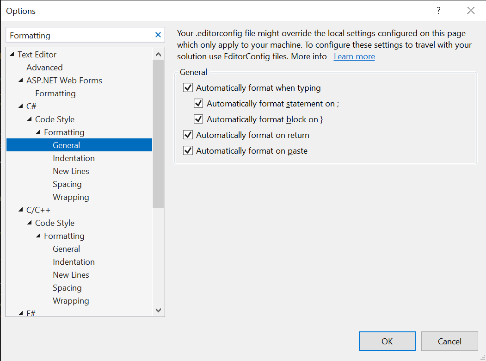
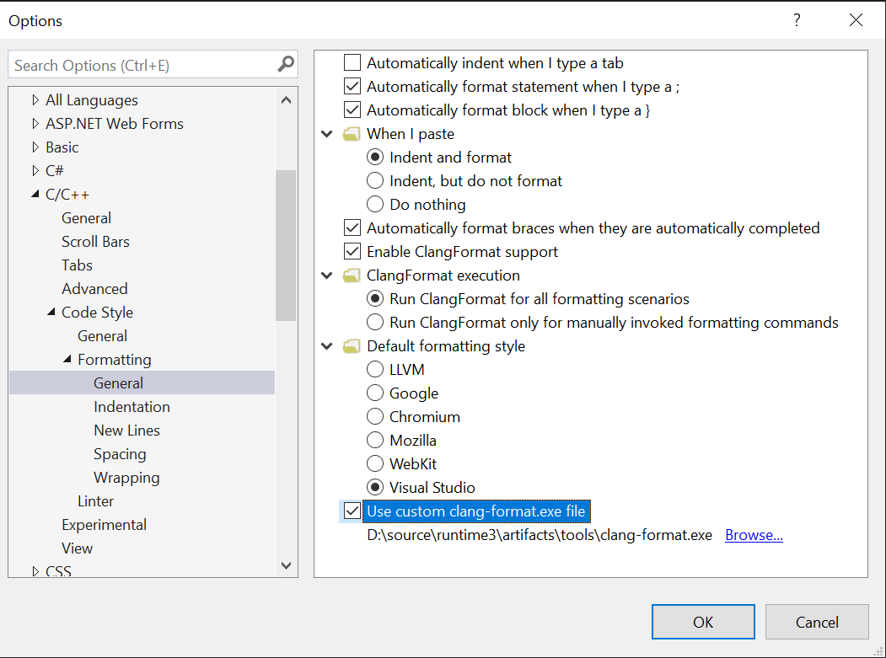

# Code Formatting Tools in dotnet/runtime

In this repository, we use various different formatting conventions depending on who owns the code. Additionally, we use different formatting tools depending on if the code is managed C# or VB code or if the code is native C or C++ code.

To help enable an easy workflow and reduce the number of formatting changes requested, this document provides steps to download and enable the various different tools in different development environments to enable a seamless workflow for ensuring that keeping code formatted is a pleasant experience.

## Downloading formatting tools

### C#/VB

C# and VB code in the repository use the built-in Roslyn support for EditorConfig to enable auto-formatting in many IDEs. As a result, no additional tools are required to enable keeping your code formatted. You can also use the `dotnet format` command from the dotnet SDK to do formatting or use the git pre-commit hook mentioned later in this document.

### C/C++

To download the formatting tools for C++, run the `download-tools.ps1/sh` script in the `eng/formatting` folder. Specifically, run the `download-tools.ps1` script if you're on Windows, or the `download-tools.sh` script otherwise.

This script will download the `clang-format` and `clang-tidy` tools to the `artifacts/tools` folder in your clone of the repository. Only specific parts of the repository use `clang-tidy`, so this document primarily focuses on setting up `clang-format` for C and C++ scenarios.

#### CoreCLR JIT

The JIT team uses a special `jit-format` tool that runs `clang-format` and `clang-tidy` on their directory with their settings. You can get the `jit-format` tool from the [dotnet/jitutils repository](https://github.com/dotnet/jitutils).

## Setting up automatic formatting

To make the formatting workflow more seamless for contributors, instructions are included below to help enable "format-on-save" or other forms of automatic formatting in various different IDEs or as a Git pre-commit hook for IDEs that do not support "format-on-save" scenarios.

This section is open to contributions for instructions on how to enable "format-on-save"-like semantics in IDEs and editors not mentioned.

### Visual Studio Code

Enabling a "format-on-save" experience in VSCode is quite easy. Add the following setting to your `.vscode/settings.json` file to enable "format-on-save":

```json
    "editor.formatOnSave": true,
```

The sections below include any additional instructions to configure the experience for different languages.

#### C#/VB

There are currently some limitations in OmniSharp that causes issues with the auto-formatting. Once a VSCode C# extension releases with both https://github.com/OmniSharp/omnisharp-roslyn/pull/2227 and https://github.com/OmniSharp/omnisharp-vscode/pull/4738, then format-on-save should be possible to enable in VSCode for C# and Visual Basic sources.

#### C/C++

VSCode ships with a different version of clang-format than we use in this repo, so you will need to add a few more settings to get VSCode to run the correct clang-format for "format-on-save".

You can add the following setting on Windows to your `.vscode/settings.json` file to configure clang-format for the repository:

```json
    "C_Cpp.clang_format_path": "./artifacts/tools/clang-format.exe"
```

On non-Windows, you can add the following setting instead:

```json
    "C_Cpp.clang_format_path": "./artifacts/tools/clang-format"
```

### Visual Studio

Visual Studio does not have a "format-on-save" feature but it does have settings for "format on end of statement" or "format on end of block" that can provide some auto-formatting features.

Using these features in combination with the steps specified in the [Git Hooks](#git-hooks) section will enable a seamless formatting experience.

The settings for C#, VB, C, and C++ are all in a dialog under the `Tools > Options` menu item.

#### C#/VB

In the options view, go to `Text Editor > C# > Code Style > Formatting > General` for C# settings. Make sure to check the various options for whenever you want Visual Studio to auto-format your code.



#### C/C++

In the options view, go to `Text Editor > C/C++ > Code Style > Formatting > General` for C# settings. Make sure to check the various options for whenever you want Visual Studio to auto-format your code.



### Git Hooks

Git provides a number of hooks to enable running scripts before commit, push, pull, etc. This section describes adding a pre-commit hook to automatically format code before committing to make formatting seamless even when your development environment doesn't support "format-on-save" or similar functionality with the formatting tools this repository uses.

#### Auto-format before committing

To enable auto-formatting before committing, you can create a `.git/hooks/pre-commit` file in your local `dotnet/runtime` clone and add a call to the script located at `eng/formatting/format.sh` to auto-format your code before committing. Since Git for Windows also installs Git Bash, this script will work for both Windows and non-Windows platforms.

The following code block can be used as the contents of the `pre-commit` file to enable the auto-formatting hook:

```sh
#!/bin/sh
./eng/formatting/format.sh

```
