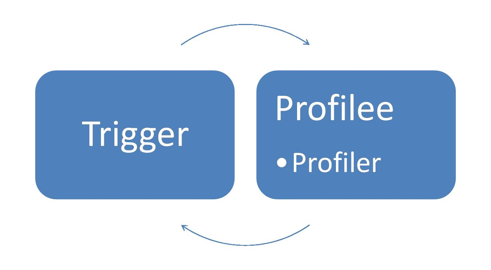

*This blog post originally appeared on David Broman's blog on 11/4/2009*

***[Update 5/30/19]: The archived content below refers to an Attach mechanism that only worked on desktop, not on .Net Core. Please see [Profiler Attach on CoreCLR](../Profiler Attach on Coreclr.md) for profiler attach on CoreCLR***

Profiler attach is a feature that allows you to attach a profiler to an already running process. The usefulness of this is fairly obvious to anyone who's ever attached a debugger to a running-process: It's helpful when diagnosing hard-to-reproduce problems, and particularly useful when encountering issues in production.

Please note!  You can't just take any profiler you bought and suddenly be able to attach it to a running application.  The profiler must be built with "attachability" in mind.  So if you're a profiler developer looking to pump some attachability into your product, read on--this article is for you.  Everyone else, this article will probably be less useful--but just as riveting.

# 

# The Players

So how do you get your profiler attached to a running process?  The process has already started, and the CLR code which interrogates the environment to determine whether to load a profiler has already run.  So how do you kick the process into loading your profiler?  The answer: Another process!

In order to force your profiler DLL to load into the target profilee process, you'll need to create a "trigger" process to send the attach message to the target profilee.  Many profilers already ship with a GUI shell to control launching processes to profile.  That shell will typically act as your trigger process as well.

# Inside the Trigger Process

Your trigger uses a simple API method, AttachProfiler, to request the target process to load your profiler.  Where is this method defined?  Well, it doesn't make much sense to put it on ICorProfilerInfo, since that interface is only available to a profiler after it's been loaded.  You could imagine a C export from mscoree.dll.  But because of in-process side-by-side CLR instances, we're moving away from mscoree.dll exports to a COM-based interface model called "metahost". 

## Meta-whos-its?

Whereas the "hosting" interfaces enable one to host and manage a CLR in a process, the "metahost" interfaces allow one to manage multiple CLRs that may be installed onto a machine or loaded into a single process.  Here's a high-level view of how you navigate your way through metahost to find AttachProfiler() (there’s a pointer to actual sample code below).

- Get ICLRMetaHost 
- Enumerate the CLRs loaded into the target process 
- Get ICLRRuntimeInfo for the particular CLR in the target process you want to profile 
- Get the corresponding ICLRProfiling 
- Call ICLRProfiling::AttachProfiler 

## Users and Integrity

The permissions required to attach a profiler are similar to those required to attach a debugger.  First, the trigger process must run as the same user as the target profilee OR as an administrator.  Second, on OS's that support process integrity levels, the trigger process must be running at an integrity level higher than or equal to that of the target profilee process.  For more information about integrity and mandatory labels, [here's](http://msdn.microsoft.com/en-us/library/bb625964.aspx) some reference from MSDN.

## Sample Trigger Source Code

For some sample code to attach a profiler to a process, take a look at the sample uploaded to the MSDN Code Gallery [here](http://code.msdn.microsoft.com/ProfilerAttacher/).

You'll notice the code attempts to enable the SE\_DEBUG\_NAME privilege, as this is required to open a process running as another user with PROCESS\_ALL\_ACCESS.  Again, cross-user attach (i.e., trigger runs as a different user than the target profilee process) is only supported when the trigger is run as an administrator.  Otherwise, only same-user attach is supported, and would not need to enable the SE\_DEBUG\_NAME privilege.

# Inside the Profilee Process

Once your trigger has called AttachProfiler(), a message is sent to the target profilee process to load your actual profiler DLL, containing info such as your profiler's GUID.  At this point, it's business as usual in the profilee.  The profilee locates and loads your profiler DLL, the CLR then calls your class factory object to create an instance of your profiler's ICorProfilerCallback implementation.

Note that, instead of the CLR calling your Initialize() method, the CLR will call your ICorProfilerCallback3::InitializeForAttach() method.  There are two reasons for this difference.  First, this ensures that only profilers that have been upgraded to work with CLR V4 and opt into attaching will actually be attached.  All other profilers can simply return an error from their InitializeForAttach() method (or won't have an ICorProfilerCallback3 implementation to begin with).

The second reason is that InitializeForAttach allows for some extra data to be passed from the trigger to your profilee via a blob of binary data.  What's that for?  Many profiler products pass configuration information from their shell to their startup-loaded profiler DLL via environment variables.  After all, the shell has to set COR\_PROFILER & COR\_ENABLE\_PROFILING in the environment anyway, so why not set some more values there to be read by their profiler?  This scheme doesn't work for an attaching profiler, since the shell cannot affect the environment of the already-running profilee.  Instead, the AttachProfiler API allows the caller to specify a pointer to a buffer containing whatever data the caller wishes.  The CLR makes a copy of the data, sends it to the profilee, and then passes a pointer to this data to the profiler DLL via InitializeForAttach.

The management of the memory containing this binary data follows the usual COM rules.  In the trigger process, your trigger code allocates memory for the blob, passes it to AttachProfiler (which will make its own copy of the data), and then your trigger code frees it once AttachProfiler returns.  Stack allocation is perfect here; your trigger could just push your own custom structure of data onto the stack and pass a pointer to it in your call to AttachProfiler.  Inside the profilee process, your profiler gets access to the blob of data from its InitializeForAttach method.  Inside InitializeForAttach, your profiler accesses that memory.  If your profiler will need to use that memory later on, your profiler should make a copy of the memory now.  After InitializeForAttach returns, the CLR will free the memory.

From your InitializeForAttach implementation, your profiler will call SetEventMask as usual to announce your intentions, and you're off to the races.

# Limitations

It was impossible to enable all profiling scenarios for attach in the time we had for the V4 release.  So only profilers that do **sampling** and **memory** analysis will function properly after attaching to a live process.  Attempts to use other profiling APIs after attach will be met with CORPROF\_E\_UNSUPPORTED\_FOR\_ATTACHING\_PROFILER.

### 

## Specific Callback Limitations

When your attaching profiler calls SetEventMask, you will be limited to only those event mask flags present in the COR\_PRF\_ALLOWABLE\_AFTER\_ATTACH bitmask (you'll find it in corprof.idl).  Any other flags, and SetEventMask will return CORPROF\_E\_UNSUPPORTED\_FOR\_ATTACHING\_PROFILER.

## Specific Info Limitations

Most of the ICorProfilerInfo\* methods are available to your attaching profiler, however some are not--particularly those involved in **IL rewriting**.  Here's a list of all ICorProfilerInfo\* methods NOT supported for attaching profilers:

- GetILFunctionBody 
- GetILFunctionBodyAllocator 
- SetILFunctionBody 
- SetILInstrumentedCodeMap 
- SetEnterLeaveFunctionHooks\* 
- SetFunctionIDMapper\* 
- GetNotifiedExceptionClauseInfo 
- All methods related to Enter/Leave/Tailcall 

It's expected that future releases of the CLR will enable more API methods for use by attaching profilers.

## GC Limitations

### GC Modes

To understand limitations around the GC modes, here's a quick review of the GC modes an app can run under:

- **Workstation Blocking mode**.  The thread that triggered the GC performs the GC while all other threads executing managed code must wait. 
- **Workstation Concurrent / Background mode (the default)**.  Concurrent GC (V1 & V2) allows portions of a full GC to execute while other threads are allowed to run.  Background GC (its replacement in V4) takes it one step further, and also allows an ephemeral GC (i.e., gen 0 or gen 1) to execute while a gen 2 GC is executing. 
- **Server mode**.  Hosts like ASP.NET may choose to enable server mode which creates a heap + dedicated GC thread per CPU.  This allows GCs to be fanned out to multiple threads. 

Of course, [Maoni's blog](http://blogs.msdn.com/maoni/) is required reading for anyone who wants to understand how the GC works.

The profiling API is able to work against workstation blocking mode and server mode, but not concurrent / background mode.  This has been the case in V1 & V2, and remains the case in V4.  When the app starts up, if a profiler is configured to load, then the CLR forcibly turns off concurrent / background mode, and you end up in workstation blocking mode (or you end up in server mode if the host requested that instead).  Again, this has been the case in V1 & V2, and remains true in V4.

So here's the catch.  What if a V4 app starts up in background GC mode _without_ a profiler loading on startup, and you later attach a profiler to the process?  If the profiler specifies COR\_PRF\_MONITOR\_GC in its call to SetEventMask, then the CLR returns the error CORPROF\_E\_CONCURRENT\_GC\_NOT\_PROFILABLE.  In other words, if the profiler is late to the party, then it simply won't work if background GC is on.  Since this is the default for client apps, the bottom line is that you can generally successfully attach your memory profiler to server apps (e.g., ASP.NET), but probably not to client apps.

Of course, you could forcibly turn off concurrent / background mode every time the app starts up via a config file:

| 

\<configuration\>   
    \<runtime\>   
        \<gcConcurrent enabled="false"/\>   
    \</runtime\>   
\</configuration\>

 |

But you don't really want to be running your apps with a sub-optimal GC mode all the time, just on the off-chance you might need to attach a memory profiler to it.  If you suspect you might need to do some memory profiling of a client app, you should just start up your app with the memory profiler to begin with.

### ObjectAllocated

The ObjectAllocated callback is disallowed for attaching profilers (i.e., COR\_PRF\_ENABLE\_OBJECT\_ALLOCATED is not part of the COR\_PRF\_ALLOWABLE\_AFTER\_ATTACH mask).

# Go Forth and Attach

All right, dig through that sample trigger code, and see if you can add "attach" to your list of features.  In later posts, I'll talk about how to catch up on application state once your profiler attaches, and also how to detach your profiler when it's done with its business.

