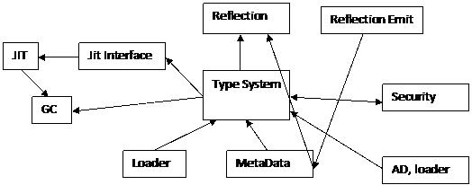

Type System Overview
====================

Author: David Wrighton ([@davidwrighton](https://github.com/davidwrighton)) - 2010

Introduction
============

The CLR type system is our representation the type system described in the ECMA specification + extensions.

Overview
--------

The type system is composed of a series of data structures, some of which are described in other Book of the Runtime chapters, as well as a set of algorithms which operate on and create those data structures. It is NOT the type system exposed through reflection, although that one does depend on this system.

The major data structures maintained by the type system are:

- MethodTable
- EEClass
- MethodDesc
- FieldDesc
- TypeDesc
- ClassLoader

The major algorithms contained within the type system are:

- **Type Loader:** Used to load types and create most of the primary data structures of the type system.
- **CanCastTo and similar:** The functionality of comparing types.
- **LoadTypeHandle:** Primarily used for finding types.
- **Signature parsing:** Used to compare and gather information about methods and fields.
- **GetMethod/FieldDesc:** Used to find/load methods/fields.
- **Virtual Stub Dispatch:** Used to find the destination of virtual calls to interfaces.

There are significantly more ancillary data structures and algorithms that provide various bits of information to the rest of the CLR, but they are less significant to the overall understanding of the system.

Component Architecture
----------------------

The type system's data structures are generally used by all of the various algorithms. This document does not describe the type system algorithms (as there are or should be other book of the runtime documents for those), but it does attempt to describe the various major data structures below.

Dependencies
------------

The type system is generally a service provided to many parts of the CLR, and most core components have some form of dependency on the behavior of the type system. This diagram describes the general dataflow that effects the type system. It is not exhaustive, but calls out the major information flows.

### Component Dependencies

The primary dependencies of the type system follow:

- The **loader** needed to get the correct metadata to work with.
- The **metadata system** provides a metadata API to gather information.
- The **security system** informs the type system whether or not certain type system structures are permitted (e.g. inheritance).
- The **AppDomain** provides a LoaderAllocator to handle allocation behavior for the type system data structures.

### Components Dependent on this Component

The type system has 3 primary components which depend on it.

- The **Jit interface**, and the jit helpers primarily depends on the type, method, and field searching functionality. Once the type system object is found, the data structures returned have been tailored to provide the information needed by the jit.
- **Reflection** uses the type system to provide relatively simple access to ECMA standardized concepts which we happen to capture in the CLR type system data structures.
- **General managed code execution** requires the use of the type system for type comparison logic, and virtual stub dispatch.

Design of Type System
=====================

The core type system data structures are the data structures that represent the actual loaded types (e.g. TypeHandle, MethodTable, MethodDesc, TypeDesc, EEClass) and the data structure that allow types to be found once they are loaded (e.g. ClassLoader, Assembly, Module, RIDMaps).

The data structures and algorithms for loading types are discussed in the [Type Loader](type-loader.md) and [MethodDesc](method-descriptor.md) Book of the Runtime chapters.

Tying those data structures together is a set of functionality that allows the JIT/Reflection/TypeLoader/stackwalker to find existing types and methods. The general idea is that these searches should be easily driven by the metadata tokens/signatures that are specified in the ECMA CLI specification.

And finally, when the appropriate type system data structure is found, we have algorithms to gather information from a type, and/or compare two types. A particularly complicated example of this form of algorithm may be found in the [Virtual Stub Dispatch](virtual-stub-dispatch.md) Book of the Runtime chapter.

Design Goals and Non-goals
--------------------------

### Goals

- Accessing information needed at runtime from executing (non-reflection) code is very fast.
- Accessing information needed at compilation time for generating code is straightforward.
- The garbage collector/stackwalker is able to access necessary information without taking locks, or allocating memory.
- Minimal amounts of types are loaded at a time.
- Minimal amounts of a given type are loaded at type load time.
- Type system data structures must be storable in NGEN images.

### Non-Goals

- All information in the metadata is directly reflected in the CLR data structures.
- All uses of reflection are fast.

Design of a typical algorithm used at runtime during execution of managed code
------------------------------------------------------------------------------

The casting algorithm is typical of algorithms in the type system that are heavily used during the execution of managed code.

There are at least 4 separate entry points into this algorithm. Each entry point is chosen to provide a different fast path, in the hopes that the best performance possible will be achieved.

- Can an object be cast to a particular non-type equivalent non-array type?
- Can an object be cast to an interface type that does not implement generic variance?
- Can an object be cast to an array type?
- Can an object of a type be cast to an arbitrary other managed type?

Each of these implementations with the exception of the last one is optimized to perform better at the expense of not being fully general.

For instance, the "Can a type be cast to a parent type" which is a variant of "Can an object be cast to a particular non-type equivalent non-array type?" code is implemented with a single loop that walks a singly linked list. This is only able to search a subset of possible casting operations, but it is possible to determine if that is the appropriate set by examining the type the cast is trying to enforce. This algorithm is implemented in the jit helper JIT\_ChkCastClass\_Portable.

Assumptions:

- Special purpose implementations of algorithms are a performance improvement in general.
- Extra versions of algorithms do not provide an insurmountable maintenance problem.

Design of typical search algorithm in the Type System
-----------------------------------------------------

There are a number of algorithms in the type system which follow this common pattern.

The type system is commonly used to find a type. This may be triggered via any number of inputs such as the JIT, reflection, serialization, remoting, etc.

The basic input to the type system in these cases is

- The context from which the search shall begin (a Module or assembly pointer).
- An identifier that describes the sought after type in the initial context. This is typically a token, or a string (if an assembly is the search context).

The algorithm must first decode the identifier.

For the search for a type scenario, the token may be either a TypeDef token, a TypeRef token, a TypeSpec token, or a string. Each of these different identifiers will cause a different form of lookup.

- A **typedef token** will cause a lookup in the RidMap of the Module. This is a simple array index.
- A **typeref token** will cause a lookup to find the assembly which this typeref token refers to, and then the type finding algorithm is begun anew with the found assembly pointer, and a string gathered from the typeref table.
- A **typespec token** indicates that a signature must be parsed to find the signature. Parse the signature to find the information necessary to load the type. This will recursively trigger more type finding.
- A **name** is used to bind between assemblies. The TypeDef/ExportedTypes table is searched for matches. Note: This search is optimized by hashtables on the manifest module object.

From this design a number of common characteristics of search algorithms in the type system are evident.

- Searches use input that is tightly coupled to metadata. In particular, metadata tokens and string names are commonly passed around. Also, these searches are tied to Modules, which directly map to .dll and .exe files.
- Use of cached information to improve performance. The RidMap and hash tables are data structures optimized to improve these lookups.
- The algorithms typically have 3-4 different paths based on their input.

In addition to this general design, there are a number of extra requirements that are layered onto this.

- **ASSUMPTION:** Searching for types that are already loaded is safe to perform while stopped in the GC.
- **INVARIANT:** A type which has already been loaded will always be found if searched for.
- **ISSUE:** Search routines rely on metadata reading. This can yield inadequate performance in some scenarios.

This search algorithm is typical of the routines used during JITing. It has a number of common characteristics.

- It uses metadata.
- It requires looking for data in many places.
- There is relatively little duplication of data in our data structures.
- It typically does not recurse deeply, and does not have loops.

This allows us to meet the performance requirements, and characteristics necessary for working with an IL based JIT.

Garbage Collector Requirements on the Type System
-------------------------------------------------

The garbage collector requires information about instances of types allocated in the GC heap. This is done via a pointer to a type system data structure (MethodTable) at the head of every managed object. Attached to the MethodTable, is a data structure that describes the GC layout of instances of types. There are two forms of this layout (one for normal types, and object arrays, and another for arrays of valuetypes).

- **ASSUMPTION:** Type system data structures have a lifetime that exceeds that of managed objects that are of types described in the type system data structure.
- **REQUIREMENT:** The garbage collector has a requirement to execute the stack walker while the runtime is suspended. This will be discussed next.

Stackwalker requirements on the Type System
-------------------------------------------

The stack walker/ GC stack walker requires type system input in 2 cases.

- For finding the size of valuetypes on the stack.
- For finding GC roots to report within valuetypes on the stack.

For various reasons involving the desire to delay load types, and the avoidance of generating multiple versions of code (that only differ via associated gc info) the CLR currently requires the walking of signatures of methods that are on the stack. This need is rarely exercised, as it requires the stack walker to execute at very particular moments in time, but in order to meet our reliability goals, the signature walker must be able to function while stackwalking.

The stack walker executes in approximately 3 modes.

- To walk the stack of the current thread for security or exception processing reasons.
- To walk the stack of all threads for GC purposes (all threads are suspended by the EE).
- To walk the stack of a particular thread for a profiler (that specific thread is suspended).

In the GC stack walking case, and in the profiler stack walking case, due to thread suspension, it is not safe to allocate memory or take most locks.

This has led us to develop a path through the type system which may be relied upon to follow the above requirement.

The rule required for the type system to achieve this goal is:

- If a method has been called, then all valuetype parameters of the called method will have been loaded into some appdomain in the process.
- The assembly reference from the assembly with the signature to the assembly implementing the type must be resolved before a walk of the signature is necessary as part of a stack walk.

This is enforced via an extensive and complicated set of enforcements within the type loader, NGEN image generation process, and JIT.

- **ISSUE:** Stackwalker requirements on the type system are HIGHLY fragile.
- **ISSUE:** Implementation of stack walker requirements in the type system requires a set of contract violations at every function in the type system that may be touched while searching for types which are loaded.
- **ISSUE:** The signature walks performed are done with the normal signature walking code. This code is designed to load types as it walks the signature, but in this case the type load functionality is used with the assumption that no type load will actually be triggered.
- **ISSUE:** Stackwalker requirements require support from not just the type system, but also the assembly loader. The Loader has had a number of issues meeting the needs of the type system here.

Type System and NGEN
--------------------

The type system data structures are a core part of what is saved into NGEN images. Unfortunately, these data structures logically have pointers within them that point to other NGEN images. In order to handle this situation, the type system data structures implement a concept known as restoration.

In restoration, when a type system data structure is first needed, the data structure is fixed up with correct pointers. This is tied into the type loading levels described in the [Type Loader](type-loader.md) Book of the Runtime chapter.

There also exists the concept of pre-restored data structures. This means that the data structure is sufficiently correct at NGEN image load time (after intra-module pointer fixups and eager load type fixups), that the data structure may be used as is. This optimization requires that the NGEN image be "hard bound" to its dependent assemblies. See NGEN documentation for further details.

Type System and Domain Neutral Loading
--------------------------------------

The type system is a core part of the implementation of domain neutral loading. This is exposed to customers through the LoaderOptimization options available at AppDomain creation. Mscorlib is always loaded as domain neutral. The core requirement of this feature is that the type system data structures must not require pointers to domain specific state. Primarily this manifests itself in requirements around static fields and class constructors. In particular, whether or not a class constructor has been run is not a part of the core MethodTable data structure for this reason, and there is a mechanism for storing static data attached to the DomainFile data structure instead of the MethodTable data structure.

Physical Architecture
=====================

Major parts of the type system are found in:

- Class.cpp/inl/h – EEClass functions, and BuildMethodTable
- MethodTable.cpp/inl/h – Functions for manipulating methodtables.
- TypeDesc.cpp/inl/h – Functions for examining TypeDesc
- MetaSig.cpp SigParser – Signature code
- FieldDesc /MethodDesc – Functions for examining these data structures
- Generics – Generics specific logic.
- Array – Code for handling the special cases required for array processing
- VirtualStubDispatch.cpp/h/inl – Code for virtual stub dispatch
- VirtualCallStubCpu.hpp – Processor specific code for virtual stub dispatch.

Major entry points are BuildMethodTable, LoadTypeHandleThrowing, CanCastTo\*, GetMethodDescFromMemberDefOrRefOrSpecThrowing, GetFieldDescFromMemberRefThrowing, CompareSigs, and VirtualCallStubManager::ResolveWorkerStatic.

Related Reading
===============

- [ECMA CLI Specification](../project-docs/dotnet-standards.md)
- [Type Loader](type-loader.md) Book of the Runtime Chapter
- [Virtual Stub Dispatch](virtual-stub-dispatch.md) Book of the Runtime Chapter
- [MethodDesc](method-descriptor.md) Book of the Runtime Chapter
