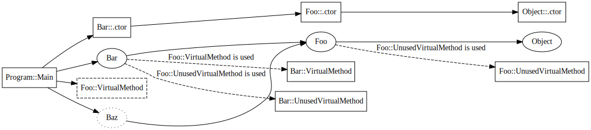

# ILC Compiler Architecture

Author: Michal Strehovsky ([@MichalStrehovsky](https://github.com/MichalStrehovsky)) - 2018

ILC (IL Compiler) is an ahead of time compiler that transforms programs in CIL (Common Intermediate Language) into a target language or instruction set to be executed on a stripped down CoreCLR runtime. The input to ILC is the common instruction format generated by popular managed language compilers such as C#, VB.NET, or F#. The output of ILC is native code for the target platform, along with data structures required to support executing the code on the target runtime. With a bit of stretch, one could say that ILC is an ahead of time native compiler for C#.

Traditionally, CIL has been compiled "just in time" (JIT). What this means is that the translation from CIL to the instruction set executable on the target runtime environment happened on an as-needed basis when the native code became necessary to continue execution of the program (e.g. on a first call to a CIL method). An ahead of time compiler tries to prepare the code and data structures in advance - before the program starts executing. The major advantages of having native code and data structures required for the code to execute available in advance are significant improvements to program startup time and working set.

In a fully ahead of time compiled environment, the compiler is responsible for generating code and data structures for everything that might be needed at runtime - the presence of the original CIL instructions or program metadata (names of methods and their signature, for example) is no longer necessary after compilation. One important aspect to keep in mind is that ahead of time compilation does not preclude just in time compilation: one could imagine mixed modes of execution where some parts of the application are compiled ahead of time, while others are compiled just in time, or interpreted. ILC needs to support such modes of operations, since both have their advantages and disadvantages. We have prototyped such modes of execution in the past.

## Goals

* Compile CIL and produce native code for the target platform
* Generate essential data structures that the runtime requires to execute managed native code (exception handling and GC information for methods, data structures describing types, their GC layout and vtables, interface dispatch maps, etc.)
* Generate optional data structures the base class libraries require to provide rich managed APIs to user code (data structures that support reflection, interop, textual stack trace information, type loading at runtime, etc.)
* Support optional inputs from a whole program analysis step to influence compilation
* Support generating executable files and static/dynamic libraries (with a flat C-style public API surface)
* Support multiple modes of compilation:
  * Single-file output:
    * All input assemblies merged into a single object file generated by ILC (merging managed assemblies happens in ILC). This mode allows maximum optimization.
    * Generating multiple object files that are merged using a platform linker into a single executable (merging happens in the native linker after ILC runs). This mode allows incremental compilation at the cost of inhibiting optimizations in ILC.
  * Multi-file output (one or more input assemblies generating one or more dynamic libraries that link against each other dynamically). This mode allows code/data sharing among several executables or dynamic libraries, but inhibits many optimizations.
* Multi-threaded compilation
* Generate native debug information for the target platform to allow debugging with native debuggers
* Generate outputs in the platform's native object file format (`.obj` and `.o` files)
* Have a defined behavior when input is incomplete (e.g. assemblies missing, or an assembly version mismatch)

## ILC composition
ILC is composed of roughly 3 parts: the compilation driver, the compiler, and the code generation backends.

### Compilation driver
The role of the compilation driver is to parse command line arguments, set up the compiler, and run the compilation. The process of setting up the compiler involves configuring a `CompilationBuilder`. The compilation builder exposes methods that let the driver configure and compose various pieces of the compiler as directed by the command line arguments. These components influence what gets compiled and how the compilation happens. Eventually the driver constructs a `Compilation` object that provides methods to run the compilation, inspect the results of the compilation, and write the outputs to a file on disk.

Related classes: `CompilationBuilder`, `ICompilation`

### Compiler
Compiler is the core component that the rest of the document is going to talk about. It's responsible for running the compilation process and generating data structures for the target runtime and target base class libraries.

The compiler tries to stay policy free as to what to compile, what data structures to generate, and how to do the compilation. The specific policies are supplied by the compilation driver as part of configuring the compilation.

### Code generation backends
ILC is designed to support multiple code generation backends that target the same runtime. What this means is that we have a model where there are common parts within the compiler (determining what needs to be compiled, generating data structures for the underlying runtime), and parts that are specific for a target environment. The common parts (the data structure layout) are not target specific - the target specific differences are limited to general questions, such as "does the target have representation for relative pointers?", but the basic shape of the data structures is the same, no matter the target platform.
ILC currently supports following codegen backends (with varying levels of completeness):

* **RyuJIT**: native code generator also used as the JIT compiler in CoreCLR. This backend supports x64, arm64, arm32 on Windows, Linux, macOS, and BSD.
* **LLVM**: the LLVM backend is currently used to generate WebAssembly code in connection with Emscripten. Lives in [NativeAOT-LLVM branch](https://github.com/dotnet/runtimelab/tree/feature/NativeAOT-LLVM).

This document describes the common parts of the compiler that are applicable to all codegen backends.

In the past, ILC supported following backends:

* **CppCodegen**: a portable code generator that translates CIL into C++ code. This supports rapid platform bringup (instead of having to build a code generator for a new CPU architecture, it relies on the C++ compiler the platform likely already has). Portability comes at certain costs. This codegen backend wasn't [brought over](https://github.com/dotnet/corert/tree/master/src/ILCompiler.CppCodeGen/src) from the now archived CoreRT repo.

Related project files: ILCompiler.LLVM.csproj, ILCompiler.RyuJit.csproj

## Dependency analysis
The core concept driving the compilation in ILC is dependency analysis. Dependency analysis is the process of determining the set of runtime artifacts (method code bodies and various data structures) that need to be generated into the output object file. Dependency analysis builds a graph where each vertex either
* represents an artifact that will be part of the output file (such as "compiled method body" or "data structure describing a type at runtime") - this is an "object node", or
* captures certain abstract characteristic of the compiled program (such as "the program contains a virtual call to the `Object.GetHashCode` method") - a general "dependency node". General dependency nodes do not physically manifest themselves as bytes in the output, but they usually have edges that (transitively) lead to object nodes that do form parts of the output.

The edges of the graph represent a "requires" relationship. The compilation process corresponds to building this graph and determining what nodes are part of the graph.

Related classes: `DependencyNodeCore<>`, `ObjectNode`

Related project files: ILCompiler.DependencyAnalysisFramework.csproj

### Dependency expansion process
The compilation starts with a set of nodes in the dependency graph called compilation roots. The roots are specified by the compilation driver and typically contain the `Main()` method, but the exact set of roots depends on the compilation mode: the set of roots will be different when we're e.g. building a library, or when we're doing a multi-file compilation, or when we're building a single file app.

The process begins by looking at the list of the root nodes and establishing their dependencies (dependent nodes). Once the dependencies are known, the compilation moves on to inspecting the dependencies of the dependencies, and so on, until all dependencies are known and marked within the dependency graph. When that happens, the compilation is done.

The expansion of the graph is required to stay within the limits of a compilation group. Compilation group is a component that controls how the dependency graph is expanded. The role of it is best illustrated by contrasting a multifile and single file compilation: in a single file compilation, all methods and types that are statically reachable from the roots become part of the dependency graph, irrespective of the input assembly that defines them. In a multi-file compilation, some of the compilation happens as part of a different unit of work: the methods and types that are not part of the current unit of work shouldn't have their dependencies examined and they should not be a part of the dependency graph.

The advantage of having the two abstractions (compilation roots, and a class that controls how the dependency graph is expanded) is that the core compilation process can be completely unaware of the specific compilation mode (e.g. whether we're building a library, or whether we're doing a multi-file compilation). The details are fully wrapped behind the two abstractions and give us a great expressive power for defining or experimenting with new compilation modes, while keeping all the logic in a single place. For example, we support a single method compilation mode where we compile only one method. This mode is useful for troubleshooting code generation. The compilation driver can define additional compilation modes (e.g. a mode that compiles a single type and all the associated methods) without having to change the compiler itself.

Related classes: `ICompilationRootProvider`, `CompilationModuleGroup`

### Dependency types
The dependency graph analysis can work with several kinds of dependencies between the nodes:
* **Static dependencies**: these are the most common. If node A is part of the dependency graph and it declares it requires node B, node B also becomes part of the dependency graph.
* **Conditional dependencies**: Node A declares that it depends on node B, but only if node C is part of the graph. If that's the case, node B will become part of the graph if both A and C are in the graph.
* **Dynamic dependencies**: These are quite expensive to have in the system, so we only use them rarely. They let the node inspect other nodes within the graph and inject nodes based on their presence. They are pretty much only used for analysis of generic virtual methods.

To show how the dependency graph looks like in real life let's look at an example of how an (optional) optimization within the compiler around virtual method usage tracking works:

```csharp
abstract class Foo
{
    public abstract void VirtualMethod();
    public virtual void UnusedVirtualMethod() { }
}

class Bar : Foo
{
    public override void VirtualMethod() { }
    public override void UnusedVirtualMethod() { }
}

class Baz : Foo
{
    public override void VirtualMethod() { }
}

class Program
{
    static int Main()
    {
        Foo f = new Bar();
        f.VirtualMethod();
        return f is Baz ? 0 : 100;
    }
}
```

The dependency graph for the above program would look something like this:



The rectangle-shaped nodes represent method bodies, the oval-shaped nodes represent types, the dashed rectangles represent virtual method use, and the dotted oval-shaped node is an unconstructed type.
The dashed edges are conditional dependencies, with the condition marked on the label.

* `Program::Main` creates a new instance of `Bar`. For that, it will allocate an object on the GC heap and call a constructor to initialize it. Therefore, it needs the data structure that represents the `Bar` type and `Bar`'s default constructor. The method then calls `VirtualMethod`. Even though from this simple example we know what specific method body this will end up calling (we can devirtualize the call in our head), we can't know in general, so we say `Program::Main` also depends on "Virtual method use of Foo::VirtualMethod". The last line of the program performs a type check. To do the type check, the generated code needs to reference a data structure that represents type `Baz`. The interesting thing about a type check is that we don't need to generate a full data structure describing the type, only enough to be able to tell if the cast succeeds. So we say `Program::Main` also depends on "unconstructed type data structure" for `Baz`.
* The data structure that represents type `Bar` has two important kinds of dependencies. It depends on its base type (`Foo`) - a pointer to it is required to make casting work - and it also contains the vtable. The entries in the vtable are conditional - if a virtual method is never called, we don't need to place it in the vtable. As a result of the situation in the graph, the method body for `Bar::VirtualMethod` is going to be part of the graph, but `Bar::UnusedVirtualMethod` will not, because it's conditioned on a node that is not present in the graph.
* The data structure that represents `Baz` is a bit different from `Bar`. We call this an "unconstructed type" structure. Unconstructed type structures don't contain a vtable, and therefore `Baz` is missing a virtual method use dependency for `Baz::VirtualMethod` conditioned on the use of `Foo::VirtualMethod`.

Notice how using conditional dependencies helped us avoid compiling method bodies for `Foo::UnusedVirtualMethod` and `Bar::UnusedVirtualMethod` because the virtual method is never used. We also avoided generating `Baz::VirtualMethod`, because `Baz` was never allocated within the program. We generated the data structure that represents `Baz`, but because the data structure was only generated for the purposes of casting, it doesn't have a vtable that would pull `Baz::VirtualMethod` into the dependency graph.

Note that while "constructed" and "unconstructed" type nodes are modelled separately in the dependency graph, at the object writing time they get coalesced into one. If the graph has a type in both the unconstructed and constructed form, only the constructed form will be emitted into the executable and places referring to the unconstructed form will be redirected to the constructed form, to maintain type identity.

Related compiler switches: `--dgmllog` serializes the dependency graph into an XML file. The XML file captures all the nodes in the graph, but only captures the first edge leading to the node (knowing the first edge is enough for most purposes). `--fulllog` generates an even bigger XML file that captures all the edges.

Related tools: [Dependency analysis viewer](../how-to-debug-compiler-dependency-analysis.md) is a tool that listens to ETW events generated by all the ILC compiler processes on the machine and lets you interactively explore the graph.

## Object writing
The final phase of compilation is writing out the outputs. The output of the compilation depends on the target environment but will typically be some sort of object file. An object file typically consists of blobs of code or data with links (or relocations) between them, and symbols: named locations within a blob. The relocations point to symbols, either defined within the same object file, or in a different module.

While the object file format is highly target specific, the compiler represents dependency nodes that have object data associated with them the same way irrespective of the target - with the `ObjectNode` class. `ObjectNode` class allows its children to specify the section where to place their data (code, read only data, uninitialized data, etc.), and crucially, the data itself (represented by the `ObjectData` class returned from `GetObjectData` method).

On a high level, the role of the object writer is to go over all the marked `ObjectNode`s in the graph, retrieve their data, defined symbols, and relocations to other symbols, and store them in the object file.

NativeAOT compiler contains multiple object writers:
* Native object writer based on LLVM that is capable of producing Windows PE, Linux ELF, and macOS Mach-O file formats
* Native object writer based on LLVM for WebAssembly
* Ready to run object writer that generates mixed CIL/native executables in the ready to run format for CoreCLR

Related command line arguments: `--map` produces a map of all the object nodes that were emitted into the object file.

## Optimization pluggability
An advantage of a fully ahead of time compiled environment is that the compiler can make closed world assumptions about the code being compiled. For example: lacking the ability to load arbitrary CIL at runtime (either through `Assembly.Load`, or `Reflection.Emit`), if the compiler sees that there's only one type implementing an interface, it can replace all the interface calls in the program with direct calls, and apply additional optimizations enabled by it, such as inlining. If the target environment allowed dynamic code, such optimization would be invalid.

The compiler is structured to allow such optimizations, but remains policy-free as to when the optimization should be applied. This allow both fully AOT compiled and mixed (JIT/interpreted) code execution strategies. The policies are always captured in an abstract class or an interface, the implementation of which is selected by the compilation driver and passed to the compilation builder. This allows a great degree of flexibility and gives a lot of power to influence the compilation from the compilation driver, without hardcoding the conditions when the optimization is applicable into the compiler.

An example of such policy is the virtual method table (vtable) generation policy. The compiler can build vtables two ways: lazily, or by reading the type's metadata and generating a vtable slot for every new virtual method present in the type's method list. The depenceny analysis example graph a couple sections above was describing how conditional dependencies can be used to track what vtable slots and virtual method bodies we need to generate for a program to work. This is an example of an optimization that requires closed world assumptions. The policy is captured in a `VTableSliceProvider` class and allows the driver to select the vtable generation policy per type. This allows the compilation driver a great degree of control to fine tune when the optimization is allowed to happen (e.g. even in the presence of a JIT, we could still allow this optimization to happen on types that are not visible/accessible from the non-AOT compiled parts of the program or through reflection).

The policies that can be configured in the driver span a wide range of areas: generation of reflection metadata, devirtualization, generation of vtables, generation of stack trace metadata for `Exception.ToString`, generation of debug information, the source of IL for method bodies, etc.

## IL scanning

Another component of ILC is the IL scanner. IL scanning is an optional step that can be executed before the compilation. In many ways, the IL scanning acts as another compilation with a null/dummy code generation backend. The IL scanner scans the IL of all the method bodies that become part of the dependency graph starting from the roots and expands their dependencies. The IL scanner ends up building the same dependency graph a code generation backend would, but the nodes in the graph that represent method bodies don't have any machine code instructions associated with them. This process is relatively fast since there's no code generation involved, but the resulting graph contains a lot of valuable insights into the compiled program. The dependency graph built by the IL scanner is a strict superset of the graph built by a real compilation since the IL scanner doesn't model optimizations such as inlining and devirtualization.

The results of the IL scanner are input into the subsequent compilation process. For example, the IL scanner can use the lazy vtable generation policy to build vtables with just the slots needed, and assign slot numbers to each slot in the vtable at the end of scanning. The vtable layouts computed lazily during scanning can then be used by the real compilation process to inline vtable lookups at the callsites. Inlining the vtable lookup at the callsite would not be possible with a lazy vtable generation policy because the exact slot assignments of lazy vtables aren't stable until the compilation is done.

The IL scanning process is optional and the compilation driver can skip it if compilation throughput is more important than runtime code quality.

Related classes: `ILScanner`

## Coupling with the base class libraries
The compiler has a certain level of coupling with the underlying base class library (the `System.Private.*` libraries within the repo). The coupling is twofold:
* Binary format of the generated data structures
* Expectations about the existence of certain methods within the core library

Examples of the binary formats generated by the compiler and used by the base class libraries would be the format of the data structure that represents a type at runtime (`MethodTable`), or the blob of bytes that describes non-essential information about the type (such as the type name, or a list of methods). These data structures form a contract and allow the managed code in the base class library to provide rich services to user code through library APIs at runtime (such as the reflection APIs). Generation of some of these data structures is optional, but for some it's mandatory because they're required to execute any managed code.

The compiler also needs to call into some well-known entrypoints within the base class library to support the generated code. The base class library needs to define these methods. Examples of such entrypoints would be various helpers to throw `OverflowException` during mathematical operations, `IndexOutOfRangeException` during array access, or various helpers to aid in generating p/invoke marshalling code (e.g. converting a UTF-16 string to ANSI and back before/after invoking the native method).

One interesting thing to point out is that the coupling of the compiler with the base class libraries is relatively loose (there are only few mandatory parts). This allows different base class libraries to be used with ILC. Such base class libraries could look quite different from what regular .NET developers are used to (e.g. a `System.Object` that doesn't have a `ToString` method) but could allow using type safe code in environments where regular .NET would be considered "too heavy". Various experiments with such lightweight code have been done in the past, and some of them even shipped as part of the Windows operating system.

Example of such alternative base class library is [Test.CoreLib](../../../../src/coreclr/nativeaot/Test.CoreLib/). The `Test.CoreLib` library provides a very minimal API surface. This, coupled with the fact that it requires almost no initialization, makes it a great assistant in bringing NativeAOT to new platforms.

## Compiler-generated method bodies
Besides compiling the code provided by the user in the form of input assemblies, the compiler also needs to compile various helpers generated within the compiler. The helpers are used to lower some of the higher-level .NET constructs into concepts that the underlying code generation backend understands. These helpers are emitted as IL code on the fly, without being physically backed by IL in an assembly on disk. Having the higher level concepts expressed as regular IL helps avoid having to implement the higher-level concept in each code generation backend (we only must do it once because IL is the thing all backends understand).

The helpers serve various purposes such as:
* Helpers to support invoking delegates
* Helpers that support marshalling parameters and return values for P/Invoke
* Helpers that support `ValueType.GetHashCode` and `ValueType.Equals`
* Helpers that support reflection: e.g. `Assembly.GetExecutingAssembly`

Related classes: `ILEmitter`, `ILStubMethod`

Related ILC command line switches: `--ildump` to dump all generated IL into a file and map debug information to it (allows source stepping through the generated IL at runtime).
