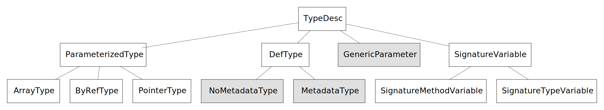

# Managed Type System Overview

Author: Michal Strehovsky ([@MichalStrehovsky](https://github.com/MichalStrehovsky)) - 2016

## Introduction

The managed type system is a major component of new generation of .NET tools for AOT and IL verification. It represents the modules, types, methods, and fields within a program and provides higher level services to the type system users that lets them get answers to various interesting questions.

The managed type system is equivalent of [CoreCLR type system](type-system.md) rewritten in C#. We've always wanted to implement runtime functionality in C#. The managed type system is the infrastructure that allows us to do that.

Some of the high level services the type system provides are:

* Loading new types from the metadata
* Computing set of interfaces implemented by a specific type
* Computing static and instance field layout (assigning offsets to individual fields)
* Computing static and instance GC layout of types (identifying GC pointers within object/class data)
* Computing VTable layout (assigning slots to virtual methods) and resolving virtual methods to slots
* Deciding whether a type can be stored to a location of another type

Three major themes drive the design of the type system:

1. Low overhead and high performance
2. Concurrency
3. Extensibility and reusability

Low overhead is achieved by lazy loading - instead of eagerly populating the types with fields, various attributes, names, etc. these are read on demand from the underlying data source (metadata). Caching is used conservatively.

Where necessary, partial classes, extension methods, and pluggable algorithms are used to achieve goal 3 instead of polymorphism and object hierarchies. The reusability of the type system is at the source level (source-including different sets of files to get different features). This allows extensibility without making sacrifices that would take us away from goal 1.

The type system in its purest form (i.e. without any partial class extensions) tries to avoid introducing concepts that are not defined in the [ECMA-335 specification](https://www.ecma-international.org/publications-and-standards/standards/ecma-335). The specification is a suggested prerequisite reading to this document and provides definitions to various terms used in this document.

## Relationship with metadata

While metadata (such as the file formats described in the ECMA-335 specification) has a close relationship with the type system, there is a clear distinction between these two: the metadata describes physical shape of the type (e.g. what is the base class of the type; or what fields does it have), but the type system builds higher level concepts on top of the shape (e.g. how many bytes are required to store an instance of the type at runtime; what interfaces does the type implement, including the inherited ones).

The type system provides access to most of the underlying metadata, but abstracts the way it was obtained. This allows types and members that are backed by metadata in other formats, or in no physical format at all (such as methods on array types), to be representable within the same type system context.

## Type system class hierarchy

The classes that represent types within the type system are:

Most of the classes in this hierarchy are not supposed to be derived by the type system user and many of them are sealed to prevent that.

The classes that are extensible (and are actually abstract classes) are shown with dark background above. The concrete class should provide implementation of the abstract and virtual methods based on some logic, such as reading metadata from an ECMA-335 module file (the type system already provides such implementation of `MetadataType` in its `EcmaType`, for example). Ideally, the type system consumers should operate on the abstract classes and use the concrete class only when creating a new instance. Casting to the concrete implementation type such as `EcmaType` is discouraged.

## Type system classes

Following section goes briefly over the classes representing types within the type system.

### TypeDesc

`TypeDesc` is the base class of all types within the type system. It defines a list of operations all classes must support. Not all operations might make sense for all the children of `TypeDesc` (for example, it doesn't make sense to request a list of methods on a pointer type), but care is taken to provide an implementation that makes sense for each particular child (i.e. the list of methods on a pointer type is empty).

### ParameterizedType (ArrayType, ByRefType, PointerType)

These are constructed types with a single parameter:

* an array (either multi-dimensional, or a vector - a single dimensional array with an implicit zero lower bound),
* a managed reference, or
* an unmanaged pointer type.

Note the distinction between multidimensional arrays of rank 1 and vectors is a crucial one, and a source of potential bugs for the type system users. Type system users should take special care.

### DefType (NoMetadataType, MetadataType)

`DefType` represents a value type, interface, or a class. While most instances of `DefType` will be of children of `MetadataType` (a type that is based off of some concrete metadata describing the type in full), there will be scenarios where full metadata is no longer available. In those cases, only restricted information (such as the number of bytes occupied by the instance of the type on the GC heap, or whether the type is a value type) is available. It is important that the type system is able to operate on such types. E.g. it should be possible for a type with restricted metadata to be a base type for a type with full metadata and the field layout algorithm should be able to compute the field layout of such a type.

### GenericParameter

Represents a generic parameter, along with its constraints. Generic definitions are represented as instantiations over generic parameters.

Note for readers familiar with the .NET reflection type system: while the .NET reflection type system doesn't distinguish between a generic definition (e.g. `List<T>`) and an open instantiation of a generic type (e.g. `List<!0>`), the managed type system draws a distinction between those two. This distinction is important when representing member references from within IL method bodies - e.g. an IL reference using an LDTOKEN instruction to `List<T>.Add` should always refer to the uninstantiated definition, while a reference to `List<!0>.Add` will refer to a concrete method after substituting the signature variable.

### SignatureVariable (SignatureTypeVariable, SignatureMethodVariable)

Signature variables represent variables that can be substituted by other types within the system. They differ from generic parameters (because e.g. they don't have constraints or variance). They are simply placeholders to be replaced by other types as part of a process called instantiation. Signature variables have an index that refers to a position within the instantiation context.

## Other type system classes

Each use of a type system starts with creating a type system context. A type system context represents a type universe across which all types share reference identity (two `TypeDesc` objects represent identical types if and only if they are the same object instance). Type system context is used to resolve all modules and constructed types within the universe. It's not legal to create new instances of constructed types outside of the type system context.

Other important classes within the type system are a `MethodDesc` (represents a method within the type system) and `FieldDesc` (represents a field within the type system). A `ModuleDesc` describes a single module which can optionally implement `IAssemblyDesc` interface if the module is an assembly. `ModuleDesc` is typically the owner of the type/method/field definitions within the module. It's the responsibility of the `ModuleDesc` to maintain the reference identity of those.

## Pluggable algorithms

Most algorithms (e.g. the field layout algorithm) provided by the type system are pluggable. The type system context can influence the choice of the algorithm by providing different implementations of it.

The algorithms are used as an extensibility mechanism in places where partial classes and source inclusion wouldn't be sufficient. The choice of the particular algorithm might depend on multiple factors and the type system user might want to use multiple algorithms depending on a certain set of conditions determined at runtime (e.g. computing the list of runtime interfaces of regular `DefTypes` vs. the runtime interfaces of array types).

## Hash codes within the type system

An interesting property of the type system lays in its ability to compute hash codes that can be reliably computed for any type or method represented within the system at compile time and at runtime. Having the same hash code available at both compile time and runtime is leveraged to build high performance lookup tables in AOT compiled code. The hash code is computed from type names and gets preserved as part of the runtime data structures so that it's available in situations when the type name has been optimized away by the compiler.

## Throwing exceptions from the type system

Throwing an exception from within the type system is a bit more involved than a simple `throw` statement. This is because the type system is designed to be usable in many places and each could have a different requirement about how exceptions are thrown. For example, when the type system is included from the runtime, a `System.TypeLoadException` should be thrown when type loading fails. On the other hand, if a type loading error occurs in a compiler or IL verifier, a `System.TypeLoadException` would be indistinguishable from an actual problem with the managed assemblies that comprise the compiler. Therefore a different exception should be thrown.

Exception throwing within the type system is wrapped in a `ThrowHelper` class. The consumer of the type system provides a definition of this class and its methods. The methods control what exception type will be thrown.

The type system provides a default implementation of the `ThrowHelper` class that throws exceptions deriving from a `TypeSystemException` exception base class. This default implementation is suitable for use in non-runtime scenarios.

The exception messages are assigned string IDs and get consumed by the throw helper as well. We require this indirection to support the compiler scenarios: when a type loading exception occurs during an AOT compilation, the AOT compiler has two tasks - emit a warning to warn the user that this occurred, and potentially generate a method body that will throw this exception at runtime when the problematic type is accessed. The localization of the compiler might not match the localization of the class library the compiler output is linking against. Indirecting the actual exception message through the string ID lets us wrap this. The consumer of the type system may reuse the throw helper in places outside the type system where this functionality is needed.

## Physical architecture

The type system implementation is found in:
* `src/coreclr/tools/Common/TypeSystem/Common`: most of the common type system is here
* `src/coreclr/tools/Common/TypeSystem/Ecma`: concrete implementations of `MetadataType`, `MethodDesc`, `FieldDesc` etc. that read metadata from ECMA-335 module files is here
* `src/coreclr/tools/aot/ILCompiler.TypeSystem.ReadyToRun.Tests`: unit tests that shed some light into the operation and features of the type system. This is a good starting point to learn about the code.

## Notable differences from CoreCLR type system

* `MethodDesc` has exact generic instantiations where possible in managed type system. The code sharing policy in managed type system is one of the pluggable algorithms and it does not affect `MethodDesc` identity. The code sharing policy in the CoreCLR type system is coupled with `MethodDesc` identity. See https://github.com/dotnet/runtime/pull/45744 for an example how this difference manifests itself.
