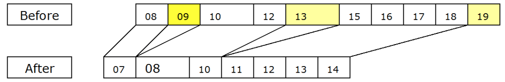

Profiling
=========

Profiling, in this document, means monitoring the execution of a program which is executing on the Common Language Runtime (CLR).  This document details the interfaces, provided by the Runtime, to access such information.

Although it is called the Profiling API, the functionality provided by it is suitable for use by more than just traditional profiling tools. Traditional profiling tools focus on measuring the execution of the program—time spent in each function, or memory usage of the program over time. However, the profiling API is really targeted at a broader class of diagnostic tools, such as code-coverage utilities or even advanced debugging aids.

The common thread among all of these uses is that they are all diagnostic in nature — the tool is written to monitor the execution of a program. The Profiling API should never be used by the program itself, and the correctness of the program's execution should not depend on (or be affected by) having a profiler active against it.

Profiling a CLR program requires more support than profiling conventionally compiled machine code.  This is because the CLR has concepts such as application domains, garbage collection, managed exception handling and JIT compilation of code (converting Intermediate Language into native machine code), that the existing conventional profiling mechanisms are unable to identify and provide useful information. The Profiling API provides this missing information in an efficient way that causes minimal impact on the performance of the CLR and the profiled program.

Note that JIT-compiling routines at runtime provide good opportunities, as the API allows a profiler to change the in-memory IL code stream for a routine, and then request that it be JIT-compiled anew.  In this way, the profiler can dynamically add instrumentation code to particular routines that need deeper investigation.  Although this approach is possible in conventional scenarios, it's much easier to do this for the CLR.

Goals for the Profiling API
===========================

- Expose information that existing profilers will require for a user to determine and analyze performance of a program run on the CLR. Specifically:

	- Common Language Runtime startup and shutdown events
	- Application domain creation and shutdown events
	- Assembly loading and unloading events
	- Module load/unload events
	- Com VTable creation and destruction events
	- JIT-compiles, and code pitching events
	- Class load/unload events
	- Thread birth/death/synchronization
	- Function entry/exit events
	- Exceptions
	- Transitions between managed and unmanaged execution
	- Transitions between different Runtime _contexts_
	- Information about Runtime suspensions
	- Information about the Runtime memory heap and garbage collection activity

- Callable from any (non-managed) COM-compatible language
- Efficient, in terms of CPU and memory consumption - the act of profiling should not cause such a big change upon the program being profiled that the results are misleading
- Useful to both _sampling_ and _non-sampling_ profilers.  [A _sampling _profiler inspects the profilee at regular clock ticks - maybe 5 milliseconds apart, say.  A _non-sampling _profiler is informed of events, synchronously with the thread that causes them]

Non-goals for the Profiling API
===============================

- The Profiling API does **not** support profiling unmanaged code. Existing mechanisms must instead be used to profile unmanaged code. The CLR profiling API works only for managed code. However, profiler provides managed/unmanaged transition events to determine the boundaries between managed and unmanaged code.
- The Profiling API does **not** support writing applications that will modify their own code, for purposes such as aspect-oriented programming.
- The Profiling API does **not** provide information needed to check bounds. The CLR provides intrinsic support for bounds checking of all managed code.

The CLR code profiler interfaces do not support remote profiling due to the following reasons:

- It is necessary to minimize execution time using these interfaces so that profiling results will not be unduly affected. This is especially true where execution performance is being monitored. However, it is not a limitation when the interfaces are used to monitor memory usage or to obtain Runtime information on stack frames, objects, etc.
- The code profiler needs to register one or more callback interfaces with the Runtime on the local machine on which the application being profiled runs. This limits the ability to create a remote code profiler.

Profiling API – Overview
========================

The profiling API within CLR allows the user to monitor the execution and memory usage of a running application.  Typically, this API will be used to write a code profiler package.  In the sections that follow, we will talk about a profiler as a package built to monitor execution of _any_ managed application.

The profiling API is used by a profiler DLL, loaded into the same process as the program being profiled. The profiler DLL implements a callback interface (ICorProfilerCallback2). The runtime calls methods on that interface to notify the profiler of events in the profiled process. The profiler can call back into the runtime with methods on ICorProfilerInfo to get information about the state of the profiled application.

Note that only the data-gathering part of the profiler solution should be running in-process with the profiled application—UI and data analysis should be done in a separate process.


The _ICorProfilerCallback_ and _ICorProfilerCallback2_ interfaces consists of methods with names like ClassLoadStarted, ClassLoadFinished, JITCompilationStarted. Each time the CLR loads/unloads a class, compiles a function, etc., it calls the corresponding method in the profiler's _ICorProfilerCallback/ICorProfilerCallback2_ interface.  (And similarly for all of the other notifications; see later for details)

So, for example, a profiler could measure code performance via the two notifications FunctionEnter and FunctionLeave.  It simply timestamps each notification, accumulates results, then outputs a list indicating which functions consumed the most cpu time, or most wall-clock time, during execution of the application.

The _ICorProfilerCallback/ICorProfilerCallback2_ interface can be considered to be the "notifications API".

The other interface involved for profiling is _ICorProfilerInfo_.  The profiler calls this, as required, to obtain more information to help its analysis.  For example, whenever the CLR calls FunctionEnter it supplies a value for the FunctionId.  The profiler can discover more information about that FunctionId by calling the _ICorProfilerInfo::GetFunctionInfo_ to discover the function's parent class, its name, etc, etc.

The picture so far describes what happens once the application and profiler are running.  But how are the two connected together when an application is started?  The CLR makes the connection during its initialization in each process.  It decides whether to connect to a profiler, and which profiler that should be, depending upon the value for two environment variables, checked one after the other:

- Cor\_Enable\_Profiling - only connect with a profiler if this environment variable exists and is set to a non-zero value.
- Cor\_Profiler - connect with the profiler with this CLSID or ProgID (which must have been stored previously in the Registry). The Cor\_Profiler environment variable is defined as a string:
	- set Cor\_Profiler={32E2F4DA-1BEA-47ea-88F9-C5DAF691C94A}, or
	- set Cor\_Profiler="MyProfiler"
- The profiler class is the one that implements _ICorProfilerCallback/ICorProfilerCallback2_. It is required that a profiler implement ICorProfilerCallback2; if it does not, it will not be loaded.

When both checks above pass, the CLR creates an instance of the profiler in a similar fashion to _CoCreateInstance_.  The profiler is not loaded through a direct call to _CoCreateInstance_ so that a call to _CoInitialize_ may be avoided, which requires setting the threading model.  It then calls the _ICorProfilerCallback::Initialize_ method in the profiler.  The signature of this method is:

```cpp
HRESULT Initialize(IUnknown *pICorProfilerInfoUnk)
```

The profiler must QueryInterface pICorProfilerInfoUnk for an _ICorProfilerInfo_ interface pointer and save it so that it can call for more info during later profiling.  It then calls ICorProfilerInfo::SetEventMask to say which categories of notifications it is interested in.  For example:

```cpp
ICorProfilerInfo* pInfo;

pICorProfilerInfoUnk->QueryInterface(IID_ICorProfilerInfo, (void**)&pInfo);

pInfo->SetEventMask(COR_PRF_MONITOR_ENTERLEAVE | COR_PRF_MONITOR_GC)
```

This mask would be used for a profiler interested only in function enter/leave notifications and garbage collection notifications.  The profiler then simply returns, and is off and running!

By setting the notifications mask in this way, the profiler can limit which notifications it receives.  This obviously helps the user build a simpler, or special-purpose profiler; it also reduces wasted cpu time in sending notifications that the profiler would simply 'drop on the floor'  (see later for details).

TODO: This text is a bit confusing. It seems to be conflating the fact that you need to create a different 'environment' (as in environment variables) to specify a different profiler and the fact that only one profiler can attach to a process at once. It may also be conflating launch vs. attach scenarios. Is that right??

Note that only one profiler can be profiling a process at one time in a given environment. In different environments it is possible to have two different profilers registered in each environment, each profiling separate processes.

Certain profiler events are IMMUTABLE which means that once they are set in the _ICorProfilerCallback::Initialize_ callback they cannot be turned off using ICorProfilerInfo::SetEventMask(). Trying to change an immutable event will result in SetEventMask returning a failed HRESULT.

The profiler must be implemented as an inproc COM server – a DLL, which is mapped into the same address space as the process being profiled.  Any other type of COM server is not supported; if a profiler, for example, wants to monitor applications from a remote computer, it must implement 'collector agents' on each machine, which batch results and communicate them to the central data collection machine.

Profiling API – Recurring Concepts
==================================

This brief section explains a few concepts that apply throughout the profiling API, rather than repeat them with the description of each method.

IDs
---

Runtime notifications supply an ID for reported classes, threads, AppDomains, etc.  These IDs can be used to query the Runtime for more info.  These IDs are simply the address of a block in memory that describes the item; however, they should be treated as opaque handles by any profiler. If an invalid ID is used in a call to any Profiling API function then the results are undefined.  Most likely, the result will be an access violation. The user has to ensure that the ID's used are perfectly valid. The profiling API does not perform any type of validation since that would create overhead and it would slow down the execution considerably.

### Uniqueness

A ProcessID is unique system-wide for the lifetime of the process. All other IDs are unique process-wide for the lifetime of the ID.

### Hierarchy & Containment

ID's are arranged in a hierarchy, mirroring the hierarchy in the process. Processes contain AppDomains contain Assemblies contain Modules contain Classes contain Functions. Threads are contained within Processes, and may move from AppDomain to AppDomain. Objects are mostly contained within AppDomains (a very few objects may be members of more than one AppDomain at a time). Contexts are contained within Processes.

### Lifetime & Stability

When a given ID dies, all IDs contained within it die.

ProcessID – Alive and stable from the call to Initialize until the return from Shutdown.

AppDomainID – Alive and stable from the call to AppDomainCreationFinished until the return from AppDomainShutdownStarted.

AssemblyID, ModuleID, ClassID – Alive and stable from the call to LoadFinished for the ID until the return from UnloadStarted for the ID.

FunctionID – Alive and stable from the call to JITCompilationFinished or JITCachedFunctionSearchFinished until the death of the containing ClassID.

ThreadID – Alive and stable from the call to ThreadCreated until the return from ThreadDestroyed.

ObjectID – Alive beginning with the call to ObjectAllocated. Eligible to change or die with each garbage collection.

GCHandleID – Alive from the call to HandleCreated until the return from HandleDestroyed.

In addition, any ID returned from a profiling API function will be alive at the time it is returned.

### App-Domain Affinity

There is an AppDomainID for each user-created app-domain in the process, plus the "default" domain, plus a special pseudo-domain used for holding domain-neutral assemblies.

Assembly, Module, Class, Function, and GCHandleIDs have app-domain affinity, meaning that if an assembly is loaded into multiple app domains, it (and all of the modules, classes, and functions contained within it) will have a different ID in each, and operations upon each ID will take effect only in the associated app domain. Domain-neutral assemblies will appear in the special pseudo-domain mentioned above.

### Special Notes

All IDs except ObjectID should be treated as opaque values. Most IDs are fairly self-explanatory. A few are worth explaining in more detail:

**ClassIDs** represent classes. In the case of generic classes, they represent fully-instantiated types. List<int>, List<char>, List<object>, and List<string> each have their own ClassID. List<T> is an uninstantiated type, and has no ClassID. Dictionary<string,V> is a partially-instantiated type, and has no ClassID.

**FunctionIDs** represent native code for a function. In the case of generic functions (or functions on generic classes), there may be multiple native code instantiations for a given function, and thus multiple FunctionIDs. Native code instantiations may be shared between different types — for example List<string> and List<object> share all code—so a FunctionID may "belong" to more than one ClassID.

**ObjectIDs** represent garbage-collected objects. An ObjectID is the current address of the object at the time the ObjectID is received by the profiler, and may change with each garbage collection. Thus, an ObjectID value is only valid between the time it is received and when the next garbage collection begins.  The CLR also supplies notifications that allow a profiler to update its internal maps that track objects, so that a profiler may maintain a valid ObjectID across garbage collections.

**GCHandleIDs** represent entries in the GC's handle table. GCHandleIDs, unlike ObjectIDs, are opaque values. GC handles are created by the runtime itself in some situations, or can be created by user code using the System.Runtime.InteropServices.GCHandle structure. (Note that the GCHandle structure merely represents the handle; the handle does not "live" within the GCHandle struct.)

**ThreadIDs** represent managed threads. If a host supports execution in fiber mode, a managed thread may exist on different OS threads, depending on when it is examined. ( **NOTE:** Profiling of fiber-mode applications is not supported.)

Callback Return Values
----------------------

A profiler returns a status, as an HRESULT, for each notification triggered by the CLR. That status may have the value S\_OK or E\_FAIL.  Currently the Runtime ignores this status value in every callback except ObjectReferences.

Caller-Allocated Buffers
------------------------

ICorProfilerInfo functions that take caller-allocated buffers typically conform to the following signature:

	HRESULT GetBuffer( [in] /\* Some query information \*/,
	   [in] ULONG32 cBuffer,
	   [out] ULONG32 \*pcBuffer,
	   [out, size\_is(cBuffer), length\_is(\*pcMap)] /\* TYPE \*/ buffer[] );

These functions will always behave as follows:

- cBuffer is the number of elements allocated in the buffer.
- \*pcBuffer will be set to the total number of elements available.
- buffer will be filled with as many elements as possible

If any elements are returned, the return value will be S\_OK. It is the caller's responsibility to check if the buffer was large enough.

If buffer is NULL, cBuffer must be 0. The function will return S\_OK and set \*pcBuffer to the total number of elements available.

Optional Out Parameters
-----------------------

All [out] parameters on the API are optional, unless a function has only one [out] parameter. A profiler simply passes NULL for any [out] parameters it is not interested in. The profiler must also pass consistent values for any associated [in] parameters—e.g., if the NULL [out] parameter is a buffer to be filled with data, the [in] parameter specifying its size must be 0.

Notification Thread
-------------------

In most cases, the notifications are executed by the same thread as generated the event.  Such notifications (for example, FunctionEnter and FunctionLeave_)_ don't need to supply the explicit ThreadID.  Also, the profiler might choose to use thread-local storage to store and update its analysis blocks, as compared with indexing into global storage, based off the ThreadID of the affected thread.

Each notification documents which thread does the call – either the thread which generated the event or some utility thread (e.g. garbage collector) within the Runtime.  For any callback that might be invoked by a different thread, a user can call the _ICorProfilerInfo::GetCurrentThreadID_ to discover the thread that generated the event.

Note that these callbacks are not serialized. The profiler developer must write defensive code, by creating thread safe data structures and by locking the profiler code where necessary to prevent parallel access from multiple threads. Therefore, in certain cases it is possible to receive an unusual sequence of callbacks. For example assume a managed application is spawning two threads, which are executing identical code. In this case it is possible to receive a JITCompilationStarted event for some function from one thread and before receiving the respective JITCompilationFinished callback, the other thread has already sent a FunctionEnter callback. Therefore the user will receive a FunctionEnter callback for a function that it seems not fully JIT compiled yet!

GC-Safe Callouts
----------------

When the CLR calls certain functions in the _ICorProfilerCallback_, the Runtime cannot perform a garbage collection until the Profiler returns control from that call.  This is because profiling services cannot always construct the stack into a state that is safe for a garbage collection; instead garbage collection is disabled around that callback.  For these cases, the Profiler should take care to return control as soon as possible.  The callbacks where this applies are:

- FunctionEnter, FunctionLeave, FunctionTailCall
- ExceptionOSHandlerEnter, ExceptionOSHandlerLeave
- ExceptionUnwindFunctionEnter, ExceptionUnwindFunctionLeave
- ExceptionUnwindFinallyEnter, ExceptionUnwindFinallyLeave
- ExceptionCatcherEnter, ExceptionCatcherLeave
- ExceptionCLRCatcherFound, ExceptionCLRCatcherExecute
- COMClassicVTableCreated, COMClassicVTableDestroyed

In addition, the following callbacks may or may not allow the Profiler to block.  This is indicated, call-by-call, via the fIsSafeToBlockargument.  This set includes:

- JITCompilationStarted, JITCompilationFinished

Note that if the Profiler _does_ block, it will delay garbage collection.  This is harmless, as long as the Profiler code itself does not attempt to allocate space in the managed heap, which could induce deadlock.

Using COM
---------

Though the profiling API interfaces are defined as COM interfaces, the runtime does not actually initialize COM in order to use them. This is in order to avoid having to set the threading model via CoInitialize before the managed application has had a chance to specify its desired threading model. Similarly, the profiler itself should not call CoInitialize, since it may pick a threading model that is incompatible with the application being profiled and therefore break the app.

Callbacks and Stack Depth
-------------------------

Profiler callbacks may be issued in extremely stack-constrained circumstances, and a stack overflow within a profiler callback will lead to immediate process exit. A profiler should be careful to use as little stack as possible in response to callbacks. If the profiler is intended for use against processes that are robust against stack overflow, the profiler itself should also avoid triggering stack overflow.

How to profile a NT Service
---------------------------

Profiling is enabled through environment variables, and since NT Services are started when the Operating System boots, those environment variables must be present and set to the required value at that time.  Thus, to profile an NT Service, the appropriate environment variables must be set in advance, system-wide, via:

MyComputer -> Properties -> Advanced -> EnvironmentVariables -> System Variables

Both **Cor\_Enable\_Profiling** and **COR\_PROFILER have to be set** , and the user must ensure that the Profiler DLL is registered.  Then, the target machine should be re-booted so that the NT Services pick up those changes.  Note that this will enable profiling on a system-wide basis.  So, to prevent every managed application that is run subsequently from being profiled, the user should delete those system environment variables after the re-boot.

Profiling API – High-Level Description
======================================

Loader Callbacks
----------------

The loader callbacks are those issued for app domain, assembly, module, and class loading.

One might expect that the CLR would notify an assembly load, followed by one or more module loads for that assembly.  However, what actually happens depends on any number of factors within the implementation of the loader. The profiler may depend on the following:

- A Started callback will be delivered before the Finished callback for the same ID.
- Started and Finished callbacks will be delivered on the same thread.

Though the loader callbacks are arranged in Started/Finished pairs, they cannot be used to accurately attribute time to operations within the loader.

Call stacks
-----------

The profiling API provides two ways of obtaining call stacks—a snapshot method, suitable for sparse gathering of callstacks, and a shadow-stack method, suitable for tracking the callstack at every instant.

### Stack Snapshot

A stack snapshot is a trace of the stack of a thread at an instant in time. The profiling API provides support for tracing the managed functions on the stack, but leaves the tracing of unmanaged functions to the profiler's own stack walker.

### Shadow Stack

Using the above snapshot method too frequently can quickly become a performance issue. When stack traces need to be taken often, profilers should instead build a "shadow stack" using the FunctionEnter, FunctionLeave, FunctionTailCall, and Exception\* callbacks. The shadow stack is always current and can be quickly copied to storage whenever a stack snapshot is needed.

A shadow stack may obtain function arguments, return values, and information about generic instantiations. This information is only available through the shadow stack, because it's readily available at function-enter time but may have been optimized away later in the run of the function.

Garbage Collection
------------------

When the profiler specifies the COR\_PRF\_MONITOR\_GC flag, all the GC events will be triggered in the profiler except the _ICorProfilerCallback::ObjectAllocated_ events. They are explicitly controlled by another flag (see next section), for performance reasons. Note that when the COR\_PRF\_MONITOR\_GC is enabled, the Concurrent Garbage Collection is turned off.

A profiler may use the GarbageCollectionStarted/Finished callbacks to identify that a GC is taking place, and which generations are covered.

### Tracking Moved Objects

Garbage collection reclaims the memory occupied by 'dead' objects and compacts that freed space.  As a result, live objects are moved within the heap.  The effect is that _ObjectIDs_ handed out by previous notifications change their value (the internal state of the object itself does not change (other than its references to other objects), just its location in memory, and therefore its _ObjectID_).  The _MovedReferences_ notification lets a profiler update its internal tables that are tracking info by _ObjectID_. Its name is somewhat misleading, as it is issued even for objects that were not moved.

The number of objects in the heap can number thousands or millions.  With such large numbers, it's impractical to notify their movement by providing a before-and-after ID for each object.  However, the garbage collector tends to move contiguous runs of live objects as a 'bunch' – so they end up at new locations in the heap, but they are still contiguous.  This notification reports the "before" and "after" _ObjectID_ of these contiguous runs of objects.  (see example below)

In other words, if an _ObjectID_ value lies within the range:

	_oldObjectIDRangeStart[i] <= ObjectID < oldObjectIDRangeStart[i] + cObjectIDRangeLength[i]_

	for _0 <= i < cMovedObjectIDRanges_, then the _ObjectID_ value has changed to

	_ObjectID - oldObjectIDRangeStart[i] + newObjectIDRangeStart[i]_

All of these callbacks are made while the Runtime is suspended, so none of the _ObjectID_ values can change until the Runtime resumes and another GC occurs.

**Example:** The diagram below shows 10 objects, before garbage collection.  They lie at start addresses (equivalent to _ObjectIDs_) of 08, 09, 10, 12, 13, 15, 16, 17, 18 and 19.  _ObjectIDs_ 09, 13 and 19 are dead (shown shaded); their space will be reclaimed during garbage collection.



The "After" picture shows how the space occupied by dead objects has been reclaimed to hold live objects.  The live objects have been moved in the heap to the new locations shown.  As a result, their _ObjectIDs_ all change.  The simplistic way to describe these changes is with a table of before-and-after _ObjectIDs_, like this:

|    | oldObjectIDRangeStart[] | newObjectIDRangeStart[] |
|:--:|:-----------------------:|:-----------------------:|
| 0  | 08 | 07 |
| 1  | 09 |    |
| 2  | 10 | 08 |
| 3  | 12 | 10 |
| 3  | 13 |    |
| 4  | 15 | 11 |
| 5  | 16 | 12 |
| 6  | 17 | 13 |
| 7  | 18 | 14 |
| 8  | 19 |    |

This works, but clearly, we can compact the information by specifying starts and sizes of contiguous runs, like this:

|    | oldObjectIDRangeStart[] | newObjectIDRangeStart[] | cObjectIDRangeLength[] |
|:--:|:-----------------------:|:-----------------------:|:----------------------:|
| 0  | 08 | 07 | 1 |
| 1  | 10 | 08 | 3 |
| 2  | 15 | 11 | 4 |

This corresponds to exactly how _MovedReferences_ reports the information. Note that _MovedReferencesCallback_ is reporting the new layout of the object BEFORE they actually get relocated in the heap. So the old _ObjectIDs_ are still valid for calls to the _ICorProfilerInfo_ interface (and the new _ObjectIDs_ are not).

#### Detecting All Deleted Objects

MovedReferences will report all objects that survive a compacting GC, regardless of whether they move; anything not reported did not survive. However not all GC's are compacting.

The profiler may call ICorProfilerInfo2::GetGenerationBounds to get the boundaries of the GC heap segments. The rangeLength field in the resulting COR\_PRF\_GC\_GENERATION\_RANGE structs can be used to figure out the extent of live objects in a compacted generation.

The GarbageCollectionStarted callback indicates which generations are being collected by the current GC. All objects that are in a generation that is not being collected will survive the GC.

For a non-compacting GC (a GC in which no objects get moved at all), the SurvivingReferences callback is delivered to indicate which objects survived the GC.

Note that a single GC may be compacting for one generation and non-compacting for another. Any given generation will receive either SurvivingReferences callbacks or MovedReferences callbacks for a given GC, but not both.

#### Remarks

The application is halted following a garbage collection until the Runtime is done passing information about the heap to the code profiler. The method _ICorProfilerInfo::GetClassFromObject_ can be used to obtain the _ClassID_ of the class of which the object is an instance. The method _ICorProfilerInfo::GetTokenFromClass_ can be used to obtain metadata information about the class.

RootReferences2 allows the profiler to identify objects held via special handles. The generation bounds information supplied by GetGenerationBounds combined with the collected-generation information supplied by GarbageCollectionStarted enable the profiler to identify objects that live in generations that were not collected.

Object Inspection
-----------------

The FunctionEnter2/Leave2 callbacks provide information about the arguments and return value of a function, as regions of memory. The arguments are stored left-to-right in the given memory regions. A profiler can use the metadata signature of the function to interpret the arguments, as follows:

| **ELEMENT\_TYPE**                      | **Representation**         |
| -------------------------------------- | -------------------------- |
| Primitives (ELEMENT\_TYPE <= R8, I, U) | Primitive values           |
| Value types (VALUETYPE)                | Depends on type            |
| Reference types (CLASS, STRING, OBJECT, ARRAY, GENERICINST, SZARRAY) | ObjectID (pointer into GC heap) |
| BYREF                                  | Managed pointer (NOT an ObjectID, but may be pointing to stack or GC heap) |
| PTR                                    | Unmanaged pointer (not movable by GC) |
| FNPTR                                  | Pointer-sized opaque value |
| TYPEDBYREF                             | Managed pointer, followed by a pointer-sized opaque value |

The differences between an ObjectID and a managed pointer are:

- ObjectID's only point into the GC heap or frozen object heap. Managed pointers may point to the stack as well.
- ObjectID's always point to the beginning of an object. Managed pointers may point to one of its fields.
- Managed pointers cannot be passed to functions that expect an ObjectID

### Inspecting Complex Types

Inspecting reference types or non-primitive value types requires some advanced techniques.

For value types and reference types other than strings or arrays, GetClassLayout provides the offset for each field. The profiler can then use the metadata to determine the type of the field and recursively evaluate it. (Note that GetClassLayout returns only the fields defined by the class itself; fields defined by the parent class are not included.)

For boxed value types, GetBoxClassLayout provides the offset of the value type within the box. The layout of the value type itself does not change, so once the profiler has found the value type within the box, it can use GetClassLayout to understand its layout.

For strings, GetStringClassLayout provides the offsets of interesting pieces of data in the string object.

Arrays are somewhat special, in that to understand arrays a function must be called for every array object, rather than just for the type. (This is because there are too many formats of arrays to describe using offsets.) GetArrayObjectInfo is provided to do the interpretation.

@TODO: Callbacks from which inspection is safe

@TODO: Functions that are legal to call when threads are hard-suspended

### Inspecting Static Fields

GetThreadStaticAddress, GetAppDomainStaticAddress, GetContextStaticAddress, and GetRVAStaticAddress provide information about the location of static fields. Looking at the memory at that location, you interpret it as follows:

- Reference types: ObjectID
- Value types: ObjectID of box containing the actual value
- Primitive types: Primitive value

There are four types of statics. The following table describes what they are and how to identify them.

| **Static Type** | **Definition** | **Identifying in Metadata** |
| --------------- | -------------- | --------------------------- |
| AppDomain       | Your basic static field—has a different value in each app domain. | Static field with no attached custom attributes |
| Thread          | Managed TLS—a static field with a unique value for each thread and each app domain. | Static field with System.ThreadStaticAttribute |
| RVA             | Process-scoped static field with a home in the module's data section | Static field with hasRVA flag |
| Context         | Static field with a different value in each COM+ Context | Static field with System.ContextStaticAttribute |

Exceptions
----------

Notifications of exceptions are the most difficult of all notifications to describe and to understand.  This is because of the inherent complexity in exception processing.  The set of exception notifications described below was designed to provide all the information required for a sophisticated profiler – so that, at every instant, it can keep track of which pass (first or second), which frame, which filter and which finally block is being executed, for every thread in the profilee process. Note that the Exception notifications do not provide any _threadID's_ but a profiler can always call _ICorProfilerInfo::GetCurrentThreadID_ to discover which managed thread throws the exception.


The figure above displays how the code profiler receives the various callbacks, when monitoring exception events. Each thread starts out in "Normal Execution." When the thread is in a state within the big gray box, the exception system has control of the thread—any non-exception-related callbacks (e.g. ObjectAllocated) that occur while the thread is in one of these states may be attributed to the exception system itself. When the thread is in a state outside of the big gray box, it is running arbitrary managed code.

### Nested Exceptions

Threads that have transitioned into managed code in the midst of processing an exception could throw another exception, which would result in a whole new pass of exception handling (the "New EH Pass" boxes above). If such a "nested" exception escapes the filter/finally/catch from the original exception, it can affect the original exception:

- If the nested exception occurred within a filter, and escapes the filter, the filter will be considered to return "false" and the first pass will continue.
- If the nested exception occurred within a finally, and escapes the finally, the original exception's processing will never resume.
- If the nested exception occurred within a catch, and escapes the catch, the original exception's processing will never resume.

### Unmanaged Handlers

An exception might be handled in unmanaged code. In this case, the profiler will see the unwind phase, but no notification of any catch handlers. Execution will simply resume normally in the unmanaged code. An unmanaged-aware profiler will be able to detect this, but a managed-only profiler may see any number of things, including but not limited to:

- An UnmanagedToManagedTransition callback as the unmanaged code calls or returns to managed code.
- Thread termination (if the unmanaged code was at the root of the thread).
- App termination (if the unmanaged code terminates the app).

### CLR Handlers

An exception might be handled by the CLR itself. In this case, the profiler will see the unwind phase, but no notification of any catch handlers. It may see execution resume normally in managed or unmanaged code.

### Unhandled Exceptions

By default, an unhandled exception will lead to process termination. If an application has locked back to the legacy exception policy, an unhandled exception on certain kinds of threads may only lead to thread termination.

Code Generation
---------------

### Getting from IL to Native Code

The IL in a .NET assembly may get compiled to native code in one of two ways: it may get JIT-compiled at run time, or it may be compiled into a "native image" by a tool called NGEN.exe (or CrossGen.exe for CoreCLR). Both the JIT-compiler and NGEN have a number of flags that control code generation.

At the time an assembly is loaded, the CLR first looks for a native image for the assembly. If no native image is found with the right set of code-generation flags, the CLR will JIT-compile the functions in the assembly as they are needed during the run. Even when a native image is found and loaded, the CLR may end up JIT-compiling some of the functions in the assembly.

### Profiler Control over Code-Generation

The profiler has control over code generation, as described below:

| **Flag**                       | **Effect** |
| ------------------------------ | --- |
| COR\_PRF\_USE\_PROFILE\_IMAGES | Causes the native image search to look for profiler-enhanced images (ngen /profile).Has no effect on JITted code. |
| COR\_PRF\_DISABLE\_INLINING    | Has no effect on the native image search.If JITting, disables inlining. All other optimizations remain in effect. |
| COR\_PRF\_DISABLE\_OPTIMIZATIONS | Has no effect on the native image search.If JITting, disables all optimizations, including inlining. |
| COR\_PRF\_MONITOR\_ENTERLEAVE  | Causes the native image search to look for profiler-enhanced images (ngen /profile).If JITting, inserts enter/leave hooks into the generated code. |
| COR\_PRF\_MONITOR\_CODE\_TRANSITIONS | Causes the native image search to look for profiler-enhanced images (ngen /profile).If JITting, inserts hooks at managed/unmanaged transition points. |

### Profilers and Native Images

When NGEN.exe creates a native image, it does much of the work that the CLR would have done at run-time—for example, class loading and method compilation. As a result, in cases where work was done at NGEN time, certain profiler callbacks will not be received at run-time:

- JITCompilation\*
- ClassLoad\*, ClassUnload\*

To deal with this situation, profilers that do not wish to perturb the process by requesting profiler-enhanced native images should be prepared to lazily gather any data required about FunctionIDs or ClassIDs as they are encountered.

### Profiler-Enhanced Native Images

Creating a native image with NGEN /profile turns on a set of code-generation flags that make the image easier to profile:

- Enter/leave hooks are inserted into the code.
- Managed/unmanaged transition hooks are inserted into the code.
- JITCachedFunctionSearch notifications are given as each function in the native image is invoked for the first time.
- ClassLoad notifications are given as each class in the native image is used for the first time.

Because profiler-enhanced native images differ significantly from regular ones, profilers should only use them when the extra perturbation is acceptable.

TODO: Instrumentation

TODO: Remoting

Security Issues in Profiling
============================

A profiler DLL is an unmanaged DLL that is effectively running as part of the CLR's execution engine itself. As a result, the code in the profiler DLL is not subject to the restrictions of managed code-access security, and the only limitations on it are those imposed by the OS on the user running the profiled application.

Combining Managed and Unmanaged Code in a Code Profiler
=======================================================

A close review of the CLR Profiling API creates the impression that you could write a profiler that has managed and unmanaged components that call to each other through COM Interop or ndirect calls.

Although this is possible from a design perspective, the CLR Profiling API does not support it. A CLR profiler is supposed to be purely unmanaged. Attempts to combine managed and unmanaged code from a CLR profiler can cause crashes, hangs and deadlocks. The danger is clear since the managed parts of the profiler will "fire" events back to its unmanaged component, which subsequently would call into the managed part of the profiler etc. The danger at this point is clear.

The only location that a CLR profiler could invoke managed code safely would be through replacement of the MSIL body of a method. The profiler before the JIT-compilation of a function is completed inserts managed calls in the MSIL body of a method and then lets the JIT compile it. This technique can successfully be used for selective instrumentation of managed code, or it can be used to gather statistics and times about the JIT.

Alternatively a code profiler could insert native "hooks" in the MSIL body of every managed function that call into unmanaged code. That technique could be used for instrumentation and coverage. For example a code profiler could be inserting instrumentation hooks after every MSIL block to ensure that the block has been executed. The modification of the MSIL body of a method is very delicate operation and there are many factors that should be taken into consideration.

Profiling Unmanaged Code
========================

There is minimal support in the Runtime profiling interfaces for profiling unmanaged code. The following functionality is provided:

- Enumeration of stack chains. This allows a code profiler to determine the boundary between managed code and unmanaged code.
- Determine if a stack chain corresponds to managed or native code.

These methods are available through the in-process subset of the CLR debugging API.  These are defined in the CorDebug.IDL and explained in DebugRef.doc, please refer to both for more details.

Sampling Profilers
==================

Hijacking
---------

Some sampling profilers operate by hijacking the thread at sample time and forcing it to do the work of the sample. This is a very tricky practice that we do not recommend. The rest of this section is mostly to discourage you from going this way.

### Timing of Hijacks

A hijacking profiler must track the runtime suspension events (COR\_PRF\_MONITOR\_SUSPENDS). The profiler should assume that when it returns from a RuntimeThreadSuspended callback, the runtime will hijack that thread. The profiler must avoid having its hijack conflict with the runtime's hijack. To do so, the profiler must ensure that:

1. The profiler does not attempt to hijack a thread between RuntimeThreadSuspended and RuntimeThreadResumed.
1. If the profiler has begun hijacking before the RuntimeThreadSuspended callback was issued, the callback does not return before the hijack completes.

This can be accomplished by some simple synchronization.

#### Initializing the Runtime

If the profiler has its own thread on which it will be calling ICorProfilerInfo functions, it needs to ensure that it calls one such function before doing any thread suspensions. This is because the runtime has per-thread state that needs to be initialized with all other threads running to avoid possible deadlocks.
