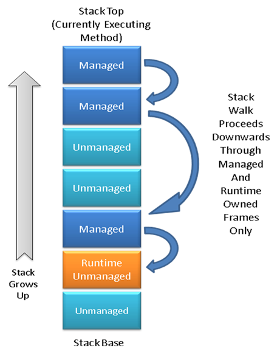

Stackwalking in the CLR
===

Author: Rudi Martin ([@Rudi-Martin](https://github.com/Rudi-Martin)) - 2008

The CLR makes heavy use of a technique known as stack walking (or stack crawling). This involves iterating the sequence of call frames for a particular thread, from the most recent (the thread's current function) back down to the base of the stack.

The runtime uses stack walks for a number of purposes:

- The runtime walks the stacks of all threads during garbage collection, looking for managed roots (local variables holding object references in the frames of managed methods that need to be reported to the GC to keep the objects alive and possibly track their movement if the GC decides to compact the heap).
- On some platforms the stack walker is used during the processing of exceptions (looking for handlers in the first pass and unwinding the stack in the second).
- The debugger uses the functionality when generating managed stack traces.
- Various miscellaneous methods, usually those close to some public managed API, perform a stack walk to pick up information about their caller (such as the method, class or assembly of that caller).

# The Stack Model

Here we define some common terms and describe the typical layout of a thread's stack.

Logically, a stack is divided up into some number of _frames_. Each frame represents some function (managed or unmanaged) that is either currently executing or has called into some other function and is waiting for it to return. A frame contains state required by the specific invocation of its associated function. Typically this includes space for local variables, pushed arguments for a call to another function, saved caller registers etc.

The exact definition of a frame varies from platform to platform and on many platforms there isn't a hard definition of a frame format that all functions adhere to (x86 is an example of this). Instead the compiler is often free to optimize the exact format of frames. On such systems it is not possible to guarantee that a stackwalk will return 100% correct or complete results (for debugging purposes, debug symbols such as pdbs are used to fill in the gaps so that debuggers can generate more accurate stack traces).

This is not a problem for the CLR, however, since we do not require a fully generalized stack walk. Instead we are only interested in those frames that are managed (i.e. represent a managed method) or, to some extent, frames coming from unmanaged code used to implement part of the runtime itself. In particular there is no guarantee about fidelity of 3rd party unmanaged frames other than to note where such frames transition into or out of the runtime itself (i.e. one of the frame types we do care about).

Because we control the format of the frames we're interested in (we'll delve into the details of this later) we can ensure that those frames are crawlable with 100% fidelity. The only additional requirement is a mechanism to link disjoint groups of runtime frames together such that we can skip over any intervening unmanaged (and otherwise uncrawlable) frames.

The following diagram illustrates a stack containing all the frames types (note that this document uses a convention where stacks grow towards the top of the page):

# Making Frames Crawlable

## Managed Frames

Because the runtime owns and controls the JIT (Just-in-Time compiler) it can arrange for managed methods to always leave a crawlable frame. One solution here would be to utilize a rigid frame format for all methods (e.g. the x86 EBP frame format). In practice, however, this can be inefficient, especially for small leaf methods (such as typical property accessors).

Since methods are typically called more times than their frames are crawled (stack crawls are relatively rare in the runtime, at least with respect to the rate at which methods are typically called) it makes sense to trade method call performance for some additional crawl time processing. As a result the JIT generates additional metadata for each method it compiles that includes sufficient information for the stack crawler to decode a stack frame belonging to that method.

This metadata can be found via a hash-table lookup with an instruction pointer somewhere within the method as the key. The JIT utilizes compression techniques in order to minimize the impact of this additional per-method metadata.

Given initial values for a few important registers (e.g. EIP, ESP and EBP on x86 based systems) the stack crawler can locate a managed method and its associated JIT metadata and use this information to roll back the register values to those current in the method's caller. In this fashion a sequence of managed method frames can be traversed from the most recent to the oldest caller. This operation is sometimes referred to as a _virtual unwind_ (virtual because we're not actually updating the real values of ESP etc., leaving the stack intact).

## Runtime Unmanaged Frames

The runtime is partially implemented in unmanaged code (e.g. coreclr.dll). Most of this code is special in that it operates as _manually managed_ code. That is, it obeys many of the rules and protocols of managed code but in an explicitly controlled fashion. For instance such code can explicitly enable or disable GC pre-emptive mode and needs to manage its use of object references accordingly.

Another area where this careful interaction with managed code comes into play is during stackwalks. Since the majority of the runtime's unmanaged code is written in C++ we don't have the same control over method frame format as managed code. At the same time there are many instances where runtime unmanaged frames contain information that is important during a stack walk. These include cases where unmanaged functions hold object references in local variables (which must be reported during garbage collections) and exception processing.

Rather than attempt to make each unmanaged frame crawable, unmanaged functions with interesting data to report to stack crawls bundle up the information into a data structure called a Frame. The choice of name is unfortunate as it can lead to ambiguity in stack related discussions. This document will always refer to the data structure variant as a capitalized Frame.

Frame is actually the abstract base class of an entire hierarchy of Frame types. Frame is sub-typed in order to express different types of information that might be interesting to a stack walk.

But how does the stack walker find these Frames and how do they relate to the frames utilized by managed methods?

Each Frame is part of a singly linked list, having a next pointer to the next oldest Frame on this thread's stack (or null if the Frame is the oldest). The CLR Thread structure holds a pointer to the newest Frame. Unmanaged runtime code can push or pop Frames as needed by manipulating the Thread structure and Frame list.

In this fashion the stack walker can iterate unmanaged Frames in newest to oldest order (the same order in which managed frames are iterated). But managed and unmanaged methods can be interleaved, and it would be wrong to process all managed frames followed by unmanaged Frames or vice versa since that would not accurately represent the real calling sequence.

To solve this problem Frames are further restricted in that they must be allocated on the stack in the frame of the method that pushes them onto the Frame list. Since the stack walker knows the stack bounds of each managed frame it can perform simple pointer comparisons to determine whether a given Frame is older or newer than a given managed frame.

Essentially the stack walker, having decoded the current frame, always has two possible choices for the next (older) frame: the next managed frame determined via a virtual unwind of the register set or the next oldest Frame on the Thread's Frame list. It can decide which is appropriate by determining which occupies stack space nearer the stack top. The actual calculation involved is platform dependent but usually devolves to one or two pointer comparisons.

When managed code calls into the unmanaged runtime one of several forms of transition Frame is often pushed by the unmanaged target method. This is needed both to record the register state of the calling managed method (so that the stack walker can resume virtual unwinding of managed frames once it has finished enumerating the unmanaged Frames) and in many cases because managed object references are passed as arguments to the unmanaged method and must be reported to the GC in the event of a garbage collection.

A full description of the available Frame types and their uses is beyond the scope of the document. Further details can be found in the [frames.h](https://github.com/dotnet/runtime/blob/main/src/coreclr/vm/frames.h) header file.

# Stackwalker Interface

The full stack walk interface is exposed to runtime unmanaged code only (a simplified subset is available to managed code via the System.Diagnostics.StackTrace class). The typical entrypoint is via the StackWalkFramesEx() method on the runtime Thread class.

The caller of this method provides three main inputs:

1. Some context indicating the starting point of the walk. This is either an initial register set (for instance if you've suspended the target thread and can call GetThreadContext() on it) or an initial Frame (in cases where you know the code in question is in runtime unmanaged code). Although most stack walks are made from the top of the stack it's possible to start lower down if you can determine the correct starting context.
2. A function pointer and associated context. The function provided is called by the stack walker for each interesting frame (in order from the newest to the oldest). The context value provided is passed to each invocation of the callback so that it can record or build up state during the walk.
3. Flags indicating what sort of frames should trigger a callback. This allows the caller to specify that only pure managed method frames should be reported for instance. For a full list see [threads.h](https://github.com/dotnet/runtime/blob/main/src/coreclr/vm/threads.h) (just above the declaration of StackWalkFramesEx()).

StackWalkFramesEx() returns an enum value that indicates whether the walk terminated normally (got to the stack base and ran out of methods to report), was aborted by one of the callbacks (the callbacks return an enum of the same type to the stack walk to control this) or suffered some other miscellaneous error.

Aside from the context value passed to StackWalkFramesEx(), stack callback functions are passed one other piece of context: the CrawlFrame. This class is defined in [stackwalk.h](https://github.com/dotnet/runtime/blob/main/src/coreclr/vm/stackwalk.h) and contains all sorts of context gathered as the stack walk proceeds.

For instance the CrawlFrame indicates the MethodDesc* for managed frames and the Frame* for unmanaged Frames. It also provides the current register set inferred by virtually unwinding frames up to that point.

# Stackwalk Implementation Details

Further low-level details of the stack walk implementation are currently outside the scope of this document. If you have knowledge of these and would care to share that knowledge please feel free to update this document.
