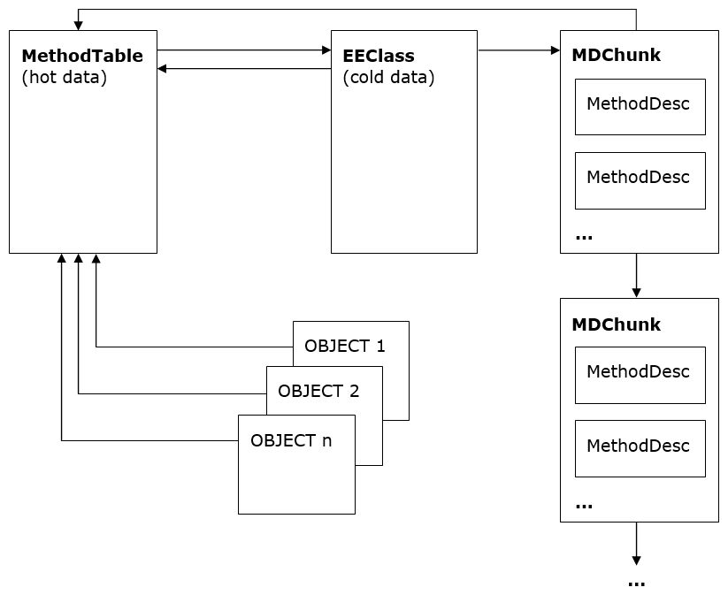

Type Loader Design
===

Author: Ladi Prosek - 2007

# Introduction

In a class-based object oriented system, types are templates
describing the data that individual instances will contain, and the
functionality that they will provide. It is not possible to create an
object without first defining its type<sup>1</sup>.  Two objects are said to
be of the same type if they are instances of the same type. The fact
that they define the exact same set of members does not make them
related in any way.

The previous paragraph could as well describe a typical C++
system. One additional feature essential to CLR is the availability of
full runtime type information. In order to "manage" the managed code
and provide type safe environment, the runtime must know the type of
any object at any time. Such a type information must be readily
available without extensive computation because the type identity
queries are expected to be rather frequent (e.g. any type-cast
involves querying the type identity of the object to verify that the
cast is safe and can be done).

This performance requirement rules out any dictionary look up
approaches and leaves us with the following high-level architecture.


Figure 1 The abstract high-level object design

Apart from the actual instance data, each object contains a type id
which is simply a pointer to the structure that represents the
type. This concept is similar to C++ v-table pointers, but the
structure, which we call TYPE now and will define it more precisely
later, contains more than just a v-table. For instance, it has to
contain information about the hierarchy so that "is-a" subsumption
questions can be answered.

<sup>1</sup> The C# 3.0 feature called "anonymous types" lets you define an
object without explicit reference to a type - simply by directly
listing its fields. Don't let this fool you, there is in fact a type
created behind the scenes for you by the compiler.

## 1.1 Related Reading

[1] Martin Abadi, Luca Cardelli, A Theory of Objects, ISBN
978-0387947754

[2] Andrew Kennedy ([@andrewjkennedy](https://github.com/andrewjkennedy)), Don Syme ([@dsyme](https://github.com/dsyme)), [Design and Implementation of Generics
for the .NET Common Language
Runtime][generics-design]

[generics-design]: http://research.microsoft.com/apps/pubs/default.aspx?id=64031

[3] [ECMA Standard for the Common Language Infrastructure (CLI)](https://www.ecma-international.org/publications-and-standards/standards/ecma-335)

## 1.2 Design Goals

The ultimate purpose of the type loader (sometimes referred to as the
class loader, which is strictly speaking not correct, because classes
constitute just a subset of types - namely reference types - and the
loader loads value types as well) is to build data structures
representing the type which it is asked to load. These are the
properties that the loader should have:

- Fast type lookup ([module, token] => handle and [assembly, name] => handle).
- Optimized memory layout to achieve good working set size, cache hit rate, and JITted code performance.
- Type safety - malformed types are not loaded and a TypeLoadException is thrown.
- Concurrency - scales well in multi-threaded environments.

# 2 Type Loader Architecture

There is a relatively small number of entry-points to the loader. Although the signature of each individual entry-point is slightly different, they all have the similar semantics. They take a type/member designation in the form of a metadata **token** or a **name** string, a scope for the token (a **module** or an **assembly** ), and some additional information like flags. They return the loaded entity in the form of a **handle**.

There are usually many calls to the type loader during JITting. Consider:

```csharp
object CreateClass()
{
    return new MyClass();
}
```

In the IL, MyClass is referred to using a metadata token. In order to generate a call to the `JIT_New` helper which takes care of the actual instantiation, the JIT will ask the type loader to load the type and return a handle to it. This handle will be then directly embedded in the JITted code as an immediate value. The fact that types and members are usually resolved and loaded at JIT time and not at run-time also explains the sometimes confusing behavior easily hit with code like this:

```csharp
object CreateClass()
{
    try {
        return new MyClass();
    } catch (TypeLoadException) {
        return null;
    }
}
```

If `MyClass` fails to load, for example because it's supposed to be defined in another assembly and it was accidentally removed in the newest build, then this code will still throw `TypeLoadException`. The reason that the catch block did not catch it is that it never ran! The exception occurred during JITting and would only be catchable in the method that called `CreateClass` and caused it to be JITted. In addition, it may not be always obvious at which point the JITting is triggered due to inlining, so users should not expect and rely on deterministic behavior.

## Key Data Structures

The most universal type designation in the CLR is the `TypeHandle`. It's an abstract entity which encapsulates a pointer to either a `MethodTable` (representing "ordinary" types like `System.Object` or `List<string>`) or a `TypeDesc` (representing byrefs, pointers, function pointers and generic variables). It constitutes the identity of a type in that two handles are equal if and only if they represent the same type. To save space, the fact that a `TypeHandle` contains a `TypeDesc` is indicated by setting the second lowest bit of the pointer to 1 (i.e. (ptr | 2)) instead of using additional flags<sup>2</sup>. `TypeDesc` is "abstract" and has the following inheritance hierarchy.


Figure 2 The TypeDesc hierarchy

**`TypeDesc`**

Abstract type descriptor. The concrete descriptor type is determined by flags.

**`TypeVarTypeDesc`**

Represents a type variable, i.e. the `T` in `List<T>` or in `Array.Sort<T>` (see the part about generics below). Type variables are never shared between multiple types or methods so each variable has its one and only owner.

**`FnPtrTypeDesc`**

Represents a function pointer, essentially a variable-length list of type handles referring to the return type and parameters. It was originally only used by managed C++. C# supported it since C# 9.

**`ParamTypeDesc`**

This descriptor represents a byref and pointer types. Byrefs are the results of the `ref` and `out` C# keywords applied to method parameters<sup>3</sup> whereas pointer types are unmanaged pointers to data used in unsafe C# and managed C++.

**`MethodTable`**

This is by far the central data structure of the runtime. It represents any type which does not fall into one of the categories above (this includes primitive types, and generic types, both "open" and "closed"). It contains everything about the type that needs to be looked up quickly, such as its parent type, implemented interfaces, and the v-table.

**`EEClass`**

`MethodTable` data are split into "hot" and "cold" structures to improve working set and cache utilization. `MethodTable` itself is meant to only store "hot" data that are needed in program steady state. `EEClass` stores "cold" data that are typically only needed by type loading, JITing or reflection. Each `MethodTable` points to one `EEClass`.

Moreover, `EEClass`es are shared by generic types. Multiple generic type `MethodTable`s can point to single `EEClass`. This sharing adds additional constrains on data that can be stored on `EEClass`.

**`MethodDesc`**

It is no surprise that this structure describes a method. It actually comes in a few flavors which have their corresponding `MethodDesc` subtypes but most of them really are out of the scope of this document. Suffice it to say that there is one subtype called `InstantiatedMethodDesc` which plays an important role for generics. For more information please see [**Method Descriptor Design**](method-descriptor.md).

**`FieldDesc`**

Analogous to `MethodDesc` , this structure describes a field. Except for certain COM interop scenarios, the EE does not care about properties and events at all because they boil down to methods and fields at the end of the day, and it's just compilers and reflection who generate and understand them in order to provide that syntactic sugar kind of experience.

<sup>2</sup> This is useful for debugging. If the value of a `TypeHandle`
ends with 2, 6, A, or E, then it's not a `MethodTable` and the extra
bit has to be cleared in order to successfully inspect the
`TypeDesc`.

<sup>3</sup> Note that the difference between `ref` and `out` is just in a
parameter attribute. As far as the type system is concerned, they are
both the same type.

## 2.1 Load Levels

When the type loader is asked to load a specified type, identified for example by a typedef/typeref/typespec **token** and a **Module** , it does not do all the work atomically at once. The loading is done in phases instead. The reason for this is that the type usually depends on other types and requiring it to be fully loaded before it can be referred to by other types would result in infinite recursion and deadlocks. Consider:

```csharp
class A<T> : C<B<T>>
{ }

class B<T> : C<A<T>>
{ }

class C<T>
{ }
```

These are valid types and apparently `A` depends on `B` and `B` depends on `A`.

The loader initially creates the structure(s) representing the type and initializes them with data that can be obtained without loading other types. When this "no-dependencies" work is done, the structure(s) can be referred from other places, usually by sticking pointers to them into another structures. After that the loader progresses in incremental steps and fills the structure(s) with more and more information until it finally arrives at a fully loaded type. In the above example, the base types of `A` and `B` will be approximated by something that does not include the other type, and substituted by the real thing later.

The exact half-loaded state is described by the so-called load level, starting with CLASS\_LOAD\_BEGIN, ending with CLASS\_LOADED, and having a couple of intermediate levels in between. There are rich and useful comments about individual load levels in the [classloadlevel.h](https://github.com/dotnet/runtime/blob/main/src/coreclr/vm/classloadlevel.h) source file.

See [Design and Implementation of Generics for the .NET Common Language Runtime][generics-design] for more detailed explanation of load levels.

### 2.1.1 Use of load levels within the type loader.
Within the type loader, while operating in various portions of the type loader, various different rules apply to what type load level can be used.

#### 2.1.1.1 Code within `ClassLoader::CreateTypeHandleForTypeDefThrowing` and `MethodTableBuilder::BuildMethodTableThrowing`
While executing the code in `ClassLoader::CreateTypeHandleForTypeDefThrowing` before the call to `MethodTableBuilder::BuildMethodTableThrowing` no logic can rely on the `MethodTable` of the type that is being loaded. This is due to the detail that these are the routines which construct the `MethodTable`.

This has various implications, but the most obvious is that the base type of the type being loaded and any associated interfaces or field types cannot be loaded past `CLASS_LOAD_APPROXPARENTS` without creating a risk of triggering a `TypeLoadException`. For instance, if we load the Base type to `CLASS_LOAD_EXACTPARENTS` then we could not load a type `A` which was derived from type `B<A>`. Exceptions to this rule exist, and are necessary to actually implement the type loading process, but generally should be avoided, as they cause behavior which does not match the ECMA specification.

#### 2.1.1.2 Code within `ClassLoader::DoIncrementalLoad`
Code that runs during `DoIncrementalLoad` is generally allowed to require a type load to either the level that is being incrementally loaded to, OR the level at which the type being loaded is already at. The distinction here is that if the relationship between the types is circular, or non-circular. Circular relationships such as the relationship of a type to its type parameters can only be loaded to a level below the desired load level. Non-circular relationships can be required to be loaded to the load level that the incremental operation will eventually reach.

For instance, the relationship of a type to its base type is non-circular, as a type cannot transitively be its own exact base type.
However, the relationship of a type to the instantiation arguments of its base type can be circular.

As an example for the rules above consider the type `class A : B<A> {}`.
When loading class `A` to `CLASS_LOAD_EXACTPARENTS` we can require the base type `B<A>` to be loaded to `CLASS_LOAD_EXACTPARENTS` as that is a non-circular relationship, but when we load `B<A>` to `CLASS_LOAD_EXACTPARENTS` we cannot require type `A` to be loaded to `CLASS_LOAD_EXACTPARENTS` as that would cause a circularity issue, and thus loading `B<A>` to `CLASS_LOAD_EXACTPARENTS` can only force `A` to be loaded to `CLASS_LOAD_APPROXPARENTS`.

Code that runs in `ClassLoader::DoIncrementalLoad` follows a fairly straightforward pattern where code can depend on types being loaded to a specific load level, and when the incremental load process completes at a given level, the type being loaded is incremented in load level.

#### 2.1.1.3 Code within `PushFinalLevels`
The final two levels of type loading are handled via `PushFinalLevels` which follows a different set of rules. `PushFinalLevels` runs code which in order to raise the level can only depend on other types being loaded to a level below the level that is desired. However, before marking the type as reaching a higher level, `PushFinalLevels` can require other types to also complete the `PushFinalLevels` algorithm to the new level. Only once all of the types are confirmed to have reached the new level can the entire set of types be marked as reaching the new level.

### 2.1.2 Usage of load levels outside of the type loader.
In the general case, its preferable to simply ignore load levels when not operating code that is part of the type loader, and to simply ask for fully loaded types. This should be the default, and always functionally correct choice. However, for performance reasons, it is possible to only require partially loaded types, which then requires the user of the type to ensure that their code does not have any dependencies on a fully loaded state.

## 2.2 Generics

In the generics-free world, everything is nice and everyone is happy because every ordinary (not represented by a `TypeDesc`) type has one `MethodTable` pointing to its associated `EEClass` which in turn points back to the `MethodTable`. All instances of the type contain a pointer to the `MethodTable` as their first field at offset 0, i.e. at the address seen as the reference value. To conserve space, `MethodDesc`s representing methods declared by the type are organized in a linked list of chunks pointed to by the `EEClass`<sup>4</sup>.



Figure 3 Non-generic type with non-generic methods

<sup>4</sup> Of course, when managed code runs, it does not call methods by
looking them up in the chunks. Calling a method is a very "hot"
operation and normally needs to access only information in the
`MethodTable`.

### 2.2.1 Terminology

**Generic Parameter**

A placeholder to be substituted by another type; the `T` in the declaration of `List<T>`. Sometimes called formal type parameter. A generic parameter has a name and optional generic constraints.

**Generic Argument**

A type being substituted for a generic parameter; the `int` in `List<int>`. Note that a generic parameter can also be used as an argument. Consider:

```csharp
List<T> GetList<T>()
{
    return new List<T>();
}
```

The method has one generic parameter `T` which is used as a generic argument for the generic list class.

**Generic Constraint**

An optional requirement placed by generic parameters on its potential generic arguments. Types that do not have the required properties may not be substituted for the generic parameter and it is enforced by the type loader. There are three kinds of generic constraints:

1. Special constraints
  - Reference type constraint - the generic argument must be a reference type (as opposed to a value type). The `class` keyword is used in C# to express this constraint.

    ```csharp
    public class A<T> where T : class
    ```

  - Value type constraint - the generic argument must be a value type different from `System.Nullable<T>`. C# uses the `struct` keyword.

    ```csharp
    public class A<T> where T : struct
    ```

  - Default constructor constraint - the generic argument must have a public parameterless constructor. This is expressed by `new()` in C#.

    ```csharp
    public class A<T> where T : new()
    ```

2. Base type constraints - the generic argument must be derived from
(or directly be of) the given non-interface type. It obviously makes
sense to use only zero or one reference type as a base types
constraint.

    ```csharp
    public class A<T> where T : EventArgs
    ```

3. Implemented interface constraints - the generic argument must
implement (or directly be of) the given interface type.  Zero or more
interfaces can be given.

    ```csharp
    public class A<T> where T : ICloneable, IComparable<T>
    ```

The above constraints are combined with an implicit AND, i.e. a
generic parameter can be constrained to be derived from a given type,
implement several interfaces, and have the default constructor. All
generic parameters of the declaring type can be used to express the
constraints, introducing interdependencies among the parameters. For
example:

```csharp
public class A<S, T, U>
	where S : T
	where T : IList<U> {
    void f<V>(V v) where V : S {}
}
```

**Instantiation**

The list of generic arguments that were substituted for generic
parameters of a generic type or method. Each loaded generic type and
method has its instantiation.

**Typical Instantiation**

An instantiation consisting purely of the type's or method's own type
parameters and in the same order in which the parameters are
declared. There exists exactly one typical instantiation for each
generic type and method. Usually when one talks about an open generic
type, they have the typical instantiation in mind. Example:

```csharp
public class A<S, T, U> {}
```

The C# `typeof(A<,,>)` compiles to ``ldtoken A`3`` which makes the
runtime load ``A`3`` instantiated at `S` , `T` , `U`.

**Canonical Instantiation**

An instantiation where all generic arguments are
`System.__Canon`. `System.__Canon` is an internal type defined
in **corlib** and its task is just to be well-known and different
from any other type which may be used as a generic
argument. Types/methods with canonical instantiation are used as
representatives of all instantiations and carry information shared by
all instantiations. Since `System.__Canon` can obviously not
satisfy any constraints that the respective generic parameter may have
on it, constraint checking is special-cased with respect to
`System.__Canon` and ignores these violations.

### 2.2.2 Sharing

With the advent of generics, the number of types loaded by the runtime
tends to be higher. Although generic types with different
instantiations (for example `List<string>` and `List<object>`)
are different types each with its own `MethodTable`, it turns out
that there is a considerable amount of information that they can
share. This sharing has a positive impact on the memory footprint and
consequently also performance.


Figure 4 Generic type with non-generic methods - shared EEClass

Currently all instantiations containing reference types share the same
`EEClass` and its `MethodDesc`s. This is feasible because all
references are of the same size - 4 or 8 bytes - and hence the layout
of all these types is the same. The figure illustrates this for
`List<object>` and `List<string>`. The canonical `MethodTable`
was created automatically before the first reference type
instantiation was loaded and contains data which is hot but not
instantiation specific like non-virtual slots. Instantiations containing only value types
are not shared and every such instantiated type gets its own unshared
`EEClass`.

`MethodTable`s representing generic types loaded so far are cached
in a hash table owned by their loader module<sup>5</sup>. This hash table is
consulted before a new instantiation is constructed, making sure
that there will never be two or more `MethodTable` instances
representing the same type.

See [Design and Implementation of Generics
for the .NET Common Language
Runtime][generics-design] for more information about generic sharing.

<sup>5</sup> Things get a bit more complicated for types loaded from NGEN
images.
