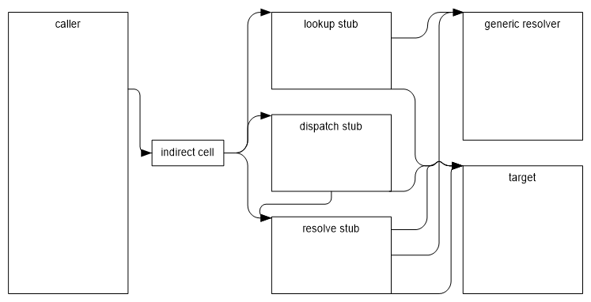

Virtual Stub Dispatch
=====================

Author: Simon Hall ([@snwbrdwndsrf](https://github.com/snwbrdwndsrf)) - 2006

Introduction
============

Virtual stub dispatching (VSD) is the technique of using stubs for virtual method invocations instead of the traditional virtual method table. In the past, interface dispatch required that interfaces had process-unique identifiers, and that every loaded interface was added to a global interface virtual table map. This requirement meant that all interfaces and all classes that implemented interfaces had to be restored at runtime in NGEN scenarios, causing significant startup working set increases. The motivation for stub dispatching was to eliminate much of the related working set, as well as distribute the remaining work throughout the lifetime of the process.

Although it is possible for VSD to dispatch both virtual instance and interface method calls, it is currently used only for interface dispatch.

Dependencies
------------

### Component Dependencies

The stub dispatching code exists relatively independently of the rest of the runtime. It provides an API that allows dependent components to use it, and the dependencies listed below comprise a relatively small surface area.

#### Code Manager

VSD effectively relies on the code manager to provide information about state of a method, in particular, whether or not any particular method has transitioned to its final state in order that VSD may decide on details such as stub generation and target caching.

#### Types and Methods

MethodTables hold pointers to the dispatch maps used to determine the target code address for any given VSD call site.

#### Special Types

Calls on COM interop types must be custom dispatched, as they both have specialized target resolution.

### Components Dependent on this Component

#### Code Manager

The code manager relies on VSD for providing the JIT compiler with call site targets for interface calls.

#### Class Builder

The class builder uses the API exposed by the dispatch mapping code to create dispatch maps during type building that will be used at dispatch type by the VSD code.

Design Goals and Non-goals
--------------------------

### Goals

#### Working Set Reduction

Interface dispatch was previously implemented using a large, somewhat sparse vtable lookup map dealing with process-wide interface identifiers. The goal was to reduce the amount of cold working set by generating dispatch stubs as they were required, in theory keeping related call sites and their dispatch stubs close to each other and increasing the working set density.

It is important to note that the initial working set involved with VSD is higher per call site due to the data structures required to track the various stubs that are created and collected as the system runs; however, as an application reaches  steady state, these data structures are not needed for simple dispatching and so gets paged out. Unfortunately, for client applications this equated to a slower startup time, which is one of the factors that led to disabling VSD for virtual methods.

#### Throughput Parity

It was important to keep interface and virtual method dispatch at an amortized parity with the previous vtable dispatch mechanism.

While it was immediately obvious that this was achievable with interface dispatch, it turned out to be somewhat slower with virtual method dispatch, one of the factors that led to disabling VSD for virtual methods.

Design of Token Representation and Dispatch Map
-----------------------------------------------

Dispatch tokens are native word-sized values that are allocated at runtime, consisting internally of a tuple that represents an interface and slot.

The design uses a combination of assigned type identifier values and slot numbers. Dispatch tokens consist of a combination of these two values. To facilitate integration with the runtime, the implementation also assigns slot numbers in the same way as the classic v-table layout. This means that the runtime can still deal with MethodTables, MethodDescs, and slot numbers in exactly the same way, except that the v-table must be accessed via helper methods instead of being directly accessed in order to handle this abstraction.

The term _slot_ will always be used in the context of a slot index value in the classic v-table layout world and as created and interpreted by the mapping mechanism. What this means is that this is the slot number if you were to picture the classic method table layout of virtual method slots followed by non-virtual method slots, as previously implemented in the runtime. It's important to understand this distinction because within the runtime code, slot means both an index into the classic v-table structure, as well as the address of the pointer in the v-table itself. The change is that slot is now only an index value, and the code pointer addresses are contained in the implementation table (discussed below).

The dynamically assigned type identifier values will be discussed later on.

### Method Table

#### Implementation Table

This is an array that, for each method body introduced by the type, has a pointer to the entrypoint to that method. Its members are arranged in the following order:

- Introduced (newslot) virtual methods.
- Introduced non-virtual (instance and static) methods.
- Overriding virtual methods.

The reason for this format is that it provides a natural extension to the classic v-table layout. As a result many entries in the slot map (described below) can be inferred by this order and other details such as the total number of virtuals and non-virtuals for the class.

When stub dispatch for virtual instance methods is disabled (as it is currently), the implementation table is non-existent and is substituted with a true vtable. All mapping results are expressed as slots for the vtable rather than an implementation table. Keep this in mind when implementation tables are mentioned throughout this document.

#### Slot Map

The slot map is a table of zero or more <_type_, [<_slot_, _scope_, (_index | slot_)>]> entries. _type_ is the dynamically assigned identification number mentioned above, and is either a sentinel value to indicate the current class (a call to a virtual instance method), or is an identifier for an interface implemented by the current class (or implicitly by one if its parents). The sub-map (contained in brackets) has one or more entries. Within each entry, the first element always indicates a slot within _type_. The second element, _scope_, specifies whether or not the third element is an implementation _index_ or a _slot_ number. _scope_ can be a known sentinel value that indicates that the next number is to be interpreted as a virtual slot number, and should be resolved virtually as _this.slot_. _scope_ can also identify a particular class in the inheritance hierarchy of the current class, and in such a case the third argument is an _index_ into the implementation table of the class indicated by _scope_, and is the final method implementation for _type.slot_.

#### Example

The following is a small class structure (modeled in C#), and what the resulting implementation table and slot map would be for each class.

Thus, looking at this map, we see that the first column of the sub-maps of the slot maps correspond to the slot number in the classic virtual table view (remember that System.Object contributes four virtual methods of its own, which are omitted for clarity). Searches for method implementations are always bottom-up. Thus, if I had an object of type _B_ and I wished to invoke _I.Foo_, I would look for a mapping of _I.Foo_ starting at _B_'s slot map. Not finding it there, I would look in _A_'s slot map and find it there. It states that virtual slot 0 of _I_ (corresponding to _I.Foo_) is implemented by virtual slot 4. Then I return to _B_'s slot map and search for an implementation for virtual slot 4, and find that it is implemented by slot 1 in its own implementation table.

### Additional Uses

It is important to note that this mapping technique can be used to implement methodimpl re-mapping of virtual slots (i.e., a virtual slot mapping in the map for the current class, similar to how an interface slot is mapped to a virtual slot). Because of the scoping capabilities of the map, non-virtual methods may also be referenced. This may be useful if ever the runtime wants to support the implementation of interfaces with non-virtual methods.

### Optimizations

The slot maps are bit-encoded and take advantage of typical interface implementation patterns using delta values, thus reducing the map size significantly. In addition, new slots (both virtual and non-) can be implied by their order in the implementation table. If the table contains new virtual slots followed by new instance slots, then followed by overrides, then the appropriate slot map entries can be implied by their index in the implementation table combined with the number of virtuals inherited by the parent class. All such implied map entries have been indicated with a (\*). The current layout of data structures uses the following pattern, where the DispatchMap is only present when mappings cannot be fully implied by ordering in the implementation table.

	MethodTable -> [DispatchMap ->] ImplementationTable

Type ID Map
-----------

This will map types to IDs, which are allocated as monotonically increasing values as each previously unmapped type is encountered. Currently, all such types are interfaces.

Currently, this is implemented using a HashMap, and contains entries for both lookup directions.

Dispatch Tokens
---------------

Dispatch tokens will be <_typeID_,_slot_> tuples. For interfaces, the type will be the interface ID assigned to that type. For virtual methods, this will be a constant value to indicate that the slot should just be resolved virtually within the type to be dispatched on (a virtual method call on _this_). This value pair will in most cases fit into the platform's native word size. On x86, this will likely be the lower 16 bits of each value, concatenated. This can be generalized to handle overflow issues similar to how a _TypeHandle_ in the runtime can be either a _MethodTable_ pointer or a <_TypeHandle,TypeHandle_> pair, using a sentinel bit to differentiate the two cases. It has yet to be determined if this is necessary.

Design of Virtual Stub Dispatch
===============================

Dispatch Token to Implementation Resolution
-------------------------------------------

Given a token and type, the implementation is found by mapping the token to an implementation table index for the type. The implementation table is reachable from the type's MethodTable. This map is created in BuildMethodTable: it enumerates all interfaces implemented by the type for which it is building a MethodTable and determines every interface method that the type implements or overrides. By keeping track of this information, at interface dispatch time it is possible to determine the target code given the token and the target object (from which the MethodTable and token mapping can be obtained).

Stubs
-----

Interface dispatch calls go through stubs. These stubs are all generated on demand, and all have the ultimate purpose of matching a token and object with an implementation, and forwarding the call to that implementation.

There are currently three types of stubs. The below diagram shows the general control flow between these stubs, and will be explained below.

### Generic Resolver

This is in fact just a C function that serves as the final failure path for all stubs. It takes a <_token_, _type_> tuple and returns the target. The generic resolver is also responsible for creating dispatch and resolver stubs when they are required, patching indirection cells when better stubs become available, caching results, and all bookkeeping.

### Lookup Stubs

These stubs are the first to be assigned to an interface dispatch call site, and are created when the JIT compiles an interface call site. Since the JIT has no knowledge of the type being used to satisfy a token until the first call is made, this stub passes the token and type as arguments to the generic resolver. If necessary, the generic resolver will also create dispatch and resolve stubs, and will then back patch the call site to the dispatch stub so that the lookup stub is no longer used.

One lookup stub is created for each unique token (i.e., call sites for the same interface slot will use the same lookup stub).

### Dispatch Stubs

These stubs are used when a call site is believed to be monomorphic in behaviour. This means that the objects used at a particular call site are typically the same type (i.e. most of the time the object being invoked is the same as the last object invoked at the same site.) A dispatch stub takes the type (MethodTable) of the object being invoked and compares it with its cached type, and upon success jumps to its cached target. On x86, this is typically results in a "comparison, conditional failure jump, jump to target" sequence and provides the best performance of any stub. If a stub's type comparison fails, it jumps to its corresponding resolve stub (see below).

One dispatch stub is created for each unique <_token_,_type_> tuple, but only lazily when a call site's lookup stub is invoked.

### Resolve Stubs

Polymorphic call sites are handled by resolve stubs. These stubs use the key pair <_token_, _type_> to resolve the target in a global cache, where _token_ is known at JIT time and _type_ is determined at call time. If the global cache does not contain a match, then the final step of the resolve stub is to call the generic resolver and jump to the returned target. Since the generic resolver will insert the <_token_, _type_, _target_> tuple into the cache, a subsequent call with the same <_token_,_ type_> tuple will successfully find the target in the cache.

When a dispatch stub fails frequently enough, the call site is deemed to be polymorphic and the resolve stub will back patch the call site to point directly to the resolve stub to avoid the overhead of a consistently failing dispatch stub. At sync points (currently the end of a GC), polymorphic sites will be randomly promoted back to monomorphic call sites under the assumption that the polymorphic attribute of a call site is usually temporary. If this assumption is incorrect for any particular call site, it will quickly trigger a backpatch to demote it to polymorphic again.

One resolve stub is created per token, but they all use a global cache. A stub-per-token allows for a fast, effective hashing algorithm using a pre-calculated hash derived from the unchanging components of the <_token_, _type_> tuple.

### Code Sequences

The former interface virtual table dispatch mechanism results in a code sequence similar to this:

And the typical stub dispatch sequence is:

where expectedMT, failure and target are constants encoded in the stub.

The typical stub sequence has the same number of instructions as the former interface dispatch mechanism, and fewer memory indirections may allow it to execute faster with a smaller working set contribution. It also results in smaller JITed code, since the bulk of the work is in the stub instead of the call site. This is only advantageous if a callsite is rarely invoked. Note that the failure branch is arranged so that x86 branch prediction will follow the success case.

Current State
=============

Currently, VSD is enabled only for interface method calls but not virtual instance method calls. There were several reasons for this:

- **Startup:** Startup working set and speed were hindered because of the need to generate a great deal of initial stubs.
- **Throughput:** While interface dispatches are generally faster with VSD, virtual instance method calls suffer an unacceptable speed degradation.

As a result of disabling VSD for virtual instance method calls, every type has a vtable for virtual instance methods and the implementation table described above is disabled. Dispatch maps are still present to enable interface method dispatching.

Physical Architecture
=====================

For dispatch token and map implementation details, please see [clr/src/vm/contractImpl.h](https://github.com/dotnet/runtime/blob/master/src/coreclr/src/vm/contractimpl.h) and [clr/src/vm/contractImpl.cpp](https://github.com/dotnet/runtime/blob/master/src/coreclr/src/vm/contractimpl.cpp).

For virtual stub dispatch implementation details, please see [clr/src/vm/virtualcallstub.h](https://github.com/dotnet/runtime/blob/master/src/coreclr/src/vm/virtualcallstub.h) and [clr/src/vm/virtualcallstub.cpp](https://github.com/dotnet/runtime/blob/master/src/coreclr/src/vm/virtualcallstub.cpp).
