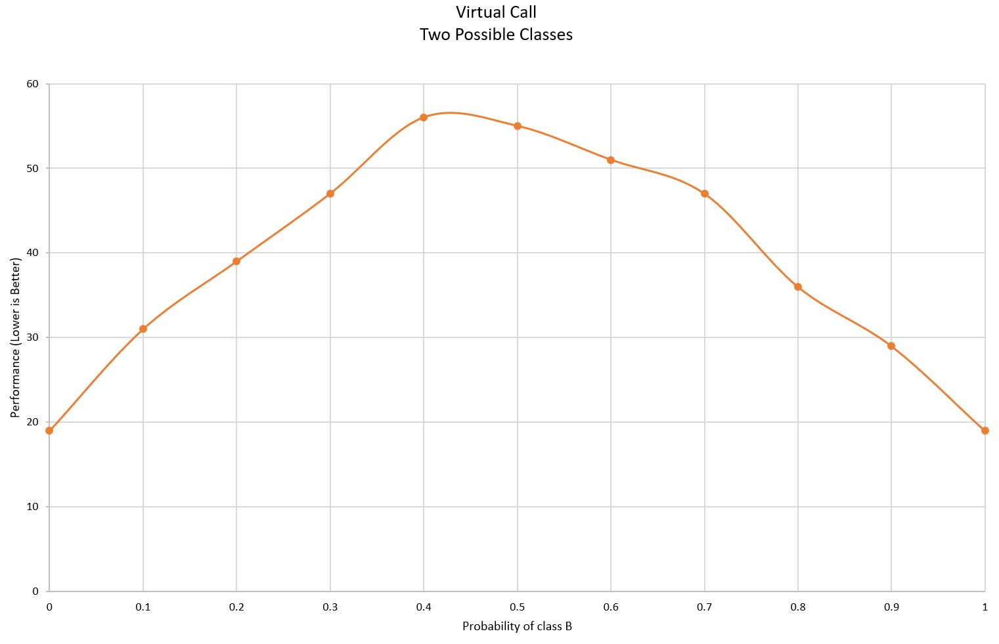
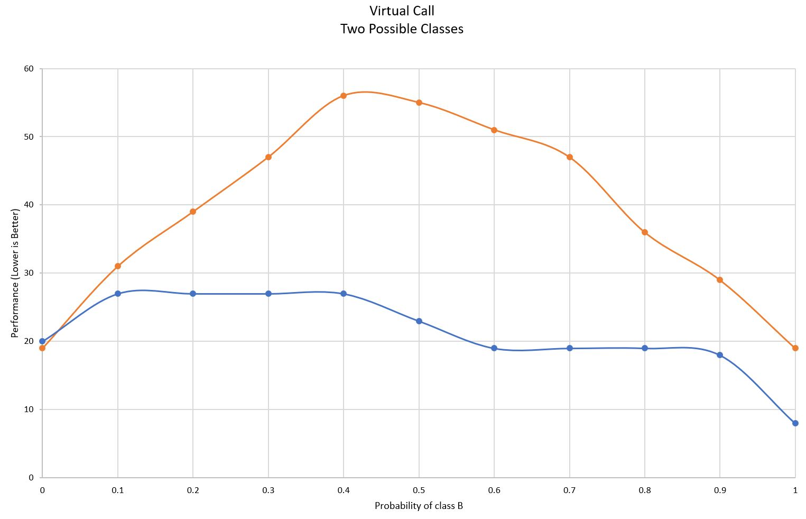
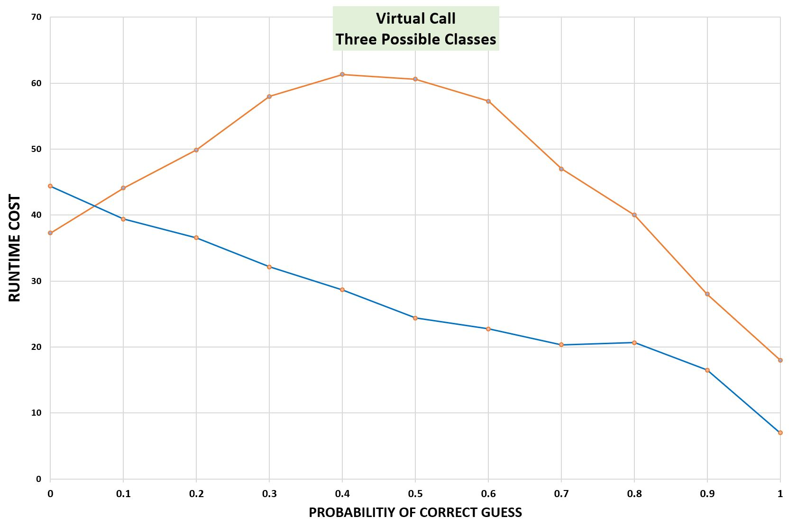
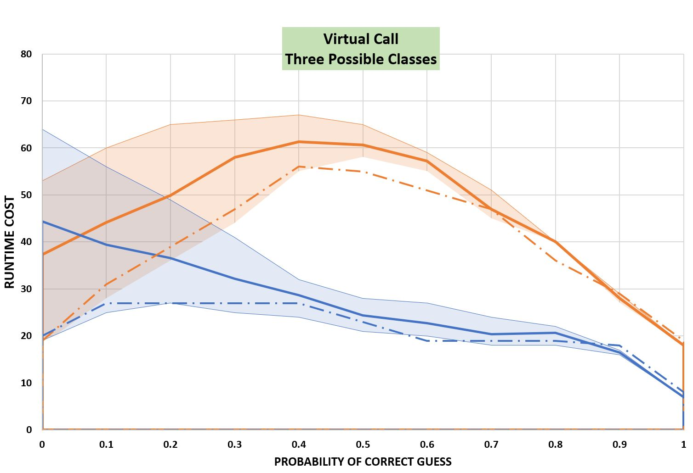
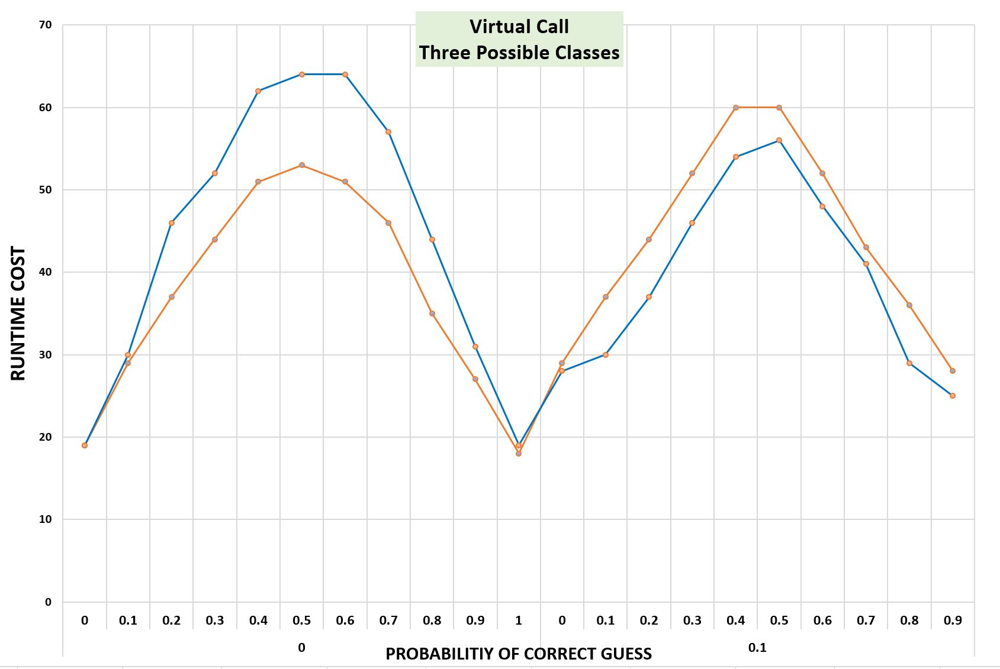
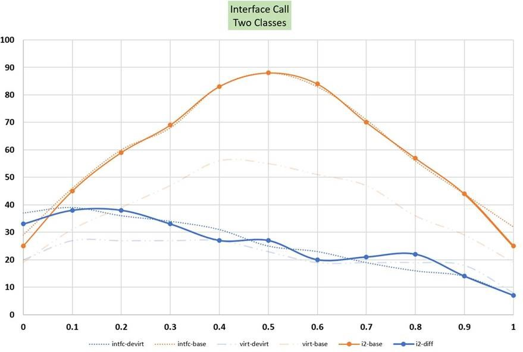
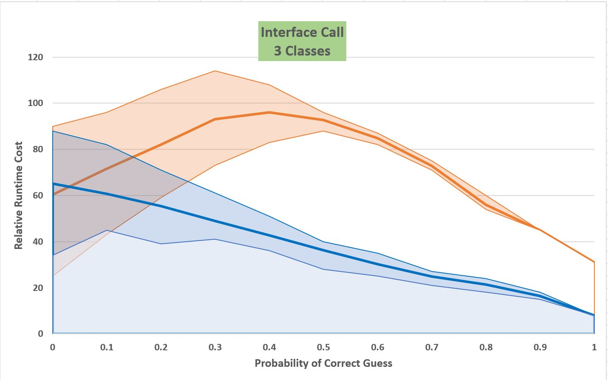

# Guarded Devirtualization

## Overview

Guarded devirtualization is a proposed new optimization for the JIT in .NET Core
3.0. This document describes the motivation, initial design sketch, and highlights
various issues needing further investigation.

## Motivation

The .NET Core JIT is able to do a limited amount of devirtualization for virtual
and interface calls. This ability was added in .NET Core 2.0. To devirtualize
the JIT must be able to demonstrate one of two things: either that it knows the
type of some reference exactly (say because it has seen a `newobj`) or that the
declared type of the reference is a `final` class (aka `sealed`). For virtual
calls the JIT can also devirtualize if it can prove the method is marked as `final`.

However, most of the time the JIT is unable to determine exactness or finalness
and so devirtualization fails. Statistics show that currently only around 15% of
virtual call sites can be devirtualized.  Result are even more pessimistic for
interface calls, where success rates are around 5%.

There are a variety of reasons for this. The JIT analysis is somewhat weak.
Historically all the JIT cared about was whether some location held **a** reference
type, not a specific reference type. So the current type propagation has been
retrofitted and there are places where types just get lost. The JIT analysis
happens quite early (during importation) and there is only minimal ability to do
data flow analysis at this stage. So for current devirtualization the source of
the type information and the consumption must be fairly close in the code. A
more detailed accounting of some of the shortcomings can be found in
[#7541](https://github.com/dotnet/runtime/issues/7541).

Resolution of these issues will improve the ability of the JIT to devirtualize,
but even the best analysis possible will still miss out on many cases. Some call
sites are truly polymorphic. Some others are truly monomorphic but proving this
would require sophisticated interprocedural analyses that are not practical in
the JIT or in a system as dynamic as the CLR. And some sites are monomorphic in
practice but potentially polymorphic.

As an alternative, when devirtualization fails, the JIT can perform *guarded
devirtualization*. Here the JIT creates an `if-then-else` block set in place of
a virtual or interface call and inserts a runtime type test (or similar) into
the `if` -- the "guard". If the guard test succeeds the JIT knows the type of
the reference, so the `then` block can directly invoke the method corresponding
to that type. If the test fails then the `else` block is executed and this
contains the original virtual or interface call.

The upshot is that the JIT conditionally gains the benefit of devirtualization at
the expense of increased code size, longer JIT times, and slightly longer code
paths around the call. So long as the JIT's guess at the type is somewhat
reasonable, this optimization can improve performance.

## Opportunity

One might imagine that the JIT's guess about the type of the reference has to be
pretty good for devirtualization to pay off. Somewhat surprisingly, at least based
on our initial results, that is not the case.

### Virtual Calls: The Two-Class Case

Given these class declarations:
```C#
class B
{
   public virtual int F() { return 33;  }
}

class D : B
{
    public override int F() { return 44; }
}
```
Suppose we have an array `B[]` that is randomly filled with instances of `B` and
`D` and each element is class `B` with probability `p`.  We time how long
it takes to invoke `F` on each member of the array (note the JIT will not ever
be able to devirtualize these calls), and plot the times as a function of `p`.
The result is something like the following:



Modern hardware includes an indirect branch target predictor and we can see it
in action here. When the array element type is predictable (`p` very close to
zero or very close to 1) performance is better. When the element type is
unpredictable (`p` near 0.5) performance is quite a bit worse.

From this we can see that a correctly predicted virtual call requires about
19 time units and worst case incorrect prediction around 55 time units. There is
some timing overhead here too so the real costs are a bit lower.

Now imagine we update the JIT to do guarded devirtualization and check if the
element is indeed type `B`. If so the JIT can call `B.F` directly and in our
prototype the JIT will also inline the call. So we would expect that if the
element types are mostly `B`s (that is if `p` is near 1.0) we'd see very good
performance, and if the element type is mostly `D` (that is `p` near 0.0)
performance should perhaps slightly worse than the un-optimized case as there is
now extra code to run check before the call.



However as you can see the performance of devirtualized case (blue line) is as
good or better than the un-optimized case for all values of `p`. This is perhaps
unexpected and deserves some explanation.

Recall that modern hardware also includes a branch predictor. For small or large
values of `p` this predictor will correctly guess whether the test added by the
JIT will resolve to the `then` or `else` case. For small values of `p` the JIT
guess will be wrong and control will flow to the `else` block. But unlike the
original example, the indirect call here will only see instances of type `D` and
so the indirect branch predictor will work extremely well. So the overhead for
the small `p` case is similar to the well-predicted indirect case without guarded
devirtualization. As `p` increases the branch predictor starts to mispredict and
that costs some cycles. But when it mispredicts control reaches the `then` block
which executes the inlined call. So the cost of misprediction is offset by the
faster execution and the cost stays relatively flat.

As `p` passes 0.5 the branch predictor flips its prediction to prefer the `then`
case. As before mispredicts are costly and send us down the `else` path but there
we still execute a correctly predicted indirect call.

And as `p` approaches 1.0 the cost falls as the branch predictor is almost always
correct and so the cost is simply that of the inlined call.

So oddly enough the guarded devirtualization case shown here does not require any
sort of perf tradeoff. The JIT is better off guessing the more likely case but
even guessing the less likely case can pay off and doesn't hurt performance.

One might suspect at this point that the two class case is a special case and that
the results do not hold up in more complex cases. More on that shortly.

Before moving on, we should point out that virtual calls in the current
CLR are a bit more expensive than in C++, because the CLR uses a two-level method
table. That is, the indirect call sequence is something like:
```asm
000095 mov      rax, qword ptr [rcx]                 ; fetch method table
000098 mov      rax, qword ptr [rax+72]              ; fetch proper chunk
00009C call     qword ptr [rax+32]B:F():int:this     ; call indirect
```
This is a chain of 3 dependent loads and so best-case will require at least 3x
the best cache latency (plus any indirect prediction overhead).

So the virtual call costs for the CLR are high. The chunked method table design
was adopted to save space (chunks can be shared by different classes) at the
expense of some performance. And this apparently makes guarded devirtualization
pay off over a wider range of class distributions than one might expect.

And for completeness, the full guarded `if-then-else` sequence measured above is:
```asm
00007A mov      rcx, gword ptr [rsi+8*rcx+16]        ; fetch array element
00007F mov      rax, 0x7FFC9CFB4A90                  ; B's method table
000089 cmp      qword ptr [rcx], rax                 ; method table test
00008C jne      SHORT G_M30756_IG06                  ; jump if class is not B

00008E mov      eax, 33                              ; inlined B.F
000093 jmp      SHORT G_M30756_IG07

G_M30756_IG06:

000095 mov      rax, qword ptr [rcx]                 ; fetch method table
000098 mov      rax, qword ptr [rax+72]              ; fetch proper chunk
00009C call     qword ptr [rax+32]B:F():int:this     ; call indirect

G_M30756_IG07:
```
Note there is a redundant load of the method table (hidden in the `cmp`) that
could be eliminated with a bit more work on the prototype. So guarded
devirtualization perf could potentially be even better than is shown above,
especially for smaller values of `p`.

### Virtual Calls: The Three-Class Case

Now to return to the question we asked above: is there something about the two
class case that made guarded devirtualization especially attractive? Read on.

Suppose we introduce a third class into the mix and repeat the above measurement.
There are now two probabilities in play: `p`, the probability that the element
has class `B`, and `p1`, the probability that the element has class `D`, and
there is a third class `E`. To avoid introducing a 3D plot we'll first simply
average the results for the various values of `p1` and plot performance as a
function of `p`:



The right-hand side (`p` near 1.0) looks a lot like the previous chart. This is
not surprising as there are relatively few instances of that third class. But the
middle and left hand side differ and are more costly.

For the un-optimized case (orange) the difference is directly attributable to
the performance of the indirect ranch predictor. Even when `p` is small there
are still two viable branch targets (on average) and some some degree of indirect
misprediction.

For the optimized case we now see that guarded devirtualization performs worse
than no optimization if the JIT's guess is completely wrong. The penalty is not
that bad because the JIT-introduced branch is predictable. But even at very
modest values of `p` guarded devirtualization starts to win out.

Because we've averaged over `p1` you might suspect that we're hiding something.
The following chart shows the min and max values as well as the average, and also
shows the two-class result (dashed lines).



You can see the minimum values are very similar to the two class case; these
are cases where the `p1` is close to 0 or close to 1. And that makes sense because
if there really are only two classes despite the potential of there being three
then we'd expect to see similar results as in the case where there only can be
two classes.

And as noted above, if `p` is high enough then the curves also converge to the
two class case, as the relative mixture of `D` and `E` is doesn't matter: the
predominance of `B` wins out.

For low values of `p` the actual class at the call site is some mixture of `D`
and `E`. Here's some detail (the x axis now shows `p1` and `p` as upper and
lower values respectively).



The worst case for perf for both is when the mixture of `D` and `E` is
unpredictably 50-50 and there are no `B`s. Once we mix in just 10% of `B` then
guarded devirt performs better no matter what distribution we have for the other
two classes. Worst case overhead -- where the JIT guesses a class that never
appears, and the other classes are evenly distributed -- is around 20%.

So it seems reasonable to say that so long as the JIT can make a credible guess
about the possible class -- say a guess that is right at least 10% of the time
-- then there is quite likely a performance benefit to guarded
devirtualization for virtual calls.

We'll need to verify this with more scenarios, but these initial results are
certainly encouraging.

### Virtual Calls: Testing for Multiple Cases

One might deduce from the above that if there are two likely candidates the JIT
should test for each. This is certainly a possibility and in C++ compilers that
do indirect call profiling there are cases where multiple tests are considered
a good idea. But there's also additional code size and another branch.

This is something we'll look into further.

### Interface Calls: The Two Class Case

Interface calls on the CLR are implemented via [Virtual Stub Dispatch](
https://github.com/dotnet/runtime/blob/main/docs/design/coreclr/botr/virtual-stub-dispatch.md
)  (aka VSD). Calls are made through an indirection cell that initially points
at a lookup stub. On the first call, the interface target is identified from the
object's method table and the lookup stub is replaced with a dispatch stub that
checks for that specific method table in a manner quite similar to guarded
devirtualization.

If the method table check fails a counter is incremented, and once the counter
reaches a threshold the dispatch stub is replaced with a resolve stub that looks
up the right target in a process-wide hash table.

For interface call sites that are monomorphic, the VSD mechanism (via the dispatch
stub) executes the following code sequence (here for x64)
```asm
; JIT-produced code
;
; set up R11 with interface target info
mov R11, ...         ; additional VSD info for call
mov RCX, ...         ; dispatch target object
cmp [rcx], rcx       ; null check (unnecessary)
call [addr]          ; call indirect through indir cell

; dispatch stub
cmp [RCX], targetMT  ; check for right method table
jne DISPATCH-FAIL    ; bail to resolve stub if check fails (uses R11 info)
jmp targetCode       ; else "tail call" the right method
```

At first glance it might appear that adding guarded devirtualization on top of
VSD may not provide much benefit for monomorphic sites. However the guarded
devirtualization test doesn't use an indirection cell and doesn't require R11
setup, may be able to optimize away the null check, and opens the door for
inlining. So it should be slightly cheaper on average and significantly cheaper
in some cases.

(Note [#9027](https://github.com/dotnet/runtime/issues/9027) indicates
we should be able to optimize away the null check in any case).

If the guarded tests fails we've filtered out one method table the dispatch cell
now works well even if a call site alternates between two classes. So we'd expect
the combination of guarded devirtualization and VSD to perform well on the two
class test and only show limitations when faced with mixtures of three or more
classes.

If the guard test always fails we have the up-front cost for the vtable fetch
(which should amortize pretty well with the subsequent fetch in the) stub plus
the predicted not taken branch. So we'd expect the cost for the two-class cases
where the JIT's prediction is always wrong to be a bit higher).

The graph below shows the measured results. To makes sure we're not overly impacted
by residual VSD state we use a fresh call site for each value of p. The solid
orange line is the current cost. The dashed orange line is the corresponding cost
for a virtual call with the same value of p. The solid blue line is the cost with
an up-front guarded test. As noted there is some slowdown when the JIT always
guesses the wrong class, but the break-even point (not shown) is at a relatively
small probability of a correct guess.



### Interface Calls: The Three Class Case

As with virtual calls you may strongly suspect the two class case for interface
calls is special. And you'd be right.

If we mix a third class in as we did above, we see similar changes in the
performance mix for interface calls, as seen below. But also as with virtual calls
the JIT's guess doesn't have to be all that good to see payoffs. At around 10%
correct, guessing wins on average, and around 30% correct guessing is always a
perf win.



### Delegate Speculation

While we have been discussing this topic in the context of virtual calls, the
method is general and can be applied to indirect calls as well. Here the guard
test may just test for a particular function rather than a type.

`Delegate.Invoke` is a special method that can eventually turns into an indirect
call. The JIT could speculate about the possible target of this call. Choosing
a good target here would require some kind of indirect call profiling.

### Calli Speculation

Indirect calls also arise via the `calli` opcode. As with delegates, choosing a
target here likely requires specialized profiling.

### Costs

Given the optimistic take on performance, it is important to remember that
there are also some costs involved to guarded devirtualization: increased code
size and increased JIT time. There may also be some second-order effects on
the local code generation as we've introduced control flow into the method where
it didn't exist previously.

A naive implementation that aggressively performs guarded devirtualization
increases code size overall by about 5% as measured by PMI. JIT time increase
was not measured but should be in that same ballpark. Some assemblies see code
size increasing by as much as 12%.

However the guarded devirtualization only kicks in for about 15% of the methods.
So the average relative size increase in a method with virtual calls is probably
more like 33%.

There may be some inefficiencies in the current prototype that can be fixed to
reduce the code size impact. Aside from the extra method table fetch noted above
the duplicated calls have the same sets of arguments and so we might be able to
amortize argument evaluation costs better. And there are some complexities around
handling return values (especially for implicit by-reference structures) that
likewise might be able to be tightened up.

Nevertheless, blindly optimizing all virtual calls with guarded devirtualization
is not likely the right approach. Something more selective is almost certainly
needed.

However we have done code-expanding optimizations somewhat blindly before, and
we could contain the size growth risk by restricting this optimization to Tier1.
Also PMI can overstate size impact seen in real scenarios as it may over-count
the impact of changes in methods that are always inlined. So we should look at
size increases from some actual scenarios.

And perhaps I'll look at the size impact of loop cloning as a precedent.

## Implementation Considerations

To get the data above and a better feel for the challenges involved we have
implemented a prototype. It is currently located on this branch:
[GuardedDevirtFoundations](https://github.com/AndyAyersMS/coreclr/tree/GuardedDevirtFoundations).

The prototype can introduce guarded devirtualization for some virtual and
interface calls. It supports inlining of the directly invoked method. It uses
the JIT's "best known type" as the class to predict. It also anticipates being
able to query the runtime for implementing classes of an interface.

### Phase Ordering

For the most part, devirtualization is done very early on in the JIT, during
importation. This allows devirtualized calls to subsequently be inlined, and for
devirtualization of call sites in inlinees to take advantage of type information
propagating down into the inlinee from inlined arguments.

We want those same properties to hold for guarded devirtualization candidates.
So conceptually the transformation should happen in the same place. However it is
not possible to introduce new control flow in the importer (ignoring for the moment
the possibility of using question ops). So the actual transformation must be
deferred until sometime after the importer runs and before the inliner runs.

This deferral is a bit problematic as some key bits of importer state are needed
to query the runtime about the properties of a call target. So if we defer the
transformation we need to somehow capture the data needed for these queries and
make it available later. The current prototype uses (abuses?) the inline
candidate information for this. As part of this we require that all speculative
devirtualization sites be treated as inline candidates, at least initially.
This has the side effect of hoisting the call to be a top level (statement)
expression and introduces a return value placeholder.

We currently already have a similar transformation in the JIT, the "fat calli"
transformation needed on CoreRT. This transformation runs at the right time --
after the importer and before the inliner -- and introduces the right kind of
`if-then-else` control flow structure. So the thought is to generalize this to
handle guarded devirtualization as well.

### Recognition

In the prototype, candidates are recognized during the initial importer driven
call to `impDevirtualizeCall`. If the only reason devirtualization fails is lack
of exactness, then the call is marked as a guarded devirtualization candidate.

### Devirtualization

To produce the direct call the prototype updates the `this` passed in the `then`
version of the call so it has the exact predicted type. It then re-invokes
`impDevirtualizeCall` which should now succeed as the type is now exactly
known. The benefit of reuse here is that certain special cases of devirtualization
are now more likely to be handled.

### Inline Candidacy

The prototype currently sets up all virtual and interface calls as potential
inline candidates. One open question is whether it is worth doing guarded
devirtualization simply to introduce a direct call. As an alternative we could
insist that the directly called method also be something that is potentially
inlineable. One can argue that call overhead matters much more for small methods
that are also likely good inline candidates.

The inline candidate info is based on the apparent method invoked at the virtual
site. This is the base method, the one that introduces the virtual slot. So if we
speculatively check for some class and that class overrides, we need to somehow
update the inline info. How to best do this is unclear.

### Return Values

Because the candidate calls are handled as inline candidates, the JIT hoists the
call to a top level expression (which is good) during importation and introduces
a return value placeholder into the place the call occupied in its original tree.
(Oddly we introduce return value placeholders for some calls that don't return a
a value -- we should fix this). The placeholder points back at the call.

When we split the call into two calls we can't keep this structure intact as there
needs to be a 1-1 relationship between call and placeholder. So the prototype
needs to save the return value in a new local and then update the placeholder to
refer to that local. This can be tricky because in some cases we haven't yet settled
on what the actual type of the return value is.

The handling of return values in the early stages of the JIT (arguably, in the entire
JIT) is quite messy. The ABI details bleed through quite early and do so somewhat
unevenly. This mostly impacts methods that return structures as different ABIs have
quite different conventions, and the IR is transformed to reflect those conventions
at different times for un-inlined calls, inlineable calls that end up not getting
inlined, and for calls that get inlined. In particular, structures that are small
enough to be returned by value (in a register or set of registers) need careful
handling.

The prototype skips over such by-value-returning struct methods today. Some of
the logic found in `fgUpdateInlineReturnExpressionPlaceHolder` needs to be pulled
in to properly type the call return value so we can properly type the temp. Or
perhaps we could leverage some of importer-time transformations that are done for
the fat calli cases.

For larger structs we should arrange so that the call(s) write their return values
directly into the new temp, instead of copying the value from wherever they
return it into a temp, to avoid one level of struct copy. Doing so may require
upstream zero init of the return value struct and this should only happen in one
place.

## Open Issues

Here are some of the issues that need to be looked into more carefully.

### Policy

- what is the best mechanism for guessing which class to test for?
  - instrument Tier0 code?
  - look at types of arguments?
  - ask runtime for set of known classes?
  - harvest info from runtime caches (VSD)?
  - add instrumenting Tier1 to collect data and Tier2 to optimize?
- is there some efficient way to test for class ranges? Currently the JIT is
doing an exact type test. But we really care more about what method is going to
be invoked. So if there is a range of types `D1...DN` that all will invoke some
particular method can we test for them all somehow?
- or should we test the method after the method lookup (possibly worse tradeoff
because of the chunked method table arrangement, also tricky as a method can
have multiple addresses over time. Since many types can share a chunk this
might allow devirtualization over a wider set of classes (good) but we'd lose
knowledge of exact types (bad). Not clear how these tradeoffs play out.
- interaction of guarded devirt with VSD? For interface calls we are sort of
inlining the first level of the VSD into the JITted code.
- revocation or reworking of the guard if the JIT's prediction turns out to bad?
- improve regular devirtualization to reduce need for guarded
devirtualization.
- should we enable this for preJITted code? In preJITted code the target method
table is not a JIT-time constant and must be looked up.
- in the prototype, guarded devirtualization and late devirtualization sometimes
conflict. Say we fail to devirtualize a site, and so expand via guarded devirtualization
guessing some class X. The residual virtual call then may be optimizable via late
devirtualization, and this may discover the actual class. In that case the guarded
devirtualization is not needed. But currently it can't be undone.
- we probably don't want to bother with guarded devirtualization if we can't also
inline. But it takes us several evaluation steps to determine if a call can
be inlined, some of these happening *after* we've done the guarded expansion.
Again this expansion can't be undone.
- so perhaps we need to build an undo capability for the cases where guarded
devirtualization doesn't lead to inlining and/or where late devirtualization also
applies.

### Implementation

- avoid re-fetching method table for latent virtual call (should reduce code
size and improve overall perf win)
- look at how effectively we are sharing argument setup (might reduce code size
and JIT time impact) -- perhaps implement head merging?
- handle return values in full generality
- il offsets
- flag residual calls as not needing null checks
- properly establish inline candidacy
- decide if the refactoring of `InlineCandidateInfo` is the right way to pass
information from importer to the indirect transform phase

### Futures

- can we cover multiple calls with one test? This can happen already if the
subsequent call is introduced via inlining of the directly called method, as we
know the exact type along that path. But for back to back calls to virtual
methods off of the same object it would be nice to do just one test.
- should we test for multiple types? Once we've peeled off the "most likely" case
if the conditional probability of the next most likely case is high it is probably
worth testing for it too. I believe the C++ compiler will test up to 3 candidates
this way... but that's a lot of code expansion.
