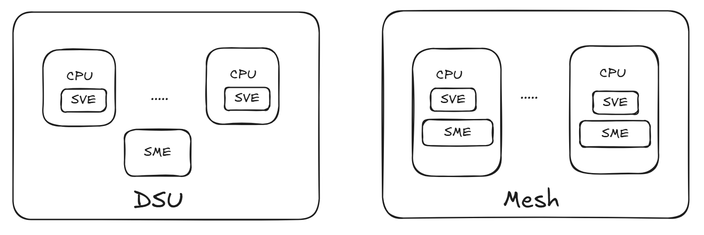

# <u>S</u>calable <u>M</u>atrix <u>E</u>xtension

## Overview

The Scalable Matrix Extension (SME) is an ARM architecture extension designed to provide optimal support for matrix operations, which are critical in AI workloads. Its key features include:

- **Streaming SVE Mode**: Enhanced execution environment for vector operations.
- **Matrix Multiplication**: Support for outer product operations between two vectors.
- **Matrix Tile Storage**: Capability to store and manipulate data in tiles.
- **Data Manipulation**: Operations such as load, store, and insert within tiles.


## Streaming SVE

### Concept and Background

SME introduces two key concepts essential for AI workloads:

1. **Streaming Mode**: Allows a program to operate with a scalable vector length (SVL) distinct from the non-streaming vector length (NSVL).
2. **ZA Storage**: Provides specialized storage for matrix tiles.

### Non-Streaming vs. Streaming Mode

In SVE1 and SVE2, the vector length (VL) is scalable and can vary between 16B and 256B, depending on the hardware. This is referred to as **NSVL**. Examples include:
- Microsoft Azure's Cobalt: VL = 16B
- Amazon AWS's Graviton3: VL = 32B
- Fujitsu A64FX Fugaku: VL = 64B

**Streaming Mode**, introduced by SME, operates with a distinct VL known as **SVL**. Some key differences include:
- The SME core is a separate hardware unit, supporting different VLs for NSVL and SVL.
- Transitions to and from Streaming Mode are controlled using the `SMSTART` and `SMSTOP` instructions.
- Certain SVE1, SVE2, and NEON instructions are invalid in Streaming Mode.

### Transitioning Between Modes

A program can enter or leave Streaming Mode using the following:
- `SMSTART`: Activates Streaming Mode.
- `SMSTOP`: Deactivates Streaming Mode and restores non-streaming operations.

**Important Considerations**:
- Transitioning between modes incurs a performance penalty, as register states must be saved and restored.
- Ensure non-streaming instructions are not executed while Streaming Mode is active.

The `FEAT_SME_FA64` feature, if present, integrates the SME unit directly onto each CPU core (referred to as the "Mesh" configuration on the right). In this configuration, no instructions become invalid. However, this setup may not be implemented for server SKUs due to the significant silicon area required for an SME unit on every core. This implementation detail still requires confirmation from Arm.

The standard configuration involves a single shared SME unit across all or a subset of CPU cores (referred to as the "DSU" configuration on the left). This setup is more suited for PCs, laptops, and mobile devices. The M4 processor is currently the only production-ready device with SME support, but it includes SME functionality without SVE capabilities in its main CPU cores.



### ZA Storage

The second key concept introduced by SME is **ZA Storage**, which is a 2D matrix of dimensions `N x N`, where `N` represents the Scalable Vector Length (SVL) (note: this is SVL and not NSVL). This matrix is exclusively accessible in Streaming Mode, and any instructions to read, write, or manipulate the ZA Storage must be executed within Streaming Mode. Similar to NEON registers and Scalable Vector Registers, the contents of the ZA Storage matrix can be interpreted in various data types, including 1-byte (`B`), 2-byte half (`H`), 4-byte single (`S`), 8-byte double (`D`), or 16-byte quad (`Q`).

### Terminology

- Non-streaming mode: Default execution
- Streaming mode: PE is set to be in streaming mode after `SMSTART` instruction and before `SMSTOP` instruction is executed for that thread.
- NSVL: Non-streaming Vector Length. Length of vector when program is operating in non-streaming mode.
- SVL: Streaming Vector Length. Length of vector when program is operating in streaming mode.
- VL-dependent objects: Objects whose size is different in streaming vs. non-streaming mode.

## C++ ACLE

### Streaming and Non Streaming functions

In C++, mode transitions between streaming and non-streaming functions are handled automatically based on the function's attributes. The compiler is responsible for inserting the necessary instructions, such as `SMSTART` and `SMSTOP`. Notably, there are no C++ intrinsics that directly correspond to these instructions.

C++ provides the following function attributes to define compatibility with Streaming Mode:
- `__arm_streaming`: Specifies that all instructions within the function must be compatible with Streaming Mode.
- `__arm_streaming_compatible`: Indicates that the function uses only instructions valid in both streaming and non-streaming modes.
- **Default Behavior**: If no attribute is specified, the function is treated as a non-streaming mode function.

### SME State Management

It is the caller's responsibility to ensure the SME state is properly configured before a function is entered and to restore the previous state upon function exit. The callee assumes that the SME state is valid when the function is invoked.

### Compiler Behavior

- **Transition Handling**: 
  - When transitioning from a streaming function to a non-streaming function (or vice versa), the compiler automatically injects the required `SMSTART` or `SMSTOP` instructions around the call.
- **Streaming-Compatible Functions**:
  - When calling streaming and non-streaming functions from a streaming-compatible function, the compiler inserts code to check the current SME state and switch modes if necessary.
  - For streaming-compatible functions, no mode-checking or state-switching is required.

[LLVM document about SME](https://llvm.org/docs/AArch64SME.html#compiler-inserted-streaming-mode-changes) captures different possibilities of state transition and how they are handled.

Let us take a look at [this example](https://godbolt.org/z/hxehqv6eG). 

The code can be summarised as:
```c++
extern void n_extern_func(void);
extern void s_extern_func(void) __arm_streaming;
extern void sc_extern_func(void) __arm_streaming_compatible;

void n_sme_func(void){
    n_extern_func();

    // Injected by compiler: SMSTART
    s_extern_func();
    // Injected by compiler: SMSTOP

    sc_extern_func();
}

void s_sme_func(void) __arm_streaming{
   // Injected by compiler: SMSTOP
   n_extern_func();
   // Injected by compiler: SMSTART

   s_extern_func();

   sc_extern_func();
}

void sc_sme_func(void) __arm_streaming_compatible{
    // Injected by compiler: bool sme_state = __arm_sme_state();
    // Injected by compiler: if(sme_state) SMSTOP
    n_extern_func();
    // Injected by compiler: if(sme_state) SMSTART

    // Injected by compiler: bool sme_state = __arm_sme_state();
    // Injected by compiler: if(!sme_state) SMSTART
    s_extern_func();
    // Injected by compiler: if(!sme_state) SMSTOP

    sc_extern_func();
}
```

## ABI

### Saving / Restoring registers

When entering and leaving streaming mode, all Z and P registers are trashed
<i>
  - When entering Streaming SVE mode (PSTATE.SM is changed from 0 to 1) or exiting Streaming SVE mode (PSTATE.SM is changed from 1 to 0), all of these registers are set to zero.
  - Some SVE2 instructions become illegal to execute in Streaming SVE mode:
    - Gather/scatter load/store SVE2 instructions 
    - SVE2 instructions that use First Fault Register 
    - Most NEON instructions become UNDEFINED
</i>

Let us look at another example [here](https://godbolt.org/z/84Ebrcn5q).

- `z8~z23` and `p4~p15` are saved/restored before streaming mode state changes. The incurs significant performance penalty and hence changing streaming state frequently is not advisable.

## .NET Runtime Use Cases

The Scalable Matrix Extension (SME) is well-suited for various PC and laptop use cases, particularly those involving matrix-heavy computations and AI workloads. Below are the primary use cases:

- **Tensor Acceleration for Matrix Manipulation**: SME can simplify and accelerate tensor operations by utilizing the `ZA` storage for efficient matrix manipulation.

- **Enhancing SVE Routines**: While current Arm hardware is limited to 128-bit vector lengths, SME implementations often support wider vector lengths. Existing routines written in SVE can be modified to run in Streaming Mode, provided they only use APIs valid in this mode. Wider vector lengths in SME provide a significant performance boost.

- **AI Inference Workloads**: SME is ideal for accelerating AI inference tasks that rely heavily on matrix operations.

- **Large-Scale Matrix Manipulation**: SME is beneficial for workloads requiring extensive matrix computations, such as those found in the [Tensor SDK](https://learn.microsoft.com/en-us/dotnet/api/system.numerics.tensors.tensor-1?view=net-9.0-pp).

- **Special Accelerator**: We can also envision SME work to be shipped as a standalone tool or collection of libraries (something similar to [Unity](https://docs.unity3d.com/Packages/com.unity.burst@1.2/manual/index.html)), that will help widely used acclerators in AI/ML workflow.

### Limitations

SME is currently not applicable to server scenarios, as it is not available on server-grade hardware. However, the intention of this design document is exploring the technical aspects of supporting SME. We want to make sure that what we design for SME (server or client), works well with the non-streaming SVE, which will be shipped much earlier than SME will get shipped.

## .NET Runtime design

To add support for the Scalable Matrix Extension (SME) in the .NET Runtime, several key considerations need to be carefully evaluated. Below are the primary aspects that must be addressed:

1. Automatic Streaming State Switching
2. Runtime Aspects
   - Agnostic Vector Length (VL) code generation
   - Exception Handling
   - Threads and SME state
   - NativeAOT and crossgen2 handling
   - .NET <--> PInvoke/system calls
   - Diagnostics - debugger and profiler
   - Testability
3. Surfacing `ZA` storage using .NET APIs, if there is a need (which is unlikely).

Let us walk through each of the above points in depth.

### Streaming state change

To support the Scalable Matrix Extension (SME) in the .NET Runtime, we need to develop a mechanism for managing streaming state transitions. This can be done either automatically by the compiler or manually by giving control to the .NET developer.

One approach we can take is to mirror the C++ ACLE design, introducing method attributes `[SME_Streaming]` and `[SME_Streaming_Compatible]` to indicate the expected streaming mode of a method. These attributes allow the code generator to insert appropriate streaming state change instructions. Having these method attributes, user can use them on methods that will have contain the code related to SME and streaming.

In the example below, streaming state change instructions are inserted into the `Bar()` method when it calls the non-streaming `Baz()` method. 

The code generator can also optimize the number of streaming state changes required. For instance, in the `Baz()` method (a non-streaming method), instead of switching states twice (once for `Foo()` and again for `Bar()`), the generator could consolidate these transitions into a single switch. However, it is worth noting that this optimization is not currently implemented at the highest optimization level in C++ compilers like Clang.

When a method is annotated with `[SME_Streaming_Compatible]`, the code generator inserts streaming state change instructions only if the current state is not already in the desired streaming state expected by the callee. For example, in `CompatMethod()`, the code generator inserts checks before calling `Foo()` or `Baz()` to ensure the state is correct. Moreover, methods marked as streaming-compatible handle state transitions internally, meaning their callers do not need to add state change instructions before and after the call.


```c#
[SME_Streaming]
void Foo() 
{
  ...
}

[SME_Streaming]
void Bar() 
{
  ...
  // insert SMSTOP
  Baz();
  // insert SMSTART
  ...
  CompatMethod();
  ...
}

void Baz() 
{
  ...
  // insert SMSTART
  Foo();
  Bar();
  // insert SMSTOP
  ...
  CompatMethod();
  ...
}

[SME_Streaming_Compatible]
void CompatMethod()
{
  // insert if (PSTATE.SM == STOP) SMSTART
  Foo();
  ...
  // insert if (PSTATE.SM == START) SMSTOP
  Baz();
  ....
}
```

**API Marking Model**

- All SME intrinsic APIs that are only valid in streaming mode will be annotated with `[SME_Streaming]`.
- All other SME intrinsic APIs will be annotated with `[SME_Streaming_Compatible]`.
- All SVE/SVE2/AdvSimd APIs that are valid in streaming mode will be annotated with `[SME_Streaming_Compatible]`.
- All SVE/SVE2/AdvSimd APIs that are not valid in streaming mode will not be annotated.

This model ensures that calling `[SME_Streaming_Compatible]` intrinsics from non-streaming methods does not incur any streaming state change penalties. As a result, existing .NET libraries that use SVE APIs remain unaffected and continue to operate efficiently.

**Pros:**
- **Accurate Code Generation**:
   - Method attributes provide clear "hints" to the code generator, enabling it to accurately insert streaming state-change instructions at the required locations.
   - Without these attributes, the code generator would need to estimate the appropriate placement of state-change instructions, which could lead to:
     - **Best Case**: A performance hit due to unnecessary state changes (state changes are expensive as they involve saving/restoring many registers).
     - **Worst Case**: Incorrect placement could result in:
       - Executing a non-streaming instruction while the processor is in streaming mode.
       - Executing a streaming instruction while the processor is in a non-streaming mode.
       - Both scenarios can cause faults and crash the process.
   - Having attributes simplifies this process, reducing the likelihood of such issues.

- **Clear Application Design**:
   - Developers can clearly encapsulate streaming-specific logic within dedicated methods, improving code organization and readability.

- **Static Analysis Support**:
   - Passing VL-dependent objects between methods of different streaming states is undefined behavior. Method attributes facilitate the use of static analyzers to catch such mistakes.
   - SME or streaming-compatible intrinsics can be placed in a dedicated namespace (e.g., `System.Runtime.Intrinsics.Arm.Sve.Streaming`), allowing analyzers to flag errors when a method without the `[SME_Streaming]` attribute uses APIs from this namespace.

- **Handling Developer Oversights**:
   - **Scenario A**: A developer forgets to add the `[SME_Streaming]` attribute to a streaming method (`A()`):
     - The code generator treats `A()` as a non-streaming method but still inserts state-change instructions if:
       1. The method contains SME intrinsic APIs.
       2. The method calls another method marked with `[SME_Streaming]`.
   - **Scenario B**: A developer forgets to remove the `[SME_Streaming]` attribute from a method (`A()`) that no longer contains streaming logic:
     - The method continues to be treated as streaming, and state-change instructions are added for the entire method.
     - The code generator can optimize by batching multiple state-change instructions into a single `SMSTOP` at the beginning and a single `SMSTART` at the end of the method.
   - **Takeaway**: Even if the attribute information is inaccurate or outdated, the code generator can still manage to insert the necessary instructions effectively.

- **Seamless Library Integration**:
   - Invoking methods from existing libraries (streaming or non-streaming) remains straightforward. Developers do not need to worry about the streaming mode of the target method being invoked.

**Cons:**
- **Developer Errors**:
   - Developers might incorrectly apply or forget to apply the streaming attribute to a method. While this does not impact correctness, it can degrade performance.

- **Static Analyzer Limitations**:
   - Although static analyzers can identify errors, many projects may disable static analysis, leaving such issues undetected.
   - To mitigate this, method attributes could also be used to analyze VL-dependent arguments and add runtime checks (e.g., `throw InvalidProgramException`) for safety.

**Special Considerations**

- **Inlining Across States**: The code generator must handle inlining carefully when a streaming method is inlined within a non-streaming method, or vice versa. By inserting the necessary streaming state change instructions at the correct points, it should still be possible to enable inlining across streaming and non-streaming methods. Sometimes, inlining might have to be disabled when callee is not in same streaming type mode as the caller.
- **Tail call optimizations**: Similar to inlining, tail call optimizations might have to get disabled when caller and callee are not in similar streaming mode.
- **Platform Compatibility**: When compiling streaming methods for platforms that lack SME support, the code generator can insert a `throw PlatformNotSupportedException` at the beginning of the method to ensure compatibility.

There were few more options explored and they are described in Appendix section, along with their pros and cons.


### Code Generation for Agnostic VL

`Vector<T>` is .NET's representation of vectors whose length is known only at runtime. Its length represents non-streaming VL (NSVL), introduced as part of the SVE feature in .NET 9. When running in SME, its length corresponds to streaming VL (SVL). To support SME, .NET's code generator must handle the semantics of dynamic (NSVL) and unknown (SVL) vector length and generate code accordingly, considering streaming mode.

#### Why VL-Agnostic Code is Important

Consider the example `bool a = Vector.GreaterThanAll(b, c);`, where `b` and `c` are of type `Vector<float>`. The operation checks if all lanes in `b` are greater than their counterparts in `c`. Using the `fcmgt` instruction, it compares values and stores `1` in the predicate register lanes for matching conditions. Subsequently, it checks if all predicate lanes are active to return `true` or `false`.

In NSVL, where VL is fixed, we can compare the active predicate lanes to a constant (e.g., `#8` for a target with VL=32):

```asm
    fcmgt   p0.s, p0/z, z8.s, z0.s  # Activate p0 lanes for which z8 > z0
    ptrue   p1.s                  
    cntp    x0, p1, p0.s            # Count number of active lanes   
    cmp     x0, #8                  # If all 8 lanes are active, all satisfy z8 > z0
    cset    x0, eq                  # Set result based on comparison
```

However, if VL is unknown during compilation or in streaming mode, where VL may change, we cannot embed constants like `#8`. Instead, a more dynamic approach is required using instructions like `rdvl`:

```asm
    fcmgt   p0.s, p0/z, z8.s, z0.s  # Activate p0 lanes for which z8 > z0
    ptrue   p1.s                  
    cntp    x0, p1, p0.s            # Count number of active lanes   
    rdvl    x1, #4                  # Get dynamic count of 4-byte lanes
    cmp     x0, x1                  # Compare active lanes with dynamic VL
    cset    x0, eq                  # Set result based on comparison
```

This example demonstrates that code generation must adapt based on whether VL is known at compile time or not. A strategy is required for generating correct and optimal VL-agnostic code under various scenarios.


#### Partial VL-Agnostic Code

In scenarios where VL is known during compilation (e.g., JIT) and remains constant during method execution (non-streaming), we can use "partial" VL-agnostic code. This mode leverages VL size information for optimization while using scalable VL-agnostic registers and instructions.

**Characteristics of Partial VL-Agnostic Code:**
- VL size can be embedded in generated code (e.g., `#8` in the example above).
- Value numbering can assign `simd*_t` types to `Vector<T>` constants and optimize accordingly.
- Constants can be loaded using SVE `ldr` instructions with appropriate fallback for residual bytes.
- VL variables can be stored in the "local" stack frame area and accessed with VL-agnostic load/store instructions.
- Stack size and frame size can be determined upfront, even with `Vector<T>` variables on the stack.
- Optimizations such as loop unrolling and struct block copying can utilize VL information.

For Arm64, vector types are represented by `TYP_SIMD*`. For SVE, valid types are `TYP_SIMD16`, `TYP_SIMD32`, `TYP_SIMD64`, `TYP_SIMD128`, and `TYP_SIMD256`. In partial VL-agnostic mode, existing types like `TYP_SIMD32` and `TYP_SIMD64` will be reused, and new types (`TYP_SIMD128`, `TYP_SIMD256`) will be introduced for SVE. This approach minimizes code changes while leveraging existing optimizations.


#### Full VL-Agnostic Code

In cases where VL is unknown during compilation (e.g., AOT compilation) or may vary during execution (e.g., streaming mode), we use "full" VL-agnostic code. This mode avoids any dependency on VL size.

**Characteristics of Full VL-Agnostic Code:**
- VL size cannot be embedded in code. Instructions like `rdvl` are used to determine VL dynamically.
- Value numbering cannot represent `Vector<T>` constants due to unknown size, so `NoVN` will be assigned, limiting optimizations.
- VL variables cannot reside in the "locals" area of the stack frame. Instead, they are placed at the stack frame's bottom and accessed with VL-agnostic load/store instructions.
- Stack size cannot be calculated upfront. Instructions like `addvl` must be used for dynamic stack frame creation.
- Optimizations like loop unrolling and struct block copying are disabled.

A new type, `TYP_SIMDVL`, will represent fully VL-agnostic variables, with a size of `-1` to indicate unknown size.


#### Partial -> Full VL-Agnostic Code

For crossgen2 scenarios (AOT compilation followed by re-JIT), we can use a "partial->full" VL-agnostic strategy. During AOT compilation, "full" VL-agnostic code is generated. At runtime, methods are recompiled into "partial" VL-agnostic code if VL becomes known.


#### Summary

VL-agnostic code generation depends on two factors:
1. Whether VL can be determined during method compilation.
2. Whether VL remains constant during method execution.

The following table summarizes the code generation modes for various scenarios:

| Scalable Mode | Method Type   | Code Generation Mode  | VL-Agnostic Code  |
|---------------|---------------|-----------------------|-------------------|
| SVE           | Non-Streaming | JIT                   | Partial           |
| SVE           | Non-Streaming | NativeAOT             | Full              |
| SVE           | Non-Streaming | Crossgen2             | Full -> Partial   |
| SME           | Non-Streaming | JIT                   | Partial           |
| SME           | Non-Streaming | NativeAOT             | Full              |
| SME           | Non-Streaming | Crossgen2             | Full -> Partial   |
| SME           | Streaming     | Any                   | Full              |


#### `Vector<T>` Intrinsics

For Arm64, `Vector<T>` methods are traditionally mapped to `Vector128` in IR, producing NEON instructions. With SVE and SME, `Vector<T>` methods in IR will indicate scalable registers. This mapping is only enabled when `VL > 16`, as NEON instructions are faster or equivalent at `VL == 16`.


### Restricting VL-dependent Objects Transfer Between Streaming States

If we choose option #1 of using method attributes like `[SME_Streaming]`, the code generator should validate whether the arguments or return values of such methods are VL-dependent objects. If they are, the code generator will insert logic to `throw InvalidProgramException` at the start of the method. 

Several scenarios can arise where VL-dependent objects might cross boundaries between streaming states. The simplest example is a `static Vector<T>` variable `a` being accessed in a streaming method. 

If other options are preferred instead of method attributes, we would need to rethink how to enforce this restriction effectively.

[Calling restrictions related to streaming mode](https://arm-software.github.io/acle/main/acle.html#calling-restrictions-related-to-streaming-mode) section of Arm ACLE highlights some of the rules for passing around VL-dependent objects between streaming state.

### Runtime

### Notes on .NET Runtime Components for SME

Here are some raw notes on various .NET runtime components that need to be handled for SME and require further investigation.

#### Exception Handling
- Saving and restoring of `PSTATE.SM` and `PSTATE.ZA`, along with saving/restoring the `ZA` storage space, need to be addressed.
- Update the unwinder to sync with Windows OS to incorporate newer unwind codes relevant for SME instructions and `ZA`.


#### Threads
- During process creation, the `PSTATE.SM` state is cleared (defaulting to non-streaming mode). The same concept can be applied when new threads are created.


#### Garbage Collection (GC)
- `Vector<T>` instances on the stack may differ depending on the streaming mode active when they were saved. When GC scans an object, it must know the object's size. While objects already have a `size` component in the header, additional metadata might be required for VL-dependent objects created in streaming mode to ensure the correct size is read by the GC. This size information may also be needed in other runtime components.
- Investigate if `ZA` storage can hold GC references. If so, determine how the GC can scan this storage space.
- When suspended execution threads are resumed by the GC, some threads might be in streaming mode while others might not. Investigate whether any handling is required to ensure that their modes are restored correctly, avoiding accidental execution in the wrong mode.

#### Assembly Routines and Stubs
- Hand-written assembly routines will avoid using streaming mode for simplicity. However, if streaming is necessary, ensure that all required streaming and `ZA` states are saved and restored properly.

#### .NET <--> PInvokes / System Calls
- For all calls (e.g., PInvokes, JIT helpers, stubs), ensure that scalable `Z` and predicate `P` registers are saved.

#### Debugger / Profiler

- **Stepping Through Code**:
  - The processor mode may differ from that implied by the source code being debugged. This can lead to crashes if the code executes invalid instructions based on the streaming mode.

- **Offline Debugging / Dump Debugging**:
  - Debugging dumps poses challenges since encountering an `SMSTART` instruction prevents execution of subsequent code on an SME unit. The debugger needs to save `SSVL` and `PSTATE` information at such points. During stepping, the debugger must read this information and adjust `VL` and `ZA` states accordingly. It may also need to save/restore `Z` and `ZA` register contents, though the exact mechanism is unclear.

- **Variable Display in Debugger**:
  - Proper support for displaying the values of `Vector<T>` in the debugger is required, depending on the streaming mode in which they were created. VL-dependent objects should not cross streaming mode boundaries, and their sizes should remain consistent in the debugger when the streaming type changes.
  - For scalable registers, the debugger must reflect streaming mode changes in the displayed register contents. Non-UI debuggers may handle this more easily through commands, but UI-based debuggers with register windows need to refresh the UI with the appropriate `VL` and register contents.

- **ZA Storage Display**:
  - Add support in tools like Visual Studio and WinDbg to display the contents of `ZA` storage space.

- **Impact of Modifying `PC` During Debugging**:
  - Writing to the `PC` with instructions like `SMSTART` or `SMSTOP` during debugging could have severe undefined impacts on the thread being debugged. This is analogous to inserting `int 3` into the `PC` while stepping through code.


## ZA storage space

### Concept and Background

### ZA Representation for 128-bits / 16B SVL

Assuming a 128-bit (16B) Scalable Vector Length (SVL), here is how ZA is represented. The index `n` ranges from `0` to `15`.

#### **BYTE**

- **ZA Array Vector Access**:  
  The `byte` elements in ZA are stored as a [16x16] array of 8-bit elements, representing 256 `byte` elements in total. Each row is referred to as `ZA.B[n]`, where `n` is the row index.  
  For example, when `SVE=16B`, the rows are:  
  `ZA.B[0], ZA.B[1], ..., ZA.B[15]`.

- **ZA Tile**:  
  There is a single tile for `byte` elements, represented as `ZA0.B`.  
  - **Horizontal slices** (row order) are accessed using `ZA0H.B[n]`.  
    For example: `ZA0H.B[0], ZA0H.B[1], ..., ZA0H.B[15]`.
  - **Vertical slices** (column-major order) are accessed using `ZA0V.B[n]`.  

#### **SHORT**

- **ZA Array Vector Access**:  
  The `short` elements in ZA are stored as a [16x16] array of 16-bit elements, representing 128 `short` elements in total. Each row is referred to as `ZA.H[n]`, where `n` is the row index.  
  For example, when `SVE=16B`, the rows are:  
  `ZA.H[0], ZA.H[1], ..., ZA.H[15]`.

- **ZA Tile**:  
  There are two tiles for `short` elements, represented as `ZA0.H` and `ZA1.H`.  
  - **Horizontal slices** (row order):  
    - `ZA0H.H[n]` and `ZA1H.H[n]` access the rows alternately:  
      - `ZA0H.H[0] => ZA.H[0]`, `ZA0H.H[1] => ZA.H[2]`, and so on.  
      - `ZA1H.H[0] => ZA.H[1]`, `ZA1H.H[1] => ZA.H[3]`, and so on.  
    - General formula: `ZAkH.H[m] => ZA.H[2*m+k]`.

  - **Vertical slices** (column-major order):  
    - `ZA0V.H[n]` accesses the top 8 rows of `ZA` storage.  
    - `ZA1V.H[n]` accesses the bottom 8 rows of `ZA` storage.  
    - Both follow column-major order:  
      - `ZA0V.H[0], ZA0V.H[1], ..., ZA0V.H[7]`.  
      - Likewise for `ZA1V.H[*]`.

  See refer images in `References` section.

### Representation of ZA Storage in .NET APIs

The Arm Compiler Language Extensions (ACLE) do not expose `ZA` storage directly in the API signatures. Instead, they use specific notations to describe how the intrinsic APIs interact with the `ZA` state:

- `__arm_in("za")`: The callee takes the `ZA` state as input and returns with the state unchanged.
- `__arm_out("za")`: The callee ignores the incoming `ZA` state and returns a new state.
- `__arm_inout("za")`: The callee takes the `ZA` state as input and returns a new state.

For example, the API for the [SMLAL](https://docsmirror.github.io/A64/2023-06/smlal_za_zzi.html) instruction is defined as follows:

```c
// SMLAL intrinsic for 2 quad-vector groups.
void svmla_lane_za32[_s8]_vg4x2(uint32_t slice, svint8x2_t zn,
                                svint8_t zm, uint64_t imm_idx)
  __arm_streaming __arm_inout("za");
```


#### Proposed Approach for .NET APIs

We can adopt a similar approach in .NET by not exposing `ZA` storage directly in the API signatures. Instead, the APIs will be mapped to SME instructions during code generation, implicitly handling the reading and writing of the `ZA` state.

For example, the corresponding .NET API for the above instruction could look like this:

```csharp
void SvmlaLaneZA32S8_VG4x2(uint slice, Tuple<Vector<byte>, Vector<byte>> zn, Vector<byte> zm, ulong imm_idx);
```

Here:
- The `Tuple<Vector<byte>, Vector<byte>> zn` represents the vector groups (`svint8x2_t` in ACLE).
- `Vector<byte> zm` corresponds to the single vector operand.
- The `ulong imm_idx` represents the immediate index.


#### Nomenclature Rules for API Names

The naming of these APIs will follow specific rules depending on the usage of `ZA` and the type of operations. For example:
- If an operation involves multiple lanes, the suffix might include `_x2`, `_x4`, etc.
- For vector groups, the suffix might include `_vg2`, `_vg4`, `_vg1x2`, `_vg2x2`, etc.

These naming conventions ensure clarity and consistency across the API surface. For more details, refer to the [Arm Compiler Language Extensions (ACLE) documentation](https://arm-software.github.io/acle/main/acle.html#sme-instruction-intrinsics).

## Dependencies

- **Windows OS**
  - Support for SME and context save/restore.
  - Unwind codes for SME instructions.

- **.NET Debugger Team**
  - Support for displaying `Vector<T>` in both streaming and non-streaming modes.

- **C++ Compiler Support**
  - Necessary if streaming is ever used in C++ runtime code or assembly routines.

- **Visual Studio Debugger and WinDbg**
  - Updates required to handle and display SME-specific states.

## Testability

- **Intrinsic Unit Tests**
  - SME intrinsic tests will inherently validate streaming mode switching. 
  - Armie ([Arm Instruction Emulator](https://developer.arm.com/Tools%20and%20Software/Arm%20Instruction%20Emulator)) can be used to test streaming mode switching scenarios.
  - Tests can also be conducted on `osx-arm64` M4+ hardware.

- **Antigen/Fuzzlyn Coverage**
  - Create methods operating in streaming mode that call SME intrinsics.
  - Coverage will require `osx-arm64 M4+` to validate SME intrinsics.

- **SuperPMI Replay**
  - Harness `superpmi-replay` to produce SME code and verify the encoding and code generation.

## Hardware to Prototype

- **Apple's M4**
  - Currently the only hardware with SME support, but lacks SVE, making it difficult to test scenarios involving streaming mode switching. Preliminary SME intrinsic validation can still be performed.

- **Azure Cobalt / AWS Graviton**
  - Suitable for validating vector-agnostic support, which forms the foundation for SME validation.

## References
- [Overview](https://community.arm.com/arm-community-blogs/b/architectures-and-processors-blog/posts/scalable-matrix-extension-armv9-a-architecture)

- Arm SME community blog posts [part 1](https://community.arm.com/arm-community-blogs/b/architectures-and-processors-blog/posts/arm-scalable-matrix-extension-introduction), [part 2](https://community.arm.com/arm-community-blogs/b/architectures-and-processors-blog/posts/arm-scalable-matrix-extension-introduction-p2)

- [Matrix Multiplication example in NEON, SVE and SME](https://community.arm.com/arm-community-blogs/b/architectures-and-processors-blog/posts/matrix-matrix-multiplication-neon-sve-and-sme-compared).

- SME instructions: https://docsmirror.github.io/A64/2023-06/mortlachindex.html
- SME kernel docs: https://docs.kernel.org/arch/arm64/sme.html
- LLVM register allocation for `ZA`: https://github.com/llvm/llvm-project/commit/c08dabb0f476e7ff3df70d379f3507707acbac4e

- [Arm SME's ZA tile mapping](https://developer.arm.com/documentation/109246/0100/SME-Overview/SME-ZA-storage/ZA-array-vector-access-and-ZA-tile-mapping)

- [Arm Community Blog that describes SME ZA Storage](https://community.arm.com/arm-community-blogs/b/architectures-and-processors-blog/posts/arm-scalable-matrix-extension-introduction)


## TODO
- More information about ZA storage, anything that runtime needs to handle about saving and restoring it.
- ZA lazy scheme: https://arm-software.github.io/acle/main/acle.html#sme-instruction-intrinsics

## Open Questions
- What happens when `Vector<T>` is created in streaming mode? Can we pass it around to non-streaming mode and vice-versa? 18.1.7 restricts VL-dependent arguments to be passed that way, but how to restrict them in C#?

## Appendix

### Alternative options for Streaming state change

Here, we state different approaches to provide functionality of streaming state changes, along with their pros and cons.

#### 1. Expose StreamingON() and StreamingOFF()

An alternative to using method attributes is exposing streaming state change instructions as intrinsics, such as `StreamingON()` and `StreamingOFF()`. This approach allows developers to explicitly control streaming mode transitions, while the code generator simply inserts the corresponding instructions at the specified locations.

**Pros:**
- **Fine-Grained Control**:
   - Developers have precise control over where and when to enable or disable streaming mode in their code.

- **Unchanged Workflow**:
   - Unlike method attributes, this approach does not require developers to annotate methods, keeping their workflow and coding style consistent.

- **Simplified Code Generator**:
   - The code generator does not need to analyze or infer placement of streaming state change instructions. It only needs to ensure proper saving and restoring of registers before and after the intrinsics are invoked.


**Cons:**
- **High Risk of Developer Errors**:
   - This approach gives developers more control than necessary, increasing the likelihood of mistakes:
     - For example, a developer might call `StreamingON()` and inadvertently write code that generates NEON instructions, which are invalid in streaming mode. This could cause the program to crash.

- **Forgotten Intrinsics**:
   - Developers may forget to call `StreamingON()` or `StreamingOFF()`, leading to catastrophic failures. Unlike the method attributes approach, there is no safety mechanism in place to insert missing state change instructions automatically.
   - Calling an SME API that is valid only in streaming mode without enabling streaming mode would result in an illegal instruction exception at runtime.

- **Scattered Intrinsics**:
   - Developers will need to manually scatter `StreamingON()` and `StreamingOFF()` calls throughout their code, making it harder to maintain. They must also remember the current mode at every point in their code to ensure counterpart APIs are called correctly.

- **Undefined Behavior in Conditional Logic**:
   - Conditional execution can lead to undefined behavior, and there is no straightforward way to flag such issues:
     ```c#
     StreamingOn();
     ...
     if (condition)
     {
       StreamingOff();
     }
     ...
     StreamingAPI(); // Is this valid?
     StreamingOff();
     ```

- **VL-Dependent Object Issues**:
   - Accessing VL-dependent objects (e.g., vectors) across streaming state boundaries remains undefined:
     ```c#
     Vector<int> a = ... // NSVL
     StreamingOn();
     ... = a;        // Undefined behavior
     StreamingOff();  
     ```

- **Complexity in Function Calls**:
   - Calling functions while in streaming mode adds complexity for developers. They may not know which library routines are safe to call in streaming mode. For example:
     - Is it safe to call `System.Console.WriteLine()` while in streaming mode?
   - This lack of clarity increases the cognitive load on developers and risks incorrect usage.

#### 2. RAII Style `using`

Another option to expose the streaming state change would be to give it "Resource Acquisition is Initialization" (RAII) semantics. This can be achieved by introducing a placeholder class in `System.Runtime.Intrinsics.Arm.Sve` called `StreamingMode`. The lifetime of this class will determine when the streaming mode is entered and exited.

```c#
using (StreamingMode m = new StreamingMode())
{
  // streaming logic
}
```

**Pros:**
- **Simpler and Intuitive Usage**:
  - This approach is simpler to use and provides a clear, natural way to express streaming logic within a scoped block.

**Cons:**
- **Difficulty in Calling Library Methods of Different Modes**:
  - With this approach, calling .NET library methods that operate in a different streaming mode becomes challenging:

    ```c#
    void Foo() // non-streaming
    {
        using (StreamingMode m = new StreamingMode())
        {
          // streaming logic
          Bar();  // non-streaming method
          // streaming logic
        }
    }
    ```

- **Undefined Behavior for VL-Dependent Objects Across Scopes**:
  - Accessing VL-dependent objects created outside the streaming scope will lead to undefined behavior:

    ```c#
    Vector<int> a = ...  // NSVL
    using (StreamingMode m = new StreamingMode())
    {
      // streaming logic
      .. = a; // undefined
    }
    ```

- **Risk of Developer Oversights**:
  - Developers may forget to add or remove the RAII block around the streaming code, leading to crashes when incompatible instructions are executed. Since such issues are syntactically and semantically valid, the C# compiler will not flag them as errors.

- **Challenges in Extending for Automatic State Changes**:
  - This approach could be extended by the code generator to behave like approach #1 (method attributes). For example:
    - The code generator can detect if non-streaming code is invoked within a streaming scope and insert the required streaming state change instructions.
    - However, it might be harder to handle the reverse case where developers forget to enclose streaming logic within a `StreamingMode` block.

#### 3. Hybrid Approach

The hybrid approach combines the use of method attributes (`[SME_Streaming]` and `[SME_Streaming_Compatible]`) with explicit streaming state controls such as `StreamingON()`/`StreamingOFF()` or the RAII-style `StreamingMode`. In this model:
- SME APIs are annotated with attributes to indicate their streaming compatibility.
- User-defined methods generally do not require attributes, and the compiler does not insert automatic mode changes for these methods.
- Developers explicitly manage streaming states using `StreamingON()`/`StreamingOFF()` or the RAII-style `StreamingMode`.
- At JIT compile time, if methods with attributes are invoked, the compiler can verify whether the current mode matches the method's requirements.

**Pros:**
- **Safe Error Detection**:
   - The compiler can validate the SME state at JIT compile time and catch potential mismatches. This prevents invalid instructions from being executed at runtime, reducing the risk of crashes.

- **Flexibility**:
   - Developers have the flexibility to use explicit control (`StreamingON()`/`StreamingOFF()` or `StreamingMode`) while still benefiting from the safety provided by attributes for SME APIs.


**Cons:**
- **Confusion About Attribute Usage**:
   - It can be unclear to developers when and where attributes should be applied, especially since user-defined methods generally do not require them. This ambiguity could lead to misuse or inconsistent application.

- **Error Case Complexity**:
   - Ensuring all possible error cases are correctly handled may be challenging. For instance, mismatches between explicit streaming state controls and attribute expectations could still occur in some scenarios.

### 4. Subclassing APIs

In the Expose and RAII approaches discussed earlier, a program can crash if an API is called while in the wrong mode. To reduce this risk, the SME/SVE/AdvSimd APIs could be split into separate groups.

All SVE and AdvSimd APIs that are invalid in streaming mode would be moved into a distinct NonStreaming subclass.

For example, `Sve.GatherLoad()` would become either `SveNonStreaming.GatherLoad()` or `Sve.NonStreaming.GatherLoad()`.

SME APIs would be organized into three classes: streaming, non-streaming, and streaming-compatible.

Pros:
- Makes it clear which methods are valid in each mode.

Cons:
- Users could still make mistakes and cause crashes.
- Would require breaking changes to the existing AdvSimd API.
- Adds complexity for AdvSimd and SVE users who aren't working with SME; it may not be obvious why some routines are separated into different classes.
- If `FEAT_SME_FA64` is ever implemented, all AdvSimd/SVE APIs would become valid in streaming mode. A simple solution would be to continue treating them as invalid for consistency.
- Future Arm extensions could introduce new restrictions or alter existing ones, complicating the model further.

#### 5. Implicit (Code Generator Tracks SM State)

Instead of relying on the developer to specify where the streaming mode should be changed, the code generator can take on the responsibility of tracking the streaming mode implicitly. It would be responsible for injecting appropriate streaming state change instructions at the correct locations. For instance, every time an SME intrinsic is called, the code generator can insert `SMSTART` before and `SMSTOP` after the call. It can also optimize by batching multiple state changes.

**Pros:**
- **No Developer Effort Required**:
  - No method attributes, RAII blocks, or special intrinsics are needed. The logic is abstracted entirely away from the developer, allowing them to write streaming and non-streaming code without any changes to their workflow.

**Cons:**
- **Undefined Behavior for VL-Dependent Objects**:
  - The problem of VL-dependent objects persists. For instance, if a VL-dependent object is created in non-streaming mode and accessed in streaming mode (or vice versa), the behavior is undefined. While the code generator could insert a `throw InvalidProgramException` at such points, identifying these cases reliably may be challenging.

- **Risk of Incorrect State Injection**:
  - Mistakes in injecting streaming state change instructions can lead to correctness issues or crashes, such as executing incompatible instructions in the wrong mode.

- **Optimization Challenges**:
  - Optimizations might lead to situations where a streaming start (`SMSTART`) is inserted in a branch, but the corresponding stop (`SMSTOP`) is omitted. This can result in undefined behavior or program crashes.

- **Unnecessary State Switching**:
  - Calling non-SME code between SME intrinsic calls could result in unnecessary state switching, leading to performance losses. For example:
    ```c#
    // Streaming mode started
    SME.method1();
    // Streaming mode stopped
    x = x + 1; // This could have been executed in streaming mode
    // Streaming mode started
    SME.method2();
    // Streaming mode stopped
    ```


## 6. Using C++ SME libraries via C# wrappers

SME is complex, and it's difficult for the average developer to fully understand the concepts and edge cases needed to write performant SME code. C++ already offers a complete set of SME APIs. In most cases, developers will likely rely on known routines that are already implemented in external libraries. One potential approach is to wrap these libraries in a C# layer and distribute them as external packages on NuGet.

There are many open-source tensor libraries available that could be wrapped.

Arm also provides the Kleidi libraries — Kleidi AI and Kleidi CV (Computer Vision) — which are written in C++, open-source under the Apache 2.0 license, and hosted on Arm's GitLab. These libraries aim to deliver highly optimized implementations of common AI and CV operations on Arm hardware, automatically leveraging SME where available.

Pros:
- No compiler changes or large-scale work items needed in CoreCLR.
- Wrappers would be relatively simple to write and maintain compared to building a full SME API.
- Expected to deliver strong performance.

Cons:
- C# libraries or CoreCLR code can't directly use these wrappers unless the native libraries are fully integrated into the runtime. While .NET does already include several external native libraries, adding new ones comes with maintenance costs that need to be justified by the benefits.
- The libraries may not cover all relevant C# use cases.
- Long-term maintenance risk if the external libraries are abandoned or removed.

This approach could serve as an interim solution until a full SME API is eventually developed.

-------
