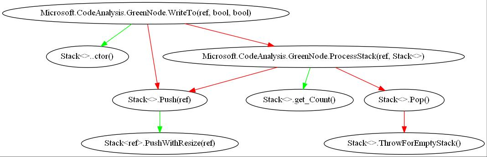

# Object Stack Allocation

This document describes work to enable object stack allocation in .NET Core.

## Motivation

In .NET instances of reference types are allocated on the garbage-collected heap.
Such allocations have performance overhead at garbage collection time. The allocator also has to ensure that the memory is fully zero-initialized.
If the lifetime of an object is bounded by the lifetime of the allocating method, the allocation
may be moved to the stack. The benefits of this optimization:

* The pressure on the garbage collector is reduced because the GC heap becomes smaller. The garbage collector doesn't have to be involved in allocating or deallocating these objects.
* Object field accesses may become cheaper if the compiler is able to do scalar replacement of the fields of the stack-allocated object
(i.e., if the fields can be promoted).
* Some field zero-initializations may be elided by the compiler.

Object stack allocation is implemented in
various Java runtimes.  This optimization is more important for Java since it doesn't have value types.

## GitHub issues

[roslyn #2104](https://github.com/dotnet/roslyn/issues/2104) Compiler should optimize "alloc temporary small object" to "alloc on stack"

[runtime #4584](https://github.com/dotnet/runtime/issues/4584) CLR/JIT should optimize "alloc temporary small object" to "alloc on stack" automatically

## Escape Analysis

An object is said to escape a method if it can be accessed after the method's execution has finished.
An object allocation can be moved to the stack safely only if the object doesn't escape the allocating method.

Several escape algorithms have been implemented in different Java implementations. Of the 3 algorithms listed in [references](#References),
[[1]](http://citeseerx.ist.psu.edu/viewdoc/download?doi=10.1.1.73.4799&rep=rep1&type=pdf)
is the most precise and most expensive (it is based on connection graphs) and was used in the context of a static Java compiler,
[[3]](https://pdfs.semanticscholar.org/1b33/dff471644f309392049c2791bca9a7f3b19c.pdf)
is the least precise and cheapest (it doesn't track references through assignments of fields) and was used in MSR's Marmot implementation.
[[2]](https://www.usenix.org/legacy/events/vee05/full_papers/p111-kotzmann.pdf)
is between
[[1]](http://citeseerx.ist.psu.edu/viewdoc/download?doi=10.1.1.73.4799&rep=rep1&type=pdf) and
[[3]](https://pdfs.semanticscholar.org/1b33/dff471644f309392049c2791bca9a7f3b19c.pdf)
both in analysis precision and cost. It was used in Java HotSpot.

Effectiveness of object stack allocation depends in large part on whether escape analysis is done inter-procedurally.
With intra-procedural analysis only, the compiler has to assume that arguments escape at all non-inlined call sites,
which blocks many stack allocations. In particular, assuming that 'this' argument always escapes hurts the optimization.
[[4]](http://www.ssw.uni-linz.ac.at/Research/Papers/Stadler14/Stadler2014-CGO-PEA.pdf) describes an approach that
handle objects that only escape on some paths by promoting them to the heap "just in time" as control reaches those paths.

There are several choices for where escape analysis can be performed:

### Analysis in the jit
**Pros:**
* The jit can analyze callee's code (subject to some restrictions, e.g., when running under profiler)
  since there are no versioning considerations at jit time.
* The optimization will apply to any msil code regardless of the language compiler or msil post-processing tools.
* The jit already has IR that's suitable for escape analysis.

**Cons:**
* The jit analyzes methods top-down, i.e., callers before callees (when inlining), which doesn't fit well with the stack allocation optimization.
* Full interprocedural analysis is expensive for the jit, even at high tiering levels. Background on-demand/full interprocedural analysis might be feasible
  if we have the ability to memoize method properties with (in)validation.

Possible approaches to interprocedural analysis in the jit:
* We can run escape analysis concurrently with inlining and analyze callee's parameters for escaping while inspecting
inline candidates. The results of such analysis can be cached.
* We can adjust inlining heuristics to give more weight to candidates whose parameters have references to potentially
stack-allocated objects. Inlining such methods may result in additional benefits if the jit can promote fields of the
stack-allocated objects.
* For higher-tier jit the order of method processing may be closer to bottom-up, i.e., callees before callers. That may
  help with running stack allocation optimization.

### Analysis in ngen/crossgen
**Pros:**
* ngen/crossgen can afford to spend more time for escape analysis.
* The jit already has IR that's suitable for escape analysis.

**Cons:**
* crossgen in Ready-To-Run mode is not running on generic methods that cross assembly boundaries.
* crossgen in Ready-To-Run mode is not allowed to analyze code of methods from other assemblies.
* newobj in Ready-To-Run mode is more abstract and introducing a hard dependence on ref class size and layout may interfere
with version reseliency.

### Analysis in ILLink
**Pros:**
* ILLInk can afford to spend more time for escape analysis.
* For self-contained apps, ILLink has access to all of application's code and can do full interprocedural analysis.
* ILLink is already a part of System.Private.CoreLib and CoreFX build toolchain so the assemblies built there can benefit
from this.

**Cons:**
* The implementation will only benefit customers that have ILLink in their toolchain
* ILLink operated on a view of metadata and raw msil instructions, it currently doesn't have a call graph or IR representation
suitable for escape analysis.

The results of escape analysis in the linker may be communicated to the jit by injecting an intrinsic call right before or after
newobj for the object that was determined to be non-escaping. Note that assemblies may lose verifiability with this approach.
An alternative is to annotate parameters with escape information so that the annotations can be verified by the jit with
local analysis.

If the methods whose info was used for interprocedural escape analysis are allowed to change after the analysis, the jit either needs
to inline those methods or there should be a mechanism to immediately revoke methods with stack allocated objects that relied on
that analysis.

## Other restrictions on stack allocations

* Objects with finalizers can't be stack-allocated since they always escape to the finalizer queue.
* Objects allocated in a loop can be stack allocated only if the allocation doesn't escape the iteration of the loop in which it is
allocated. Such analysis is complicated and is beyond the scope of at least the initial implementation.
* Conditional object allocations (i.e., allocations that don't dominate the exit) need to be restricted to avoid growing the stack
unnecessarily. A possible approach is turning such allocations to dynamic stack allocations.
* There should be a limit on the maximum size of stack allocated objects.
* There may be restrictions for objects with weak GC fields (this needs to be investigated).

## GC considerations

The jit is responsible for reporting references to heap-allocated objects to the GC. With stack-allocated objects present in a method
a reference at a particular GC-safe point may be in one of 3 states:
* The reference always points to a heap object: the reference should be reported as TYPE_GC_REF.
* The reference always points to a stack object: the reference should not be reported to the GC.
* The reference may point to a heap object or to a stack object depending on control flow: the reference should be reported as TYPE_GC_BYREF.

All GC fields of stack-allocated objects have to be reported to the GC, the same as for fields of stack-allocated value classes.

When a field of an object is modified the jit may need to issue a write barrier:
* The reference always points to a heap object: normal write barrier should be used
* The reference always points to a stack object: no write barrier is needed
* The reference may point to a heap object or to a stack object depending on control flow: checked write barrier should be used

## Existing Prototypes

@echesakovMSFT implemented a [prototype](https://github.com/echesakovMSFT/coreclr/tree/StackAllocation) in 2016.

The goal of the prototype was to have the optimization working end-to-end with a number of simplifications:
* A simple intra-procedural escape analysis based on
[[1]](http://citeseerx.ist.psu.edu/viewdoc/download?doi=10.1.1.73.4799&rep=rep1&type=pdf)
but without field edges in the connection graph.
* All call arguments are assumed to be escaping.
* Only simple objects are stack allocated, arrays of constant size are not analyzed.
* Only objects that are allocated unconditionally in the method are moved to the stack. An improvement here would
be allocating other objects dynamically on the stack.
* If at least one object in a method is stack allocated, all objects are conservatively reported as TYPE_GC_BYREF
and a checked write barrier is used in the method.
* All objects allocated on the stack also have a pre-header allocated. Pre-header is used for synchronization
and hashing so we could eliminate it if we proved the object wasn't used for synchronization and hashing.

We ran the prototype on System.Private.CoreLib via crossgen in 2016 and
objects at 21 allocation sites were moved to the stack.

We also ran an experiment where we changed the algorithm to optimistically assume that no arguments escape.
The goal was to get an upper bound on the number of potential stack allocations.

* 424 methods out of 6150 had allocations moved to the stack.
* 586 allocation sites out of 7977 were moved to the stack.
* One finding was that most sites were exception object allocations (5345), which almost never happen dynamically.
* Excluding exception allocations we had 586 allocation sites out of 2632 that could be moved to the stack.
So the upper bound from this experiment is 22.2%.

@AndyAyersMS recently resurrected @echesakovMSFT work and used it to [prototype stack allocation of a simple delegate that's
directly invoked](https://github.com/dotnet/coreclr/compare/master...AndyAyersMS:NonNullPlusStackAlloc). It exposed a number of things that need to be
done in the jit to generate better code for stack-allocated objects. The details are in comments of
[runtime #4584](https://github.com/dotnet/runtime/issues/4584).

We did some analysis of Roslyn csc self-build to see where this optimization may be beneficial. One hot place was found in [GreenNode.WriteTo](https://github.com/dotnet/roslyn/blob/fab7134296816fc80019c60b0f5bef7400cf23ea/src/Compilers/Core/Portable/Syntax/GreenNode.cs#L647).
This object allocation accounts for 8.17% of all object allocations in this scenario. The number is not as impressive as a percentage
of all allocated bytes: 0.67% (6.24 Mb out of 920.1 Mb) but it's just a single static allocation.
Below is the portion of the call graph the escape analysis will have to consider when proving this allocation is not escaping.
Green arrows correspond to the call sites that are inlined and red arrows correspond to the call sites that are not inlined.

## Roadmap

We will implement the optimization in the jit first and get as many cases as possible that don't require deep interprocedural analysis,
e.g., the delegate cases from the prototype mentioned above. We will also try to take advantage of the more suitable order of method
processing in higher-tier jit.

The jit work includes removing the restrictions in @echesakovMSFT prototype, making escape analysis more sophisticated, making
changes for producing better code for stack-allocated objects (some of which @AndyAyersMS discovered while working on his prototype),
and updating inlining heuristics to help with object stack allocation.

To get the maximum benefit from the optimization we will likely have to augment the jit analysis with more information. The information
may come from manual annotations or from a tool analysis. ILLink or the upcoming [CPAOT](https://github.com/dotnet/corert/tree/r2r)
may be appropriate places for ahead-of-time escape analysis. Self-contained applications will benefit the most from ILLink analysis
but framework assemblies can also be analyzed and annotated even though cross-assembly calls will have to be processed conservatively.

In this context an algorithm similar to [[1]](http://citeseerx.ist.psu.edu/viewdoc/download?doi=10.1.1.73.4799&rep=rep1&type=pdf) can be used
to get the most accurate escape results.

The cost of adding some infrastructure to ILLink (call graph, proper IR, etc.) will be amortized if we do other IL-to-IL optimizations in the future.
Also, we may be able to reuse the infrastructure from other projects, i.e., [ILSpy](https://github.com/icsharpcode/ILSpy/blob/da2f0d0b9143fb082a5529f78267fa36e8bf16f9/ICSharpCode.Decompiler/IL/ILReader.cs).

## References

[[1] Jong-Deok Choi at al. Stack Allocation and Synchronization Optimizations for Java Using Escape Analysis.](http://citeseerx.ist.psu.edu/viewdoc/download?doi=10.1.1.73.4799&rep=rep1&type=pdf)

[[2] Thomas Kotzmann and Hanspeter Moessenbroeck. Escape Analysis in the Context of Dynamic Compilation and Deoptimization](https://www.usenix.org/legacy/events/vee05/full_papers/p111-kotzmann.pdf)

[[3] David Gay and Bjarne Steensgaard. Fast Escape Analysis and Stack Allocation for Object-Based Programs](https://pdfs.semanticscholar.org/1b33/dff471644f309392049c2791bca9a7f3b19c.pdf)

[[4] Lukas Stadler at al. Partial Escape Analysis and Scalar Replacement for Java](http://www.ssw.uni-linz.ac.at/Research/Papers/Stadler14/Stadler2014-CGO-PEA.pdf)
