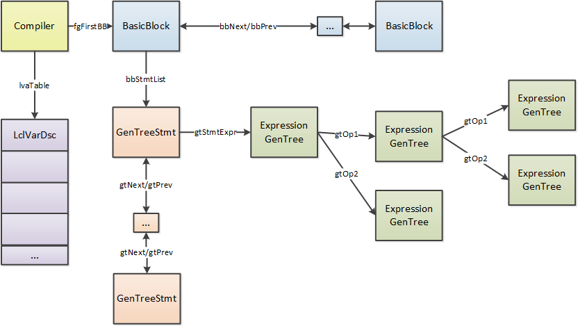

JIT Compiler Structure
===

# Introduction

RyuJIT is the code name for the Just-In-Time Compiler (aka "JIT") for the .NET runtime. It was
evolved from the JIT used for x86 (jit32) on .NET Framework, and ported to support all other architecture and
platform targets supported by .NET Core.

The primary design considerations for RyuJIT are to:

* Maintain a high compatibility bar with previous JITs, especially those for x86 (jit32) and x64 (jit64).
* Support and enable good runtime performance through code optimizations, register allocation, and code generation.
* Ensure good throughput via largely linear-order optimizations and transformations, along with limitations on tracked variables for analyses (such as dataflow) that are inherently super-linear.
* Ensure that the JIT architecture is designed to support a range of targets and scenarios.

The first objective was the primary motivation for evolving the existing code base, rather than starting from scratch
or departing more drastically from the existing IR and architecture.

# Execution Environment and External Interface

RyuJIT provides both just-in-time and ahead-of-time compilation service for the .NET runtime. The runtime itself is
variously called the EE (execution engine), the VM (virtual machine), or simply the CLR (common language runtime).
Depending upon the configuration, the EE and JIT may reside in the same or different executable files. RyuJIT
implements the JIT side of the JIT/EE interfaces:

* `ICorJitCompiler` – this is the interface that the JIT compiler implements. This interface is defined in
[src/inc/corjit.h](https://github.com/dotnet/runtime/blob/main/src/coreclr/inc/corjit.h)
and its implementation is in
[src/jit/ee_il_dll.cpp](https://github.com/dotnet/runtime/blob/main/src/coreclr/jit/ee_il_dll.cpp).
The following are the key methods on this interface:
  * `compileMethod` is the main entry point for the JIT. The EE passes it a `ICorJitInfo` object,
  and the "info" containing the IL, the method header, and various other useful tidbits.
  It returns a pointer to the code, its size, and additional GC, EH and (optionally) debug info.
  * `getVersionIdentifier` is the mechanism by which the JIT/EE interface is versioned.
  There is a single GUID (manually generated) which the JIT and EE must agree on.
  * `getMaxIntrinsicSIMDVectorLength` communicates to the EE the largest SIMD vector length that the JIT can support.
* `ICorJitInfo` – this is the interface that the EE implements. It has many methods defined on it that allow the JIT to
look up metadata tokens, traverse type signatures, compute field and vtable offsets, find method entry points,
construct string literals, etc. This bulk of this interface is inherited from `ICorDynamicInfo` which is defined in
[src/inc/corinfo.h](https://github.com/dotnet/runtime/blob/main/src/coreclr/inc/corinfo.h). The implementation
is defined in
[src/vm/jitinterface.cpp](https://github.com/dotnet/runtime/blob/main/src/coreclr/vm/jitinterface.cpp).

# Internal Representation (IR)

## `Compiler` object

The `Compiler` object is the primary data structure of the JIT. While it is not part of the JIT's IR per se, it
serves as the root from which the data structures that implement the IR are accessible. For example, the `Compiler`
object points to the head of the function's `BasicBlock` list with the `fgFirstBB` field, as well as having
additional pointers to the end of the list, and other distinguished locations. `ICorJitCompiler::compileMethod()` is
invoked for each method, and creates a new `Compiler` object. Thus, the JIT need not worry about thread
synchronization while accessing `Compiler` state. The EE has the necessary synchronization to ensure there is a
single JIT compiled copy of a method when two or more threads try to trigger JIT compilation of the same method.

## Overview of the IR

RyuJIT represents a function as a doubly-linked list of `BasicBlock` values. Each `BasicBlock` has explicit edges to
its successors that define the function's non-exceptional control flow. Exceptional control flow is implicit, with
protected regions and handlers described in a table of `EHblkDsc` values. At the beginning of a compilation, each
`BasicBlock` contains nodes in a high-level, statement- and tree-oriented form (HIR: "high-level intermediate
representation"); this form persists throughout the JIT's front end. During the first phase of the back end--the
rationalization phase--the HIR for each block is lowered to a linearly-ordered, node-oriented form (LIR: "low-level
intermediate representation"). The fundamental distinction between HIR and LIR is in ordering semantics, though there
are also some restrictions on the types of nodes that may appear in an HIR or LIR block.

Both HIR and LIR blocks are composed of `GenTree` nodes that define the operations performed by the block. A
`GenTree` node may consume some number of operands and may produce a singly-defined, at-most-singly-used value as a
result. These values are referred to interchangably as *SDSU* (single def, single use) temps or *tree* temps.
Definitions (aka, defs) of SDSU temps are represented by `GenTree` nodes themselves, and uses are represented by
edges from the using node to the defining node. Furthermore, SDSU temps defined in one block may not be used in a
different block. In cases where a value must be multiply-defined, multiply-used, or defined in one block and used in
another, the IR provides another class of temporary: the local var (aka, local variable). Local vars are defined by
assignment nodes in HIR or store nodes in LIR, and are used by local var nodes in both forms.

An HIR block is composed of a doubly-linked list of statement nodes (`Statement`), each of which references a single
expression tree (`m_rootNode`). The `GenTree` nodes in this tree execute in "tree order", which is defined as the
order produced by a depth-first, left-to-right traversal of the tree, with two notable exceptions:
* Binary nodes marked with the `GTF_REVERSE_OPS` flag execute their right operand tree (`gtOp2`) before their left
operand tree (`gtOp1`)
* Dynamically-sized block copy nodes where `gtEvalSizeFirst` is `true` execute the `gtDynamicSize` tree
before executing their other operand trees.

In addition to tree order, HIR also requires that no SDSU temp is defined in one statement and used in another. In
situations where the requirements of tree and statement order prove onerous (e.g. when code must execute at a
particular point in a function), HIR provides `GT_COMMA` nodes as an escape valve: these nodes consume and discard
the results of their left-hand side while producing a copy of the value produced by their right-hand side. This
allows the compiler to insert code in the middle of a statement without requiring that the statement be split apart.

An LIR block is composed of a doubly-linked list of `GenTree` nodes, each of which describes a single operation in
the method. These nodes execute in the order given by the list; there is no relationship between the order in which a
node's operands appear and the order in which the operators that produced those operands execute. The only exception
to this rule occurs after the register allocator, which may introduce `GT_COPY` and `GT_RELOAD` nodes that execute in
"spill order". Spill order is defined as the order in which the register allocator visits a node's operands. For
correctness, the code generator must generate code for spills, reloads, and `GT_COPY`/`GT_RELOAD` nodes in this
order.

In addition to HIR and LIR `BasicBlock`s, a separate representation--`insGroup` and `instrDesc`--is used during the
actual instruction encoding.

(Note that this diagram is slightly out-of-date: GenTreeStmt no longer exists, and is replaced by `Statement`
nodes in the IR.)



## GenTree Nodes

Each operation is represented as a GenTree node, with an opcode (`GT_xxx`), zero or more child/operand `GenTree`
nodes, and additional fields as needed to represent the semantics of that node. Every node includes its type, value
number, assertions, register assignments, etc. when available.

`GenTree` nodes are doubly-linked in execution order, but the links are not necessarily valid during all phases of
the JIT. In HIR these links are primarily a convenience, as the order produced by a traversal of the links must match
the order produced by a "tree order" traversal (see above for details). In LIR these links define the execution order
of the nodes.

HIR statement nodes utilize the same `GenTree` base type as the operation nodes, though they are not truly related.
* The statement nodes are doubly-linked. The first statement node in a block points to the last node in the block via its `m_prev` link. Note that the last statement node does *not* point to the first; that is, the list is not fully circular.
* Each statement node contains two `GenTree` links – `m_rootNode` points to the top-level node in the statement (i.e. the root of the tree that represents the statement), while `m_treeList` points to the first node in execution order (again, this link is not always valid).

## Local var descriptors

A `LclVarDsc` represents a possibly-multiply-defined, possibly-multiply-used temporary. These temporaries may be used
to represent user local variables, arguments or JIT-created temps. Each lclVar has a `gtLclNum` which is the
identifier usually associated with the variable in the JIT and its dumps. The `LclVarDsc` contains the type, use
count, weighted use count, frame or register assignment, etc. A local var may be "tracked" (`lvTracked`), in which
case it participates in dataflow analysis, and has a secondary name (`lvVarIndex`) that allows for the use of dense
bit vectors.

### Example of Post-Import IR

For this snippet of code (extracted from
[src/tests/JIT/CodeGenBringUpTests/DblRoots.cs](https://github.com/dotnet/runtime/blob/main/src/tests/JIT/CodeGenBringUpTests/DblRoots.cs)), with `COMPlus_TieredCompilation=0` and using the DblRoots_ro.csproj project to compile it:

       r1 = (-b + Math.Sqrt(b*b - 4*a*c))/(2*a);

A stripped-down dump of the `GenTree` nodes just after they are imported looks like this:

```
STMT00000 (IL 0x000...0x026)
▌  ASG       double
├──▌  IND       double
│  └──▌  LCL_VAR   byref  V03 arg3
└──▌  DIV       double
   ├──▌  ADD       double
   │  ├──▌  NEG       double
   │  │  └──▌  LCL_VAR   double V01 arg1
   │  └──▌  INTRINSIC double sqrt
   │     └──▌  SUB       double
   │        ├──▌  MUL       double
   │        │  ├──▌  LCL_VAR   double V01 arg1
   │        │  └──▌  LCL_VAR   double V01 arg1
   │        └──▌  MUL       double
   │           ├──▌  MUL       double
   │           │  ├──▌  CNS_DBL   double 4.0000000000000000
   │           │  └──▌  LCL_VAR   double V00 arg0
   │           └──▌  LCL_VAR   double V02 arg2
   └──▌  MUL       double
      ├──▌  CNS_DBL   double 2.0000000000000000
      └──▌  LCL_VAR   double V00 arg0
```

## Types

The JIT is primarily concerned with "primitive" types, i.e. integers, reference types, pointers, and floating point
types. It must also be concerned with the format of user-defined value types (i.e. struct types derived from
`System.ValueType`) – specifically, their size and the offset of any GC references they contain, so that they can be
correctly initialized and copied. The primitive types are represented in the JIT by the `var_types` enum, and any
additional information required for struct types is obtained from the JIT/EE interface by the use of an opaque
`CORINFO_CLASS_HANDLE`.

## Dataflow Information

In order to limit throughput impact, the JIT limits the number of lclVars for which liveness information is computed.
These are the tracked lclVars (`lvTracked` is true), and they are the only candidates for register allocation (i.e.
only these lclVars may be assigned registers over their entire lifetime). Defs and uses of untracked lclVars are
treated as stores and loads to/from the appropriate stack location, and the corresponding nodes act as normal
operators during register allocation.

The liveness analysis determines the set of defs, as well as the uses that are upward exposed, for each block. It
then propagates the liveness information. The result of the analysis is captured in the following:

* The live-in and live-out sets are captured in the `bbLiveIn` and `bbLiveOut` fields of the `BasicBlock`.
* The `GTF_VAR_DEF` flag is set on a lclVar node (all of which are of type `GenTreeLclVarCommon`) that is a definition.
* The `GTF_VAR_USEASG` flag is set (in addition to the `GTF_VAR_DEF` flag) on partial definitions of a local variable (i.e. `GT_LCL_FLD` nodes that do not define the entire variable).

## SSA

Static single assignment (SSA) form is constructed in a traditional manner [[1]](#[1]). The SSA names are recorded on
the lclVar references. While SSA form usually retains a pointer or link to the defining reference, RyuJIT currently
retains only the `BasicBlock` in which the definition of each SSA name resides.

## Value Numbering

Value numbering utilizes SSA for lclVar values, but also performs value numbering of expression trees. It takes
advantage of type safety by not invalidating the value number for field references with a heap write, unless the
write is to the same field. The IR nodes are annotated with the value numbers, which are indexes into a type-specific
value number store. Value numbering traverses the trees, performing symbolic evaluation of many operations.

# Phases of RyuJIT

The top-level function of interest is `Compiler::compCompile`. It invokes the following phases in order.

| **Phase** | **IR Transformations** |
| --- | --- |
| [Pre-import](#pre-import) | `Compiler->lvaTable` created and filled in for each user argument and variable. `BasicBlock` list initialized. |
| [Importation](#importation) | `GenTree` nodes created and linked in to `Statement` nodes, and Statements into BasicBlocks. Inlining candidates identified. |
| [Inlining](#inlining) | The IR for inlined methods is incorporated into the flowgraph. |
| [Struct Promotion](#struct-promotion) | New lclVars are created for each field of a promoted struct. |
| [Mark Address-Exposed Locals](#mark-addr-exposed) | lclVars with references occurring in an address-taken context are marked.  This must be kept up-to-date. |
| [Morph Blocks](#morph-blocks) | Performs localized transformations, including mandatory normalization as well as simple optimizations. |
| [Eliminate Qmarks](#eliminate-qmarks) | All `GT_QMARK` nodes are eliminated, other than simple ones that do not require control flow. |
| [Flowgraph Analysis](#flowgraph-analysis) | `BasicBlock` predecessors are computed, and must be kept valid. Loops are identified, and normalized, cloned and/or unrolled. |
| [Normalize IR for Optimization](#normalize-ir) | lclVar references counts are set, and must be kept valid. Evaluation order of `GenTree` nodes (`gtNext`/`gtPrev`) is determined, and must be kept valid. |
| [SSA and Value Numbering Optimizations](#ssa-vn) | Computes liveness (`bbLiveIn` and `bbLiveOut` on `BasicBlock`s), and dominators. Builds SSA for tracked lclVars. Computes value numbers. |
| [Loop Invariant Code Hoisting](#licm) | Hoists expressions out of loops. |
| [Copy Propagation](#copy-propagation) | Copy propagation based on value numbers. |
| [Common Subexpression Elimination (CSE)](#cse) | Elimination of redundant subexressions based on value numbers. |
| [Assertion Propagation](#assertion-propagation) | Utilizes value numbers to propagate and transform based on properties such as non-nullness. |
| [Range analysis](#range-analysis) | Eliminate array index range checks based on value numbers and assertions |
| [Rationalization](#rationalization) | Flowgraph order changes from `FGOrderTree` to `FGOrderLinear`. All `GT_COMMA`, `GT_ASG` and `GT_ADDR` nodes are transformed. |
| [Lowering](#lowering) | Register requirements are fully specified (`gtLsraInfo`). All control flow is explicit. |
| [Register allocation](#reg-alloc) | Registers are assigned (`gtRegNum` and/or `gtRsvdRegs`), and the number of spill temps calculated. |
| [Code Generation](#code-generation) | Determines frame layout. Generates code for each `BasicBlock`. Generates prolog & epilog code for the method. Emit EH, GC and Debug info. |

## <a name="pre-import"></a>Pre-import

Prior to reading in the IL for the method, the JIT initializes the local variable table, and scans the IL to find
branch targets and form BasicBlocks.

## <a name="importation"></a>Importation

Importation is the phase that creates the IR for the method, reading in one IL instruction at a time, and building up
the statements. During this process, it may need to generate IR with multiple, nested expressions. This is the
purpose of the non-expression-like IR nodes:

* It may need to evaluate part of the expression into a temp, in which case it will use a comma (`GT_COMMA`) node to ensure that the temp is evaluated in the proper execution order – i.e. `GT_COMMA(GT_ASG(temp, exp), temp)` is inserted into the tree where "exp" would go.
* It may need to create conditional expressions, but adding control flow at this point would be quite messy. In this case it generates question mark/colon (?: or `GT_QMARK`/`GT_COLON`) trees that may be nested within an expression.

During importation, tail call candidates (either explicitly marked or opportunistically identified) are identified
and flagged. They are further validated, and possibly unmarked, during morphing.

## Morphing

The `fgMorph` phase includes a number of transformations:

### <a name="inlining"></a>Inlining

The `fgInline` phase determines whether each call site is a candidate for inlining. The initial determination is made
via a state machine that runs over the candidate method's IL. It estimates the native code size corresponding to the
inline method, and uses a set of heuristics, including the estimated size of the current method, to determine if
inlining would be profitable. If so, a separate `Compiler` object is created, and the importation phase is called to
create the tree for the candidate inline method. Inlining may be aborted prior to completion, if any conditions are
encountered that indicate that it may be unprofitable (or otherwise incorrect). If inlining is successful, the
inlinee compiler's trees are incorporated into the inliner compiler (the "parent"), with arguments and return values
appropriately transformed.

### <a name="struct-promotion"></a>Struct Promotion

Struct promotion (`fgPromoteStructs()`) analyzes the local variables and temps, and determines if their fields are
candidates for tracking (and possibly enregistering) separately. It first determines whether it is possible to
promote, which takes into account whether the layout may have holes or overlapping fields, whether its fields
(flattening any contained structs) will fit in registers, etc.

Next, it determines whether it is likely to be profitable, based on the number of fields, and whether the fields are
individually referenced.

When a lclVar is promoted, there are now N+1 lclVars for the struct, where N is the number of fields. The original
struct lclVar is not considered to be tracked, but its fields may be.

### <a name="mark-addr-exposed"></a>Mark Address-Exposed Locals

This phase traverses the expression trees, propagating the context (e.g. taking the address, indirecting) to
determine which lclVars have their address taken, and which therefore will not be register candidates. If a struct
lclVar has been promoted, and is then found to be address-taken, it will be considered "dependently promoted", which
is an odd way of saying that the fields will still be separately tracked, but they will not be register candidates.

### <a name="morph-blocks"></a>Morph Blocks

What is often thought of as "morph" involves localized transformations to the trees. In addition to performing simple
optimizing transformations, it performs some normalization that is required, such as converting field and array
accesses into pointer arithmetic. It can (and must) be called by subsequent phases on newly added or modified trees.
During the main Morph phase, the boolean `fgGlobalMorph` is set on the `Compiler` argument, which governs which
transformations are permissible.

### <a name="eliminate-qmarks"></a>Eliminate Qmarks

This expands most `GT_QMARK`/`GT_COLON` trees into blocks, except for the case that is instantiating a condition.

## <a name="flowgraph-analysis"></a>Flowgraph Analysis

At this point, a number of analyses and transformations are done on the flowgraph:

* Computing the predecessors of each block
* Computing edge weights, if profile information is available
* Computing reachability and dominators
* Identifying and normalizing loops (transforming while loops to "do while")
* Cloning and unrolling of loops

## <a name="normalize-ir"></a>Normalize IR for Optimization

At this point, a number of properties are computed on the IR, and must remain valid for the remaining phases. We will
call this "normalization"

* `lvaMarkLocalVars` – if this jit is optimizing, set the reference counts (raw and weighted) for lclVars, sort them,
and determine which will be tracked (currently up to 512). If not optimizing, all locals are given an implicit
reference count of one. Reference counts are not incrementally maintained. They can be recomputed if accurate
counts are needed.
* `optOptimizeBools` – this optimizes Boolean expressions, and may change the flowgraph (why is it not done prior to reachability and dominators?)
* Link the trees in evaluation order (setting `gtNext` and `gtPrev` fields): and `fgFindOperOrder()` and `fgSetBlockOrder()`.

## <a name="ssa-vn"></a>SSA and Value Numbering Optimizations

The next set of optimizations are built on top of SSA and value numbering. First, the SSA representation is built
(during which dataflow analysis, aka liveness, is computed on the lclVars), then value numbering is done using SSA.

### <a name="licm"></a>Loop Invariant Code Hoisting

This phase traverses all the loop nests, in outer-to-inner order (thus hoisting expressions outside the largest loop
in which they are invariant). It traverses all of the statements in the blocks in the loop that are always executed.
If the statement is:

* A valid CSE candidate
* Has no side-effects
* Does not raise an exception OR occurs in the loop prior to any side-effects
* Has a valid value number, and it is a lclVar defined outside the loop, or its children (the value numbers from which it was computed) are invariant.

### <a name="copy-propagation"></a>Copy Propagation

This phase walks each block in the graph (in dominator-first order, maintaining context between dominator and child)
keeping track of every live definition. When it encounters a variable that shares the VN with a live definition, it
is replaced with the variable in the live definition.

The JIT currently requires that the IR be maintained in conventional SSA form, as there is no "out of SSA"
translation (see the comments on `optVnCopyProp()` for more information).

### <a name="cse"></a>Common Subexpression Elimination (CSE)

Utilizes value numbers to identify redundant computations, which are then evaluated to a new temp lclVar, and then
reused.

### <a name="assertion-propagation"></a>Assertion Propagation

Utilizes value numbers to propagate and transform based on properties such as non-nullness.

### <a name="range-analysis"></a>Range analysis

Optimize array index range checks based on value numbers and assertions.

## <a name="rationalization"></a>Rationalization

As the JIT has evolved, changes have been made to improve the ability to reason over the tree in both "tree order"
and "linear order". These changes have been termed the "rationalization" of the IR. In the spirit of reuse and
evolution, some of the changes have been made only in the later ("backend") components of the JIT. The corresponding
transformations are made to the IR by a "Rationalizer" component. It is expected that over time some of these changes
will migrate to an earlier place in the JIT phase order:

* Elimination of assignment nodes (`GT_ASG`). The assignment node was problematic because the semantics of its destination (left hand side of the assignment) could not be determined without context. For example, a `GT_LCL_VAR` on the left-hand side of an assignment is a definition of the local variable, but on the right-hand side it is a use. Furthermore, since the execution order requires that the children be executed before the parent, it is unnatural that the left-hand side of the assignment appears in execution order before the assignment operator.
  * During rationalization, all assignments are replaced by stores, which either represent their destination on the store node itself (e.g. `GT_LCL_VAR`), or by the use of a child address node (e.g. `GT_STORE_IND`).
* Elimination of address nodes (`GT_ADDR`). These are problematic because of the need for parent context to analyze the child.
* Elimination of "comma" nodes (`GT_COMMA`). These nodes are introduced for convenience during importation, during which a single tree is constructed at a time, and not incorporated into the statement list until it is completed. When it is necessary, for example, to store a partially-constructed tree into a temporary variable, a `GT_COMMA` node is used to link it into the tree. However, in later phases, these comma nodes are an impediment to analysis, and thus are eliminated.
  * In some cases, it is not possible to fully extract the tree into a separate statement, due to execution order dependencies. In these cases, an "embedded" statement is created. While these are conceptually very similar to the `GT_COMMA` nodes, they do not masquerade as expressions.
* Elimination of "QMark" (`GT_QMARK`/`GT_COLON`) nodes is actually done at the end of morphing, long before the current rationalization phase. The presence of these nodes made analyses (especially dataflow) overly complex.
* Elimination of statements. Without statements, the execution order of a basic block's contents is fully defined by the `gtNext`/`gtPrev` links between `GenTree` nodes.

For our earlier example (Example of Post-Import IR), here is what the simplified dump looks like just prior to
Rationalization (the $ annotations are value numbers). Note that some common subexpressions have been computed into
new temporary lclVars, and that computation has been inserted as a `GT_COMMA` (comma) node in the IR:

```
STMT  (IL 0x000...0x026)
▌  ASG       double $VN.Void
├──▌  IND       double $146
│  └──▌  LCL_VAR   byref  V03 arg3         u:1 (last use) $c0
└──▌  DIV       double $146
   ├──▌  ADD       double $144
   │  ├──▌  COMMA     double $83
   │  │  ├──▌  ASG       double $VN.Void
   │  │  │  ├──▌  LCL_VAR   double V06 cse0         d:1 $83
   │  │  │  └──▌  INTRINSIC double sqrt $83
   │  │  │     └──▌  SUB       double $143
   │  │  │        ├──▌  MUL       double $140
   │  │  │        │  ├──▌  LCL_VAR   double V01 arg1         u:1 $81
   │  │  │        │  └──▌  LCL_VAR   double V01 arg1         u:1 $81
   │  │  │        └──▌  MUL       double $142
   │  │  │           ├──▌  MUL       double $141
   │  │  │           │  ├──▌  LCL_VAR   double V00 arg0         u:1 $80
   │  │  │           │  └──▌  CNS_DBL   double 4.0000000000000000 $180
   │  │  │           └──▌  LCL_VAR   double V02 arg2         u:1 $82
   │  │  └──▌  LCL_VAR   double V06 cse0         u:1 $83
   │  └──▌  COMMA     double $84
   │     ├──▌  ASG       double $VN.Void
   │     │  ├──▌  LCL_VAR   double V08 cse2         d:1 $84
   │     │  └──▌  NEG       double $84
   │     │     └──▌  LCL_VAR   double V01 arg1         u:1 $81
   │     └──▌  LCL_VAR   double V08 cse2         u:1 $84
   └──▌  COMMA     double $145
      ├──▌  ASG       double $VN.Void
      │  ├──▌  LCL_VAR   double V07 cse1         d:1 $145
      │  └──▌  MUL       double $145
      │     ├──▌  LCL_VAR   double V00 arg0         u:1 $80
      │     └──▌  CNS_DBL   double 2.0000000000000000 $181
      └──▌  LCL_VAR   double V07 cse1         u:1 $145
```

After Rationalize, the nodes are presented in execution order, and the `GT_COMMA` (comma), `GT_ASG` (=), and
`Statement` nodes have been eliminated:

```
        IL_OFFSET void   IL offset: 0x0
t3 =    LCL_VAR   double V01 arg1         u:1 $81
t4 =    LCL_VAR   double V01 arg1         u:1 $81
     ┌──▌  t3     double
     ├──▌  t4     double
t5 = ▌  MUL       double $140
t7 =    LCL_VAR   double V00 arg0         u:1 $80
t6 =    CNS_DBL   double 4.0000000000000000 $180
     ┌──▌  t7     double
     ├──▌  t6     double
t8 = ▌  MUL       double $141
t9 =    LCL_VAR   double V02 arg2         u:1 $82
     ┌──▌  t8     double
     ├──▌  t9     double
10 = ▌  MUL       double $142
     ┌──▌  t5     double
     ├──▌  t10    double
11 = ▌  SUB       double $143
     ┌──▌  t11    double
12 = ▌  INTRINSIC double sqrt $83
     ┌──▌  t12    double
     ▌  STORE_LCL_VAR double V06 cse0         d:1
43 =    LCL_VAR   double V06 cse0         u:1 $83
t1 =    LCL_VAR   double V01 arg1         u:1 $81
     ┌──▌  t1     double
t2 = ▌  NEG       double $84
     ┌──▌  t2     double
     ▌  STORE_LCL_VAR double V08 cse2         d:1
53 =    LCL_VAR   double V08 cse2         u:1 $84
     ┌──▌  t43    double
     ├──▌  t53    double
13 = ▌  ADD       double $144
15 =    LCL_VAR   double V00 arg0         u:1 $80
14 =    CNS_DBL   double 2.0000000000000000 $181
     ┌──▌  t15    double
     ├──▌  t14    double
16 = ▌  MUL       double $145
     ┌──▌  t16    double
     ▌  STORE_LCL_VAR double V07 cse1         d:1
48 =    LCL_VAR   double V07 cse1         u:1 $145
     ┌──▌  t13    double
     ├──▌  t48    double
17 = ▌  DIV       double $146
t0 =    LCL_VAR   byref  V03 arg3         u:1 (last use) $c0
     ┌──▌  t0     byref
     ├──▌  t17    double
     ▌  STOREIND  double
        IL_OFFSET void   IL offset: 0x27
55 =    LCL_VAR   double V08 cse2         u:1 $84
45 =    LCL_VAR   double V06 cse0         u:1 $83
     ┌──▌  t55    double
     ├──▌  t45    double
33 = ▌  SUB       double $147
50 =    LCL_VAR   double V07 cse1         u:1 $145
     ┌──▌  t33    double
     ├──▌  t50    double
37 = ▌  DIV       double $148
20 =    LCL_VAR   byref  V04 arg4         u:1 (last use) $c1
     ┌──▌  t20    byref
     ├──▌  t37    double
     ▌  STOREIND  double
        IL_OFFSET void   IL offset: 0x4f
        RETURN    void   $200
```

## <a name="lowering"></a>Lowering

Lowering is responsible for transforming the IR in such a way that the control flow, and any register requirements,
are fully exposed.

It does an execution-order traversal that performs context-dependent transformations such as
* expanding switch statements (using a switch table or a series of conditional branches)
* constructing addressing modes (`GT_LEA` nodes)
* determining the code generation strategy for block assignments (e.g. `GT_STORE_BLK`) which may become helper calls, unrolled loops, or an instruction like `rep stos`
* generating machine specific instructions (e.g. generating the `BT` x86/64 instruction)
* mark "contained" nodes - such a node does not generate any code and relies on its user to include the node's operation in its own codegen (e.g. memory operands, immediate operands)
* mark "reg optional" nodes - despite the name, such a node may produce a value in a register but its user does not require a register and can consume the value directly from a memory location

For example, this:

```
t47 =    LCL_VAR   ref    V00 arg0
t48 =    LCL_VAR   int    V01 arg1
      ┌──▌  t48    int
t51 = ▌  CAST      long <- int
t52 =    CNS_INT   long   2
      ┌──▌  t51    long
      ├──▌  t52    long
t53 = ▌  LSH       long
t54 =    CNS_INT   long   16 Fseq[#FirstElem]
      ┌──▌  t53    long
      ├──▌  t54    long
t55 = ▌  ADD       long
      ┌──▌  t47    ref
      ├──▌  t55    long
t56 = ▌  ADD       byref
      ┌──▌  t56    byref
t44 = ▌  IND       int
```

Is transformed into this, in which the addressing mode is explicit:

```
t47 =    LCL_VAR   ref    V00 arg0
t48 =    LCL_VAR   int    V01 arg1
      ┌──▌  t48    int
t51 = ▌  CAST      long <- int
      ┌──▌  t47    ref
      ├──▌  t51    long
t79 = ▌  LEA(b+(i*4)+16) byref
      ┌──▌  t79    byref
t44 = ▌  IND       int
```
Sometimes `Lowering` will insert nodes into the execution order before the node that it is currently handling.
In such cases, it must ensure that they themselves are properly lowered. This includes:

* Generating only legal `LIR` nodes that do not themselves require lowering.
* Performing any needed containment analysis (e.g. `ContainCheckRange()`) on the newly added node(s).

After all nodes are lowered, liveness is run in preparation for register allocation.

## <a name="reg-alloc"></a>Register allocation

The RyuJIT register allocator uses a Linear Scan algorithm, with an approach similar to [[2]](#[2]). In discussion it
is referred to as either `LinearScan` (the name of the implementing class), or LSRA (Linear Scan Register
Allocation). In brief, it operates on two main data structures:

* `Intervals` (representing live ranges of variables or tree expressions) and `RegRecords` (representing physical registers), both of which derive from `Referenceable`.
* `RefPositions`, which represent uses or defs (or variants thereof, such as ExposedUses) of either `Intervals` or physical registers.

`LinearScan::buildIntervals()` traverses the entire method building RefPositions and Intervals as required. For example, for the `STORE_BLK` node in this snippet:

```
t67 =    CNS_INT(h) long   0x2b5acef2c50 static Fseq[s1]
     ┌──▌  t67    long
 t0 = ▌  IND       ref
 t1 =    CNS_INT   long   8 Fseq[#FirstElem]
     ┌──▌  t0     ref
     ├──▌  t1     long
 t2 = ▌  ADD       byref
     ┌──▌  t2     byref
 t3 = ▌  IND       struct
t31 =    LCL_VAR_ADDR byref  V08 tmp1
     ┌──▌  t31    byref
     ├──▌  t3     struct
      ▌  STORE_BLK(40) struct (copy) (Unroll)
```

the following RefPositions are generated:

```
N027 (???,???) [000085] -A-XG-------              ▌  STORE_BLK(40) struct (copy) (Unroll) REG NA
Interval 16: int RefPositions {} physReg:NA Preferences=[allInt]
<RefPosition #40  @27  RefTypeDef <Ivl:16 internal> STORE_BLK BB01 regmask=[allInt] minReg=1>
Interval 17: float RefPositions {} physReg:NA Preferences=[allFloat]
<RefPosition #41  @27  RefTypeDef <Ivl:17 internal> STORE_BLK BB01 regmask=[allFloat] minReg=1>
<RefPosition #42  @27  RefTypeUse <Ivl:15> BB01 regmask=[allInt] minReg=1 last>
<RefPosition #43  @27  RefTypeUse <Ivl:16 internal> STORE_BLK BB01 regmask=[allInt] minReg=1 last>
<RefPosition #44  @27  RefTypeUse <Ivl:17 internal> STORE_BLK BB01 regmask=[allFloat] minReg=1 last>
```

The "@ 27" is the location number of the node. "internal" indicates a register that is internal to the node (in this case 2 internal registers are needed, one float (XMM on XARCH) and one int, as temporaries for copying). "regmask" indicates the register constraints for the `RefPosition`.

### Notable features of RyuJIT LinearScan

Unlike most register allocators, LSRA performs register allocation on an IR (Intermediate Representation) that is not
a direct representation of the target instructions. A given IR node may map to 0, 1 or multiple target instructions.
Nodes that are "contained" are handled by code generation as part of their parent node and thus may map to 0
instructions. A simple node will have a 1-to-1 mapping to a target instruction, and a more complex node (e.g.
`GT_STORE_BLK`) may map to multiple instructions.

### Pre-conditions:

It is the job of the `Lowering` phase to transform the IR such that:
* The nodes are in `LIR` form (i.e. all expression trees have been linearized, and the execution order of the nodes within a BasicBlock is specified by the `gtNext` and `gtPrev` links)
* All contained nodes are identified (`gtFlags` has the `GTF_CONTAINED` bit set)
* All nodes for which a register is optional are identified (`RefPosition::regOptional` is `true`)
  * This is used for x86 and x64 on operands that can be directly consumed from memory if no register is allocated.
* All unused values (nodes that produce a result that is not consumed) are identified (`gtLIRFlags` has the `LIR::Flags::UnusedValue` bit set)
  * Since tree temps (the values produced by nodes and consumed by their parent) are expected to be single-def, single-use (SDSU), normally the live range can be determined to end at the use. If there is no use, the register allocator doesn't know where the live range ends.
* Code can be generated without any context from the parent (consumer) of each node.

After `Lowering` has completed, liveness analysis is performed:
* It identifies which `lclVar`s should have their liveness computed.
  * The reason this is done after `Lowering` is that it can introduce new `lclVar`s.
* It then does liveness analysis on those `lclVar`s, updating the `bbLiveIn` and `bbLiveOut` sets for each `BasicBlock`.
  * This tells the register allocator which `lclVars` are live at block boundaries.
  * Note that "tree temps" cannot be live at block boundaries.

### Allocation Overview

Allocation proceeds in 4 phases:

* Prepration:
  * Determine the order in which the `BasicBlocks` will be allocated, and which predecessor of each block will be used to determine the starting location for variables live-in to the `BasicBlock`.
  * Construct an `Interval` for each `lclVar` that may be enregistered.
  * Construct a `RegRecord` for each physical register.
* Walk the `BasicBlocks` in the determined order building `RefPositions` for each register use, def, or kill.
  * Just prior to building `RefPosition`s for the node, the `TreeNodeInfoInit()` method is called to determine its register requirements.
* Allocate the registers by traversing the `RefPositions`.
* Write back the register assignments, and perform any necessary moves at block boundaries where the allocations don't match.

Post-conditions:

* The `gtRegNum` property of all `GenTree` nodes that require a register has been set to a valid register number.
  * For reg-optional nodes, the `GTF_NOREG_AT_USE` bit is set in `gtFlags` if a register was not allocated.
* The `gtRsvdRegs` field (a set/mask of registers) has the requested number of registers specified for internal use.
* All spilled values (lclVar or expression) are marked with `GTF_SPILL` at their definition. For lclVars, they are also marked with `GTF_SPILLED` at any use at which the value must be reloaded.
* For all lclVars that are register candidates:
  * `lvRegNum` = initial register location (or `REG_STK`)
  * `lvRegister` flag set if it always lives in the same register
  * `lvSpilled` flag is set if it is ever spilled
* The maximum number of simultaneously-live spill locations of each type (used for spilling expression trees) has been communicated via calls to `compiler->tmpPreAllocateTemps(type)`.

## <a name="code-generation"></a>Code Generation

The process of code generation is relatively straightforward, as Lowering has done some of the work already. Code
generation proceeds roughly as follows:

* Determine the frame layout – allocating space on the frame for any lclVars that are not fully enregistered, as well as any spill temps required for spilling non-lclVar expressions.
* For each `BasicBlock`, in layout order, and each `GenTree` node in the block, in execution order:
  * If the node is "contained" (i.e. its operation is subsumed by a parent node), do nothing.
  * Otherwise, "consume" all the register operands of the node.
    * This updates the liveness information (i.e. marking a lclVar as dead if this is the last use), and performs any needed copies.
    * This must be done in "spill order" so that any spill/restore code inserted by the register allocator to resolve register conflicts is generated in the correct order. "
  * Track the live variables in registers, as well as the live stack variables that contain GC refs.
  * Produce the `instrDesc(s)` for the operation, with the current live GC references.
  * Update the scope information (debug info) at block boundaries.
* Generate the prolog and epilog code.
* Write the final instruction bytes. It does this by invoking the emitter, which holds all the `instrDescs`.

# Phase-dependent Properties and Invariants of the IR

There are several properties of the IR that are valid only during (or after) specific phases of the JIT. This section describes the phase transitions, and how the IR properties are affected.

## Phase Transitions

* Flowgraph analysis
  * Sets the predecessors of each block, which must be kept valid after this phase.
  * Computes reachability and dominators. These may be invalidated by changes to the flowgraph.
  * Computes edge weights, if profile information is available.
  * Identifies and normalizes loops. These may be invalidated, but must be marked as such.
* Normalization
  * The lclVar reference counts are set by `lvaMarkLocalVars()`.
  * Statement ordering is determined by `fgSetBlockOrder()`. Execution order is a depth-first preorder traversal of the nodes, with the operands usually executed in order. The exceptions are:
    * Binary operators, which can have the `GTF_REVERSE_OPS` flag set to indicate that the RHS (`gtOp2`) should be evaluated before the LHS (`gtOp1`).
    * Dynamically-sized block copy nodes, which can have `gtEvalSizeFirst` set to `true` to indicate that their `gtDynamicSize` tree should be evaluated before executing their other operands.
* Rationalization
  * All `GT_ASG` trees are transformed into `GT_STORE` variants (e.g. `GT_STORE_LCL_VAR`).
  * All `GT_ADDR` nodes are eliminated (e.g. with `GT_LCL_VAR_ADDR`).
  * All `GT_COMMA` and `Statement` nodes are removed and their constituent nodes linked into execution order.
* Lowering
  * `GenTree` nodes are split or transformed as needed to expose all of their register requirements and any necessary `flowgraph` changes (e.g., for switch statements).

## GenTree phase-dependent properties

Ordering:

* For `Statement` nodes, the `m_next` and `m_prev` fields must always be consistent. The last statement in the `BasicBlock` must have `m_next` equal to `nullptr`. By convention, the `m_prev` of the first statement in the `BasicBlock` must be the last statement of the `BasicBlock`.
  * In all phases, `m_rootNode` points to the top-level node of the expression.
* For 'GenTree' nodes, the `gtNext` and `gtPrev` fields are either `nullptr`, prior to ordering, or they are consistent (i.e. `A->gtPrev->gtNext = A`, and `A->gtNext->gtPrev == A`, if they are non-`nullptr`).
* After normalization the `m_treeList` of the containing statement points to the first node to be executed.
* Prior to normalization, the `gtNext` and `gtPrev` pointers on the expression `GenTree` nodes are invalid. The expression nodes are only traversed via the links from parent to child (e.g. `node->gtGetOp1()`, or `node->gtOp.gtOp1`). The `gtNext/gtPrev` links are set by `fgSetBlockOrder()`.
  * After normalization, and prior to rationalization, the parent/child links remain the primary traversal mechanism. The evaluation order of any nested expression-statements (usually assignments) is enforced by the `GT_COMMA` in which they are contained.
* After rationalization, all `GT_COMMA` nodes are eliminated, statements are flattened, and the primary traversal mechanism becomes the `gtNext/gtPrev` links which define the execution order.
* In tree ordering:
  * The `gtPrev` of the first node (`m_treeList`) is always `nullptr`.
  * The `gtNext` of the last node (`m_rootNode`) is always `nullptr`.

## LclVar phase-dependent properties

LclVar ref counts track the number of uses and weighted used of a local in the jit IR. There are two sequences of
phases over which ref counts are valid, tracked via `lvaRefCountState`: an early sequence (state `RCS_EARLY`) and the
normal sequence (state `RCS_NORMAL`). Requests for ref counts via `lvRefCnt` and `lvRefCntWtd` must be aware of the
ref count state.

Before struct promotion the ref counts are invalid. Struct promotion enables `RCS_EARLY` and it and subsequent phases
through morph compute and uses ref counts on some locals to guide some struct optimizations. After morph the counts
go back to longer being valid.

The `RCS_NORMAL` sequence begins at normalization. Ref counts are computed and generally available via for the rest
of the compilation phases. The counts are not incrementally maintained and may go stale as the IR is optimized or
transformed, or maybe very approximate if the jit is not optimizing. They can be recomputed via `lvaComputeRefCounts`
at points where accurate counts are valuable. Currently this happens before and after lower.

# Supporting technologies and components

## Instruction encoding

Instruction encoding is performed by the emitter
([emit.h](https://github.com/dotnet/runtime/blob/main/src/coreclr/jit/emit.h)), using the
`insGroup`/`instrDesc` representation. The code generator calls methods on the emitter to construct `instrDescs`. The
encodings information is captured in the following:

* The "instruction" enumeration itemizes the different instructions available on each target, and is used as an index into the various encoding tables (e.g. `instInfo[]`, `emitInsModeFmtTab[]`) generated from the `instrs{tgt}.h` (e.g., [instrsxarch.h](https://github.com/dotnet/runtime/blob/main/src/coreclr/jit/instrsxarch.h)).
* The skeleton encodings are contained in the tables, and then there are methods on the emitter that handle the special encoding constraints for the various instructions, addressing modes, register types, etc.

## GC Info

Reporting of live GC references is done in two ways:

* For stack locations that are not tracked (these could be spill locations or lclVars – local variables or temps – that are not register candidates), they are initialized to `nullptr` in the prolog, and reported as live for the entire method.
* For lclVars with tracked lifetimes, or for expression involving GC references, we report the range over which the reference is live. This is done by the emitter, which adds this information to the instruction group, and which terminates instruction groups when the GC info changes.

The tracking of GC reference lifetimes is done via the `GCInfo` class in the JIT. It is declared in
[src/jit/jitgcinfo.h](https://github.com/dotnet/runtime/blob/main/src/coreclr/jit/jitgcinfo.h) (to
differentiate it from
[src/inc/gcinfo.h](https://github.com/dotnet/runtime/blob/main/src/coreclr/inc/gcinfo.h)), and implemented in
[src/jit/gcinfo.cpp](https://github.com/dotnet/runtime/blob/main/src/coreclr/jit/gcinfo.cpp).

In a JitDump, the generated GC info can be seen following the "In gcInfoBlockHdrSave()" line.

## Debugger info

Debug info consists primarily of two types of information in the JIT:

* Mapping of IL offsets to native code offsets. This is accomplished via:
  * the `m_ILOffsetX` on the statement nodes (`Statement`)
  * the `gtLclILoffs` on lclVar references (`GenTreeLclVar`)
  * The IL offsets are captured during CodeGen by calling `CodeGen::genIPmappingAdd()`, and then written to debug tables by `CodeGen::genIPmappingGen()`.
* Mapping of user locals to location (register or stack). This is accomplished via:
  * Struct `siVarLoc` (in [compiler.h](https://github.com/dotnet/runtime/blob/main/src/coreclr/jit/compiler.h)) captures the location
  * `VarScopeDsc` ([compiler.h](https://github.com/dotnet/runtime/blob/main/src/coreclr/jit/compiler.h)) captures the live range of a local variable in a given location.

## Exception handling

Exception handling information is captured in an `EHblkDsc` for each exception handling region. Each region includes
the first and last blocks of the try and handler regions, exception type, enclosing region, among other things. Look
at [jiteh.h](https://github.com/dotnet/runtime/blob/main/src/coreclr/jit/jiteh.h) and
[jiteh.cpp](https://github.com/dotnet/runtime/blob/main/src/coreclr/jit/jiteh.cpp), especially, for details.
Look at `Compiler::fgVerifyHandlerTab()` to see how the exception table constraints are verified.

# Reading a JitDump

One of the best ways of learning about the JIT compiler is examining a compilation dump in detail. The dump shows you
all the really important details of the basic data structures without all the implementation detail of the code.
Debugging a JIT bug almost always begins with a JitDump. Only after the problem is isolated by the dump does it make
sense to start debugging the JIT code itself.

Dumps are also useful because they give you good places to place breakpoints. If you want to see what is happening at
some point in the dump, simply search for the dump text in the source code. This gives you a great place to put a
conditional breakpoint.

There is not a strong convention about what or how the information is dumped, but generally you can find
phase-specific information by searching for the phase name. Some useful points follow.

## How to create a JitDump

You can enable dumps by setting the `COMPlus_JitDump` environment variable to a space-separated list of the method(s)
you want to dump. For example:

```cmd
:: Print out lots of useful info when
:: compiling methods named Main/GetEnumerator
set "COMPlus_JitDump=Main GetEnumerator"
```

See [Setting configuration variables](viewing-jit-dumps.md#setting-configuration-variables) for more
details on this.

Full instructions for dumping the compilation of some managed code can be found here:
[viewing-jit-dumps.md](viewing-jit-dumps.md)

## Reading expression trees

Expression trees are displayed using a pre-order traversal, with the subtrees of a node being displayed under the
node in operand order (e.g. `gtOp1`, `gtOp2`). This is similar to the way trees are displayed in typical user
interfaces (e.g. folder trees). Note that the operand order may be different from the actual execution order,
determined by `GTF_REVERSE_OPS` or other means. The operand order usually follows the order in high level languages
so that the typical infix, left to right expression `a - b` becomes prefix, top to bottom tree:

```
▌  SUB       double
├──▌  LCL_VAR   double V03 a
└──▌  LCL_VAR   double V02 b
```

Assignments are displayed like all other binary operators, with `dest = src` becoming:

```
▌  ASG       double
├──▌  LCL_VAR   double V03 dest
└──▌  LCL_VAR   double V02 src
```

Calls initially display in source order - `Order(1, 2, 3, 4)` is:

```
[000004] --C-G-------              *  CALL      void   Program.Order
[000000] ------------ arg0         +--*  CNS_INT   int    1
[000001] ------------ arg1         +--*  CNS_INT   int    2
[000002] ------------ arg2         +--*  CNS_INT   int    3
[000003] ------------ arg3         \--*  CNS_INT   int    4
```

but call morphing may change the order depending on the ABI so the above may become:

```
[000004] --CXG+------              *  CALL      void   Program.Order
[000002] -----+------ arg2 on STK  +--*  CNS_INT   int    3
[000003] -----+------ arg3 on STK  +--*  CNS_INT   int    4
[000000] -----+------ arg0 in ecx  +--*  CNS_INT   int    1
[000001] -----+------ arg1 in edx  \--*  CNS_INT   int    2
```

where the node labels (e.g. arg0) help identifying the call arguments after reordering.

Here is a full dump of an entire statement:

```
STMT00000 (IL 0x010...  ???)
[000025] --C-G-------              └──▌  RETURN    double
[000023] --C-G-------                 └──▌  CALL      double C.DblSqrt
[000022] ------------ arg0               └──▌  MUL       double
[000018] ------------                       ├──▌  MUL       double
[000014] ------------                       │  ├──▌  MUL       double
[000010] ------------                       │  │  ├──▌  LCL_VAR   double V03 loc0
[000013] ------------                       │  │  └──▌  SUB       double
[000011] ------------                       │  │     ├──▌  LCL_VAR   double V03 loc0
[000012] ------------                       │  │     └──▌  LCL_VAR   double V00 arg0
[000017] ------------                       │  └──▌  SUB       double
[000015] ------------                       │     ├──▌  LCL_VAR   double V03 loc0
[000016] ------------                       │     └──▌  LCL_VAR   double V01 arg1
[000021] ------------                       └──▌  SUB       double
[000019] ------------                          ├──▌  LCL_VAR   double V03 loc0
[000020] ------------                          └──▌  LCL_VAR   double V02 arg2
```

Tree nodes are identified by their `gtTreeID`. This field only exists in DEBUG builds, but is quite useful for
debugging, since all tree nodes are created from the routine `gtNewNode` (in
[src/jit/gentree.cpp](https://github.com/dotnet/runtime/blob/main/src/coreclr/jit/gentree.cpp)). If you find a
bad tree and wish to understand how it got corrupted, you can place a conditional breakpoint at the end of
`gtNewNode` to see when it is created, and then a data breakpoint on the field that you believe is corrupted.

The trees are connected by line characters (either in ASCII, by default, or in slightly more readable Unicode when
`COMPlus_JitDumpASCII=0` is specified), to make it a bit easier to read.

## Variable naming

The dump uses the index into the local variable table as its name. The arguments to the function come first, then the
local variables, then any compiler generated temps. Thus in a function with 2 parameters (remember "this" is also a
parameter), and one local variable, the first argument would be variable 0, the second argument variable 1, and the
local variable would be variable 2. As described earlier, tracked variables are given a tracked variable index which
identifies the bit for that variable in the dataflow bit vectors. This can lead to confusion as to whether the
variable number is its index into the local variable table, or its tracked index. In the dumps when we refer to a
variable by its local variable table index we use the 'V' prefix, and when we print the tracked index we prefix it by
a 'T'.

## References

<a name="[1]"></a>
[1] P. Briggs, K. D. Cooper, T. J. Harvey, and L. T. Simpson, "Practical improvements to the construction and destruction of static single assignment form," Software --- Practice and Experience, vol. 28, no. 8, pp. 859---881, Jul. 1998.

<a name="[2]"></a>
[2] Wimmer, C. and Mössenböck, D. "Optimized Interval Splitting in a Linear Scan Register Allocator," ACM VEE 2005, pp. 132-141. [http://portal.acm.org/citation.cfm?id=1064998&dl=ACM&coll=ACM&CFID=105967773&CFTOKEN=80545349](http://portal.acm.org/citation.cfm?id=1064998&dl=ACM&coll=ACM&CFID=105967773&CFTOKEN=80545349)
