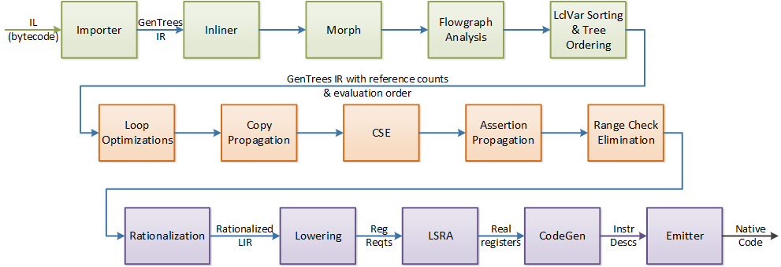
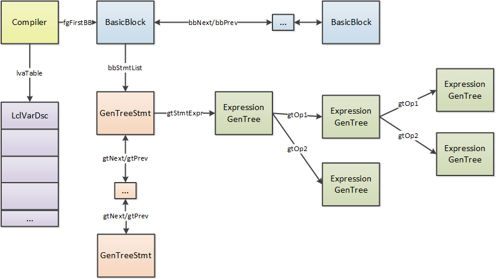
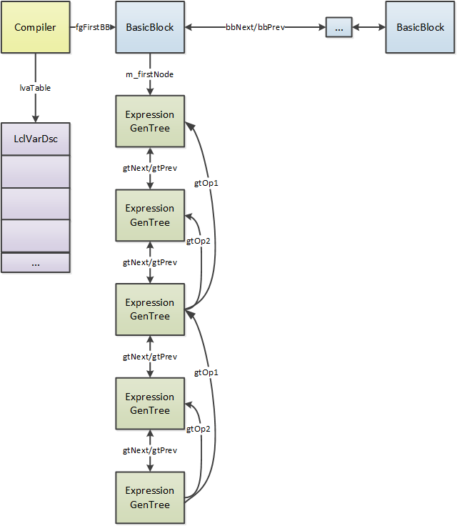

# RyuJIT Tutorial

## .NET Dynamic Code Execution

### .NET Runtime
- An implementation of the Common Language Infrastructure [ECMA 335]
  - Supports multiple languages, including C#, F# and VB
- RyuJIT is the "next generation" just in time compiler for .NET
- Sources are at https://github.com/dotnet/runtime/tree/main/src/coreclr/jit

#### Notes
For context, the .NET runtime has been around since about the turn of the millennium. It is a virtual machine that supports the execution of a number of languages, primarily C#, Visual Basic, and F#.
It has been standardized through Ecma and then ISO.
There have been a number of implementations of the CLI, the dominant one being installed with the Windows operating system.
That implementation has served as the basis for a standalone implementation that is now available in open source.
RyuJIT is the re-architected JIT for .NET.

### Why "RyuJIT"?
- Ryujin is a Japanese Sea Dragon

We wanted something with "JIT" in the name, and the idea of a dragon came to mind because of the Dragon book that we all know and love.
So – we just adapted the name of the Japanese sea dragon, Ryujin.

### JIT History
- Code base pre-dates .NET
- Designed to support x86 only
- Evolved, enhanced and extended over time & still evolving
  - Primary RyuJIT changes
    - Front-end: value numbering, SSA
    - Back-end: linear scan register allocation, lowering

#### Notes
The original JIT was developed for a precursor to .NET, around the turn of the millennium.
It was developed quickly, and was designed for x86 only.
It has evolved over time, and is still evolving.
The front-end has been extended to support SSA and value numbering, while the original register allocation and code generation phases have been fully replaced.

### Primary design considerations
- High compatibility bar with previous JITs
- Support and enable good runtime performance
- Ensure good throughput via largely linear-order optimizations and transformations, along with limits for those that are inherently super-linear.
- Enable a range of targets and scenarios.

#### Notes
First and foremost, the evolution of RyuJIT is constrained by the requirement to maintain compatibility with previous JITs. This is especially important for a just in time compiler that has such a huge installed base. We need to ensure that the behavior of existing programs will be preserved across updates. Sometimes this even means adding "quirks" to ensure that even invalid programs continue to behave the same way.
Beyond that, the objective is to get the best possible performance with a minimum of compile time.
Both the design of the RyuJIT IR, as well as constraints on the scope of optimizations, are aimed at keeping as close to a linear compile time as possible.
Finally, while the original JIT was quite x86-oriented, we now have a broader set of platforms to support, as well as an ever-widening variety of application scenarios.

### Execution Environment & External Interface
- RyuJIT provides just-in-time compilation for the .NET runtime (aka EE or VM or CLR)
  - Supports "tiering", where code can be compiled with most optimizations turned off (Tier 0), and the VM can later request the same method be recompiled with optimizations turned on (Tier 1).
- ICorJitCompiler – this is the interface that the JIT compiler implements, and includes compileMethod (corjit.h)
- ICorJitInfo – this is the interface that the EE implements to provide type & method info
  - Inherits from ICorDynamicInfo (corinfo.h)

#### Notes
In this talk and elsewhere, you will see the .NET runtime often referred to as the VM, for virtual machine, the EE, for execution engine, or the CLR, for common language runtime. They are largely used interchangeably, though some might argue the terms have subtle differences.
.NET is somewhat unique in that it currently has a single-tier JIT – no interpreter, and no re-optimizing JIT. While an interpreter exists, and experimentation has been done on re-jitting, the current model remains single-tier.

The JIT and the VM each implement an interface that abstracts the dependencies they share. The VM invokes methods on the ICorJitCompiler interface to compile methods, and the JIT calls back on the ICorJitInfo interface to get information about types and methods.

### RyuJIT High-Level Overview


#### Notes
This is the 10,000 foot view of RyuJIT. It takes in MSIL (aka CIL) in the form of byte codes, and the Importer phase transforms these to the intermediate representation used in the JIT. The IR operations are called "GenTrees", as in "trees for code generation". This format is preserved across the bulk of the JIT, with some changes in form and invariants along the way. Eventually, the code generator produces a low-level intermediate called InstrDescs, which simply capture the instruction encodings while the final mappings are done to produce the actual native code and associated tables.

### RyuJIT Phases


#### Notes
This is the more detailed view, and shows all of the significant phases of RyuJIT. The ones in green are responsible for creating and normalizing the IR and associated data structures.
The phases in orange are the optimization phases, and the phases in purple are the lower-level, back-end phases.

### Initial Phases of RyuJIT

- Importer:
  - initialize the local variable table and scan the MSIL to form BasicBlocks
  - Create the IR from the MSIL
  - May create GT_COMMA to enforce order, or GT_QMARK for conditional expressions
- Inlining: Consider each call site, using state machine to estimate cost
- Morph
  - Struct promotion: scalar replacement of fields
  - Mark address-exposed locals
  - Morph blocks – localized simple optimizations and normalization
  - Eliminate Qmarks – turn into control flow


#### Notes
The initial phases of RyuJIT set up the IR in preparation for the optimization phases. This includes importing the IL, that is, producing GenTrees IR from the incoming MSIL, inlining methods when considered profitable, normalizing the representation, analyzing the flowgraph, specifying the execution order and identifying the important local variables for optimization.

### Optimization Phases of RyuJIT


- SSA and Value Numbering Optimizations
  - Dataflow analysis, SSA construction and Value numbering
  - Loop Invariant Code Hoisting – outer to inner
  - Copy Propagation – dominator-based path traversal, replacing variables with same VN (preserves CSSA)
  - Common Subexpression Elimination (CSE): identify computations with same VN, evaluate to a new temporary variable, and reuse
  - Assertion Propagation: uses value numbers to propagate properties such as non-nullness and in-bounds indices, and make transformations accordingly.
  - Eliminate array index range checks based on value numbers and assertions

#### Notes
The optimization phases of RyuJIT are based on liveness analysis, SSA and value numbering. These are used to perform loop invariant code hoisting, copy propagation, common subexpression elimination, assertion propagation, and range check elimination. SSA is used to uniquely identify the values of lclVars, while value numbering is used to identify trees that compute the same value for a given execution.

### Back-end Phases of RyuJIT


- Rationalization: eliminate "parental context" in trees
  - Not really strictly "back-end" but required by back-end)
- Lowering: fully expose control flow and register requirements
- Register allocation: Linear scan with splitting
- Code Generation:
  - Traverse blocks in layout order, generating code (InstrDescs)
  - Generate prolog & epilog, as well as GC, EH and scope tables


#### Notes
While the phases up to this point are largely target-independent, the back-end is responsible for performing the transformations necessary to produce native code.
The Rationalization pass is intended to be a transitional phase that takes the existing IR, and turns it into a form that is easier to analyze and reason about. Over time, we expect that this IR form will be used across the JIT.
The next phase, Lowering, is responsible for fully exposing the control flow and register requirements. This allows the register allocation to be performed on a rather more abstract IR than usually used for that purpose. It then annotates the IR with the register numbers, and the code generator walks the IR in linear execution order to produce the instructions. These are kept in a low-level format called InstrDescs which simply allow the emitter to fixup relative addresses and produce native code and tables.

## RyuJIT IR

### Throughput-Oriented IR
- Trees instead of tuples
  - HIR Form:
    - Evaluation order implicit
  - LIR Form:
    - Evaluation order explicit via gtNext, gtPrev links
  - JIT must preserve side-effect ordering
  - Implicit single-def, single-use dataflow
- Limit on the number of "tracked" variables
  - SSA, liveness
- Single (though modal) IR, with limited phase-oriented IR transformations
- Historically oriented toward a small working set

### RyuJIT IR


#### Notes
The RyuJIT IR can be described at a high level as follows:

- The `Compiler` object is the primary data structure of the JIT. Each method is represented as a doubly-linked list of `BasicBlock` objects. The Compiler object points to the head of this list with the `fgFirstBB` link, as well as having additional pointers to the end of the list, and other distinguished locations.
- `BasicBlock` nodes contain a list of doubly-linked statements with no internal control flow
  - The `BasicBlock` also contains the dataflow information, when available.
- `GenTree` nodes represent the operations and statement of the method being compiled.
  - It includes the type of the node, as well as value number, assertions, and register assignments when available.
- `LclVarDsc` represents a local variable, argument or JIT-created temp. It has a `gtLclNum` which is the identifier usually associated with the variable in the JIT and its dumps. The `LclVarDsc` contains the type, use count, weighted use count, frame or register assignment etc. These are often referred to simply as "lclVars". They can be tracked (`lvTracked`), in which case they participate in dataflow analysis, and have a different index (`lvVarIndex`) to allow for the use of dense bit vectors. Only non-address-taken lclVars participate in liveness analysis, though aliased variables can participate in value numbering.

### GenTrees
- A `BasicBlock` is a list of statements (`Statement`)
  - It has a pointer to the root expression for the statement
  - Statement nodes share the same base type as expression nodes, though they are really distinct IR objects
- Each `Statement` node points to its root expression tree
  - Each node points to its operands (children), and contains:
    - Oper (the operator for the expression, e.g. GT_ASG, GT_ADD, …)
    - Type (the evaluation type, e.g. GT_INT, GT_REF, GT_STRUCT)
  - They are not always strictly expressions
    - Comma nodes are inserted to allow creation of (multi-use) temps while preserving ordering constraints

#### Notes
The GenTree is the primary data structure of the JIT. It is used to represent the expressions for each statement.
Some distinguishing features of this IR are that, while an operation has links to its operands, they do not have a link to their parent expression.
Furthermore, during the initial phases of the JIT, the nodes are only ordered implicitly by the canonical traversal order of trees.
The initial construction of the IR ensures that any ordering dependencies are obeyed by the canonical traversal order, and any subsequent optimizations must ensure that any visible ordering constraints are obeyed.

### GenTrees Sample
```
▌  Statement  (top level) (IL 0x01D
│        ┌──▌  const int 1
│     ┌──▌  & int
│     │  └──▌  lclVar int V08
│  ┌──▌  + int
│  │  └──▌  lclVar int V06
└──▌  = int
   └──▌  lclVar int V06
```
From the example we'll look at later: count = count + (bits & 1)

#### Notes
This is the dump of an expression tree for a single statement. It takes a little while to get used to reading the expression tree dumps, which are printed with the children indented from the parent, and, for binary operators, with the first operand below the parent and the second operand above, at least in the front-end.
This statement is extracted from the PopCount example we're going to walk through later. V06 is the local variable with lclNum 6, which is the "count" variable in the source. V08 is the "bits" variable.
One thing to notice about this is that the context of the lclVar nodes is not clear without examining their parent. That is, two of the lclVar nodes here are uses, while the bottom one is a definition (it is the left-hand-side of the assignment above it).


### GenTrees Evolution
- The IR is being evolved to improve the ability to analyze and reason about it
  - Ensure that expression tree edges reflect data flow from child to parent
    - Eliminate GT_ASG: data flows from rhs to lhs "over" the parent (need parent context to determine whether a node is a use or a def)
    - Eliminate GT_ADDR: Need parent context to analyze child
    - Eliminate GT_COMMA: strictly an ordering constraint for op1 relative to op2 and parent
- Over time we expect to Rationalize the IR during or immediately after the IR is imported from the MSIL byte codes.

#### Notes
The GenTrees IR is being evolved to address the context issue mentioned in the last slide.
We would like to ensure that all data flows are from child to parent. Examples where this is currently violated are in the assignment, or GT_ASG node, where the data flows from the right hand side of the assignment "over" the parent assignment, to the value being defined on the left hand side. Similarly, the child of a GT_ADDR node may appear to be a use or a definition of the value, when instead its address is being taken.
Finally, the comma node is inserted in the tree purely as an ordering constraint to enable a non-flow computation or store of a temporary variable, to be inserted in the midst of the evaluation of an expression.

The Rationalizer phase, which transforms these constructs to a more rational form, is currently run just prior to the back-end, but over time we expect to move it much earlier.

### GenTrees: Two modes
- In tree-order mode (front-end)
  - Aka HIR
  - IR nodes are linked only from parent to child initially
  - After loop transformations, and before the main optimization phases, the IR nodes are sequenced in
  execution order with `gtNext` and `gtPrev` links.
    - After this point the execution order must be maintained, and must be consistent with a canonical
    tree walk order.
- In linear-order mode (back-end)
  - Aka LIR
  - Execution order links (`gtPrev` and `gtNext`) are the definitive specification
  of execution order (no longer derivable from a tree walk)
  - Each `BasicBlock` contains a single linked list of nodes
    - `Statement` nodes are eliminated
    - `GT_IL_OFFSET`nodes convey source (IL) mapping info

#### Notes
There are a number of modalities in the RyuJIT IR, but one of the more significant is that when the IR is first imported, the nodes are linked only from parent to child. Later in the JIT, the execution order is made explicit by the addition of gtPrev and gtNext links on each node. This eases analysis of the IR, but also makes updates a bit more cumbersome.

### IR Example: Array References
##### After Import
```
  ┌──▌  lclVar V03
──▌  []
  └──▌ lclVar V00
```
##### Front-end
- Computation Exposed for Opt
```
  ┌──▌ indir
  │  │  ┌──▌  const 16
  │  └──▌  +
  │     │     ┌──▌  const 2
  │     │  ┌──▌  <<
  │     │  │  └──▌  lclVar V03
  │     └──▌  +
  │        └──▌  lclVar V00
──▌  comma
  └──▌ arrBndsChk
     ├──▌  arrLen
     │  └──▌  lclVar V00
     └──▌  lclVar V03
```
##### Backend
- Execution order
- Target-dependent addressing modes
```
        ┌──▌  lclVar V00
     ┌──▌  lea(b+8)
  ┌──▌  indir
  ├──▌  lclVar V03
──▌  arrBndsChk
     ┌──▌  lclVar V00
     ├──▌  lclVar V03
  ┌──▌  lea(b+(i*4)+16)
──▌  indir
```

#### Notes
This example shows the evaluation of the IR from the importer, through the front-end and finally the backend.
Initially, an array reference is imported as a GT_INDEX node, represented here by the double brackets, with the array object (V00) and the index (V03) as its children.
In order to optimize this, we want to be able to expose the full addressing expression, as well as the bounds check. Note that the bounds check is inserted below a comma node. This allows this transformation to be made "in place". Also, note that the execution order is generally "left to right" where the "left" node of a binary operator is actually shown below it in tree order.
On the right hand side, you can see that the addressing expression has been transformed to a "load effective address", and the array bounds check has been split.
In the backend, although the tree links are still shown, we dump the graphs in execution order, as that is the primary view of the IR in the backend.

### Dataflow
- There are two first-class entities in the JIT:
  - Local variables
    - These include some compiler-generated temps
    - These can have multiple definitions and uses
  - Tree nodes
    - Each node has a type, and if it is not a top-level node (i.e. the root of the statement tree), it defines a value
    - The value has exactly one use, by the parent node
- The JIT also does some tracking of heap values via value numbering

#### Notes
The JIT only tracks the value of two kinds of entities:
Local variables – including user-defined arguments and locals, as well as JIT-generated temps. These can have multiple definitions and uses.
Tree nodes – these are always single-def, single-use

The JIT also does some tracking of heap values.

### Dataflow Information
- For throughput, the JIT limits the number of lclVars for which it computes liveness
  - These are the only lclVars that will be candidates for register allocation
  - These are also the lclVars for which GC ranges will be reported
    - Note that we have a precise GC model

#### Notes
The JIT limits the number of lclVars for which it computes liveness. The limit is currently 512 for most targets, which is sufficient to include all of the lclVars for most methods. These are the only lclVars that will participate in optimization or register allocation.
A lclVar whose address has been taken will never be tracked.
They are also the lclVars for which GC ranges will be reported. Although the CLR has a precise GC model, the JIT can either report ranges over which a location (i.e. a register or stack location) contains a GC variable, or report a location as a GC value for the full method scope, and then ensure that its value either represents a valid heap location or null.

### Liveness Analysis
- The live-in and live-out sets are captured in the bbLiveIn and bbLiveOut fields of the BasicBlock.
  - The GTF_VAR_DEF flag is set on a lclVar GenTree node that is a definition.
  - The GTF_VAR_USEASG flag is set (in addition to the GTF_VAR_DEF flag) on partial definitions of a local variable (i.e. `GT_LCL_FLD` nodes that do not define the entire variable).
  - GTF_VAR_DEATH is set to indicate the last uses.
- The bitvector implementation is abstracted and can be changed to a variable sized set.

#### Notes
The liveness analysis is a simple, traditional liveness analysis. Once complete, the bbLiveIn and bbLiveOut sets are available on each BasicBlock, and the data flow bits are set on each GenTree node that represents a lclVar reference, to indicate whether it is a use, a def, or an update, and whether it is a last use.
The size of the bitVector is the number of tracked variables, and can be changed with different JIT build options, though not currently dynamically.

### SSA
- Static single assignment (SSA) form is constructed in a traditional manner.
  - The SSA names are recorded on the lclVar references.
  - Each lclVar has a table of its SSA names with their defining tree and BasicBlock
- The JIT currently requires that the IR be maintained in conventional SSA form, as there is no "out of SSA" translation
  - i.e. the operands of a phi node may not interefere

#### Notes
The SSA implementation constructs pruned SSA, using the liveness information.
It doesn't change the lclNum of the lclVar nodes, but simply annotates the node with the SSA name. That is, an SSA name can be considered to be the pair formed by the lclNum and the SSA name.
The JIT has no "out of SSA" translation, so all optimizations must preserve conventional SSA form – that is they may not move references to an SSA name across a PHI node that references it.

### Value Numbering
- Value numbering utilizes SSA for lclVar values, but also performs value numbering of expression trees.
  - Two nodes with the same value number compute the same value
    - Used for CSE and for array bounds check elimination
  - It takes advantage of type safety by not invalidating the value number for field references with a heap write, unless the write is to the same field.
- This is done by tagging indirections with a chain of FieldSeqNodes that describe the field being referenced at each level, such that the final expression has the chain of fields being accessed.
  - The IR nodes are annotated with the value numbers (shown as $<vn> in the dump), which are indexes into a type-specific value number store.
  - Value numbering traverses the trees, performing symbolic evaluation of many operations.

#### Notes
The RyuJIT value numbering implementation is somewhat unusual in that it takes advantage of the type safety of .NET by not invalidating the value number for heap-based field references by an arbitrary heap write, unless the write is to the same field. While this doesn't give the full fidelity of alias-based analysis, it is quite effective.
This is done by tagging indirections with a chain of descriptors for the fields referenced at each level of indirection below the current node. In this way, each node has the full chain of fields that it references.
Value numbering performs symbolic evaluation of many operations, and can therefore tag equivalent expressions with the same value number.
This is used by all of the front-end optimizations.

## RyuJIT Initial Phases

### Inlining
- The inliner is the first phase after the importer
- It examines the signature and IL for the candidate methods, extracting characteristics that it uses to estimate viability and profitability
  - It then imports the IL for the candidate, producing IR
    - This is inserted at the call site, if successful
- This phase has been undergoing significant refactoring and enhancement:
  - See [inlining plans](inlining-plans.md)

#### Notes
The inliner re-invokes the importer for each method that is considered a suitable candidate. Along the way, it may determine that the method cannot, or should not, be inlined, at which case it abandons the constructed IR, and leaves the callsite as-is. Otherwise, it inserts the newly created IR at the callsite, adds the local variables of the called method to the callee, and fixes up the arguments and returns.
This phases has recently been significantly refactored, and enhancements are in progress. There is a design document online that describes the overall plan.

### Morph
- This phase is responsible for preparing the IR for optimization and code generation:
  - Struct promotion (scalar replacement) breaks down value types into their constituent fields if conditions are met
  - The IR is traversed to determine which lclVars have their address taken
    - Note that this requires a contextual walk, as it is the parent of a lclVar that determines whether it is a use, def or address
  - Morph Blocks normalizes the graph
    - Expanding and transforming array and field references, block copies and assignments, and doing simple optimizations
  - It is a complicating issue that Morph does both transformations necessary for correctness, as well as optimizing transformations

### Flowgraph analysis
- Sets the predecessors of each block
  - Must be kept valid after this phase.
- Computes reachability and dominators
  - These may be invalidated by changes to the flowgraph.
- Sets edge and block weights
  - Using profile information if available; otherwise heuristically set
- Identifies and normalizes loops
  - Transforms while loops to "do while"
  - Performs loop cloning and unrolling
  - Loops may be invalidated, but must be marked as such.

### LclVar Sorting and Tree Ordering
- lvaMarkLocalVars()
  - Set reference counts, sort and select for tracking
- Execution order within a statement is set by fgSetBlockOrder()
  - Canonical postorder traversal of the nodes
  - Execution order is made concrete by adding gtNext/gtPrev links
  - Must also correspond with canonical order: "Left to right" except for binary operators with GTF_REVERSE_OPS flag
  - If op1 has no side-effects, a simple cost analysis is done to determine when to reverse the order of binary operands
  - A GTF_REVERSE_OPS flag on an assignment indicates that the rhs (op2) should be evaluated before the target address (if any) on the lhs (op1) is evaluated.

### Tree Order
- Initially, expression nodes are linked only via parent-child links (uni-directional)
- The consuming node (parent) has pointers to the nodes that produce its input operands (children)
- Execution order is implicit
  - Operands are evaluated in order
  - Unless the GTF_REVERSE_OPS flag is set

### RyuJIT IR
- Before ordering
  - The earlier IR diagram shows the IR with only the parent/child links
- After ordering (`fgSetBlockOrder()`):
  - The execution order *within a statement* is specified by the `gtNext` and `gtPrev` links


#### Notes
This is the same diagram as before, but with additional links to indicate execution order. The statements have a link to the first node in the list, and each node has a link to its previous and next node in the linear order.

### Linear IR (LIR)
- After Ordering, IR expression nodes have both parent-child links as well as execution order links (gtPrev and gtNext)
- The execution order no longer represents a canonical traversal of the parent ->  child links
- In LIR, statements are replaced with GT_IL_OFFSET nodes to allow mapping back to the incoming IL
- All the nodes for a `BasicBlock` are in a single linked-list



## RyuJIT Front-End

### Loop Recognition and Transformation
- Identifies simple loops
- Performs loop cloning and unrolling

### Early Propagation
- Propagation of array lengths and type information
- Done after loop recognition but before loop hoisting

### Loop Optimizations
- Traverses loops outer-to-inner, hoisting expressions that
  - Have not been marked GTF_DONT_CSE
  - Have no side-effects
  - Don't raise exceptions, OR occur before any side-effects
  - Have a valid value number and are invariant:
    - Constants
    - LclVars defined outside the loop
    - Nodes whose children are invariant

### Copy Propagation
- Walks each block in the graph in dominator-first order
  - When it encounters a variable with the same VN as a previously live variable, it is replaced with that variable

### CSE & Assertion Propagation
- Common Subexpression Elimination
  - Redundant expressions are identified by value number
  - If deemed profitable, they are evaluated to a new "temp" lclVar and then reused
- Assertion Propagation
  - Propagate properties such as constant values and non-nullness

### Range Check Optimization
- Traverse the IR looking for range checks, determining the check range
  - Constant or value number
- Compute the range of the index value being checked:
  - Iterate over the def chains for the index
    - Mark recursive phis as dependent
    - Merge assertions from incoming values
      - This incorporates loop bound information
    - Check for overflow
  - Check that the chain is monotonic
  - Determine initial value for dependent phis
- Eliminate checks where the range of the index is within the check range

## RyuJIT Back-End

### Rationalization
- All GT_COMMA nodes are eliminated
- All GT_ASG nodes become GT_STORE variants (e.g. GT_STORE_LCL_VAR)
- All GT_ADDR nodes are eliminated (e.g. with GT_LCL_VAR_ADDR)

### IR Rationalization: Assignment and Address-of

#### Assignment
##### Front-end IR
```
  ┌──▌  lclVar V03
──▌  =
  └──▌ lclVar V00
```
##### Rationalized IR
```
  ┌──▌  lclVar V03
──▌  st.lclVar V00
```

#### Address-of
##### Front-end IR
```
   ┌──▌  const 0
   ├──▌  lclVarAddr V00
   ├──▌  const 16
 ──▌  initBlk
```
##### Rationalized IR
```
   ┌──▌  const 0
   │  ┌──▌  lclVar V00
   ├──▌  addr
   ├──▌  const 16
 ──▌  initBlk

```

### IR Rationalization: Commas
#### Front-end IR
```
▌  Statement (IL 0x093...0x09D)
│     ┌──▌  lclVar long V09
│  ┌──▌  indir long
│  │        ┌──▌  lclFld float V10 [+0]
│  │     ┌──▌  addr byref
│  │     ├──▌  lclVar long V101
│  │  ┌──▌  = long
│  │  ├──▌  lclVar long V101
│  ├──▌  comma long
└──▌  = long
```
##### Rationalized IR
```
▌  Statement (IL 0x093...0x09D)
│  ┌──▌  lclVar long V09
│  │  {  ▌  stmtExpr (embedded)
│  │  {  │  ┌──▌  &lclFld V10 [+0]
│  │  {  └──▌  st.lclVar long V101
│  ├──▌  lclVar long   V101
└──▌  storeIndir long
```
#### Notes
This needs to be updated, as we no longer have embedded statements.

### Lowering
- GenTree nodes are split or transformed
  - Make any necessary flowgraph changes
    - Switch statements
    - Block copies
  - Expose all register requirements
    - Number of registers used, defined, and required for "internal use"
  - Identify nodes that are "contained"
    - This includes constants and addressing modes
    - Code generation for these nodes is deferred to the parent node

### Linear Scan Register Allocator
- Builds Intervals
  - Each represents a lclVar or expression
- Constructs an ordered list of RefPositions
  - Ordered according to a weighted predecessor-first traversal of blocks
  - These are associated either with an Interval or a physical register
- Traverses the RefPositions to allocate registers
  - Supports split intervals for lclVars, i.e. they can move between different registers and/or a stack location
  - Calculates the maximum number of spill temps required
- Writes back the register assignments, and resolves register locations at block boundaries, inserting moves and splitting blocks as needed

### Code Generation
- Determines frame layout
- Traverses the blocks in layout order
  - Generates code for each node in execution order
    - InstrDescs
  - Updates the state of registers and variables, used to
    - Associate GC information with the generated code
    - Create debug scope info
- Generates the prolog and epilog code

### Supporting Components
- Instruction encoding: InstrDescs
  - Encodings are captured in various encoding tables instrs{tgt}.h (e.g. instrsxarch.h)
- GC info: reports live GC references two ways
  - Untracked stack locations: initialized to null in prolog
  - Tracked lclVars: live ranges in registers or on stack
- Debugger info
  - Mapping of MSIL offsets to native code offsets
    - Tracked on GenTree nodes, captured during Codegen, then written out at end (genIPmapping*)
  - Mapping of user locals to location (register or stack) – siVarLoc captures location, VarScopeDsc captures range
- Exception handling: EHblkDsc for each exception handling region
  - Can be nested
  - Complicated!
  - Inhibits optimization of values that flow across EH edges

### Retargeting
- Platforms:
  - x86-64
    - Fully functional on Windows, Linux and OSX
  - x86 (32-bit)
    - Fully function on Windows
    - Linux support is underway
  - Arm64/Windows is nearly complete
  - Arm32 is using an older source base for the backend (look for #ifdef LEGACY_BACKEND), but the retargeting of RyuJIT is nearing completion for both Linux and Windows
- Major porting considerations:
  - Encodings: instrsXXX.h, emitXXX.cpp and targetXXX.cpp
  - Translation: lowerXXX.cpp, codeGenXXX.cpp, simdcodegenXXX.cpp, and unwindXXX.cpp
  - ABI (including calling convention): primarily Importer, Morph, Lowering and Codegen

### Instruction Encoding
- The instrDesc is the data structure used for encoding
  - It is initialized with the opcode bits, and has fields for immediates and register numbers.
- instrDescs are collected into groups
  - A label may only occur at the beginning of a group
- The emitter is called to:
  - Create new instructions (instrDescs), during CodeGen
  - Emit the bits from the instrDescs after CodeGen is complete
  - Update Gcinfo (live GC vars & safe points)

### Sample Feature
- Add support for popcnt "intrinsic" to x86-64 RyuJIT:
  - C# code:
```
public static int PopCount(ulong bitVectorArg)
{
    int count = 0;
    const int bitWidth = sizeof(ulong) * 8;
    ulong bitVector = bitVectorArg;
    for (int i = 0; i < bitWidth; i++)
    {
        count += ((int)bitVector & 1);
        bitVector >>= 1;
    }
    return count;
}
```
- Encoding: F3 REX.W 0F B8 /r POPCNT r64, r/m64

#### Notes
The sample I'm going to walk through implements support for pop count (counting the number of '1' bits in a 64-bit value).

We're going to start by assuming that we have a method with a known signature that implements PopCount.
Here's the implementation we're going to use. It simply takes the input value, and keeps anding with one, and then shifting right.
We're first going to simply recognize the name and signature, and replace the method call with a simple PopCnt IR node.
Then, we're going to add code to pattern match the loop.
Note that this is not necessarily the approach one would take, because the loop is quite an inefficient implementation - but the alternative (sequence of ands, ors and multiplies) creates a complex tree that would be problematic to recognize for our simple example.

### Sample Code
- I've implemented this sample and checked it into my fork of the coreclr sources:
        https://github.com/caroleidt/coreclr/tree/PopCntSample
- There are two commits
  - The first one does a simple name match of the PopCount method
  - The second one does a pattern match of the loop

### Getting Dumps
```
set COMPlus_JitDump=Main
set COMPlus_JitDumpAscii=0
set COMPlus_JitDumpFg=Main
set COMPlus_JitDumpFgDot=1
set COMPlus_JitDumpFgFile=Main
set COMPlus_JitDumpFgPhase=OPT-CHK
```
{BinaryDir}\CoreRun.exe PopCount.exe 1122334455667788 > jitdump.out.0


#### Notes
The first thing we're going to do is to take a look at the IR for the sample.
We have a simple Main method that reads in an unsigned long value, and calls the PopCount method.
We set a bunch of environment variables to get some useful dumps.
The first says that we're want the dump for the method named "Main". We are also going to set the Ascii option to zero, to get a slightly better tree dump.
We also want to dump the flowgraph in dot format, to a file named Main.dot, and we want to do it after the range check optimization phase, since that's where we're eventually going to put our pattern matching code. The graph to the right is the result of running the dot file through graphviz.

### PopCnt Sample Overview
I added/changed some foundational stuff:
- gentree.h
  - GenTree::IsOne() (this is now available as `GenTree::IsIntegralConst(1)`)
- compiler.h, optimizer.cpp:
  - optIsSimpleLoop(int loopNum)
  - bool optIsTestEvalIntoTemp(GenTreePtr test, GenTreePtr* newTest); ( was optIsLoopTestEvalIntoTemp)
  - unsigned optIsLclVarUpdateTree(GenTreePtr tree, GenTreePtr* otherTree, genTreeOps *updateOper);

Getting Ready
- Set COMPlus_JitDump=Main
- Set COMPlus_AltJit=*
- Run and capture jitdump1.out
- Examine the IR for the loop just prior to optCloneLoops

Recognize "Intrinsic" (SampleStep1 shelveset)
- View/compare shelveset changes:
  - gtlist.h: Add a new node, GT_POPCNT.  It's unary.
  - instrsxarch.h: encoding
  - codegenxarch.cpp: generate instruction
  - importer.cpp: name recognition
- set COMPlus_JitDump
- Run & capture jitdump2.out, search for CountBits, then look at disassembly

Add Pattern Recognition (SampleStep2 shelveset):
- ifdef out the name recognition
- Go back to jitdump1.out and look at IR just prior to optCloneLoops
- Let's assume we're going to eventually add more than one intrinsic that implements a loop, so we'll add a method that looks for simple loops we can turn into intrinsics.
- Unshelve SampleStep2:
- Add optFindLoopIntrinsics() to compCompile after optOptimizeLoops()
- compiler.h, compiler.cpp
- Run & capture jitdump3.out, search for optCloneLoops

### Reference
- The RyuJIT overview document is available [here](ryujit-overview.md)

## Backup

### COMPlus Variables
- COMPlus_JitDump={method-list} – lots of info about what the JIT is doing
- COMPlus_JitDisasm={method-list} – disassembly listing of each method
- COMPlus_JitDiffableDasm – avoid printing pointer values that can change from one invocation to the next, so that the disassembly can be more easily diffed.
- COMPlus_JITGCDump={method-list} – this dumps the GC information.
- COMPlus_JitUnwindDump={method-list} – dumps the unwind tables.
- COMPlus_JitEHDump={method-list} – dumps the exception handling tables.
- COMPlus_JitTimeLogFile – a log file for timing information (dbg or chk builds)
- COMPlus_JitTimeLogCsv – a log file for timing information in csv form (all builds)
- {method-list} can be a space-separated list of method names or * for all methods

### IR Dump: Front-end
Here is an example dump in tree order (shown with COMPlus_JitDumpAscii=0)
```
STMT00000 (IL   ???...  ???)
[000067] -AC-G-------      ▌  call help void   HELPER.CORINFO_HELP_ARRADDR_ST
[000047] ------------ arg0 ├──▌  lclVar    ref    V03 loc2
[000048] ------------ arg1 ├──▌  const     int    0
[000063] -A---------- arg2 └──▌  box       ref
[000061] ------------         │  ┌──▌  lclVar    ref    V04 tmp0
[000062] -A----------         └──▌  comma     ref
[000049] ------------            │  ┌──▌  lclVar    long   V01 loc0
[000060] -A----------            └──▌  =         long
[000059] -------N----               └──▌  indir     long
[000057] ------------                  │  ┌──▌  const     long   8
[000058] ------------                  └──▌  +         byref
[000056] ------------                     └──▌  lclVar    ref    V04 tmp0
```

### IR Dump: Back-end
- Here is the same statement just prior to code generation. Note that the nodes are printed in execution order, and the comma node has been eliminated.
```
***** BB06, stmt 21 (top level)
     ( 49, 31) [000068] ------------             ▌  stmtExpr  void  (top level) (IL   ???...  ???)
N199 (  1,  1) [000047] ------------             │     ┌──▌  lclVar    ref    V03 loc2         u:3 rdi REG rdi RV $540
N201 (  5,  4) [000281] DA--------L- arg0 SETUP  │  ┌──▌  st.lclVar ref    V11 tmp7         d:3 rcx (last use) REG rcx RV
N203 (  0,  0) [000288] ----------L- arg1 SETUP  │  ├──▌  argPlace  int    REG NA $40
     (  8,  7) [000396] ------------             │  │     {  ▌  stmtExpr  void  (embedded) (IL   ???...  ???)
N205 (  1,  1) [000056] ------------             │  │     {  │     ┌──▌  lclVar    ref    V04 tmp0         u:3 rax REG rax RV $1cf
N207 (  2,  2) [000421] ------------             │  │     {  │  ┌──▌  lea(b+8)  byref  REG NA
N209 (  3,  2) [000049] ----G-------             │  │     {  │  ├──▌  lclVar    long  (AX) V01 loc0          REG rcx $348
N211 (  8,  7) [000397] ----G-------             │  │     {  └──▌  storeIndir long   REG NA
N213 (  1,  1) [000061] ------------             │  │  ┌──▌  lclVar    ref    V04 tmp0         u:3 rax (last use) REG rax RV $1cf
N215 ( 19, 15) [000285] DA--GO----L- arg2 SETUP  │  ├──▌  st.lclVar ref    V12 tmp8         d:3 r8 REG r8 RV
N223 (  1,  1) [000282] ------------             │  │  ┌──▌  lclVar    ref    V03 loc2         u:3 rdi REG rdi RV $540
N225 (  1,  1) [000418] ------------ arg0 in rcx │  ├──▌  putarg_reg ref    REG rcx
N227 (  3,  2) [000286] ------------             │  │  ┌──▌  lclVar    ref    V12 tmp8         u:3 r8 (last use) REG r8 RV $2d3
N229 (  3,  2) [000419] ------------ arg2 in r8  │  ├──▌  putarg_reg ref    REG r8
N231 (  1,  1) [000048] ------------             │  │  ┌──▌  const     int    0 REG rdx $40
N233 (  1,  1) [000420] ------------ arg1 in rdx │  ├──▌  putarg_reg int    REG rdx
N241 ( 49, 31) [000067] -ACXGO------             └──▌  call help void   HELPER.CORINFO_HELP_ARRADDR_ST $1d1
```
#### Notes
This needs to be updated, as we no longer have statements in back-end.

### Phase Transitions
- Flowgraph analysis
- BasicBlock links, reachability, dominators, edge weights, loop identification
- IR Sorting and Ordering
- LclVar reference counts, evaluation order
- Rationalization
- Eliminate context sensitive nodes
- Lowering
- Expose all register requirements and control flow
