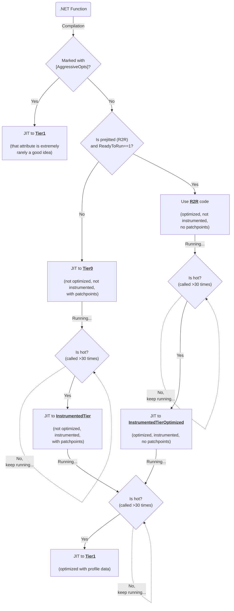

# Instrumented Tiers

_Disclaimer: the functionality described in this doc is still in the preview stage and is not enabled by default even for `DOTNET_TieredPGO=1`._

[#70941](https://github.com/dotnet/runtime/pull/70941) introduced new opt-in strategies for Tiered Compilation + TieredPGO mainly to address
two existing limitations of the current design:
1) R2R code never benefits from Dynamic PGO as it's not instrumented and is promoted straight to Tier1 when it's hot
2) Instrumentation in Tier0 comes with a big overhead and it's better to only instrument hot Tier0 code (whether it's ILOnly or R2R)

A good example explaining boths problems is this TechEmpower benchmark (plaintext-plaintext):

Legend:
* Red    - `DOTNET_TieredPGO=0`, `DOTNET_ReadyToRun=1` (default)
* Black  - `DOTNET_TieredPGO=1`, `DOTNET_ReadyToRun=1`
* Yellow - `DOTNET_TieredPGO=1`, `DOTNET_ReadyToRun=0`

Yellow line provides the highest level of performance (RPS) by sacrificing start up speed (and, hence, time it takes to process the first request). It happens because the benchmark is quite simple and most of its code is already prejitted so we can only instrument it when we completely drop R2R and compile everything from scratch. It also explains why the black line (when we enable Dynamic PGO but still rely on R2R) didn't really show a lot of improvements. With the separate instrumentation tier for hot R2R we achieve "Yellow"-level of performance while maintaining the same start up speed as it was before. Also, for the mode where we have to compile a lot of code to Tier0, switching to "instrument only hot Tier0 code" strategy shows ~8% time-to-first-request reduction across all TE benchmarks.

(_predicted results according to local runs of crank with custom binaries_)

# Tiered compilation workflow in TieredPGO mode

The following diagram explains how the instrumentation for hot code works under the hood when TieredPGO is enabled (it's disabled by default):

(_VSCode doesn't support mermaid diagrams out of the box, consider installing external add-ins_)

## Pros & cons of using optimizations inside the instrumented tiers

Pros & cons of using optimizations inside the instrumented tiers
Pros:
   * Lower overhead from instrumentation
   * We definitely don't want to use unoptimized instrumented tier for R2R - it will produce a lot of new first-time compilations for non-inlined methods
     and performance impact might be noticeable (when we switch from fast R2R to extremely slow Tier0+instrumentation)

Cons:
   * Currently, we don't instrument inlinees -> we'll probably miss some oportunities and produce less accurate profile leading to a less optimized final tier
   * Non-optimized instrumented tier is faster to prepare for use