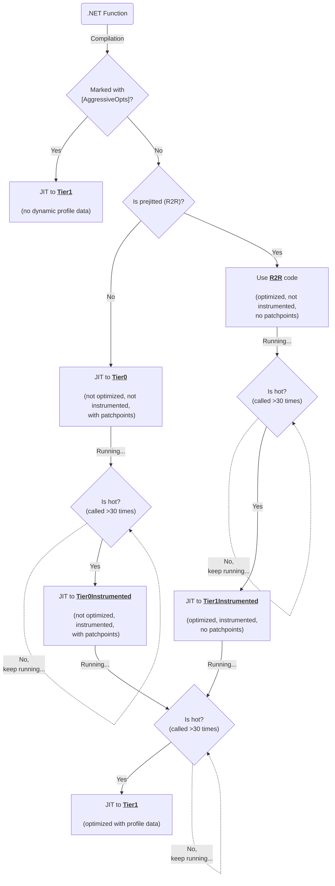
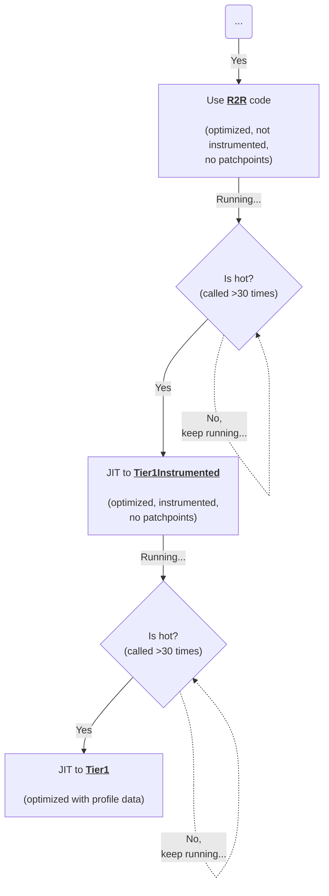
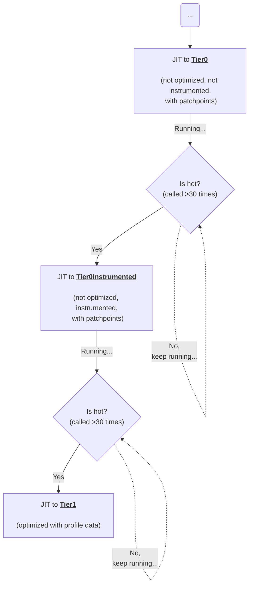

# Instrumented Tiers

[#70941](https://github.com/dotnet/runtime/pull/70941) introduced separate tiers to focus on instrumenting only the hot code. It's done to address the following problems:
1) R2R code should still benefit from Dynamic PGO despite being not instrumented in the first place
2) Overhead from the instrumentation in Tier0 should not slow startup

To address these problems the following workflow was introduced:


(_VSCode doesn't support mermaid diagrams out of the box, consider installing external add-ins_)

Now, any code is eligible for Dynamic PGO if it's hot enough. It's easier to explain this on a concrete example:

```csharp
class Program : IDisposable
{
    static int Main()
    {
        Program p = new();
        for (int i = 0; i < 500; i++)
        {
            HotLoop(p);
            Thread.Sleep(40); // cold loop
        }

        Console.ReadKey();
        return 100;
    }

    [MethodImpl(MethodImplOptions.NoInlining)]
    static void HotLoop(IDisposable d)
    {
        for (int i = 0; i < 500000; i++) // hot loop
            d?.Dispose();
    }

    public void Dispose() => Test();

    [MethodImpl(MethodImplOptions.NoInlining)]
    void Test() { }
}
```

The method we'll be looking at is `HotLoop`. The method itself has a hot loop (to show how this work interacts with OSR) but the whole method is expected to be promoted to Tier1 too since it's invoked also in a loop (cold loop). The method also has a virtual call to showcase GDV.

# Case 1: `HotLoop` is prejitted (R2R)

Let's see what happens when the method we're inspecting has an AOT version on start:

1) When we start the app, VM picks up R2R'd version of `HotLoop` that looks like this:

```asm
; Assembly listing for method Program:HotLoop(System.IDisposable)
; Emitting BLENDED_CODE for X64 CPU with AVX - Windows
; ReadyToRun compilation
; optimized code
; No PGO data
G_M43040_IG01:              ;; offset=0000H
       57                   push     rdi
       56                   push     rsi
       4883EC28             sub      rsp, 40
       488BF1               mov      rsi, rcx
						;; size=9 bbWeight=1    PerfScore 2.50
G_M43040_IG02:              ;; offset=0009H
       33FF                 xor      edi, edi
						;; size=2 bbWeight=1    PerfScore 0.25
G_M43040_IG03:              ;; offset=000BH
       4885F6               test     rsi, rsi
       740D                 je       SHORT G_M43040_IG05
						;; size=5 bbWeight=4    PerfScore 5.00
G_M43040_IG04:              ;; offset=0010H
       488BCE               mov      rcx, rsi
       4C8D1D00000000       lea      r11, [(reloc 0x4000000000420270)]
       41FF13               call     [r11]System.IDisposable:Dispose():this
						;; size=13 bbWeight=2    PerfScore 7.50
G_M43040_IG05:              ;; offset=001DH
       FFC7                 inc      edi
       81FF20A10700         cmp      edi, 0x7A120
       7CE4                 jl       SHORT G_M43040_IG03
						;; size=10 bbWeight=4    PerfScore 6.00
G_M43040_IG06:              ;; offset=0027H
       4883C428             add      rsp, 40
       5E                   pop      rsi
       5F                   pop      rdi
       C3                   ret      
						;; size=7 bbWeight=1    PerfScore 2.25
; Total bytes of code 46
```

As we can see from the codegen: it's not instrumented (we never instrument R2R'd code - it would increase the binary size by quite a lot), it doesn't have patchpoints for OSR (since it's already optimized) and is optimized. Technically, it can be optimized with a Static PGO but, presumably, it's a rare case in the real world due to complexity, so we left that virtual call here non-devirtualized.

2) HotLoop is invoked >30 times meaning it's likely a hot method so VM "promotes" it to Tier1Instrumented:
```asm
; Assembly listing for method Program:HotLoop(System.IDisposable)
; Emitting BLENDED_CODE for X64 CPU with AVX - Windows
; Tier-1 compilation
; optimized code
; instrumented for collecting profile data
; No PGO data
G_M43040_IG01:              ;; offset=0000H
       57                   push     rdi
       56                   push     rsi
       4883EC28             sub      rsp, 40
       488BF1               mov      rsi, rcx
                                                ;; size=9 bbWeight=1    PerfScore 2.50
G_M43040_IG02:              ;; offset=0009H
       FF05F9FE5500         inc      dword ptr [(reloc 0x7ffd5edb4948)]
       33FF                 xor      edi, edi
       EB3B                 jmp      SHORT G_M43040_IG05
                                                ;; size=10 bbWeight=1    PerfScore 5.25
G_M43040_IG03:              ;; offset=0013H
       FF05F3FE5500         inc      dword ptr [(reloc 0x7ffd5edb494c)]
       4885F6               test     rsi, rsi
       7428                 je       SHORT G_M43040_IG04
       FF05ECFE5500         inc      dword ptr [(reloc 0x7ffd5edb4950)]
       488BCE               mov      rcx, rsi
       48BA5849DB5EFD7F0000 mov      rdx, 0x7FFD5EDB4958
       E81ACB105F           call     CORINFO_HELP_CLASSPROFILE32
       488BCE               mov      rcx, rsi
       49BB5000595EFD7F0000 mov      r11, 0x7FFD5E590050      ; code for System.IDisposable:Dispose
       41FF13               call     [r11]System.IDisposable:Dispose():this
                                                ;; size=51 bbWeight=2    PerfScore 24.50
G_M43040_IG04:              ;; offset=0046H
       FF0514FF5500         inc      dword ptr [(reloc 0x7ffd5edb49a0)]
       FFC7                 inc      edi
                                                ;; size=8 bbWeight=2    PerfScore 6.50
G_M43040_IG05:              ;; offset=004EH
       FF0510FF5500         inc      dword ptr [(reloc 0x7ffd5edb49a4)]
       81FF20A10700         cmp      edi, 0x7A120
       7CB7                 jl       SHORT G_M43040_IG03
                                                ;; size=14 bbWeight=8    PerfScore 34.00
G_M43040_IG06:              ;; offset=005CH
       FF0506FF5500         inc      dword ptr [(reloc 0x7ffd5edb49a8)]
                                                ;; size=6 bbWeight=1    PerfScore 3.00
G_M43040_IG07:              ;; offset=0062H
       4883C428             add      rsp, 40
       5E                   pop      rsi
       5F                   pop      rdi
       C3                   ret
                                                ;; size=7 bbWeight=1    PerfScore 2.25
; Total bytes of code 105
```

We had to instrument **optimized** code here to mitigate two issues:
1) We don't want to see a significant performance degradation (even temporarily) after fast R2R
2) Unoptimized code tends to spawn a lot of new unnecessary jit compilations because it doesn't inline code, even simple properties

As a downside - the profile is less accurate and it doesn't instrument inlinees.

3) The new code version of `HotLoop` is also invoked >30 times leading to the final promotion to Tier1:
```asm
; Assembly listing for method Program:HotLoop(System.IDisposable)
; Emitting BLENDED_CODE for X64 CPU with AVX - Windows
; Tier-1 compilation
; optimized code
; optimized using profile data
; with Dynamic PGO: edge weights are invalid, and fgCalledCount is 48
; 0 inlinees with PGO data; 1 single block inlinees; 0 inlinees without PGO data
G_M43040_IG01:              ;; offset=0000H
       57                   push     rdi
       56                   push     rsi
       4883EC28             sub      rsp, 40
       488BF1               mov      rsi, rcx
                                                ;; size=9 bbWeight=1    PerfScore 2.50
G_M43040_IG02:              ;; offset=0009H
       33FF                 xor      edi, edi
       4885F6               test     rsi, rsi
       7424                 je       SHORT G_M43040_IG05
       48B9A023C861FD7F0000 mov      rcx, 0x7FFD61C823A0      ; Program
       48390E               cmp      qword ptr [rsi], rcx
       7515                 jne      SHORT G_M43040_IG05
                                                ;; size=22 bbWeight=1    PerfScore 5.75
G_M43040_IG03:              ;; offset=001FH
       488BCE               mov      rcx, rsi
       FF1550771B00         call     [Program:Test():this]
       FFC7                 inc      edi
       81FF20A10700         cmp      edi, 0x7A120
       7CED                 jl       SHORT G_M43040_IG03
                                                ;; size=19 bbWeight=484693.69 PerfScore 2302295.02
G_M43040_IG04:              ;; offset=0032H
       EB27                 jmp      SHORT G_M43040_IG07
                                                ;; size=2 bbWeight=1    PerfScore 2.00
G_M43040_IG05:              ;; offset=0034H
       4885F6               test     rsi, rsi
       7418                 je       SHORT G_M43040_IG06
       48B9A023C861FD7F0000 mov      rcx, 0x7FFD61C823A0      ; Program
       48390E               cmp      qword ptr [rsi], rcx
       751A                 jne      SHORT G_M43040_IG08
       488BCE               mov      rcx, rsi
       FF1527771B00         call     [Program:Test():this]
                                                ;; size=29 bbWeight=4895.90 PerfScore 42839.09
G_M43040_IG06:              ;; offset=0051H
       FFC7                 inc      edi
       81FF20A10700         cmp      edi, 0x7A120
       7CD9                 jl       SHORT G_M43040_IG05
                                                ;; size=10 bbWeight=4895.90 PerfScore 7343.84
G_M43040_IG07:              ;; offset=005BH
       4883C428             add      rsp, 40
       5E                   pop      rsi
       5F                   pop      rdi
       C3                   ret
                                                ;; size=7 bbWeight=0.98 PerfScore 2.20
G_M43040_IG08:              ;; offset=0062H
       488BCE               mov      rcx, rsi
       49BB10007E61FD7F0000 mov      r11, 0x7FFD617E0010      ; code for System.IDisposable:Dispose
       41FF13               call     [r11]System.IDisposable:Dispose():this
       EBDD                 jmp      SHORT G_M43040_IG06
; Total bytes of code 116
```
The codegen looks a bit bulky but if we look closer we'll see that we cloned the loop to have a fast version with a devirtualized call inside (see `G_M43040_IG03`) with guards hoisted out of that loop. To summarize what happened with `HotLoop` we can take a look at this part of the diagram:



# Case 2: `HotLoop` is not initially prejitted

This case is a bit more complicated since it involves OSR for this case.

1) Since no R2R version exists for `HotLoop` VM has to ask JIT to compile a Tier0 version of it as fast as it can:
```asm
; Assembly listing for method Program:HotLoop(System.IDisposable)
; Emitting BLENDED_CODE for X64 CPU with AVX - Windows
; Tier-0 compilation
; MinOpts code
G_M43040_IG01:              ;; offset=0000H
       55                   push     rbp
       4883EC70             sub      rsp, 112
       488D6C2470           lea      rbp, [rsp+70H]
       33C0                 xor      eax, eax
       8945C4               mov      dword ptr [rbp-3CH], eax
       48894D10             mov      gword ptr [rbp+10H], rcx
                                                ;; size=19 bbWeight=1    PerfScore 4.00
G_M43040_IG02:              ;; offset=0013H
       33C9                 xor      ecx, ecx
       894DC4               mov      dword ptr [rbp-3CH], ecx
       C745B8E8030000       mov      dword ptr [rbp-48H], 0x3E8
       EB20                 jmp      SHORT G_M43040_IG05
                                                ;; size=14 bbWeight=1    PerfScore 4.25
G_M43040_IG03:              ;; offset=0021H
       48837D1000           cmp      gword ptr [rbp+10H], 0
       7411                 je       SHORT G_M43040_IG04
       488B4D10             mov      rcx, gword ptr [rbp+10H]
       49BB90027E61FD7F0000 mov      r11, 0x7FFD617E0290      ; code for System.IDisposable:Dispose
       41FF13               call     [r11]System.IDisposable:Dispose():this
                                                ;; size=24 bbWeight=1    PerfScore 7.25
G_M43040_IG04:              ;; offset=0039H
       8B45C4               mov      eax, dword ptr [rbp-3CH]
       FFC0                 inc      eax
       8945C4               mov      dword ptr [rbp-3CH], eax
                                                ;; size=8 bbWeight=1    PerfScore 2.25
G_M43040_IG05:              ;; offset=0041H
       8B4DB8               mov      ecx, dword ptr [rbp-48H]
       FFC9                 dec      ecx
       894DB8               mov      dword ptr [rbp-48H], ecx
       837DB800             cmp      dword ptr [rbp-48H], 0
       7F0E                 jg       SHORT G_M43040_IG07
                                                ;; size=14 bbWeight=1    PerfScore 5.25
G_M43040_IG06:              ;; offset=004FH
       488D4DB8             lea      rcx, [rbp-48H]
       BA11000000           mov      edx, 17
       E8338F045F           call     CORINFO_HELP_PATCHPOINT
                                                ;; size=14 bbWeight=0.01 PerfScore 0.02
G_M43040_IG07:              ;; offset=005DH
       817DC420A10700       cmp      dword ptr [rbp-3CH], 0x7A120
       7CBB                 jl       SHORT G_M43040_IG03
                                                ;; size=9 bbWeight=1    PerfScore 3.00
G_M43040_IG08:              ;; offset=0066H
       4883C470             add      rsp, 112
       5D                   pop      rbp
       C3                   ret
                                                ;; size=6 bbWeight=1    PerfScore 1.75
; Total bytes of code 108
```

The codegen is unoptimized, with patchpoints for OSR and without instrumentation (to avoid spending time on it for methods which will never make it to Tier1 - as the practice shows: only 10-20% of methods make it to Tier1)

2) Its loop body triggers OSR after `DOTNET_TC_OnStackReplacement_InitialCounter` iterations (see jitconfigvalue.h):
```asm
; Assembly listing for method Program:HotLoop(System.IDisposable)
; Emitting BLENDED_CODE for X64 CPU with AVX - Windows
; Tier-1 compilation
; OSR variant for entry point 0x11
; optimized code
; No PGO data
G_M43040_IG01:              ;; offset=0000H
       4883EC38             sub      rsp, 56
       4889BC24A8000000     mov      qword ptr [rsp+A8H], rdi
       4889B424A0000000     mov      qword ptr [rsp+A0H], rsi
       488BB424C0000000     mov      rsi, gword ptr [rsp+C0H]
       8B7C2474             mov      edi, dword ptr [rsp+74H]
                                                ;; size=32 bbWeight=1    PerfScore 6.25
G_M43040_IG02:              ;; offset=0020H
       81FF20A10700         cmp      edi, 0x7A120
       7D1F                 jge      SHORT G_M43040_IG06
                                                ;; size=8 bbWeight=1    PerfScore 1.25
G_M43040_IG03:              ;; offset=0028H
       4885F6               test     rsi, rsi
       7410                 je       SHORT G_M43040_IG05
                                                ;; size=5 bbWeight=4    PerfScore 5.00
G_M43040_IG04:              ;; offset=002DH
       488BCE               mov      rcx, rsi
       49BB98027E61FD7F0000 mov      r11, 0x7FFD617E0298      ; code for System.IDisposable:Dispose
       41FF13               call     [r11]System.IDisposable:Dispose():this
                                                ;; size=16 bbWeight=2    PerfScore 7.00
G_M43040_IG05:              ;; offset=003DH
       FFC7                 inc      edi
       81FF20A10700         cmp      edi, 0x7A120
       7CE1                 jl       SHORT G_M43040_IG03
                                                ;; size=10 bbWeight=4    PerfScore 6.00
G_M43040_IG06:              ;; offset=0047H
       4881C4A0000000       add      rsp, 160
       5E                   pop      rsi
       5F                   pop      rdi
       5D                   pop      rbp
       C3                   ret
                                                ;; size=11 bbWeight=1    PerfScore 2.75
; Total bytes of code 82
```

Now the loop is faster because of optimizations but is still not instrumented/devirtualized. In theory, we could start instrumenting at least the loop body at this stage, but it's left as is for now, see notes below.

3) `HotLoop` itself is invoked > 30 times, that triggers promotion to Tier0Instrumented:
```asm
; Assembly listing for method Program:HotLoop(System.IDisposable)
; Emitting BLENDED_CODE for X64 CPU with AVX - Windows
; Tier-0 compilation
; MinOpts code
; instrumented for collecting profile data
G_M43040_IG01:              ;; offset=0000H
       55                   push     rbp
       4881EC80000000       sub      rsp, 128
       488DAC2480000000     lea      rbp, [rsp+80H]
       33C0                 xor      eax, eax
       488945A8             mov      qword ptr [rbp-58H], rax
       C5D857E4             vxorps   xmm4, xmm4
       C5F97F65B0           vmovdqa  xmmword ptr [rbp-50H], xmm4
       488945C0             mov      qword ptr [rbp-40H], rax
       48894D10             mov      gword ptr [rbp+10H], rcx
                                                ;; size=39 bbWeight=1    PerfScore 7.33
G_M43040_IG02:              ;; offset=0027H
       FF05A3846000         inc      dword ptr [(reloc 0x7ffd6214fc10)]
       33C9                 xor      ecx, ecx
       894DC4               mov      dword ptr [rbp-3CH], ecx
       C745B8E8030000       mov      dword ptr [rbp-48H], 0x3E8
       EB55                 jmp      SHORT G_M43040_IG05
                                                ;; size=20 bbWeight=1    PerfScore 7.25
G_M43040_IG03:              ;; offset=003BH
       FF0593846000         inc      dword ptr [(reloc 0x7ffd6214fc14)]
       48837D1000           cmp      gword ptr [rbp+10H], 0
       743A                 je       SHORT G_M43040_IG04
       FF058A846000         inc      dword ptr [(reloc 0x7ffd6214fc18)]
       488B4D10             mov      rcx, gword ptr [rbp+10H]
       48894DB0             mov      gword ptr [rbp-50H], rcx
       488B4DB0             mov      rcx, gword ptr [rbp-50H]
       48BA20FC1462FD7F0000 mov      rdx, 0x7FFD6214FC20
       E8E79D045F           call     CORINFO_HELP_CLASSPROFILE32
       488B4DB0             mov      rcx, gword ptr [rbp-50H]
       48894DA8             mov      gword ptr [rbp-58H], rcx
       488B4DA8             mov      rcx, gword ptr [rbp-58H]
       49BBA0027E61FD7F0000 mov      r11, 0x7FFD617E02A0      ; code for System.IDisposable:Dispose
       41FF13               call     [r11]System.IDisposable:Dispose():this
                                                ;; size=71 bbWeight=1    PerfScore 19.50
G_M43040_IG04:              ;; offset=0082H
       FF05A0846000         inc      dword ptr [(reloc 0x7ffd6214fc68)]
       8B45C4               mov      eax, dword ptr [rbp-3CH]
       FFC0                 inc      eax
       8945C4               mov      dword ptr [rbp-3CH], eax
                                                ;; size=14 bbWeight=1    PerfScore 5.25
G_M43040_IG05:              ;; offset=0090H
       8B4DB8               mov      ecx, dword ptr [rbp-48H]
       FFC9                 dec      ecx
       894DB8               mov      dword ptr [rbp-48H], ecx
       837DB800             cmp      dword ptr [rbp-48H], 0
       7F0E                 jg       SHORT G_M43040_IG07
                                                ;; size=14 bbWeight=1    PerfScore 5.25
G_M43040_IG06:              ;; offset=009EH
       488D4DB8             lea      rcx, [rbp-48H]
       BA11000000           mov      edx, 17
       E8248C045F           call     CORINFO_HELP_PATCHPOINT
                                                ;; size=14 bbWeight=0.01 PerfScore 0.02
G_M43040_IG07:              ;; offset=00ACH
       FF057A846000         inc      dword ptr [(reloc 0x7ffd6214fc6c)]
       817DC420A10700       cmp      dword ptr [rbp-3CH], 0x7A120
       7C80                 jl       SHORT G_M43040_IG03
       FF056F846000         inc      dword ptr [(reloc 0x7ffd6214fc70)]
                                                ;; size=21 bbWeight=1    PerfScore 9.00
G_M43040_IG08:              ;; offset=00C1H
       4881C480000000       add      rsp, 128
       5D                   pop      rbp
       C3                   ret
                                                ;; size=9 bbWeight=1    PerfScore 1.75
; Total bytes of code 202
```
Now the whole method is compiled to Tier0 with instrumentation and patchpoints. No optimizations.
We decided to promote hot Tier0 to Tier0Instrumented without optimizations for the following reasons:
1) We won't notice a big performance regression from going from Tier0 to Tier0Instrumented
2) Tier0Instrumented is faster to compile
3) Its profile is more accurate

Although, in this specific case we could consider using Tier1Instrumented since we had a faster loop in the previous code version due to Tier1-OSR, but since OSR events are rare and we don't want to produce a less accurate profile that we had before https://github.com/dotnet/runtime/pull/70941 it's left as is. We might re-consider this when we improve instrumentation for the optimized code to produce a more accurate profile including inlinees.

4) The loop of `HotLoop` triggered OSR once again:
```asm
; Assembly listing for method Program:HotLoop(System.IDisposable)
; Emitting BLENDED_CODE for X64 CPU with AVX - Windows
; Tier-1 compilation
; OSR variant for entry point 0x11
; optimized code
; optimized using profile data
; with Dynamic PGO: edge weights are invalid, and fgCalledCount is 9999
; 0 inlinees with PGO data; 1 single block inlinees; 0 inlinees without PGO data
G_M43040_IG01:              ;; offset=0000H
       4883EC38             sub      rsp, 56
       4889BC24B8000000     mov      qword ptr [rsp+B8H], rdi
       4889B424B0000000     mov      qword ptr [rsp+B0H], rsi
       488BB424D0000000     mov      rsi, gword ptr [rsp+D0H]
       8BBC2484000000       mov      edi, dword ptr [rsp+84H]
                                                ;; size=35 bbWeight=1    PerfScore 6.25
G_M43040_IG02:              ;; offset=0023H
       81FF20A10700         cmp      edi, 0x7A120
       7D50                 jge      SHORT G_M43040_IG06
       4885F6               test     rsi, rsi
       7424                 je       SHORT G_M43040_IG04
       48B9C86CCC61FD7F0000 mov      rcx, 0x7FFD61CC6CC8      ; Program
       48390E               cmp      qword ptr [rsi], rcx
       7515                 jne      SHORT G_M43040_IG04
                                                ;; size=28 bbWeight=1    PerfScore 6.75
G_M43040_IG03:              ;; offset=003FH
       488BCE               mov      rcx, rsi
       FF15605A1500         call     [Program:Test():this]
       FFC7                 inc      edi
       81FF20A10700         cmp      edi, 0x7A120
       7D29                 jge      SHORT G_M43040_IG06
       EBEB                 jmp      SHORT G_M43040_IG03
                                                ;; size=21 bbWeight=0.99 PerfScore 6.68
G_M43040_IG04:              ;; offset=0054H
       4885F6               test     rsi, rsi
       7418                 je       SHORT G_M43040_IG05
       48B9C86CCC61FD7F0000 mov      rcx, 0x7FFD61CC6CC8      ; Program
       48390E               cmp      qword ptr [rsi], rcx
       751E                 jne      SHORT G_M43040_IG07
       488BCE               mov      rcx, rsi
       FF15375A1500         call     [Program:Test():this]
                                                ;; size=29 bbWeight=0.01 PerfScore 0.09
G_M43040_IG05:              ;; offset=0071H
       FFC7                 inc      edi
       81FF20A10700         cmp      edi, 0x7A120
       7CD9                 jl       SHORT G_M43040_IG04
                                                ;; size=10 bbWeight=0.01 PerfScore 0.02
G_M43040_IG06:              ;; offset=007BH
       4881C4B0000000       add      rsp, 176
       5E                   pop      rsi
       5F                   pop      rdi
       5D                   pop      rbp
       C3                   ret
                                                ;; size=11 bbWeight=0    PerfScore 0.00
G_M43040_IG07:              ;; offset=0086H
       488BCE               mov      rcx, rsi
       49BBA8027E61FD7F0000 mov      r11, 0x7FFD617E02A8      ; code for System.IDisposable:Dispose
       41FF13               call     [r11]System.IDisposable:Dispose():this
       EBD9                 jmp      SHORT G_M43040_IG05
                                                ;; size=18 bbWeight=0    PerfScore 0.00
; Total bytes of code 152
```
We ended up with a very fast version of the method with optimal loop `G_M43040_IG03` that calls devirtualized call each iteration without any guards. The outsides of the loop are still unoptimized Tier0 codegen.

5) ``HotLoop` method is invoked 30 more times and triggers the final promotion to the last tier:
```asm
; Assembly listing for method Program:HotLoop(System.IDisposable)
; Emitting BLENDED_CODE for X64 CPU with AVX - Windows
; Tier-1 compilation
; optimized code
; optimized using profile data
; with Dynamic PGO: edge weights are invalid, and fgCalledCount is 48
; 0 inlinees with PGO data; 1 single block inlinees; 0 inlinees without PGO data
G_M43040_IG01:              ;; offset=0000H
       57                   push     rdi
       56                   push     rsi
       4883EC28             sub      rsp, 40
       488BF1               mov      rsi, rcx
                                                ;; size=9 bbWeight=1    PerfScore 2.50
G_M43040_IG02:              ;; offset=0009H
       33FF                 xor      edi, edi
       4885F6               test     rsi, rsi
       7424                 je       SHORT G_M43040_IG04
       48B9C86CCC61FD7F0000 mov      rcx, 0x7FFD61CC6CC8      ; Program
       48390E               cmp      qword ptr [rsi], rcx
       7515                 jne      SHORT G_M43040_IG04
                                                ;; size=22 bbWeight=1    PerfScore 5.75
G_M43040_IG03:              ;; offset=001FH
       488BCE               mov      rcx, rsi
       FF15C0591500         call     [Program:Test():this]
       FFC7                 inc      edi
       81FF20A10700         cmp      edi, 0x7A120
       7D29                 jge      SHORT G_M43040_IG06
       EBEB                 jmp      SHORT G_M43040_IG03
                                                ;; size=21 bbWeight=1158.09 PerfScore 7817.13
G_M43040_IG04:              ;; offset=0034H
       4885F6               test     rsi, rsi
       7418                 je       SHORT G_M43040_IG05
       48B9C86CCC61FD7F0000 mov      rcx, 0x7FFD61CC6CC8      ; Program
       48390E               cmp      qword ptr [rsi], rcx
       751A                 jne      SHORT G_M43040_IG07
       488BCE               mov      rcx, rsi
       FF1597591500         call     [Program:Test():this]
                                                ;; size=29 bbWeight=11.70 PerfScore 102.36
G_M43040_IG05:              ;; offset=0051H
       FFC7                 inc      edi
       81FF20A10700         cmp      edi, 0x7A120
       7CD9                 jl       SHORT G_M43040_IG04
                                                ;; size=10 bbWeight=11.70 PerfScore 17.55
G_M43040_IG06:              ;; offset=005BH
       4883C428             add      rsp, 40
       5E                   pop      rsi
       5F                   pop      rdi
       C3                   ret
                                                ;; size=7 bbWeight=0    PerfScore 0.00
G_M43040_IG07:              ;; offset=0062H
       488BCE               mov      rcx, rsi
       49BBB0027E61FD7F0000 mov      r11, 0x7FFD617E02B0      ; code for System.IDisposable:Dispose
       41FF13               call     [r11]System.IDisposable:Dispose():this
       EBDD                 jmp      SHORT G_M43040_IG05
                                                ;; size=18 bbWeight=0    PerfScore 0.00
; Total bytes of code 116
```
Again, to summarize the workflow for non-prejitted case let's take a look at this branch of the diagram (OSR details are omitted to showcase the most common case):



It's worth noting that we analyzed the worst (in case of working set) case with OSR, normally (in 99.8% of cases) we end up only with three code versions for hot code:
1) Tier0/R2R
2) Instrumented Tier (with or without optimizations)
3) Tier1 optimized with profile

# Working Set Impact

The general rule of thumb that only 10-20% of methods make it to Tier1 and about to 40-60% of all methods are less than 8 bytes of IL (e.g., getters/setters) so we're effectively double the size of Tier1 with this approach (including call counting stubs, etc.). How bad it can be compared to overall working set in various apps? let's consider these two examples:

## 1) A large web app (internal Microsoft service)

| Metric           | Number of methods | Share, % | Total size, MB | Share, % |
|------------------|-------------------|----------|----------------|----------|
| **Tier0**        |            115862 |   59.36% |          60.06 |   83.89% |
| **Tier1**        |             30942 |   15.85% |           8.22 |   11.48% |
| **FullOpts**     |             48384 |   24.79% |           3.26 |    4.55% |
| **Contains OSR** |                55 |    0.03% |           0.06 |    0.08% |
| **Total jitted** |            195188 |  100.00% |          71.60 |  100.00% |


In this app Tier1 code occupies 8.22MB in the loader heap (we can add a few megabytes on top of it for call counting stubs, jump-stubs, etc.) meaning that instrumentated tier is expected to add a similar amount (~13MB). The total working set of the service is 10GB so instrumentated tiers contribute ~0.1% of that. We're adding +30k new jit compilations which we can fully compensate with https://github.com/dotnet/runtime/issues/76402 work to avoid potential problems connected with too big queues of methods pending call counting installation/promotions to tier1.

## 2) A desktop OSS application [AvaloniaILSpy](https://github.com/icsharpcode/AvaloniaILSpy)

`ReadyToRun=0`:

| Metric           | Number of methods |        % | Total size, MB |        % |
|------------------|-------------------|----------|----------------|----------|
| **Tier0**        |             19968 |   79.09% |           4.58 |   84.69% |
| **Tier1**        |              4978 |   19.72% |           **0.75** |   13.90% |
| **FullOpts**     |               300 |    1.19% |           0.08 |    1.39% |
| **OSR**          |                 2 |    0.01% |           0.00 |    0.02% |
|                  |                   |          |                |          |
|        **Total** |             25248 |  100.00% |           5.41 |  100.00% |

`ReadyToRun=1`:

| Metric           | Number of methods |        % | Total size, MB |        % |
|------------------|-------------------|----------|----------------|----------|
| **Tier0**        |              4713 |   62.45% |           0.84 |   58.34% |
| **Tier1**        |              2516 |   33.34% |           0.56 |   38.75% |
| **FullOpts**     |               318 |    4.21% |           0.04 |    2.92% |
| **OSR**          |                 0 |    0.00% |           0.00 |    0.00% |
|                  |                   |          |                |          |
|        **Total** |              7547 |  100.00% |           1.44 |  100.00% |

In case of AvaloniaILSpy, instrumented tiers add around 1MB (stubs included) to the total working set and around 5k of new jit compilations.

# Start time and performance impact

## TechEmpower

Overall, it is expected from instrumented tiers to improve startup speed when Dynamic PGO is enabled and improve performance (e.g. Latency/Throughput) for prejitted code. A good example demonstrating both is the following TechEmpower benchmark (plaintext-plaintext):


Legend:
* Red    - `DOTNET_TieredPGO=0`, `DOTNET_ReadyToRun=1`
* Black  - `DOTNET_TieredPGO=1`, `DOTNET_ReadyToRun=1`
* Yellow - `DOTNET_TieredPGO=1`, `DOTNET_ReadyToRun=0`

Yellow line provides the highest level of performance (RPS) by sacrificing start up speed (and, hence, time it takes to process the first request). It happens because the benchmark is quite simple and most of its code is already prejitted so we can only instrument it when we completely drop R2R and compile everything from scratch. It also explains why the black line (when we enable Dynamic PGO but still rely on R2R) didn't really show a lot of improvements. With the separate instrumentated tiers for hot R2R we achieve "Yellow"-level of performance while maintaining the same start up speed as it was before. Also, for the mode where we have to compile a lot of code to Tier0, switching to "instrument only hot Tier0 code" strategy shows ~8% time-to-first-request reduction across all TE benchmarks.


(_Predicted results according to local runs_)

## AvaloniaILSpy

For this experiment we modified the source code of the app to send an event once view is completely loaded to measure the real start time:

| Mode                       | Start time |
|----------------------------|------------|
| R2R=0                      |      2.03s |
| R2R=0, PGO=1               |      2.26s |
| R2R=0, PGO=1, Instr. Tiers |      2.03s |

As we can see, instrumentated tiers help to mitigate the start time regression from Dynamic PGO.

## Microsoft internal service

Throughput of the service after startup:


X axis - time in seconds after start, Y axis - Throughput in MB/s.

Here Dynamic PGO without instrumented tiers (red line) is not able to show benefits because the service is prejitted thus prejitted code doesn't benefit from Dynamic PGO. Instrumented tiers help with that by instrumenting hot R2R code to achieve the best performance, hence, the throughput is higher (green line).