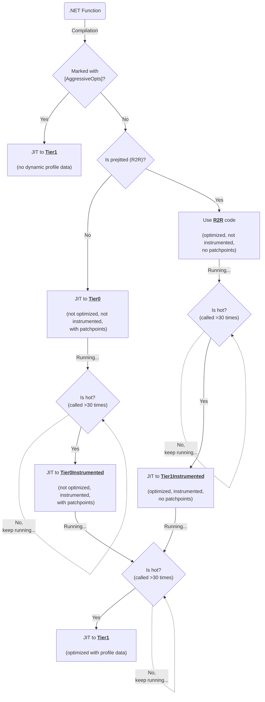
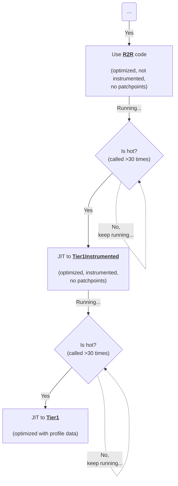
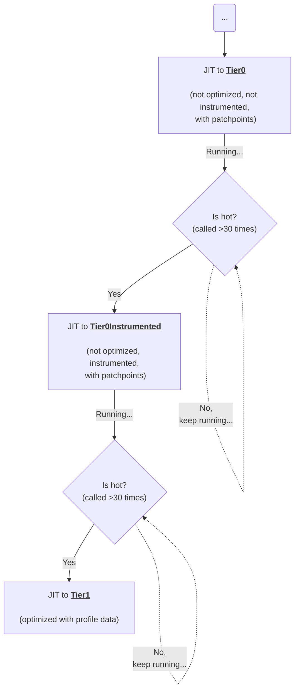
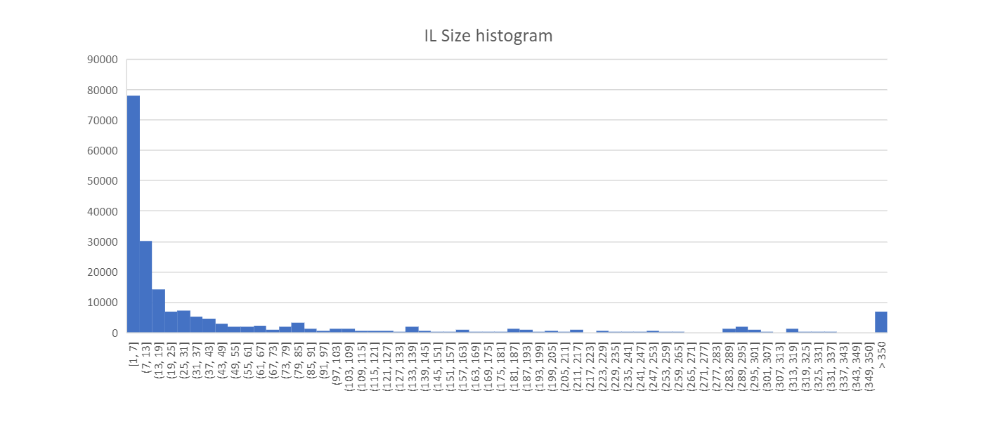
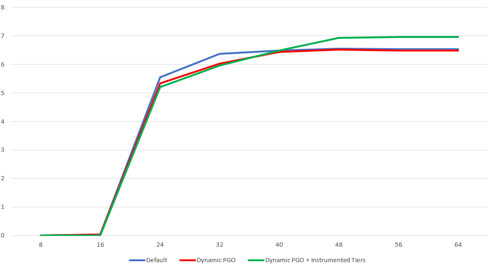

# Dynamic PGO: Instrumented Tiers

[#70941](https://github.com/dotnet/runtime/pull/70941) introduced a new tier to instrument only hot code. It's mainly done to address the following problems:
1) R2R code should still benefit from Dynamic PGO despite being not instrumented in the first place.
2) Overhead from the instrumentation in Tier0 should not slow startup down (compared to the mode where DynamicPGO is disabled) and methods which never reach the next tier should not be instrumented at all.

To address these problems the following workflow was introduced:


(_VSCode doesn't support mermaid diagrams out of the box, consider installing external add-ins_)

Now, any code is eligible for Dynamic PGO if it's hot enough. It's easier to explain this on a concrete example:

```csharp
class MyDisposableImpl : IDisposable
{
    public void Dispose() => Console.WriteLine("disposed");
}

class Program
{
    static void Main()
    {
        for (int i = 0; i < 100; i++)
        {
            CallDispose(new MyDisposableImpl());
            // Give VM some time to promote CallDispose
            Thread.Sleep(15);
        }
    }

    [MethodImpl(MethodImplOptions.NoInlining)]
    static void CallDispose(IDisposable d) => d?.Dispose(); // virtual (interface) call
}
```

The method we'll be inspecting is `CallDispose`. It has an unknown interface call + two branches (the `?` operator).

# Case 1: `CallDispose` is initially prejitted (R2R)

Let's see what happens when the method we're inspecting has an AOT version on start (e.g. our app was published with `/p:PublishReadyToRun=true`):

### 1) R2R version of `CallDispose` is picked up:

```asm
; Assembly listing for method Program:CallDispose(System.IDisposable)
; Emitting BLENDED_CODE for X64 CPU with AVX - Windows
; ReadyToRun compilation
; optimized code
; No PGO data
G_M10906_IG01:              ;; offset=0000H
       4883EC28             sub      rsp, 40
						;; size=4 bbWeight=1 PerfScore 0.25
G_M10906_IG02:              ;; offset=0004H
       4885C9               test     rcx, rcx
       740A                 je       SHORT G_M10906_IG04
						;; size=5 bbWeight=1 PerfScore 1.25
G_M10906_IG03:              ;; offset=0009H
       4C8D1D00000000       lea      r11, [(reloc 0x4000000000420240)]
       41FF13               call     [r11]System.IDisposable:Dispose():this
						;; size=10 bbWeight=0.50 PerfScore 1.75
G_M10906_IG04:              ;; offset=0013H
       90                   nop      
						;; size=1 bbWeight=1 PerfScore 0.25
G_M10906_IG05:              ;; offset=0014H
       4883C428             add      rsp, 40
       C3                   ret      
						;; size=5 bbWeight=1 PerfScore 1.25
; Total bytes of code 25
; ============================================================
```

As we can see from the codegen: it's not instrumented (we never instrument R2R'd code - that is a lot of additional size increase) and is optimized already. The interface call is not devirtualized yet as we don't have any profile for it.

### 2) `CallDispose` is promoted to Tier1Instrumented

 `CallDispose` is invoked more than 30 times so VM "promotes" it to Tier1Instrumented for instrumentation:
```asm
; Assembly listing for method Program:CallDispose(System.IDisposable)
; Emitting BLENDED_CODE for X64 CPU with AVX - Windows
; Tier-1 compilation
; optimized code
; instrumented for collecting profile data
; No PGO data
G_M10906_IG01:              ;; offset=0000H
       56                   push     rsi
       4883EC20             sub      rsp, 32
       488BF1               mov      rsi, rcx
                                                ;; size=8 bbWeight=1 PerfScore 1.50
G_M10906_IG02:              ;; offset=0008H
       4885F6               test     rsi, rsi
       7428                 je       SHORT G_M10906_IG04
                                                ;; size=5 bbWeight=1 PerfScore 1.25
G_M10906_IG03:              ;; offset=000DH
       FF057D366600         inc      dword ptr [(reloc 0x7ffbea03b250)]
       488BCE               mov      rcx, rsi
       48BA58B203EAFB7F0000 mov      rdx, 0x7FFBEA03B258
       E89B77505F           call     CORINFO_HELP_CLASSPROFILE32
       488BCE               mov      rcx, rsi
       49BB500071E9FB7F0000 mov      r11, 0x7FFBE9710050      ; code for System.IDisposable:Dispose():this
       41FF13               call     [r11]System.IDisposable:Dispose():this
                                                ;; size=40 bbWeight=0.50 PerfScore 4.00
G_M10906_IG04:              ;; offset=0035H
       FF05A5366600         inc      dword ptr [(reloc 0x7ffbea03b2a0)]
                                                ;; size=6 bbWeight=1 PerfScore 3.00
G_M10906_IG05:              ;; offset=003BH
       4883C420             add      rsp, 32
       5E                   pop      rsi
       C3                   ret
                                                ;; size=6 bbWeight=1 PerfScore 1.75
; Total bytes of code 65
; ============================================================
```

The code is optimized, it has a helper call to record types of objects passed to that virtual call (`Dispose()`).
Also, there are two edge counters (`inc [reloc]`) to get a better understanding which branch is more popular (where d is null or where it is not).
It is worth noting that we had to instrument **optimized** code here to mitigate two issues:
1) We don't want to see a significant performance degradation (even temporarily) after fast R2R.
2) Unoptimized code tends to spawn a lot of new unnecessary jit compilations because it doesn't inline code, even simple getters/setters.

As a downside, the profile is less accurate and it doesn't instrument inlinees.

### 3) `CallDispose` is promoted to Tier1

The new code version of `CallDispose` is also invoked >30 times leading to the final promotion to Tier1:
```asm
; Assembly listing for method Program:CallDispose(System.IDisposable)
; Emitting BLENDED_CODE for X64 CPU with AVX - Windows
; Tier-1 compilation
; optimized code
; optimized using profile data
; with Dynamic PGO: edge weights are valid, and fgCalledCount is 48
; 0 inlinees with PGO data; 1 single block inlinees; 0 inlinees without PGO data
G_M10906_IG01:              ;; offset=0000H
       4883EC28             sub      rsp, 40
                                                ;; size=4 bbWeight=1 PerfScore 0.25
G_M10906_IG02:              ;; offset=0004H
       4885C9               test     rcx, rcx
       741F                 je       SHORT G_M10906_IG03
       48B8688CFBE9FB7F0000 mov      rax, 0x7FFBE9FB8C68      ; MyDisposableImpl
       483901               cmp      qword ptr [rcx], rax
       7516                 jne      SHORT G_M10906_IG05
       48B908855A29EE010000 mov      rcx, 0x1EE295A8508      ; 'disposed'
       FF1538535A00         call     [System.Console:WriteLine(System.String)]
                                                ;; size=36 bbWeight=1 PerfScore 8.75
G_M10906_IG03:              ;; offset=0028H
       90                   nop
                                                ;; size=1 bbWeight=1 PerfScore 0.25
G_M10906_IG04:              ;; offset=0029H
       4883C428             add      rsp, 40
       C3                   ret
                                                ;; size=5 bbWeight=1 PerfScore 1.25
G_M10906_IG05:              ;; offset=002EH
       49BB580071E9FB7F0000 mov      r11, 0x7FFBE9710058      ; code for System.IDisposable:Dispose():this
       41FF13               call     [r11]System.IDisposable:Dispose():this
       EBEB                 jmp      SHORT G_M10906_IG03
                                                ;; size=15 bbWeight=0 PerfScore 0.00
; Total bytes of code 61
; ============================================================
```
PGO helped us to optimize two things in the final tier:
1) We know that `d` object is rarely/never null so we mark that path as cold
2) We know that `d` is mostly/always `MyDisposableImpl` so we optimized an unknown interface call to basically this:
```csharp
if (d is MyDisposableImpl)
    Console.WriteLine("disposed"); // MyDisposableImpl.Dispose inlined
else
    d.Dispose(); // fallback, interface call in case if a new type is added/loaded and used here
```
There are more things JIT can optimize with help of PGO, e.g. be more aggressive inlining methods on hot paths, etc.

Thus, R2R didn't lead to a missing oportunity to run Dynamic PGO here. To summarize what happened with `CallDispose` we can take a look at this part of the diagram:


# Case 2: `CallDispose` is not initially prejitted

### 1) `CallDispose` is compiled to Tier0

Since there is no R2R version for `CallDispose`, VM has to ask JIT to compile a Tier0 version of it as fast as it can (because it needs to execute it and there is no any code version of it available):
```asm
; Assembly listing for method Program:CallDispose(System.IDisposable)
; Emitting BLENDED_CODE for X64 CPU with AVX - Windows
; Tier-0 compilation
; MinOpts code
G_M10906_IG01:              ;; offset=0000H
       55                   push     rbp
       4883EC20             sub      rsp, 32
       488D6C2420           lea      rbp, [rsp+20H]
       48894D10             mov      gword ptr [rbp+10H], rcx
                                                ;; size=14 bbWeight=1 PerfScore 2.75
G_M10906_IG02:              ;; offset=000EH
       48837D1000           cmp      gword ptr [rbp+10H], 0
       7411                 je       SHORT G_M10906_IG03
       488B4D10             mov      rcx, gword ptr [rbp+10H]
       49BB78020E3CFC7F0000 mov      r11, 0x7FFC3C0E0278      ; code for System.IDisposable:Dispose():this
       41FF13               call     [r11]System.IDisposable:Dispose():this
                                                ;; size=24 bbWeight=1 PerfScore 7.25
G_M10906_IG03:              ;; offset=0026H
       90                   nop
                                                ;; size=1 bbWeight=1 PerfScore 0.25
G_M10906_IG04:              ;; offset=0027H
       4883C420             add      rsp, 32
       5D                   pop      rbp
       C3                   ret
                                                ;; size=6 bbWeight=1 PerfScore 1.75
; Total bytes of code 45
; ============================================================
```

The codegen is not optimized and doesn't have any instrumentation (to avoid spending time on it for methods which will never make it to Tier1 - as the practice shows: only 10-20% of methods make it to Tier1)

### 2) `CallDispose` is promoted to Tier0Instrumented

`CallDispose` is invoked more than 30 times and that triggers promotion to Tier0Instrumented (when VM is busy serving other Tier0 requests):
```asm
; Assembly listing for method Program:CallDispose(System.IDisposable)
; Emitting BLENDED_CODE for X64 CPU with AVX - Windows
; Tier-0 compilation
; MinOpts code
; instrumented for collecting profile data
G_M10906_IG01:              ;; offset=0000H
       55                   push     rbp
       4883EC30             sub      rsp, 48
       488D6C2430           lea      rbp, [rsp+30H]
       33C0                 xor      eax, eax
       488945F8             mov      qword ptr [rbp-08H], rax
       488945F0             mov      qword ptr [rbp-10H], rax
       48894D10             mov      gword ptr [rbp+10H], rcx
                                                ;; size=24 bbWeight=1 PerfScore 5.00
G_M10906_IG02:              ;; offset=0018H
       48837D1000           cmp      gword ptr [rbp+10H], 0
       743A                 je       SHORT G_M10906_IG03
       FF05832A7500         inc      dword ptr [(reloc 0x7ffc3cbac2f8)]
       488B4D10             mov      rcx, gword ptr [rbp+10H]
       48894DF8             mov      gword ptr [rbp-08H], rcx
       488B4DF8             mov      rcx, gword ptr [rbp-08H]
       48BA00C3BA3CFC7F0000 mov      rdx, 0x7FFC3CBAC300
       E8F05A455F           call     CORINFO_HELP_CLASSPROFILE32
       488B4DF8             mov      rcx, gword ptr [rbp-08H]
       48894DF0             mov      gword ptr [rbp-10H], rcx
       488B4DF0             mov      rcx, gword ptr [rbp-10H]
       49BB90020E3CFC7F0000 mov      r11, 0x7FFC3C0E0290      ; code for System.IDisposable:Dispose():this
      disposed
 41FF13               call     [r11]System.IDisposable:Dispose():this
                                                ;; size=65 bbWeight=1 PerfScore 16.50
G_M10906_IG03:              ;; offset=0059H
       FF05992A7500         inc      dword ptr [(reloc 0x7ffc3cbac348)]
                                                ;; size=6 bbWeight=1 PerfScore 3.00
G_M10906_IG04:              ;; offset=005FH
       4883C430             add      rsp, 48
       5D                   pop      rbp
       C3                   ret
                                                ;; size=6 bbWeight=1 PerfScore 1.75
; Total bytes of code 101
; ============================================================
```
Now the whole method is compiled to Tier0 with instrumentation. No optimizations.
We decided to promote hot Tier0 to Tier0Instrumented without optimizations for the following reasons:
* We won't notice a big performance regression from transitioning from Tier0 to Tier0Instrumented
* Tier0Instrumented is faster to compile
* Its profile is more accurate - better performance for Tier1

### 3) ``CallDispose` is promoted to Tier1

``CallDispose` method is invoked more than 30 times again and this time it triggers the final promotion to the last tier - Tier1:
```asm
; Assembly listing for method Program:CallDispose(System.IDisposable)
; Emitting BLENDED_CODE for X64 CPU with AVX - Windows
; Tier-1 compilation
; optimized code
; optimized using profile data
; with Dynamic PGO: edge weights are valid, and fgCalledCount is 47
; 0 inlinees with PGO data; 1 single block inlinees; 0 inlinees without PGO data
G_M10906_IG01:              ;; offset=0000H
       4883EC28             sub      rsp, 40
                                                ;; size=4 bbWeight=1 PerfScore 0.25
G_M10906_IG02:              ;; offset=0004H
       4885C9               test     rcx, rcx
       741F                 je       SHORT G_M10906_IG04
                                                ;; size=5 bbWeight=1 PerfScore 1.25
G_M10906_IG03:              ;; offset=0009H
       48B8E89FB33CFC7F0000 mov      rax, 0x7FFC3CB39FE8      ; MyDisposableImpl
       483901               cmp      qword ptr [rcx], rax
       7516                 jne      SHORT G_M10906_IG06
       48B9507B2D45C0020000 mov      rcx, 0x2C0452D7B50      ; 'disposed'
       FF1560346900         call     [System.Console:WriteLine(System.String)]
                                                ;; size=31 bbWeight=1.02 PerfScore 7.66
G_M10906_IG04:              ;; offset=0028H
       90                   nop
                                                ;; size=1 bbWeight=1.02 PerfScore 0.26disposed
G_M10906_IG05:              ;; offset=0029H
       4883C428             add      rsp, 40
       C3                   ret
                                                ;; size=5 bbWeight=1.02 PerfScore 1.28
G_M10906_IG06:              ;; offset=002EH
       49BB98020E3CFC7F0000 mov      r11, 0x7FFC3C0E0298      ; code for System.IDisposable:Dispose():this
       41FF13               call     [r11]System.IDisposable:Dispose():this
       EBEB                 jmp      SHORT G_M10906_IG04
                                                ;; size=15 bbWeight=0 PerfScore 0.00
; Total bytes of code 61
; ============================================================
```
Just like in case of initially prejitte app, PGO helped us to optimize two things in the final tier:
1) We know that `d` object is rarely/never null so we mark that path as cold
2) We know that `d` is mostly/always `MyDisposableImpl` so we optimized an unknown interface call to basically this:
```csharp
if (d is MyDisposableImpl)
    Console.WriteLine("disposed"); // MyDisposableImpl.Dispose inlined
else
    d.Dispose(); // fallback, interface call in case if a new type is added/loaded and used here
```

Again, to summarize the workflow for non-prejitted case let's take a look at this branch of the diagram:



# Working Set Impact

The general rule of thumb that only 10-20% of methods make it to Tier1 and about to 40-60% of all methods are less than 8 bytes of IL (e.g., getters/setters) so we're effectively double the size of Tier1 with this approach (including call counting stubs, etc.). How bad it can be compared to overall working set in various apps? let's consider these two examples:

## 1) A large web app (internal Microsoft service)

| Metric           | Number of methods | Share, % | Total size, MB | Share, % |
|------------------|-------------------|----------|----------------|----------|
| **Tier0**        |            115862 |   59.36% |          60.06 |   83.89% |
| **Tier1**        |             30942 |   15.85% |           8.22 |   11.48% |
| **FullOpts**     |             48384 |   24.79% |           3.26 |    4.55% |
| **Contains OSR** |                55 |    0.03% |           0.06 |    0.08% |
| **Total jitted** |            195188 |  100.00% |          71.60 |  100.00% |




In this app Tier1 code occupies 8.22MB in the loader heap (we can add a few megabytes on top of it for call counting stubs, jump-stubs, etc.) meaning that Instrumented tier is expected to add a similar amount (~13MB). The total working set of the service is 10GB so Instrumented tiers contribute ~0.1% of that. We're adding +30k new jit compilations which we can fully compensate with https://github.com/dotnet/runtime/issues/76402 work to avoid potential problems connected with too big queues of methods pending call counting installation/promotions to tier1.

## 2) A desktop OSS application [AvaloniaILSpy](https://github.com/icsharpcode/AvaloniaILSpy)

`ReadyToRun=0`:

| Metric           | Number of methods |        % | Total size, MB |        % |
|------------------|-------------------|----------|----------------|----------|
| **Tier0**        |             19968 |   79.09% |           4.58 |   84.69% |
| **Tier1**        |              4978 |   19.72% |           **0.75** |   13.90% |
| **FullOpts**     |               300 |    1.19% |           0.08 |    1.39% |
| **OSR**          |                 2 |    0.01% |           0.00 |    0.02% |
|                  |                   |          |                |          |
|        **Total** |             25248 |  100.00% |           5.41 |  100.00% |

`ReadyToRun=1`:

| Metric           | Number of methods |        % | Total size, MB |        % |
|------------------|-------------------|----------|----------------|----------|
| **Tier0**        |              4713 |   62.45% |           0.84 |   58.34% |
| **Tier1**        |              2516 |   33.34% |           0.56 |   38.75% |
| **FullOpts**     |               318 |    4.21% |           0.04 |    2.92% |
| **OSR**          |                 0 |    0.00% |           0.00 |    0.00% |
|                  |                   |          |                |          |
|        **Total** |              7547 |  100.00% |           1.44 |  100.00% |

In case of AvaloniaILSpy, instrumented tiers add around 1MB (stubs included) to the total working set and around 5k of new jit compilations.

# Start time and performance impact

## TechEmpower

Overall, it is expected from instrumented tiers to improve startup speed when Dynamic PGO is enabled and improve performance (e.g. Latency/Throughput) for prejitted code. A good example demonstrating both is the following TechEmpower benchmark (plaintext-plaintext):


Legend:
* Red    - `DOTNET_TieredPGO=0`, `DOTNET_ReadyToRun=1`
* Black  - `DOTNET_TieredPGO=1`, `DOTNET_ReadyToRun=1`
* Yellow - `DOTNET_TieredPGO=1`, `DOTNET_ReadyToRun=0`

Yellow line provides the highest level of performance (RPS) by sacrificing start up speed (and, hence, time it takes to process the first request). It happens because the benchmark is quite simple and most of its code is already prejitted so we can only instrument it when we completely drop R2R and compile everything from scratch. It also explains why the black line (when we enable Dynamic PGO but still rely on R2R) didn't really show a lot of improvements. With the separate Instrumented tiers for hot R2R we achieve "Yellow"-level of performance while maintaining the same start up speed as it was before. Also, for the mode where we have to compile a lot of code to Tier0, switching to "instrument only hot Tier0 code" strategy shows ~8% time-to-first-request reduction across all TE benchmarks.


(_Predicted results according to local runs_. **UPD**: we observed the same on real benchmarks - [aka.ms/aspnet/benchmarks](aka.ms/aspnet/benchmarks))

## AvaloniaILSpy

For this experiment we modified the source code of the app to send an event once view is completely loaded to measure the real start time:

| Mode                       | Start time |
|----------------------------|------------|
| R2R=0                      |      2.03s |
| R2R=0, PGO=1               |      2.26s |
| R2R=0, PGO=1, Instr. Tiers |      2.03s |

As we can see, Instrumented tiers help to mitigate the start time regression from Dynamic PGO.

## Microsoft internal service

Throughput of the service after startup:



X axis - time in seconds after start, Y axis - Throughput in MB/s.

Here Dynamic PGO without instrumented tiers (red line) is not able to show benefits because the service is prejitted thus prejitted code doesn't benefit from Dynamic PGO. Instrumented tiers help with that by instrumenting hot R2R code to achieve the best performance, hence, the throughput is higher (green line).

## Known limitations
* Methods with loop bypass non-instrumented Tier0 and are promoted to Instrumented Tier if they're eligible for OSR - we want to avoid cases where a cold method with a hot loop won't benefit from PGO because it itself won't be ever promoted, only the loop body part (via OSR). See https://github.com/dotnet/runtime/pull/81051 for more details.
* Instrumentation after R2R is less efficient compared to Tier0 IL-only because of optimizations and e.g. inlinees aren't instrumented.
