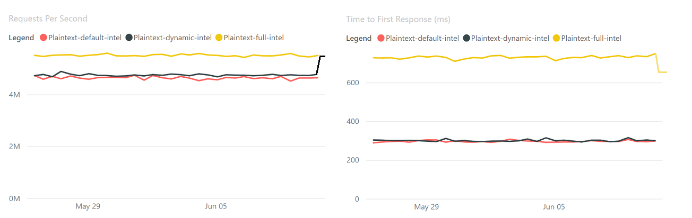
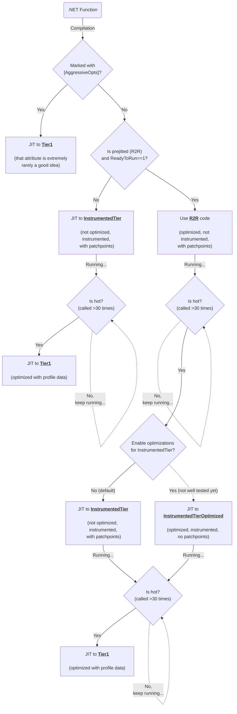

# Instrumented Tiers

_Disclaimer: the functionality described in this doc is still in the preview stage and is not enabled by default even for `DOTNET_TieredPGO=1`._

[#70941](https://github.com/dotnet/runtime/pull/70941) introduced new opt-in strategies for Tiered Compilation + TieredPGO mainly to address
two existing limitations of the current design:
1) R2R code never benefits from Dynamic PGO as it's not instrumented and is promoted straight to Tier1 when it's hot
2) Instrumentation in Tier0 comes with a big overhead and it's better to only instrument hot Tier0 code (whether it's ILOnly or R2R)

As of today, [#70941](https://github.com/dotnet/runtime/pull/70941) only provides a solution for the 1st problem by introducing a new tier for hot R2R code in order to instrument it first, collect profile and only then compile to the final tier. Thus, we don't sacrifice start up speed and still benefit from Dynamic PGO.
A good example explaining the problem is this TechEmpower benchmark:

Legend:
* Red    - `DOTNET_TieredPGO=0`, `DOTNET_ReadyToRun=1` (default)
* Black  - `DOTNET_TieredPGO=1`, `DOTNET_ReadyToRun=1`
* Yellow - `DOTNET_TieredPGO=1`, `DOTNET_ReadyToRun=0`

Yellow line provides the highest level performance (RPS) by sacrificing start up speed (and, hence, time to process the first request). It happens because the benchmark is quite simple and most of its code is already prejitted so we can only instrument it when we completely drop R2R. It also explains why the black line (when we enabled Dynamic PGO but still rely on R2R) didn't really show a lot of improvements. With the separate instrumentation tier for hot R2R we achieve "Yellow"-level of performance while maintaining the same fast start up speed as was before:

(_predicted results according to local runs of crank with custom binaries_)

# Tiered compilation workflow in TieredPGO mode

The following diagram explains how the instrumentation for hot R2R code works under the hood when TieredPGO is enabled (it's disabled by default):

(_VSCode doesn't support mermaid diagrams, consider installing external add-ins_)

As we can see from the diagram, it's also possible to choose whether to use optimizations in the instrumentation tier or not - it's controlled via `DOTNET_TieredPGO_Strategy` knob.

## Pros & cons of using optimizations inside the instrumented tiers

Pros:
* Lower overhead from instrumentation (and thanks to optimizations we _can_ optimize probes and emit less of those)
* Optimized code is able to inline methods so we won't be producing new Compilation units for even small methods

Cons:
* Currently, we won't instrument inlinees -> we'll probably miss a lot of opportunities and produce less accurate profile leading to a less optimized final tier