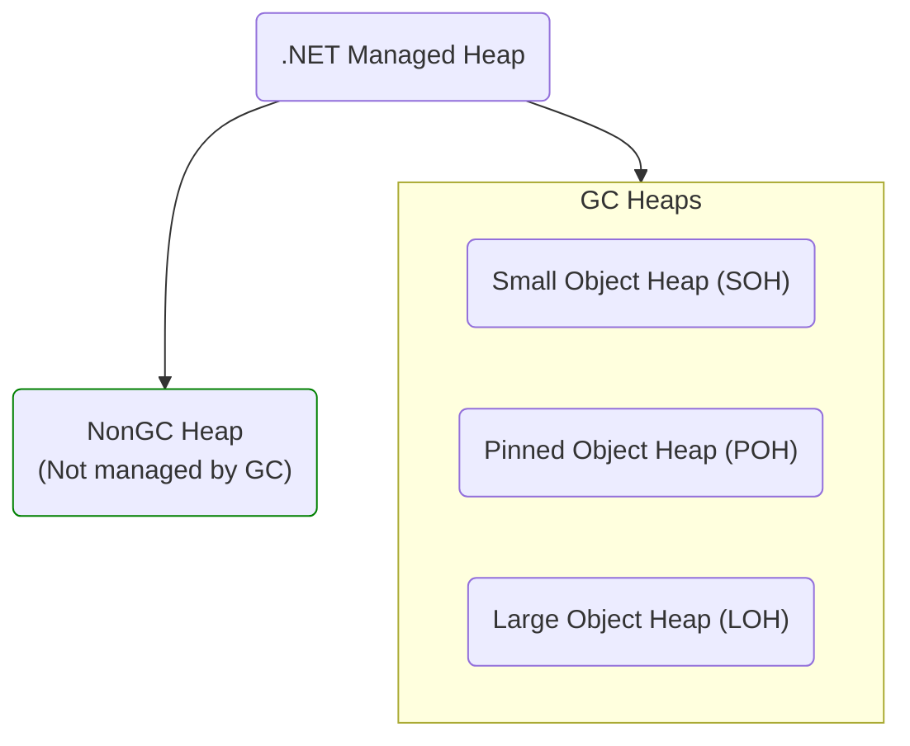

# NonGC Heap

.NET 8.0 introduced a new concept called **NonGC Heap** - a specialized heap that is not managed by the Garbage Collector (GC) and is designed to store immortal objects with certain benefits for GC and code generation (codegen). Although the name is new, the feature is based on pre-existing **Frozen Segments** which were added long time ago to serve a similar purpose and were used on CoreRT/NativeAOT. What's changed in .NET 8.0 is that this functionality has been exposed to users through public profiling and debugging APIs, and it is now heavily leveraged for several codegen optimizations in RyuJIT. A general overview of the .NET managed heap can be visualized as shown in the following mermaid diagram:



The basic idea that certain kinds of objects are essentially immortal and will never be collected, hence, we can put them into a separate storage where they are never scanned or compacted. This has significant implications for RyuJIT, as it can directly embed GC references (or even byrefs) in codegen. For example, in order to access a string object that represents a string literal `"Hello"` (all string literals are interned and therefore immortal) an indirect load is required to access that string. In pre-.NET 8.0 runtimes, the following C# code:
```cs
string Test() => "Hello";
```
produces the following codegen:
```asm
; Method Program:Test():System.String:this
       mov      rax, 0xAABBCCDDEEFF
       mov      rax, gword ptr [rax]
       ret
```
Here, VM must create a small pinned handle that keeps a reference to the source string object that is kept in a normal heap. The address of that pinned handle (`0xAABBCCDDEEFF` in the example above) is then passed to RyuJIT, enabling it to access the original object via an indirect load and to keep the codegen GC-friendly in case if the source string object is moved to a different location during a sudden heap compaction. The pinned handle must be rooted to ensure it remains alive. By pinning the object itself instead, JIT can "bake" the direct reference, resulting in a more efficient codegen:
```asm
; Method Program:Test():System.String:this
       mov      rax, 0x112233445566
       ret
```

## Can we just pin them directly?

[PinnedHeap](PinnedHeap.md) doc explains all the pitfalls of having long-living pinned objects in normal heaps. In contrast, the Pinned Object Heap (POH) itself may initially seem like a perfect target, but it comes with its own set of pitfalls too. The POH has a public API, allowing users to use it for both long- and short-living objects. This flexibility can create complications when these objects are mixed with immortal ones. Consider the following arrangement:
```
..[user's buffer1][user's buffer2][string object created by JIT][user's buffer3][RuntimeType object created by JIT]...
```
Since it's not guaranteed that all immortal objects will be allocated simultaneously, this arrangement leads to fragmentation in case if e.g. `buffer3` is no longer needed. Moreover, placing the objects in the POH wouldn't allow us to omit write-barriers, and these objects would still need to be scanned, reducing the efficiency gains the NonGC Heap is designed to provide.

## Benefits of the NonGC heap

As it was already noted, the two most obvious benefits of such a separate heap are:
* **No Mark-n-Sweep participation**: Since the objects in the NonGC Heap are always alive and the heap itself is not managed by the GC, there's no need for the heap to be involved in the mark-and-sweep procedure. This also eliminates the need to root objects to a specific AppDomain or Assembly Load Context (ALC) to maintain their persistence.
* **Address embedding in RyuJIT**: The JIT compiler can "bake" direct addresses into the code generation, removing the need for redundant indirect loads. This enhances the efficiency of code execution.

There are also a couple of unobvious benefits:
* **No Write-Barriers:** Since the NonGC heap is not managed by the GC we no longer need to emit the write-barriers for objects in it, e.g.:
```cs
string _field;

void SetField() => _field = "Hi!";
```
produces the following codegen on pre-.NET 8.0 runtimes:
```asm
; Method Program:SetStringField():this
       mov      rdx, 0x229C1004FE8        ; pinned handle reference
       mov      rdx, gword ptr [rdx]      ; load string object reference
       lea      rcx, bword ptr [rcx+08H]
       call     CORINFO_HELP_ASSIGN_REF   ; write-barrier
       nop      
       ret      
; Total bytes of code: 24
```
while with .NET 8.0 it now looks like this:
```asm
; Method Program:SetField():this
       mov      rax, 0x1F880209550        ; 'Hi!' direct object reference
       mov      gword ptr [rcx+0x08], rax
       ret      
; Total bytes of code: 15
```
Although, we may need to emit memory barriers on platforms with a weak memory model for **mutable** objects.

* **Special optimizations in RyuJIT for NonGC objects:** The JIT compiler can further optimize access to parts of NonGC objects such as fields, the full list can be found in the related issue [#76151](https://github.com/dotnet/runtime/issues/76151).

## Limitations: which objects cannot be allocated on NonGC heaps
The NonGC Heap, while powerful and beneficial, comes with certain inherent limitations, both obvious and specific to the current design used by CoreCLR and NativeAOT:
* **Non-immortal objects:** Only immortal objects should be allocated on NonGC heap to avoid "dead weight" in that heap.
* **Objects from unloadable contexts:** NonGC heap should never be used for objects belonging to unloadable contexts. Doing so could lead to potential memory leaks. As a consequence, all string literals associated with **unloadable** Assembly Load Contexts (ALCs) won't be placed in the NonGC Heap.
* **No References to GC Heap's objects:** NonGC heap **must** never contain references to GC heaps' objects. However, it may contain references to other NonGC objects and GC heaps are allowed to reference NonGC objects.
* The current design of CoreCLR's `FrozenObjectHeapManager` has certain design limitations such as:
  * Large objects are not supported.
  * Objects requiring unusual data alignment are not supported.

Because of these restrictions, users **must never** assume that certain kinds of objects can be accessed without pinning.

## What typically can be found in the NonGC heap?
The NonGC Heap is suitable for a specific set of objects that adhere to the previously described rules. Here's a list showcasing the types of objects that are commonly found in the NonGC Heap for CoreCLR and NativeAOT runtimes:
* String literal objects
* RuntimeType objects (CoreCLR-only as of the time of writing), which means for:
```cs
Type Test() => typeof(int);
```
we used to emit:
```asm
; Method Test():System.Type:this
       sub      rsp, 40
       mov      rcx, 0x7FFC892DE5D8
       call     CORINFO_HELP_TYPEHANDLE_TO_RUNTIMETYPE
       nop      
       add      rsp, 40
       ret      
; Total bytes of code: 25

```
but with the help of NonGC heap, it's now:
```asm
; Method Test():System.Type:this
       mov      rax, 0x2C1802055E8 ; 'System.Int32' RuntimeType object
       ret      
; Total bytes of code: 11
```
* Boxed statics:  All static fields of non-primitive value types wrap values in objects to store them on the heap. With NonGC Heap, we can avoid indirect access and reach the field's value directly, further enhancing the efficiency of these operations.
* Certain kinds of `static readonly` fields which can be pre-initialized on NativeAOT or recognized by CoreCLR e.g., `Array<>.Empty`.

## Diagnostics and visible changes in .NET 8.0
The most visible change that now `GC.GetGeneration(object)` API returns `int.MaxValue` for such objects. This change serves to emphasize that these objects are not managed by the garbage collector. Similarly, corresponding `ICorProfiler` APIs may return the same value as a generation. A full inventory of new APIs and alterations related to diagnostic support for the NonGC Heap can be found in the ["Diagnostic support for NonGC heap"](https://github.com/dotnet/runtime/issues/75836) issue. An important detail to keep in mind is that these objects should never be considered as "dead" if no one references them since it's possible that they're actually kept alive by unmanaged data structures in VM itself.
