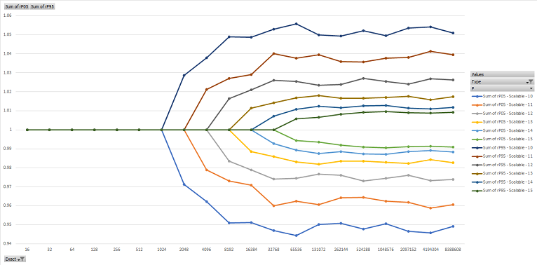

# Scalable Approximate Counting

With particular relevance to Dynamic PGO

Andy Ayers
February 2023

## Introduction

Dynamic PGO works by instrumenting early versions of methods (aka Tier0 codegen) to produce a profile data set that the JIT can use to optimize subsequent versions of those methods (aka Tier1 codegen).

In this note we focus on just one aspect of this instrumentation: *counter based* instrumentation. With PGO enabled, the JIT adds code to each Tier0 method to count how often the parts of the methods execute so that later on in Tier1 it can focus optimization efforts on the parts of the method that seem to be most important for performance. More details on Dynamic PGO can be found [here](https://github.com/dotnet/runtime/blob/main/docs/design/features/DynamicPgo.md).

From the outset, Dynamic PGO has used fairly simplistic methods of counting&mdash;for each distinct counter, the code the JIT adds will simply increment a shared memory location. Let's call that aspect of counting the counter *implementation* and this particular way of counting *racing*.

(A related aspect of counting, not covered here, is that the JIT tries to be efficient with counter *placement*, relying on an approach first pioneered by [Ball](https://dl.acm.org/doi/10.1145/143165.143180) to try and reduce the total number of counters needed to a minimum, and to place them in the less often executed parts of the method.)

Recently we made two surprising observations about the *racing* implementation:
* We started measuring the runtime cost of counting in heavily multithreaded applications by forcing them to run only the Tier0 instrumented code. We saw that compared to uninstrumented Tier0 code, instrumented code was slower by a factor of 2 or 3. Some further experimentation revealed that cache contention (both true and false sharing) was a major contributor to the high instrumentation overhead.
* We started looking at how accurate the counts were in the Tier1 compilation and discovered widespread inaccuracies. The major contributor here was lost counter updates because of the unsynchronized access across many threads of execution (hence the name *racing*).

This was doubly bad news: not only were we paying a lot at runtime for our *racing* counter implementation, but it was also doing a pretty bad job of counting.

It seemed like we should be able to do better, and indeed we can. The rest of this note explores this problem space in more detail.

## Precision

The obvious fix for the lost counter updates is to stop racing and start synchronizing the updates. Our various platforms provide nice atomic counter updates in the form of `InterlockedIncrement` and similar, and the JIT can emit the proper machine code forms (say `lock inc[mem]`) that lay at the heart of these in place of the unsynchronized (`inc [mem]`) *racing* variant.

So let's call this new version the *interlocked* implementation scheme for a counter. It is simple to update the JIT to emit this variant and make various measurements. *Interlocked* largely fixes the accuracy problem we'd been seeing with *racing* counters, but creates even more runtime overhead. So while *interlocked* might serve as a component of a solution, it was not on its own a solution.

## Scalability

The counts gathered by Dynamic PGO have very wide dynamic range, and even when we are checking accuracy we are usually interested in relatively self consistent counts. For example, if we have a simple `if / then /else ` construct we would expect the count for the `if` block to equal sum of the counts for the `then` and `else` portions, and given a flow graph one can formulate this sort of conservation law more broadly (a good analogy here are Kirchhoff's laws for current flowing through a circuit). But there are some variances that we must tolerate: the method could throw an exception or the thread could be asynchronously stopped. So we typically are happy if the profile flows are accurate at each conservation point to say 1%, and a diminishing return on having results more accurate than this.

Given that we already need to tolerate some inaccuracy, the idea came about to see if we could leverage that to produce an intentionally approximate counting scheme that was nearly as accurate as *interlocked* but with less overhead.

A bit of research turned up an interesting paper by Dice, Lev, and Moir: [Scalable Statistics Counters](https://dl.acm.org/doi/10.1145/2486159.2486182) which was concerned with a similar problem. Here the key insight is that we can leverage randomization to count probabilistically: once the counter value is sufficiently large, instead of always trying to update its value by 1 for each increment, we update it by $N$ with probability $1/N$. So as the counter value grows we update it less and less often, thus reducing the amount of contention counter updates cause, and the counter's expected value is the correct count, with some controllable likelihood of the count being too large or to small. Because the total number of updates is limited, we can use *interlocked* operations for the updates without unduly harming scalability.

The approach in the paper relies either on using standard floating-point representations for counts or a "software float" representation where part of the counter storage is an exponent and the remainder a mantissa. Those representations were not well suited for our work, so we set about to find a similar scheme that would work for regular integer data types.

The key benefit of the exponent/mantissa form is that it makes it relatively simple to estimate the magnitude of the counter&mdash;the exponent is the integer part of the $\log_2$ of the counter value, and in particular, to compute an approximately correct quantity $1/N$ quickly without needing to divide if we restrict $N$ to a power of 2. For normal integer data we can compute the same thing by simply finding the highest set bit of the data, and can check the probability by computing the remainder left by dividing some random value by simple masks and compares.

## The Scalable Counter

Here is a C# implementation of our counter:
```C#
    static void ScalableProfileCount(ref uint counter)
    {
        uint count = counter;
        uint delta = 1;

        if (count > 0)
        {
            int logCount = 31 - (int) uint.LeadingZeroCount(count);

            if (logCount >= 13)
            {
                delta = 1u << (logCount - 12);
                uint rand = random();
                bool update = (rand & (delta - 1)) == 0;
                if (!update)
                {
                    return;
                }
            }
        }

        Interlocked.Add(ref counter, delta);
    }
```
Here `random` is a fast source of `uint` sized random numbers, ideally obtainable without synchronization (so say from a `thread_local` producer).

When the count value is small (less than $2^{13} = 8192$) the counter counts exactly by $1$. Once the value exceeds $8192$ the counter counts randomly, first by $2$, then $4$, then $8$, ... The only parameter value here is $13$, which controls the relative accuracy: a higher number would give more accurate (but less scalable) counts; a smaller number more scalable (but less accurate) counts.

Let's call this implementation *scalable*.

A value of $13$ with the simple and fast `xorshift` RNG we've historically used for PGO empirically gives the *scalable* count an overall $2\sigma$ accuracy of around 2%, with worst case deviation around 3% (see below on how we measured this). A better quality RNG might improve accuracy but would create more overhead.

## Results From Simulation

We first worked up a C# simulation to compare the three approaches introduced above: *racing*, *interlocked*, and *scalable*. We've already mentioned some of these results in text above.

### Accuracy

As noted, *interlocked* is perfectly accurate. If we compare *racing* and *scalable* to interlocked we see results similar to the following:


Here the X axis is the intended final value of the count, where counting is done by #processors (here 12) threads each doing nothing more than incrementing the counter, and the Y axis shows the mean counter value along with max and min values, scaled by the total expected count.

As expected, *Interlocked* is just a horizontal line at Y=1.0.

*Racing* is losing counts even with a small final count of 12, and the loss percentage gets worse and worse the higher we try to count, ending up with at best 20% of the final count value.

*Scalable* is perfectly accurate up to 8192, then starts to deviate somewhat, but the total relative deviation remains constrained.

If we remove *Racing* from the picture and zoom in, we see that the error is indeed 2% for the 5/95 spread, and 3% for worst case, and that on average the count is very accurate.


We can also adjust the accuracy by changing when we switch to probabilistic counting; the higher the switchover point, the more accurate the results are overall. In the below we vary the switchover point from $2^{10}$ to $2^{15}$ and plot the 5th and 95th percentiles relative to the accurate count:



### Scalability

Benchmarking the same set of computations with, we end up with the following (here the switchover is at 8192):


So *scalable* and *racing* have similar costs, while *interlocked* becomes quite a bit more costly at high counts.

### Notes

* Quite likely the benchmark has too much fixed overhead and could be improved, and if so we might see distinctions even for lower total counts.
* It was critical for *scalable* to use per-thread RNGs and to seed them each differently.

Mathematically we can model the *scalable* update distribution as a binomial distribution. If we make $N$ counter updates with probability $P$, the expected number of updates is $NP$ and the standard deviation in the number of updates is $\sqrt{NP(1-P)}$.

So if we start probabilistically incrementing by $2$ with probability $1/2$ at $8192$, then after $8192$ probabilistic updates we have added an expected value of $8192 \cdot 2 \cdot 1/2 = 8192$ to the counter.

The variance in the actual number of updates is $\sqrt{2^{13} \cdot 1/2 \cdot (1-1/2)} = \sqrt{2^{11}} \approx 45$. Each update is by 2, so the two standard deviation expected range for the change in the counter value is $2 \cdot 2 \cdot 45 \approx 180$. The relative error range is thus $\pm 180 / 8192 \approx \pm 0.022$. This is in reasonable agreement with the empirical study above.

As we count higher the standard deviation is limited by $\sigma \approx \sqrt{NP}$, so when we double $N$ and halve $P$ the variance $\sigma$ remains roughly the same overall.

If (via the benchmark) we look at how tunable the scalability is, we see that the higher the threshold for switching to probabilistic counting, the higher the cost (but of course the better the accuracy):


## Results From Dynamic PGO

We next implemented this same technique within the runtime and JIT, encoding the logic above as a new helper call.

Trying this out on some Tech Empower benchmarks where we force the benchmark to execute Tier0 instrumented code, we see significant improvements in server metrics (here on mvc/plaintext, windows, citrine, switchover at 8192):

| Metric (Tier0 instr)   | Racing           | Scalable |         |
| ---------------------- | ---------------- | -------------------- | ------- |
| First Request (ms)     |              155 |                  155 |  +0.22% |
| Requests/sec           |          223,665 |              352,592 | +57.64% |
| Requests               |        3,372,373 |            5,308,812 | +57.42% |
| Mean latency (ms)      |            10.60 |                 7.83 | -26.08% |
| Max latency (ms)       |           237.25 |               279.12 | +17.65% |
| Read throughput (MB/s) |            34.77 |                54.81 | +57.64% |
| Latency 50th (ms)      |            10.03 |                 6.68 | -33.42% |
| Latency 75th (ms)      |            14.69 |                 9.70 | -33.98% |
| Latency 90th (ms)      |            17.65 |                11.76 | -33.38% |
| Latency 99th (ms)      |            29.59 |                 0.00 |         |

And in normal processing, the extra accuracy from *Scalable* seems to provide some small benefits to the Tier1 code as well:

| Metric (Tiered PGO)    | Racing      | Scalable        |         |
| ---------------------- | ----------- | --------------- | ------- |
| First Request (ms)     |          90 |              89 |  -1.12% |
| Requests/sec           |   3,083,453 |       3,187,157 |  +3.36% |
| Requests               |  46,558,728 |      48,125,121 |  +3.36% |
| Mean latency (ms)      |        0.97 |            0.92 |  -4.61% |
| Max latency (ms)       |       98.20 |          109.77 | +11.77% |
| Read throughput (MB/s) |      479.32 |          495.44 |  +3.36% |
| Latency 50th (ms)      |        0.76 |            0.74 |  -2.76% |
| Latency 75th (ms)      |        1.08 |            1.05 |  -2.77% |
| Latency 90th (ms)      |        1.30 |            1.28 |  -2.05% |
| Latency 99th (ms)      |        0.00 |            0.00 |         |

We haven't yet explored the impact across a wider set of benchmarks or tried varying the switch-over point.

## Summary

We have presented a technique to implement approximately correct counters with relatively low overhead and good scaling properties. The counter accuracy can be tuned by trading off some of the scalability benefit. The counting process uses minimal runtime state: one RNG per physical thread, plus one storage location per counter. The value of the counter is readily available without any post-processing.

This sort of counter seems well-suited for use in our Dynamic PGO instrumentation.

It may be that approximate counting will be useful in other application areas where scalability is a concern and exact counts aren't needed.

## End Notes

The Dice *et al.* paper suggests that at high count values one might retain more accuracy by capping the granularity of updates. That is, once the likelihood of an update reaches say $1/1024$ there is not much scalability benefit to be had with further decreases, as the contention for the counter should be minimal. We have not tried this.

It might also be possible to continue with increment by one counting so long as there is no contention for the counter, so that a single-threaded application gets more precision. One could for example replace the `Interlocked.Add` with a compare exchange, and only switch over to probabilistic counting when the exchange fails.

Another approach not considered here is to shard the entire counter array into per-thread counters. Aside from a potentially large size increase, a sharded counter requires more work to query the counter's current value, as one must sum across the shards.

Our *scalable* scheme still suffers from false sharing; this seems more difficult to fix.

The paper by Dice *et al.* refers to a seminal paper by Morris, [Counting large numbers of events in small registers](https://dl.acm.org/doi/10.1145/359619.359627) where similar techniques are used to reduce the size of each counter. This might prove interesting in other contexts, for example compressing the size of some of our other DynamicPGO data, like the dynamic class profile histograms.