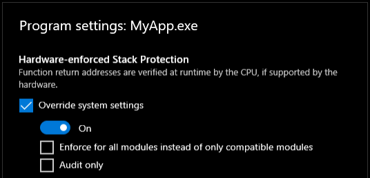

# .NET 7 support for Intel CET shadow stacks (requires Windows)

Intel's [Control-flow Enforcement Technology (CET)](https://newsroom.intel.com/editorials/intel-cet-answers-call-protect-common-malware-threats/) is a security feature available in some newer Intel and AMD processors. It adds capabilities to the hardware that protect against some common types of attacks involving control-flow hijacking. With CET shadow stacks, the processor and operating system can track the control flow of calls and returns in a thread in the shadow stack in addition to the data stack, and detect unintended changes to the control flow. The shadow stack is protected from application code memory accesses and helps to defend against attacks involving return-oriented programming (ROP). Windows offers [Hardware-enforced Stack Protection](https://techcommunity.microsoft.com/t5/windows-kernel-internals/understanding-hardware-enforced-stack-protection/ba-p/1247815) for CET shadow stack compatibility and is available as an early preview in [Windows Insider preview builds (Beta channel)](https://insider.windows.com/en-us/understand-flighting).

## Opting into CET shadow stack compatibility

CET compatibility is enabled in .NET 7. In order to receive the security benefits of CET shadow stacks in .NET applications, ensure the following to opt into the feature for an executable:
- Verify that your processor supports Intel CET. There are Intel and AMD processors currently available with the feature.
- Ensure that the application is running on a recent build of Windows 11 or Windows Server (Version 22H2) that has Hardware-enforced Stack Protection. The latest versions from [Windows Insider preview builds (Beta channel)](https://insider.windows.com/en-us/understand-flighting) have the feature.
- Install [.NET 7](https://dotnet.microsoft.com/download/dotnet) RC1 or a more recent release
- Build or publish your application targeting framework `net7.0` and runtime `win-x64`
- Open the Windows Security app
  - Inside the "App & browser control" pane, select "Exploit protection settings"
  - Under the "Program settings" tab, select "Add program to customize" and "Add by program name"
  - Enter the file name of your application's executable file and select "Add"
  - Select the following options and select "Apply":

    
  - See the [Developer Guidance for Hardware-enforced Stack Protection](https://techcommunity.microsoft.com/t5/windows-kernel-internals/developer-guidance-for-hardware-enforced-stack-protection/ba-p/2163340) for more details
- Task Managers Details tab has a new column "Hardware-enforced Stack Protection" that shows the compatibility level of a running process. If CET shadow stacks are enabled for the process, the column for the application should say "Compatible modules only".

## Considerations

CET shadow stack compatibility in .NET is new within 7 and should work for most features an opt-in for x64 applications.

When opted in as above, CET shadow stacks are enabled in compatibility mode. Strict mode should be supported unless the application uses native libraries which are not CET compliant.

CET shadow stack compatibility is available to try for Windows x64 applications (on Windows 11 and Server). Support for the feature on Linux is pending and something we will enable in upcoming .NET releases.
