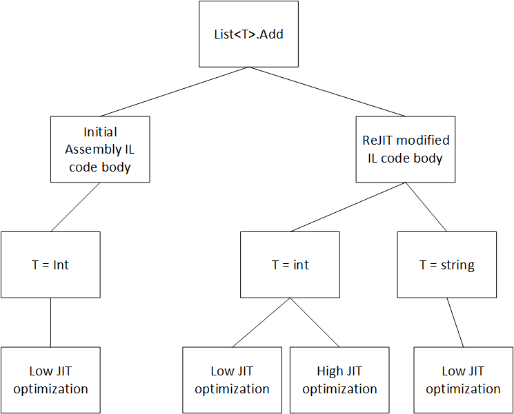
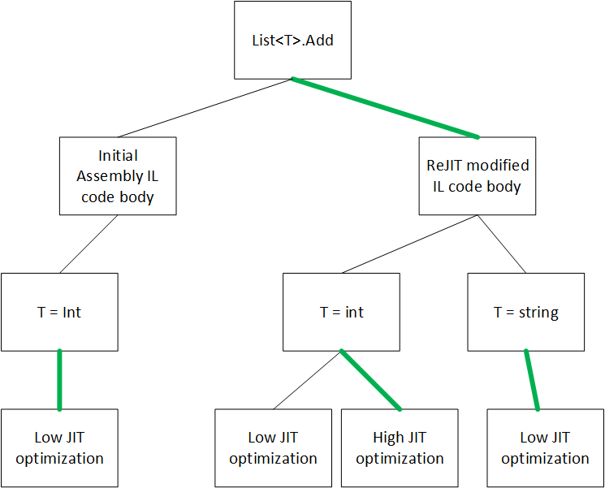
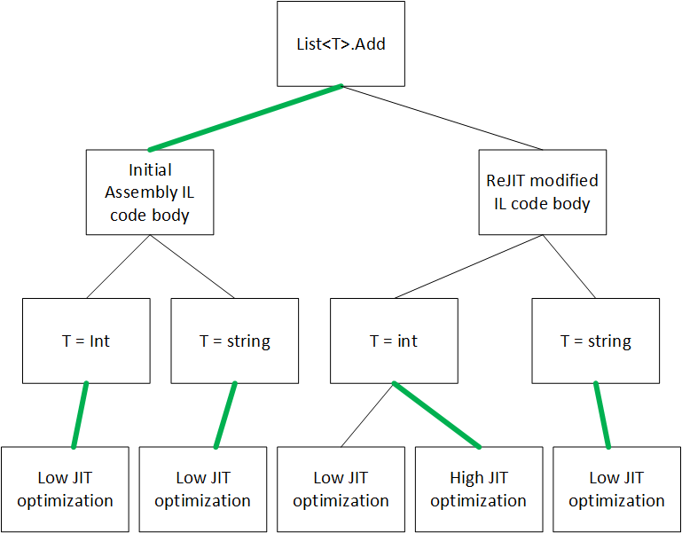

Code Versioning
===============

Author: Noah Falk ([@noahfalk](https://github.com/noahfalk)) - 2017

Introduction
============

Code versioning allows a single logical method to be implemented with different code bodies over the lifetime of an application process. In principle code versioning has a variety of potential uses:

- **Performance** - Infrequently used methods get a low quality code body and once they are called more often the runtime substitutes a higher quality code body.
- **Diagnostics** - Instrumentation can be added and removed dynamically from the code body for code coverage or logging
- **Code pitching** - When methods aren't in use their code could be deleted and then a new version of the code can be re-generated when the method is next called.
- **Fast iterative development** - A developer can modify a method's code without restarting the program or recompiling entire assemblies.
- **Hot patching** - A program in production could have a fix applied without restarting it.


The runtime has multiple code versioning mechanisms and the majority of the doc is only going to focus on one of them, the CodeVersionManager. However a quick listing of the major ones is helpful to understand the landscape.

- **CodeVersionManager**
	- **Tiered compilation** - This feature re-runs the JIT to generate better code for hot methods.
	- **Profiler ReJIT** - The ICorProfilerInfo APIs have a feature called ReJIT that allows the profiler to modify the IL of a method.
- **Edit and Continue (ENC)** - The ICorDebug API have a feature that allows the debugger to apply edits to assemblies which includes method body edits. This mechanism also supports on stack replacement (OSR).
- **Lightweight codegen (LCG)** - APIs in the base class library allow programs to create new delegates with custom IL. These delegates are collected by the GC automatically when they aren't in use which provides a code pitching mechanism.


Dependencies
============

## CodeVersionManager Depends On ##

### The Typeloader ###
The typeloader defines the set of method entrypoints that exist in an application. The CodeVersionManager reasons about entrypoints at both the CLI level of abstraction via MethodDef tokens, as well as entrypoints that are specific to a particular generic instantiations via MethodDescs.

### The Prestub ###
The Prestub provides an initial version agnostic implementation of any method. When it is invoked it can call back to the CodeVersionManager to finalize which version of a method is active, and publish the code for that particular version.

### JumpStub and FixupPrecode ###
These stubs are used to construct stable method entrypoints that can delegate to different code bodies.

## Components that depend on CodeVersionManager ##

### Tiered compilation ###
Tiered compilation creates new code versions with different optimization properties and indicates which version is the preferred one to invoke. It relies on the CodeVersionManager to manage the storage of the code versions, to aggregate version configuration information from other components that may have contributed, and to update the relevant stubs so that preferred code version will be invoked.

### Profiler ReJIT ###
The ICorProfilerInfo API allows a profiler user to create new versions of the IL code, to configure jit compilation settings, and to return execution to the original version. Similar to tiered compilation, this feature relies on the CodeVersionManager to manage storage of the code versions, to aggregate version configuration information from other components that may have contributed, and to update the relevant stubs so that the preferred code version will be invoked.

### MethodDesc Code Preparation ###
When MethodDesc::PrepareCode generates code, it reads configuration information from the CodeVersionManager for the version of the code it is generating.

### Debugger ###
When debugging an application with a debugger based on the ICorDebug API, the debugger fetches the IL and IL mapping information so that it can expose correct diagnostic information for the particular code body being executed.

### Event tracing ###
Event tracing, such as ETW or the recently created built-in profiler, uses the CodeVersionManager to correlate different code bodies with versioning identifiers. These identifiers can either be directly visualized or used to reason about the relationships between code bodies during analysis.

### SOS ###
Similar to event tracing, SOS exposes the versioning identifiers for code bodies which it needs to read from the CodeVersionManager.


Design
======

## Historical context ##

The CodeVersionManager was introduced in 2017, nearly 20 years after the development the runtime began. At the time it was added tiered compilation, profiler rejit, ENC, and LCG were all discrete non-interoperable features. The CodeVersionManager aims to provide a common foundation for general interoperation but the specific impetus was to allow Tiered Compilation to work in a broader variety of scenarios. In the future we may decide that it would be beneficial to allow other versioning mechanisms to interoperate as well and at that time we would refactor them.

## Goals ##

When it was introduced the CodeVersionManager aimed to solve three major issues:

1. We had multiple features that wanted to contribute a portion of configuration for the same method. For example Profiler ReJIT wanted to specify the IL, but tiered compilation wanted to specify the JIT optimization settings. There was no data store to aggregate this information on a per-version basis.
2. There was no unified mechanism for switching runtime dispatch between different versions of the code. ReJit used a JumpStamp, EnC and tiered compilation used a FixupPrecode, and IL interpreter used a custom stub.
3. There is no unified build pipeline. ReJit was probably the biggest offender but the general issue was that some feature would duplicate a portion of the build/configuration logic that handles its own versioning needs as a special case, but excludes the requirements from other features.

There is also a fourth issue which isn't solved yet, but we wanted to make some progress towards a solution:

4. There is no unified mechanism for lifetime management of different code versions. Most of the runtime assumes code has AppDomain lifetime, LCG has a customized garbage collection scheme, and Samsung's code pitching uses a different garbage collection scheme


## Concepts ##

### Methods, Code Versions and Entrypoints ###

In this doc a ***method*** always refers to a named invokable sub-routine with a particular signature. In CLI this is represented by a MethodDef token and the corresponding name and signature. Methods do not include a specific generic instantiation so List<T\>.Add(T item) is a method. List<int\>.Add(int item) and List<string\>.Add(string item) are two generic instantiations of the same method. Methods can have zero or more ***code versions***.

A ***code version*** includes two things:

1. A native code implementation of a method with corresponding side tables for EH, GC, debug data, etc. This determines the exact behavior of the method when it is executed.
2. Various identifiers and configuration information that describe how this code version was generated and how it differs from other versions. For example this includes a version ID number, the IL that was compiled, the generic instantiation parameters and the jit optimization settings.

It is important to notice that the IL is not defined as part of the method, but instead it is part of a particular code version. The CLI encoding of a method in an assembly defines a 1:1 relationship between MethodDef token and an IL body, but it is a runtime choice whether to use that IL in a particular code version for the method.

An ***entrypoint*** is a virtual memory address that can be called at runtime to invoke a particular method. There can be multiple entrypoints for the same method. For example the method List<T\>.Add(T item) may have one entrypoint when T is int and a different one when T is string. In theory any method could be implemented by the runtime to have any number of entrypoints, but in practice generics is the current use-case. Each entrypoint is bound to exactly one code version at a time. There is no requirement that all entrypoints for the same method will be bound to the same code version, and in fact this commonly not the case when tiered compilation creates an optimized version of only one generic instantiation.

### Build pipeline ###

To create a code version there is a code generation pipeline operating inside the runtime. This pipeline is logically a set of stages. At the beginning of the pipeline we have solely a method identifier. Then each stage in sequence may append some additional configuration information. After all the stages have contributed and code is compiled we have a final code version. This is not defined in a highly structured way within our code, but an approximate pipeline might look like this:

1. IL code loaded from an assembly or specified dynamically
3. IL code can be replaced by Edit And Continue
4. IL code can be replaced by profiler rejit
7. The runtime specifies the generic instantiation
5. IL code can be replaced by the profiler using SetILFunctionBody
6. Jit settings can be modified by debugger
7. Jit settings can be modified by the profiler
8. Jit settings can be modified by the tiered compilation manager
9. Final native code is produced by the Jit

If the runtime re-runs the build pipeline with any stage altering the configuration then a new version is produced. Technically even if all stages remained unchanged this would still produce a new code version because the incrementing version id is part of code version, but there would be no reason to do this.

### Default and partial code versions ###

The ***default code version*** for an entrypoint is version of code that is produced when each build pipeline stage that has been integrated with the CodeVersionManager contributes its default configuration. At the moment this means Profiler ReJIT was not used to modify the IL and tiered compilation has not specified a higher optimization level.

***Partial code versions*** refer to any subset of the configuration information that would be present in a complete code version. Partial versions come up frequently when a new code version has been requested, but it hasn't yet been fully initialized. For example when a profiler user calls ICorProfilerInfo4::RequestReJIT a new code version is created immediately, but it is not until the next time that method is invoked that the runtime asks the profiler what IL to associate with the new version. During the interim time period the new code version is a partial one.

## The code versioning tree ##

The CodeVersionManager mostly consists of maintaining a ***code versioning tree*** for each method. This tree represents a set of code versions for a particular method. Each path from root to leaf represents one code version. Every level of the tree maps to a stage in the build pipeline. The nodes on level N represent partial code versions with at most the configuration information from the first N stages of the build pipeline. It is possible for the nodes to have less information if a given stage only produces its configuration information on demand when the final code version is being created. Here is an example tree.



Figure 1 shows an example tree for the List<T\>.Add method. This tree has 3 stages, ReJIT configuration setting the IL code body, then generic instantiation determining the type of T, and finally tiered compilation determining the JIT optimization level.

### Published and Active code versions ###

At any given time only one version of the code can execute when an entrypoint is invoked. This version is called the ***published code version*** for that entrypoint. Closely related to this is ***active code version***. The active code version for an entrypoint is the version that the runtime would prefer to run when the entrypoint is next invoked. Most of the time active and published versions are identical, but the concepts can diverge in two cases:

1. The runtime logic that picks the active code version has just changed it, but the corresponding stubs that direct code flow have not been updated yet. Due to the granularity of various locks the runtime can't always update the stubs in the same atomic operation that updated the active code version.
2. In (hopefully) rare error conditions publishing may fail and this isn't necessarily treated as a fatal error. When this occurs the published code version could remain on an alternate version of the code for an indefinite period of time.

The active code version for an entrypoint is determined by following a path from the root of the versioning tree down to a particular leaf. At each node one of the child nodes is designated the ***active child*** and the edge to that child should be selected. One exception to this rule occurs when traversing to the generic instantiation stage. On this stage only, the next node is selected based on the desired entrypoint. Another example tree:



Figure 2 shows an example versioning tree with edges to the active child in thick green.

In this example the active code version for the List<int\>.Add(int item) is the 3rd version from left to right, the one with high JIT optimization. At the root the runtime would follow the active child to the right, then traverse to the T=int generic instantiation, and finally follow the active child to the right once more. The active version for the List<string\>(string item) entrypoint is on the far right.

Each build pipeline stage controls which of their nodes are the active child nodes and in aggregate this allows all the stages to determine which code version is the active one for any given entrypoint. Any stage is allowed to create new nodes on its level or update its choice of active child at any time. The CodeVersionManager must do its best to recalculate the active version and then publish it.

Hypothetically in the example tree above what would happen if the profiler used the ReJIT API to revert the change to the IL? In this case the ReJIT stage would designate the left child of the root as the new active child and the leftmost code version would become active for the List<int\>(int item) entrypoint. For List<string\>(string item) entrypoint a new branch of the tree would be constructed with a single child at every level down to the leaves.



Figure 3 shows the example tree after an update

You may also have noticed that the T=int entrypoint was optimized before and now it isn't. This might feel wrong that we have allowed code to get worse, but two important points to note.

1. The CodeVersionManager doesn't own any policy and the example is merely hypothesizing policies of the Rejit and Tiered Compilation build stages to show how the CodeVersionManager would update.
2. Even if this example is correctly representing the Tiered Compilation stage policy, it isn't necessarily a bad one. Switching to a code version that already exists allows new invocations to run immediately whereas jitting a new high optimization code body would block a calling thread until the code was ready.

Implementation
==============

### Code Versions ###

The implementation can be located in [codeversion.h](../../../src/coreclr/vm/codeversion.h) and [codeversion.cpp](../../../src/coreclr/vm/codeversion.cpp)

Code versions are embodied by the configuration in NativeCodeVersion structure as well as the configuration in the transitively reachable ILCodeVersion. NativeCodeVersion::GetILCodeVersion() allows trivial access from one part of the configuration to the other. These structures have various accessors to retrieve all the code and configuration data such as:

```
    NativeCodeVersion::GetVersionId()
    NativeCodeVersion::GetNativeCode()
    NativeCodeVersion::GetOptimizationTier()
    ILCodeVersion::GetIL()
```

ILCodeVersion objects are always partial code versions, containing only the portion of versioning information that doesn't vary by generic instantiation.

The NativeCodeVersion and ILCodeVersion don't directly store any of the configuration data but rather serve as facades that use one of two different storage strategies. For the default version (or in the case of ILCodeVersion, default partial code version), the structures only store sufficient information to identify which version is being referred to. Then they delegate all storage to the pre-existing runtime data structures which already store this data. For non-default versions the structure stores a pointer block of memory that does store the configuration. For example:

```
PCODE NativeCodeVersion::GetNativeCode() const
{
    LIMITED_METHOD_DAC_CONTRACT;
    if (m_storageKind == StorageKind::Explicit)
    {
        return AsNode()->GetNativeCode();
    }
    else
    {
        return GetMethodDesc()->GetNativeCode();
    }
}
```

StorageKind::Explicit refers to the non-default version case, in which the code retrieves the pointer to the memory block and reads the value from there:

```
PTR_NativeCodeVersionNode NativeCodeVersion::AsNode() const
{
    LIMITED_METHOD_DAC_CONTRACT;
    if (m_storageKind == StorageKind::Explicit)
    {
        return m_pVersionNode;
    }
    else
    {
        return NULL;
    }
}
PCODE NativeCodeVersionNode::GetNativeCode() const
{
    LIMITED_METHOD_DAC_CONTRACT;
    return m_pNativeCode;
}
```

StorageKind::Synthetic refers to the default version case, in which case the code retrieves the MethodDesc identifier and then fetches the code from MethodDesc::GetNativeCode() as usual:

```
PTR_MethodDesc NativeCodeVersion::GetMethodDesc() const
{
    LIMITED_METHOD_DAC_CONTRACT;
    if (m_storageKind == StorageKind::Explicit)
    {
        return AsNode()->GetMethodDesc();
    }
    else
    {
        return m_synthetic.m_pMethodDesc;
    }
}
```

This facade technique was chosen to conserve memory, as most methods will only ever have one version, the default version. In this case the code version manager never allocates any additional memory beyond the current runtime behavior. Only when additional non-default versions are created do we need to pay memory costs. A second reason is that the facades free the CodeVersionManager to further change the implementation in the future without requiring any particular correlation between the conceptual nodes and the memory allocations that back that data. The versioning information isn't particularly hot so there might be motivation to attempt further compression in the future.


### Code Version Manager ###

The CodeVersionManager is the primary entrypoint to code versioning information and gives access to the logical code versioning tree discussed above. The tree isn't named as such in the API and is slightly modified from its idealized presentation in the design.

- There is no direct object model representation of the root node of the tree. Instead ILCodeVersion nodes represent the child nodes of the root level. They are accessible by calling

```
CodeVersionManager::GetILCodeVersions(Module*, MethodDef)
```

- The active child of the root node is indicated by

```
CodeVersionManager::GetActiveILCodeVersion(Module*, MethodDef)
```

- To travel upwards in the tree from an ILCodeVersion, the root is logically identified by Module and MethodDef available via:

```
ILCodeVersion::GetModule()
ILCodeVersion::GetMethodDef()
```

- The nodes in the generic instantiation level have no direct object model representation. Instead the grand-child nodes of particular generic instantiations are directly enumerable using:

```
ILCodeVersion::GetNativeCodeVersions(MethodDesc*)
```

- The active grand-child node of a particular generic instance child can be retrieved (or created on demand) via:

```
ILCodeVersion::GetOrCreateActiveNativeCodeVersion(MethodDesc*)
```

- These grand-child nodes are always NativeCodeVersions, the leaves of the tree. From here it possible travel up to the logical parent by using:

```
NativeCodeVersion::GetMethodDesc()
```

- To get the grand-parent of a NativeCodeVersion use

```
NativeCodeVersion::GetILCodeVersion()
```

When observing how these structures are implemented it may not appear particularly tree-like as there are no direct parent or child pointers and two of the four levels in the tree are missing. Instead MethodDescVersioningState and ILCodeVersioningState create two linked lists that span the NativeCodeVersion and ILCodeVersion levels of the tree respectively. Each NativeCodeVersion records a parent id which can be searched for in ILCodeVersion list to establish the parent-child linkage. This choice is again to save some memory in exchange for slower traversal of tree edges. The expectation is that most methods will have only one version, and the vast majority will only have a small number per generic instantiation (< 10) so O(N) searches are still quite reasonable. If we ever want to scale the feature to allow for very large numbers of versions we would likely need to make a different tradeoff, increasing memory usage to improve tree traversal time.

Another interesting consideration is that in the future I anticipate having some form of collection for code versions. In this case methods might initially grow to some modest number of versions but most of those versions will no longer be in use. When the unused versions are collected the version tree will again prune back down to most likely a single version per generic instantiation. This suggests two interesting properties for our representations:

1. The most compact representations will avoid spending large amounts of memory encoding linkages between tree levels because every level other than generic instantiation will have 1:1 relationships between parent and child. The most efficient encoding would likely place all information for every node between root and generic instantiation into one memory block and then place all information for every node from generic instantiation to leaf in a second block.
2. Using fixed storage, such as an array where version 1 is in element 1 and so on will suffer internal fragmentation. Before collection this is a very efficient representation, but after collection perhaps only version 3 is still in use, and the space for versions 1 and 2 can't be easily reclaimed.

Thus if the current implementation doesn't appear ideal partly this may be because I wasn't sufficiently clever, but the other part is that I was optimizing for future conditions.

### Domains ###
There is one CodeVersionManager per AppDomain, and one for the SharedDomain. Versioning for a given method always looks up the appropriate CodeVersionManager by traversing from MethodDef token -> Module that defines that token -> Domain that loaded that module -> CodeVersionManager. In code this is either:

```
Module* pModule;
pModule->GetDomain()->GetCodeVersionManager()
MethodDesc* pMethod;
pMethod->GetModule()->GetDomain()->GetCodeVersionManager()
```

Some shortcut accessors are defined to make these lookups simpler:

```
pModule->GetCodeVersionManager()
pMethod->GetCodeVersionManager()
```

Generics can cause methods in domain-neutral modules to refer to types in domain-specific modules. The rules above dictate that these code versions still reside in the domain-neutral CodeVersionManager. The AppDomain specific CodeVersionManagers will never contain code versions with a domain-neutral type in their instantiation.

CoreCLR is largely moving away from multiple AppDomains but I left the domain distinctions in place for a few reasons:

1. Pragmatically the feature is a partial refactoring of ReJitManager and this is what ReJitManager did. Diverging from ReJitManager's design incurs extra time and risk of new issues.
2. Maybe someday we will want to migrate similar functionality back to the desktop .NET SKU. Desktop supports multiple AppDomains so per-AppDomain handling would be required in that context.

AppDomain unloading however has not been handled. If CoreCLR supports proper AppDomain unload at some point or the code moves back to desktop runtime we will need to handle this gap.

### Code activation and publishing ###

The CodeVersionManager abstracts selecting the active code versions and publishing them behind the APIs that individual build stages use to manipulate the versioning tree. For example a build stage would call either:

```
CodeVersionManager::SetActiveILCodeVersions(...)
ILCodeVersion::SetActiveNativeCodeVersion(...)
```

to update the active child at either of those levels (ReJIT uses SetActiveILCodeVersions, Tiered Compilation uses SetActiveNativeCodeVersion). Once this occurs the CodeVersionManager needs to do these things:

1. Determine which entrypoints may need updates.
2. Recalculate the active code version for each entrypoint
3. Update the published code version for each entrypoint to match the active code version

In order to do step 3 the `CodeVersionManager` relies on one of three different mechanisms, a `FixupPrecode`, a `JumpStamp`, or backpatching entry point slots. In [method.hpp](https://github.com/dotnet/runtime/blob/main/src/coreclr/vm/method.hpp) these mechanisms are described in the `MethodDesc::IsVersionableWith*()` functions, and all methods have been classified to use at most one of the techniques, based on the `MethodDesc::IsVersionableWith*()` functions.

### Thread-safety ###
CodeVersionManager is designed for use in a free-threaded environment, in many cases by requiring the caller to acquire a lock before calling. This lock can be acquired by constructing an instance of `CodeVersionManager::LockHolder`.

in some scope for the CodeVersionManager being operated on. CodeVersionManagers from different domains should not have their locks taken by the same thread with one exception, it is OK to take the shared domain  manager lock and one AppDomain manager lock in that order. The lock is required to change the shape of the tree or traverse it but not to read/write configuration properties from each node. A few special cases:

- CodeVersionManager::SetActiveILCodeVersions needs to operate partially inside and partially outside the lock. The caller should not acquire the lock beforehand.
- NativeCodeVersion::GetILCodeVersion() does not require the lock if the caller first guarantees it is operating on the default code version.

APIs that require the lock is held/not held should ASSERT the lock state in debug builds. APIs with no ASSERT can be used with or without the lock.

### Ambient/unrecorded/explicit version configuration ###

The example build pipeline in the design section has many stages, but the implemented versioning tree only tracks a few specific chunks of configuration information:

1. Profiler ReJIT can specify an IL body, IL remapping table, and a few jit flags.
2. The runtime can specify any number of generic instantiations
3. Tiered compilation can specify an optimization level

All other information such as Edit and Continue IL modifications, or a profiler disabling inlining via the JIT time callback aren't recorded in NativeCodeVersion/ILCodeVersion. The code generation pipeline implementation still takes these other configuration options into account when generating the code so how do we square that with the conceptual model that code version captured all configuration? Our implementation classifies all configuration settings into one of three categories. (These classification names aren't used much in the code, but you can use them to reason about it)

- **Explicit** - These are configuration options that are encoded directly into the version tree data structures so they can be trivially read back at any time. Profiler ReJIT, generic instantiation, and tiered compilation settings are all explicit.
- **Ambient** - These are configuration values that are immutable once set and apply to all code versions of the same method. This can be treated the same as if the build stage gave an explicit configuration result for each generated code version, but the policy in that build stage always returns the same answer. Then as a memory footprint optimization rather than save N copies of the same answer in N different versions, the runtime stores the answer once and knows that it applies to all code versions. For example the debugger can set a debuggable codegen flag that causes all methods in a module to jit differently. The runtime stores that flag in the module for efficiency, but we can map it back to the code version concept as if every code version had that flag in it and it happens to be the same for all versions.
- **Unrecorded** - The final case are configuration options that do change per code version, but they aren't recorded in the NativeCodeVersion/ILCodeVersion data structures. Logically this configuration is part of the code version regardless of the runtime's ability trivially access it/compute it on demand. For example a .NET profiler can control whether a particular jitting of a method has Profiler Enter/Leave/Tailcall probes in it based on its response to the FunctionIDMapper2 callback during JIT code generation. If there was already a version of this function generated without ELT and the profiler wanted a new version that does have ELT then the profiler needs to create a new code version. The only technique it has available to create new code versions is to use ReJIT, but ELT isn't part of explicit configuration that ReJIT collects for the new code version. Instead the profiler records in its own data structures that the new ReJIT version should have a certain ELT configuration setting. Whenever code jits that corresponds to this version the runtime will query the profiler and then the profiler will respond with the appropriate ELT setting. In this way the ELT has logically become part of the profiler ReJIT stage configuration even though the runtime has no explicit record of it. Generalizing from this example, the runtime expects that all unrecorded code version configuration can be treated as a hidden portion of the configuration that is supplied by one of the explicitly configured build stages.

The runtime's current classification is:

- **Explicit** - ReJIT IL, IL mapping, jit flags, generic instantiation, optimization tier, versioning ids
- **Ambient** - Profiler IL from SetILFunctionBody, Profiler metadata updates, runtime inlining policy, profiler NGEN search policy
- **Unrecorded** - Profiler inlining policy, Profiler ELT configuration


Future roadmap possibilities
============================

A few (completely uncommitted) thoughts on how this area of the code might evolve in the future, in no particular order:

- Make the debugger configuration for EnC another explicit build pipeline stage. This seems most interesting to allow diagnostic tools that use profiler instrumentation to coexist with a live debugging session that is rewriting code using EnC.
- Add code version collection to save memory when certain code versions are no longer being used.
- On stack replacement requires that publication not only redirect new method invocations to a new version, but also continued execution of existing method invocations must redirect to a new version.
- Performance improvements that utilize more memory / cpu efficient data structures.
- Add new build pipeline stage accessible from managed code APIs to do self-modifying code.
- Add new build pipeline stage accessible from out-of-process or maybe runtime managed that could handle hot-patching app deployment scenarios.
- Allow for an extensible set of stages rather than the current hard-coded set, perhaps to allow N profilers to all collaboratively edit. Some form of multi-profiler collaboration has long been requested and this seems a fairly powerful (and potentially way too complicated) form.
