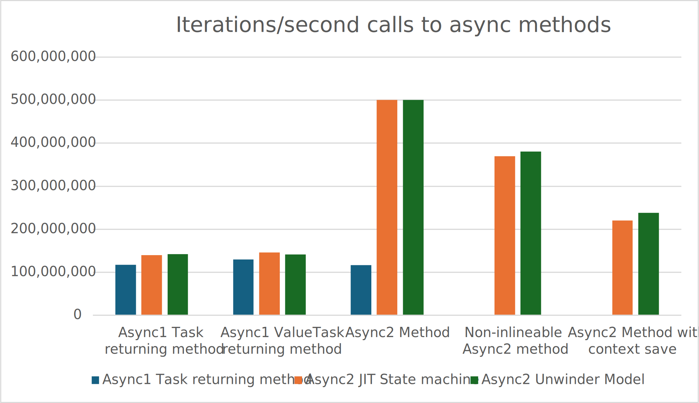
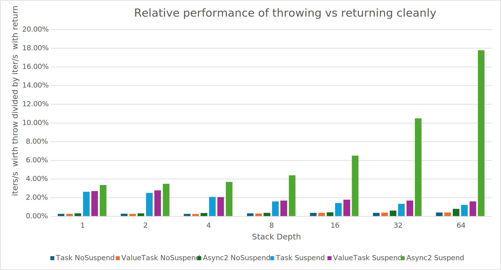
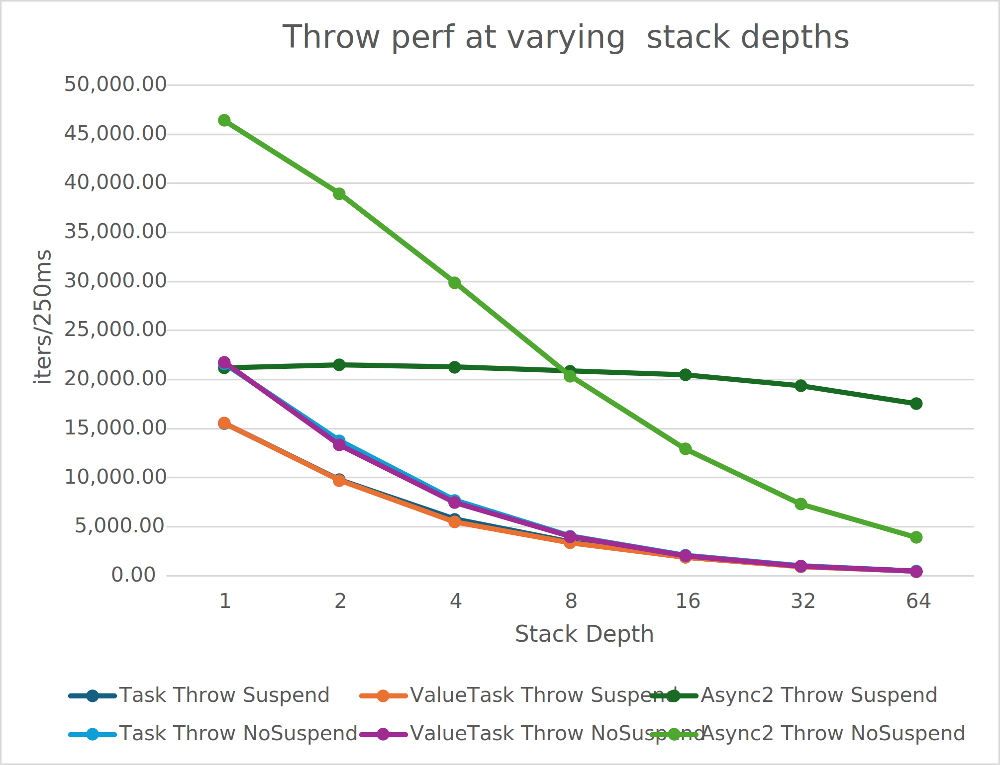
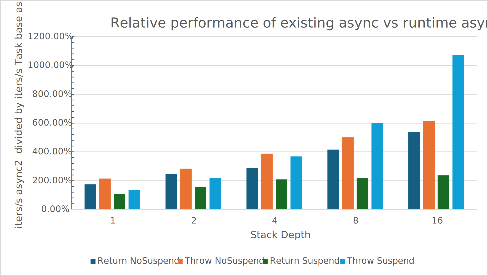
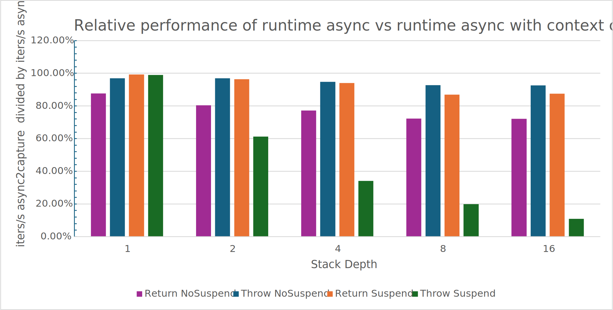
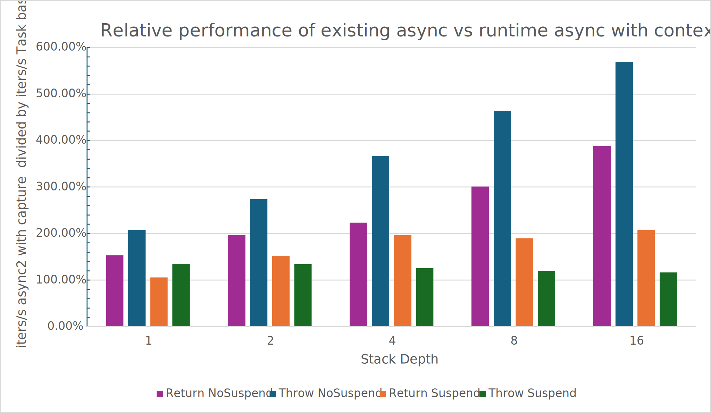
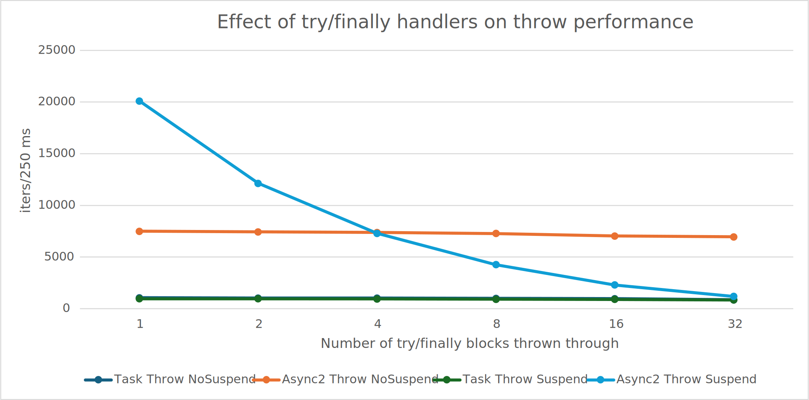

# Runtime Handled Tasks Experiment

The .NET Runtime has historically supported a programming model of developing async programs through use of the System.Threading.Tasks library provided by the runtime as well as the Roslyn async method support, which interacts with that tasks library to make it simple to write the callback based state machines that the runtime can use. Over the years several attempts have been made to optimize the performance and other characteristics of this scheme, but fundamentally those arrangements have relied on either tweaks to the core library's code base or adjustments to the IL code generated. This experiment seeks to identify what improvements to the async model can be achieved by moving the state machine computation and handling to being handled internally in the runtime.

## Experimental Goals

1. Find out if runtime generated async state machines are substantially better in performance than the existing async state machine model
2. Find out if we can implement a variation on async which has some subtle semantic behavior changes, but remains compatible with existing code which is written in the original style

## Experimental Approach

1. Develop new semantics which allow the runtime to implement state machines as part of the runtime instead of relying on the existing state machine generation.
2. Develop 1 or more implementations of the runtime which implement said semantics
3. Develop a version of the Roslyn compiler which is capable of building code using the new semantics
4. Develop a set of microbenchmarks for measuring the different performance characteristics of the new model
5. Develop a set of application scenario benchmarks

Throughput this document, any references to the term async2 refer exclusively to the new model.

## New Semantics

This section is a work in progress, but describes the current expected semantic changes.

### Specification of a method as following async2 semantics

To specify that a method follows async2 rules, a custom modifier to either `System.Threading.Tasks.Task`, ``System.Threading.Tasks.Task`1``, `System.Threading.Tasks.ValueTask`, or ``System.Threading.Tasks.ValueTask`1`` shall be placed as the last custom modifier before the return type in the signature of a method.

### Flowing `SynchronizationContext` and `ExecutionContext` and other behavior such as AsyncLocal
Unlike traditional C# compiler generated async, async2 methods shall not save/restore `SynchronizationContext` and `ExecutionContext` at function boundaries. Instead, changes to them can be observed by their callers (as long as the caller is not a Task to async2 thunk).

#### Integration with `SynchronizationContext` and resumption

A new attribute `System.Runtime.CompilerServices.ConfigureAwaitAttribute` will be defined. It can be applied at the assembly/module/type/method level. It shall be defined as 
```
namespace System.Runtime.CompilerServices
{
    class ConfigureAwaitAttribute : Attribute
    {
        public ConfigureAwaitAttribute(bool continueOnCapturedContext) { ContinueOnCapturedContext = continueOnCapturedContext; }
        public bool ContinueOnCapturedContext { get; }
    }
}
```

The behavior of this attribute shall be to apply configure await semantics for resuming suspended frames of execution. Notably, though, the semantics of exactly which `SynchronizationContext` to use is subtly different from that of traditional async. In traditional async since each async method saves/restores the `SynchronizationContext` an async method which suspended at an ConfigureAwait(true) await point awaiting async method `A` will always continue on the Synchronization context that existed before the call to async method `A`, where in the async2 model the context used will be that which is current just before calling into method `A`, but in the async2 model, the SynchronizationContext will be the context that was current just before the return statement of method `A`. In practice, we expect this to be a distinction without a difference, as all known intentional uses of `SyncrhonizationContext` are implemented via a pattern where the context is set in a function, and restored via a try/finally to its original state before returning from the function.

#### Implications of flowing `ExecutionContext` and async locals

`ExecutionContext` is used to represent the current values of the `AsyncLocal<T>`. This feature is colloquially known as async locals. The semantics of these locals is surprising to developers today, in that while any function can modify the current state of an aync local, if an async function returns, any mutations to the async local are lost. In contrast, this proposal changes to the model such that when an async2 function returns, the async local state is **not** reverted to its previous state.

### Integration with the existing api surface of Task and ValueTask based apis

Any MethodDef that is an async2 based method can also be called as a `Task`/`ValueTask` returning method. Likewise any MethodDef which returns `Task` or `ValueTask` can be called via an async2 entrypoint. In addition, MethodImpl records and virtual method override rules shall be adjusted so that if an interface or base type defines a virtual method using a signature of `Task`/`ValueTask` then it can be overriden via a method that is an async2 api. The same is true vice versa. For overrides implemented via `MethodImpl` the MethodImpl must describe the Body and Decl using signatures which are either both async2 or `Task`/`ValueTask` returning, but the MethodImpl will also apply to the other async variant. These overrides are permitted to be interleaved, so for example

```
class Base
{
    public virtual async Task<int> Method() { ... }
}
class Derived : Base
{
    public override async2 int Method() { ... }
}

class MoreDerived : Derived
{
    public override async Task<int> Method() { ... }
}
```

Any attempt to call an entrypoint will resolve to either an implementation which matches the signature, or in case of an async variant mismatch, will resolve to a runtime generated thunk which will call into the developer provided implementation.

Methods that return Task via generics do not follow this rule. For instance
```
class MyGeneric<T>
{
    T DoSomething() { ... }
}
```

`MyGeneric<Task>.DoSomething()` is not callable via an async2 entrypoint.

#### Thunk from an async2 api surface to Task based implementation

A thunk from an async2 api surface to a Task based implementation will have the following psuedocode, if a legal thunk can be made.

```
async2 ReturnType ThunkAsync(ParameterType param1, ParameterType2 param2, ...)
{
    return RuntimeHelpers.UnsafeAwaitAwaiterFromRuntimeAsync<TaskAwaiter<ReturnType>, ReturnType>(TargetMethod(param1, param2, ...));
}
```

If any of the parameter types to the target method are ref parameters, or ref structures, then the Thunk generated will be 
```
async2 ReturnType ThunkAsync(ParameterType param1, ParameterType2 param2, ...)
{
    throw new InvalidProgramException();
}
```

#### Thunk from the Task api surface to async2 based implementation

If any of the parameter types to the target method are ref parameters, or ref structures, then any thunk invoked will throw `InvalidProgramException`. Otherwise it will perform whatever runtime actions are necessary to transition to the async2 implementation, and return the appropriate Task object type on return.

Thunks are required to save and restore the `ExecutionContext` and `SynchronizationContext` such that callers of thunks cannot observe changes to them.

### Specifying custom scheduling of async2
Async2 shall integrate with `TaskScheduler.Current`.

### Semantics of async2 based IL code

#### IL Semantics

Async2 IL is broadly similar to the existing IL semantics with the following restrictions.

1. Usage of the `localloc` instruction is forbidden
2. The `ldloca` and `ldarga` instructions are redefined to return managed pointers instead of pointers.
3. A pinning local cannot be validly used with a local variable.
. As an initial restriction that is not fundamental, the `tail.` prefix is not permitted
4. Use of byrefs and ref structs within async2 methods may or may not be acceptable. The currently JIT focussed prototype is designed with the same limitations as the existing async model, and thus does not work with byref data. However, the unwinder approach is able to tolerate byrefs.

#### EH Semantics
No call to a method with an async2 modreq will be permitted in a finally, fault, filter, or catch clause. If such a thing exists, the program is invalid.

The StackTrace of a exception thrown within an async2 method shall include any async2 frames which are logically on the call stack up until the thunk which transfers execution to the root async2 method.

### Api surface for interacting with non Task/ValueTask apis which async from within async2 code

The runtime shall provide the following apis

```
        public static async2 void AwaitAwaiterFromRuntimeAsync<TAwaiter>(TAwaiter awaiter) where TAwaiter : INotifyCompletion
        public static async2 void UnsafeAwaitAwaiterFromRuntimeAsync<TAwaiter>(TAwaiter awaiter) where TAwaiter : ICriticalNotifyCompletion
```

Any IL in an async2 method which needs to await will follow the existing C# model of calling `IsCompleted` and `GetResult()` and in the middle instead of using the existing patterns for suspension shall call one of the above helper methods.

### Utilizing async2 based code from non-async2 based code

Non-async2 code is never permitted to directly invoke async2 code. Instead any and all calls into async2 functions shall be done by means of one of the thunks.

### Interaction with Reflection

Async2 methods will not be visible in reflection via the `Type.GetMethod`, `TypeInfo.DeclaredMethods`, `TypeInfo.DeclaredMembers` , or `Type.GetInterfaceMap()` apis. 

`Type.GetMembers` and `Type.GetMethods` will be able to find the async2 methods if and only if the `BindingFlags.Async2Visible` flag is set.

`Type.GetMemberWithSameMetadataDefinitionAs` will find the matching async variant method.


## Implementation of Unwinder based async2 prototype

The general design is to leverage the notion that a normal code generated function at a function call point is effectively a state machine. The index for resumption is the IP that returning to the function will set, and the stackframe + saved registers are the current state of the state machine. I believe we can achieve performance comparable to synchronous code with this scheme for non-suspended scenarios, and we may achieve acceptable overall performance as an async mechanism if suspension is relatively rare.

To enable this prototype, set `DOTNET_RuntimeAsyncViaJitGeneratedStateMachines=0`.

### JIT Code changes
1. Do not allow InlinedCallFrames to be linked to the frame chain across a suspend (Or disable p/invoke inlining in these methods)
2. Report frame pointers as ByRef
3. Report all pointers to locals as ByRef
4. Force the AwaitAwaiterFromRuntimeAsync to be treated as an async2 method even though it isn't marked as such (due to compiler limitations)
5. Do not allow the JIT to hold onto a thread static base pointer across await points.

### Thunk from the Task api surface to async2 based implementation

A thunk from the Task api surface to an async2 based implementation will have the following psuedocode if it is not required to throw `InvalidProgramException`

```
Task<ReturnType> ThunkAsync(ParameterType param1, ParameterType2 param2, ...)
{
    // A variant on this helper type will be defined for each type of `Task`/`ValueTask`/`Task<TResult>`/`ValueTask<TResult>`
    System.Runtime.CompilerServices.RuntimeTaskState<ReturnType> runtimeTaskState = new;

    // If the Task is parameterized there shall be a return type to work with.
    ReturnType result;

    runtimeTaskState.Push();
    try
    {
        try
        {
            // NOTE there is a special case for instance methods on valuetypes. For that case,
            // the thunk will construct a boxed instance of the this value, and then invoke the method
            // on that.
            result = TargetMethod(param1, param2, ...);
        }
        catch (Exception ex)
        {
            return runtimeTaskState.FromException(ex);
        }
        return runtimeTaskState.FromResult(result);
    }
    finally
    {
        runtimeTaskState.Pop();
    }
}
```

### Implementation of `AwaitAwaiterFromRuntimeAsync`
The implementation of this method captures every stack frame from itself down to the `ThunkAsync` function or `ResumptionFunc`. Each one of these stack frames is packaged up into a structure known as a `Tasklet`. These `Tasklet` objects are registered with the GC so that they will be properly reported, but that reporting is not based on normal GC reporting, but is instead a special codebase. Primarily this need to treat them as special is done so that ByRef pointers can be handled correctly. Once all of the stack frames are captured, then the set of unwound `Tasklet` and the awaiter object are placed in a thread local variable for use by the `ThunkAsync` or `ResumptionFunc` functions. Finally, the actual stack is unwound to the `ThunkAsync`/`ResumptionFunc` frame, which detects that the operation was suspended and does the appropriate thing. In the ThunkAsync implementation, this is done by the runtimeTaskState.FromResult method, which determines if it should ignore the result it acquired from the `TargetMethod` and instead just create a task to return. Finally, a delegate to `ResumptionFunc` is passed to the awaiter.

`Tasklet` structures are designed to hold the data of a frame, the instruction pointer where execution should resume, the current state of any callee preserved registers that are used by the function, and layout/unwind information for finding GC data/and preserved register locations within the frame. Of particular interest is the handling for preserved registers. In the normal case of execution of JIT generated code, when a function needs to use a callee preserved register, it will generate code to store the current value of the register during the prolog of the method, and restore it during the epilog of the method. This unwinder based approach reverses that approach so that the `Tasklet` copy of the stack frame stores the "current" value of the register, and it is reported to the GC in that location when the `Tasklet` goes through GC reporting. The other detail of particular interest is that the data necessary to describe the locations of these preserved registers turns out to be exactly the data necessary to unwind a stack frame.

The implementation of unwinding used to return back to the `ThunkAsync` method is currently written in a highly optimized assembly path which walks the list of preserved register locations, and resets them.

Current implementation of this unwinder scheme use the standard CoreCLR unwinder and GC information reporter to build data structures that describe the unwind/GC data at a particular instruction pointer address, but in theory this should be amenable to a high performance cache.

### Implementation of `ResumptionFunc`
The dispatcher takes a collection of Tasklets, and resumes the one at the top of the stack, and if it returns, will pop it off the stack and execute the next one. It shall maintain structures such that the EH stack walker can find the list of stack frames that are still held in `Tasklet`s. In addition it shall be responsible for ensuring that the correct `ExecutionContext`/`SynchronizationContext` is maintained, and any `Tasklet` is resumed using the appropriate scheduler provided to the runtime. This implementation today is partial, but the basic structure is present to do so.

#### Resumption of a Tasklet

Once the `ResumptionFunc` has setup the global state to have the correct bits in it, it will call into a carefully crafted assembly stub (called `ResumeTaskletIntegerRegisterReturn` or `ResumeTaskletReferenceReturn`) which takes a `Tasklet*` as input as well as a pointer to a structure which holds the current return value that should be restored to the return value registers. This assembly stub shall copy the `Tasklet`'s stack frame onto the stack, swap any values in the preserved register locations with the current value of the preserved registers, and then tail jump to the instruction pointer held in the `Tasklet`. This resumption process was chosen to ensure that:
1. The return address on the shadow CET stack does not need any updates upon `Tasklet` resumption.
2. The runtime only resumes a single method at a time, which improves efficiency in the somewhat common case where there is a deep stack which has a loop in it.
3. Once resumed, the stack appears as a normal stack to all stackwalking operations.

### Expected characteristics of this approach
1. The performance of code which does not suspend is effectively the same as normal synchronous code. (confirmed)
2. The performance of code which suspends a lot is highly impacted by the cost of performing unwind, and somewhat by resumption cost. (under investigation)
3. The cost of GC while `Tasklet`s exist is dependent on the number of live `Tasklet` objects. This is almost certainly a fairly high cost. (under investigation)
4. This approach allows development of async code which uses ref parameters/locals and ByRefLike structures. (confirmed)

## Implementation of prototype based on JIT generated state machines

In the second prototype we leave it up to the JIT to generate the state machines for async2 functions.
When awaiting an async2 function from within an async2 function the JIT generates suspension code to capture the live state in a continuation.
In addition, the JIT generates code for each of these suspension points to be able to resume from the continuation that was created.

This prototype is enabled by default, or when `DOTNET_RuntimeAsyncViaJitGeneratedStateMachines=1`.

### Suspension

Communicating suspension is done by returning a non-zero continuation, using a special calling convention.
The continuation is a normal GC ref so special care must be taken within the JIT and within the VM to handle proper GC reporting of this return value.
On x64 the continuation is returned in `rcx`.

When a callee suspends by returning a non-zero continuation the caller itself suspends by creating its own continuation and returning it.
Additionally, the generated suspension code links the continuations into a linked list.

`Continuation` is defined as a simple class in the BCL:
```csharp
internal sealed unsafe class Continuation
{
    public Continuation? Next;
    public delegate*<Continuation, Continuation?> Resume;
    public uint State;
    public CorInfoContinuationFlags Flags;
    public byte[]? Data;
    public object[]? GCData;
}
```

This incurs extra cost on every call to an async2 method in the form of a test for whether the returned continuation is non-zero.

### Resumption

In addition to returning a continuation async2 methods also accept a continuation as an additional parameter.
The parameter follows the normal calling convention; it is added in the parameter list after the generic context, return buffer or `this` parameter (whichever comes last).

Resuming an async2 method is done by passing a non-zero continuation.
The continuation must have been created by the same exact native code version that is being resumed.

Passing a zero continuation is the same as starting the state machine.
The JIT will automatically generate code to pass a zero continuation when calling an async2 method.

When the JIT generates code for an async2 function it asks the runtime to create a resumption stub.
The suspension code stores the pointer to the resumption stub in the `Continuation.Resume` field.

The resumption stub implements the following:
1. It calls into the original function passing the non-zero continuation
2. It passes default values for all arguments, to make sure that the callee has the expected stack frame set up. If parameters are live, then it is expected that the resumed function restores them from the continuation state.
3. If the function returns a value it ensures that the return value is propagated into the next continuation at the right location (either its `Data` or `GCData` arrays).
4. If the function returned a new continuation (i.e. it suspended again), the resumption stub returns it back to the caller.

In pseudo-C#:
```csharp
static async2 int Foo(int a, int b)
{
    ...
}

static Continuation? IL_STUB_AsyncResume_Foo(Continuation continuation)
{
    delegate*<Continuation, int, int, int> foo = &Foo;
    int result = foo(continuation, 0, 0);
    Continuation? newContinuation = StubHelpers.Async2CallContinuation();

    if (newContinuation == null)
    {
        // Foo returns an int and is saved in the Data array. If Foo returned a
        // GC ref or struct with GC refs, it would be boxed and stored in GCData instead.
        // Exact index depends on some factors; see the code for the details.
        Unsafe.Write(ref continuation.Next.Data[index], result);
    }

    return newContinuation;
}
```

### Intrinsics used for suspension/resumption

To interact with the async2 calling convention the JIT/VM provides the following intrinsics:
```csharp
// Retrieve the continuation returned by a preceding async2 function call
[Intrinsic]
internal static Continuation? Async2CallContinuation() => null;

// Suspend the current function by immediately returning with a specific non-zero continuation.
[Intrinsic]
private static void SuspendAsync2(Continuation continuation) => throw new UnreachableException();
```

These intrinsics are NOT used by user code, but they are used internally by the async1<->async2 adapter later, which will be described later.

`Async2CallContinuation()` is also used by generated resumption stubs to capture the returned continuation.

Since the continuation is a normal parameter no intrinsic is required to allow the resumption stub to pass the continuation to the target.
Instead, the resumption stub calls the target by `calli` with a signature that includes the continuation, in the same way as IL instantiating stubs work.

### Handling OSR

There is additional complexity necessary to handle OSR correctly:
1. OSR expects that the frame was set up by a tier-0 method so resumption directly in an OSR method is not possible.
Instead, the JIT generates code in the tier0 version to check for an OSR continuation in which case the tier-0 method transitions immediately to the OSR method on resumption.
The resumption stub created for an OSR method thus points to its corresponding tier-0 code version.
This is currently implemented by storing a link between OSR methods and corresponding tier-0 methods in `PatchpointInfo`.
2. When resuming in a tier-0 method, if we transition to the OSR method by normal means, the OSR method will see a non-zero continuation that belongs to the tier-0 method.
The OSR method must ignore the continuation in this case.
3. OSR continuations store the IL offset in the `Data` array which complicates propagation of return values into the next continuation, as the exact index to use depends on whether or not this IL offset is present in that continuation.
This introduces a small amount of overhead in resumption stubs (in terms of a flag check).

### Interop: the async1<->async2 adapter layer

Thunks of the same shapes are provided as for the unwinding prototype.

#### async2 -> async1

The only way to actually begin suspension of a chain of async2 methods happens when calling into an async1 method that suspends.
As described previously these boundaries are generally expected to be handled by Roslyn by IL codegen that involves a check for `IsCompleted` followed by a call into one of the two `AwaitAwaiterFromRuntimeAsync` variants in the asynchronous case, finally followed by a `GetResult` call.
The runtime will automatically provide such a stub if an async1 method is called with an async2 signature.

The implementation of `AwaitAwaiterFromRuntimeAsync` is provided by the BCL.
For the JIT state machines prototype it looks as follows:

```csharp
private struct RuntimeAsyncAwaitState
{
    public Continuation? SentinelContinuation;
    public INotifyCompletion? Notifier;
}

[ThreadStatic]
private static RuntimeAsyncAwaitState t_runtimeAsyncAwaitState;

public static async2 void AwaitAwaiterFromRuntimeAsync<TAwaiter>(TAwaiter awaiter) where TAwaiter : INotifyCompletion
{
    ref RuntimeAsyncAwaitState state = ref t_runtimeAsyncAwaitState;
    Continuation? sentinelContinuation = state.SentinelContinuation;
    if (sentinelContinuation == null)
        state.SentinelContinuation = sentinelContinuation = new Continuation();

    state.Notifier = awaiter;
    SuspendAsync2(sentinelContinuation);
}

```

The helper starts the suspension by allocating a continuation into TLS, and returning it back to the caller.
This is going to result in the JIT codegen unwinding through all calling async2 functions and linking all continuations together.
The end result will be a linked list of continuations where the head of the continuation is available through TLS.

The state stored in TLS is acted on by the async1 -> async2 adapter.

#### async1 -> async2
The async1 -> async2 adapter, which allows calling an async2 function as if it returns a `Task`, is implemented in the following pseudo-C#:

```csharp
static Task<int> FooAdapter(int a, int b)
{
    int result;
    Continuation? continuation = null;

    ExecutionAndSyncBlockStore state = new();
    state.Push();

    try
    {
        result = Foo(a, b);
        continuation = StubHelpers.Async2CallContinuation();
    }
    catch (Exception ex)
    {
        return Task.FromException<int>(ex);
    }
    finally
    {
        state.Pop();
    }

    if (continuation == null)
        return Task.FromResult(result);

    return FinalizeTaskReturningThunk<int>(continuation);
}
```

In the suspended case where `Foo` returns a continuation, we know that the leaf called into the async2 -> async1 adapter described previously, which has made the head of the continuation chain and the leaf awaiter available in TLS.

The remaining work gets handled inside `Task<T> FinalizeTaskReturningThunk<T>(Continuation continuation)`.
See the code for the details, but logically two things happen:
1. We link a synthetic continuation to the end of the continuation chain.
When the last async2 method is resumed and finishes running, it will store its result into the synthetic continuation in the same way as other continuations, making the final result available from there.
2. We call `OnCompleted` on the awaiter that was saved in TLS.
The callback passed calls a dispatcher that starts resuming the continuation chain in a loop.

There are complications around proper `ExecutionContext` and `SynchronizationContext` handling.
We currently implement `FinalizeTaskReturningThunk` as a normal async1 method to get (some of) this handling automatically; see the code for the details.

### Potential future improvements
* We can avoid allocating a synthetic continuation in the async1 -> async2 case if resumption stubs instead take a pointer for where the return value should be stored.
The dispatcher should pass the return location of the next continuation if there is one, and otherwise forward a passed-in pointer for the final result.
* EH is currently handled by rethrowing exceptions at the suspension point.
It should be possible for the JIT to bypass the repeated VM EH dispatching by directly running the appropriate handlers on resumption.
* If the JIT always allocates continuations that are large enough for all suspension points within the same method then it should be possible to reuse previously allocated continuations when a resumed function suspends again.
* With support for multiple entry points to functions we can avoid the overhead on async2 to async2 calls of passing a null continuation, and the overhead of testing this continuation at the beginning of most async2 calls.
Instead, resumption stubs would resume at a special "resume" entry point that would handle the resumption continuation.
* Suspending deep async call stacks result in a lot of separate allocations as the call stack unwinds.
If we passed along the state size on async2 to async2 calls, then it would be possible to allocate the state arrays once in the leaf.
This would trade off suspension performance for synchronous performance.
Alternatively we could keep some large `byte[]` and `object[]` arrays in TLS that we stored state in during unwinding, after which we copied the resulting arrays.

## Shared implementation between Unwinder and JIT focused implementation of runtime tasks

It turns out that due to the api design of how async2 code interacts with the existing await pattern in IL, the thunk from async2 to existing Tasks and ValueTasks is the same for all designs.

### Thunk from the async2 surface to Task api implementation

```
async2 ReturnType Thunk(ParameterType param1, ParameterType2 param2, ...)
{
    var awaiter = TargetMethod(param1, param2, ...).GetAwaiter();
    if (!awaiter.IsCompleted)
    {
        RuntimeHelpers.UnsafeAwaitAwaiterFromRuntimeAsync(awaiter);
    }
    return awaiter.GetResult();
}
```

## C# Language changes

TBD, and not part of this experiment. We have built something. It is strictly for demonstrating that code CAN be generated.

Major identified concerns are

1. What about code which today looks like `public async Task<Task<Task<int>>> Method()` What would the new syntax be?
2. It is desirable to be able to implement methods that return `ValueTask` as well as just `Task` with an async2 method. How do we distinguish?
3. There is an existing concept for `async void` methods. Does that model need to exist in the new system.

## Microbenchmarks

# Benchmark of minimum call cost between Async and Async2 functions

The performance of interaction between the Async and Async2 implementation strategies has come up as a concern in developing a replacement strategy for the existing async model.
Given that this proposal suggests building a model which allows both to co-exist within the same application, understanding the cost of such calls is important.
This benchmark counts the iterations per second of non-suspending calls between various methods implemented as either async or async2.
Data for this benchmark is available for both the JIT generated state machine model, as well as the unwinder based model.
The data was gathered using the `src/tests/Loader/async/async-mincallcost-microbench.csproj` project.

This benchmark works by an async method calling into another mostly empty async method in a loop.
The benchmark operates for a fixed period of time, measuring the number of iterations.
The caller method is always a `Task<long>` returning method, and the mostly empty method, reads a global variable, and then awaits the result of a call to `Task.Yield()` if that global variable is `0`. (The variable never has the value '0'.) 



In this graph, you can see that the performance of interaction between the async1 and async2 models are not problematically slow.
Indeed, the performance of async2 code calling async1 functions is actually greater than the performance of async1 calling async1.
In addition, the cost to call an async2 function from another async2 function is substantially less (even if the async2 function being called needs to save the context in order to maintain full similarity of behavior with async1.)
Here we can see the cost of inlining vs not inlining, as there is a meaningful reduction in iteration count.
In addition, the async2 method with Context Save is also unable to inline at the current time, and also performs work simulating the additional work that the async2 logic would need to implement to fully replicate async1 behavior around async locals, and synchronization context handling.

NOTES: 
- Cost of calls from async1 method to async2 method are shown for the JIT state machine model only.
The performance of the calls from async1 to async2 for the unwinder model were substantially slower, although if we choose that as the implementation style it is expected they could be made at least as fast as the state machine model.
- Measurement of calls from async1 to async 2 non-inlineable and with context save were not measured.
It is expected that in any final implementation there would be optimizations in place in order to ensure that the cost from async1 to either of these two target methods would be the same as calls to any Async2 method.

# Raw data from mincallcost benchmark
| Caller | Async1 Task returning method | Async1 ValueTask returning method | Async2 Method | Non-inlineable Async2 method | Async2 Method with context save |
| ------ | ----- | ------ | ---- | ---- | --- |
| Async1 Task returning method | 117,232,360 | 129,758,886 | 116,365,186 (StateMachine), 76,280,435 (Unwinder) | N/A | N/A |
| Async2 JIT State machine | 139,952,617 | 145,961,918 | 500,753,190 | 369,495,926 | 220,148,034 |
| Async2 Unwinder Model | 142,012,835 | 141,336,005 | 500,148,939 | 380,632,094 | 238,234,481 |


# Benchmark the performance of EH at various depths.

The performance of EH within the existing async programming model is highly problematic, and has caused customers issues.
In particular, the impact of async EH performance tends to interfere with responsive performance of applications when failures start ocurring suddenly.
Since EH is so much slower than standard execution performance, it is known to cause additional downtime as a server which may be capable of handling the load of succesful requests, may run out of available CPU time handling failed requests.
In addition, EH is commonly used to implement cancellation in async code.
Thus improving the performance of EH can dramatically improve codebases which make significant use of cancellation.
The runtime generated async state machine model is showing some substantial improvements to performance.

All of these figures are gathered by using the async-eh-microbench test located at `src/tests/Loader/async/async2-eh-microbench.csproj`.
This benchmark works by looping until 250 ms has passed and measuring the number of iterations in that time.
Each iteration works by recursively calling a function until the specified stack depth is achieved (optionally calling through a try/finally block), and then suspending the async method by awaiting `Task.Yield()` or not, and then finally finishing each iteration either by returning or throwing a newly created exception.
In addition, these experiments use the JIT focused implementation of `async2`. The unwinder based implementation is both significantly slower, and does not support EH.

## Notes on the following graphs
These benchmarks are gathered by running the async2-eh-microbench in varying configurations.
- NoSuspend vs Suspend - Suspend indicates that the async function awaits `Task.Yield()` before completing.
- `Return` vs `Throw` - `Return` indicates that the iteration finishes by returning up the call stack via return instructions, and `Throw` indicates that each iteration terminated via a `throw new Exception()`.
- `Task` vs `ValueTask` vs `Async2` vs `Async2Capture` - The benchmark has 4 functions which are written with the same C# code, but with different syntax using different async implementation strategies.
With `Task`, the function signature is `async Task<long> RunTask(int depth)`
With `ValueTask`, the function signature is `async ValueTask<long> RunTask(int depth)`
With `Async2`, the function signature is `async2 long RunTask(int depth)`
With `Async2Capture`, the function signature is `async2 long RunTask(int depth)`, and the body of the function contains a try/finally which saves/restores the Sync and ExecutionContext. This is intended to (imperfectly) measure the cost of adjusting the runtime async model to behave exactly like the existing async model.

When a graph does not specify one of the config options, the graph is a relative performance gathered by dividing the iters/250ms that the benchmark produces between the two options, and then multiplying by 100 to produce a percentage. 

## Relative performance of throwing vs returning cleanly from a function at varying stack depths


This graph shows the performance of throwing relative to the performance of returning cleanly from a function with varying stack depths.
There are 2 remarkable bits of data presented here.
1. The cost of throwing is extraordinary if the application would otherwise be able to complete synchronously.
2. The overhead of suspending an async function and transitioning to the thread pool is rather high.
3. The performance of runtime handled async with regards to throwing is much faster than normal EH. In fact as the stack becomes deeper, the EH model presented by runtime generated async functions does not suffer as much of a performance penalty for walking the stack as our normal EH stack walker does.

## Performance of normal async `async Task<T>` code vs runtime generated async functions

In this graph the raw performance of throwing at various stack depths is shown.
We can see that the performance of `ValueTask` and `Task` is nearly identical, and differs only between whether or not the function suspended or not before throwing.
In addition, we can see the different performance of throwing with `Async2`.
Since the design of EH in `Async2` is able to avoid doing expensive operations as it walks a suspended stack, the performance of throwing with various stack depths while suspended is extremely fast, and dominated by the cost of the suspend operation.
In constrast the non-suspended performance follows the same curve as the `Task` and `ValueTask` model, but is a constant factor faster, as `Async2` produces a smaller call stack, so the runtime's stack walker has substantially less work to do.



In this graph, the performance of runtime async vs classic async is presented for the particular code in use.
What we can see is that the performance of the new runtime generated async code is always faster for this code than the traditional code generation.
Numbers above 100% indicate speedups.
This higher performance is likely due to the relatively large size of the async function used in this benchmark.
In addition, in this graph, only data out to a depth of 16 is presented, as the performance of throwing with new async at higher stack depths would make looking at the data for other depths difficult.
(It reaches a level of 3851% of the performance of the traditional async function at a stack depth of 64). Not shown is the performance of `ValueTask` based async code. It is extremely close to that of the `Task` based variant.

## Impact on performance of capturing/restoring ExecutionContext and SynchronizationContext



The Async2Capture variant of the testing is intended to show the impact that capturing/restoring `ExecutionContext` and `SynchronizationContext` would have on performance of the runtime generated async logic.
In this graph, taller bars are better, and if capture had no cost, they would all be expected to be at 100%.
The variant of code does not necessarily represent all of the costs involved in a real implementation, notably, on restore it does not attempt to ensure that the code resumes respecting the correct `SynchronizationContext` or `TaskScheduler` rules, but its probably fairly accurate for NoSuspend measurements.
In addition, in this data we can see that the cost of the try/finally results in performance unfortunately similar to that of the `async Task` based implementation in the "Throw Suspend" scenario.
This could likely be optimized to have performance similar to that of the higher performance runtime async model. (As the contents of the finally are well known, and would not require the entire EH machinery to be invoked.)

As we can see from the graph, the performance impact on NoSuspend cases is between 20%-30% for this somewhat complex function.
This test also fails to measure the impact of losing the ability to inline small helper functions which was expected to be one of the significant wins in practice of the new async logic.



However, while this is a substantial performance loss relative to the full speed runtime async model, the overall performance of this model relative to our existing model still shows a nice performance win.
Looking at this graph, the performance win from a fully capturing model is not terrible.
We may wish to strongly consider implementing a variant of this where individual methods could choose to have capture or not.
This would allow the new model to be fully drop in, but customers could opt into higher performance/logic which can support inlining.

## Impact of try/finally regions on throw performance


Much of the extraordinary performance of EH the runtime generated async prototype depends on the very fast stack walk that occurs when dispatching exceptions.
Notably, in the runtime generated model we are able to easily skip frames which do not have any handlers in them with a simple flag check.
This is contrary to IL compiler generated async, where the implementation generates a catch, even if the frame has no try block written in C#.

We can see some very interesting details.
1. In IL based async the cost of suspending once is dominated by the cost of throwing an exception, and so whether or not the function suspends, does not change the performance.
2. In the NoSuspend case, for async2 we can see that the presence or abscence of a finally has a fairly small impact on throw performance.
Most of the cost is taken up by other tasks such as stackwalking, creating the exception object, and the like.
3. In the case where we DO suspend, the performance is quite different with async2.
Without many finally blocks, we can see that the performance is really extraordinary, but as each frame gets a finally block, the cost of handling EH approaches that of the traditional async model.
4. The performance of Task Throw NoSuspend and Task Throw Suspend is effectively the same.

## Raw data from EH microbenchmark
| Stack Depth | Task Return NoSuspend | ValueTask Return NoSuspend | Async2 Return NoSuspend | Task Throw NoSuspend | ValueTask Throw NoSuspend | Async2 Throw NoSuspend | Task Return Suspend | ValueTask Return Suspend | Async2 Return Suspend | Task Throw Suspend | ValueTask Throw Suspend | Async2 Throw Suspend | Async2Capture Return NoSuspend | Async2Capture Throw NoSuspend | Async2Capture Return Suspend | Async2Capture Throw Suspend |
| ----- | --------------------- | -------------------------- | ----------------------- | -------------------- | ------------------------- | ---------------------- | ------------------- | ------------------------ | --------------------- | ------------------ | ----------------------- | -------------------- | --------------------- | ------------------ | ----------------------- | -------------------- |
| 1     | 7,976,995.00          | 7,994,790.00               | 13,966,110.00           | 21,630.00            | 21,789.00                 | 46,434.00              | 589,057.00          | 574,660.00               | 629,310.00            | 15,563.00          | 15,584.00               | 21,208.00            | 12249438.00           | 45002.00           | 624336.00               | 21005.00             |
| 2     | 4,738,359.00          | 5,036,613.00               | 11,573,294.00           | 13,781.00            | 13,359.00                 | 38,975.00              | 390,167.00          | 349,900.00               | 617,464.00            | 9,806.00           | 9,740.00                | 21,514.00            | 9306011.00            | 37769.00           | 594730.00               | 13163.00             |
| 4     | 2,884,153.00          | 2,924,123.00               | 8,340,047.00            | 7,717.00             | 7,477.00                  | 29,887.00              | 276,584.00          | 265,590.00               | 577,707.00            | 5,778.00           | 5,495.00                | 21,288.00            | 6438143.00            | 28318.00           | 543293.00               | 7253.00              |
| 8     | 1,274,335.00          | 1,324,960.00               | 5,308,395.00            | 4,068.00             | 4,001.00                  | 20,358.00              | 217,067.00          | 198,172.00               | 474,723.00            | 3,476.00           | 3,376.00                | 20,877.00            | 3836147.00            | 18871.00           | 412340.00               | 4160.00              |
| 16    | 536,064.00            | 533,731.00                 | 2,888,828.00            | 2,104.00             | 2,063.00                  | 12,941.00              | 132,636.00          | 106,605.00               | 315,191.00            | 1,912.00           | 1,909.00                | 20,496.00            | 2083270.00            | 11978.00           | 275944.00               | 2234.00              |
| 32    | 263,823.00            | 249,821.00                 | 1,157,832.00            | 1,032.00             | 989.00                    | 7,319.00               | 71,989.00           | 55,860.00                | 184,699.00            | 973.00             | 949.00                  | 19,379.00            | 861826.00             | 6705.00            | 156610.00               | 1133.00              |
| 64    | 113,187.00            | 114,845.00                 | 488,245.00              | 484.00               | 473.00                    | 3,936.00               | 37,086.00           | 28,365.00                | 98,769.00             | 458.00             | 456.00                  | 17,565.00            | 393380.00             | 3654.00            | 83977.00                | 593.00               |

| Finally blocks on stack | Task Throw NoSuspend | Async2 Throw NoSuspend | Task Throw Suspend | Async2 Throw Suspend |
| ----------------------- | -------------------- | ---------------------- | ------------------ | -------------------- |
| 1                       | 1067                 | 7504                   | 965                | 20107                |
| 2                       | 1032                 | 7441                   | 965                | 12140                |
| 4                       | 1034                 | 7392                   | 959                | 7306                 |
| 8                       | 1006                 | 7287                   | 928                | 4268                 |
| 16                      | 972                  | 7045                   | 912                | 2307                 |
| 32                      | 872                  | 6961                   | 857                | 1194                 |

## Scenario benchmarks

1. Serialization/Deserialization of JSON data to an asynchronous stream
2. ASP.NET servicing of requests where must of the pipeline is converted to the async2 model

## On supporting  span/byref variables in runtime-assisted async code.

It is not a secret that inability to use span and byref with async code causes some amount of grief. The async/span impedance in particular appears to be unnecessarily constraining. That is likely because span caters to a wider audience and thus use of span often intersects with async. A simple search brings up a lot of user concerns, workarounds, and asks to relax the constraint at least partially, if possible -

https://stackoverflow.com/questions/57229123/how-to-use-spanbyte-in-async-method

https://stackoverflow.com/questions/63284335/spant-and-async-methods 

[Span<T> in async methods not supported · Issue #27147 · dotnet/roslyn (github.com)] (https://github.com/dotnet/roslyn/issues/27147) 

https://stackoverflow.com/questions/20868103/ref-and-out-arguments-in-async-method 

[Consider relaxing restrictions of async methods in blocks that do not contain `await`. · Issue 1331 · dotnet/csharplang (github.com)](https://github.com/dotnet/csharplang/issues/1331) Lots of discussions here, including insightful comments by Vance. 

The current situation is that C# does not allow byrefs and byref-likes in async methods in any form – be it parameters, locals or spans. The reason for this restriction is inability to capture byrefs as fields of display types. For consistency all use is forbidden, even if it does not require capture.  
There are few cases were C# supports transient byrefs by the means of decomposing a byref-producing expression into constituent parts and capturing the parts and re-playing at use sites. Example `staticArray[i].Field += await Somehting();`    That allows to handle a subset of cases, but codegen is far from great.

In runtime-assisted async supporting span and byrefs is not a strict “no”, but there are implications. There are roughly two kinds of byrefs that async implementation would need to deal with. They come with distinct challenges.

**Heap-referencing byrefs** are challenging because GC reporting of byrefs is only naturally supported on stack. Any alternative storage will have to implement a scheme for reporting stored variables for marking/updating purposes. The main challenge here is performance. As we expect the number of tasks to be easily in thousands at a time, O(n) algorithms inevitably result in GC pauses. There are ways to mitigate this, some of which were explored and measured as a part of this experiment.

**Stack-referencing byrefs** do not have to be reported to GC, but must be adjusted when containing frame is reactivated as the referent is either in the current frame and thus now lives in a different stack location, or in one of still suspended caller frames and thus not on the stack at all. In the presence of “ref Span<T> param” and similar, updating upon suspending is also necessary to keep chains of byrefs safely walkable.

In general it would not be a tractable programming model from the user perspective, if we allow only one kind of byrefs and not another as distinction may often only be known at run time.  
Note that the stack/heap-referencing nature of a byref cannot change while the frame is not active. However that is not completely true if “ref Span<T> param” is allowed. In such case a calee may repoint a byref in a caller frame and switch from stack-pointing to heap-pointing.   

**Stack-referencing byrefs, that lead into sync callers** these are unsafe as the sync caller may exit any or all its stack frames before the Task is resumed.

In the current experiment we have looked into two implementing strategies:

**Stack unwinding with 1:1 stack capture for suspended frames.** In this model byrefs/spans that point to heap or other async callers can be supported as there is a mechanism to report byrefs to the GC. There are some performance challenges, but not without solutions. 

**State machine with managed storage for captured variables.** The current implementation does not support capturing byrefs and byref-likes. On the other hand it can utilize regular GC reporting mechanisms, which has many advantages, notably not having O(n) components that need to run in GC pauses. There are some ideas on how byrefs may be captured and converted into {object, offset} at the next GC, so that not to incur continuous O(n) costs.

## On unmanaged pointers.
We cannot possibly track unmanaged pointers that refer to the stack across suspensions. Disallowing such scenarios would not be a take-back though since currently C# does not allow `await` in unsafe context, therefore await and unmanaged pointers cannot mix.

## Impact on GC (heap size, pauses).

We have examined the behavior of experimental async2 implementations on GC. For simplicity we looked into behavior of a simple benchmark that ensures 10000 suspended tasks at some point, each containing 100 stack frames with at least 1 object and 1 integer alive across await and thus requiring capture. At the time the tasks are suspended, the benchmark forces a number of Gen0 GCs and measures average time taken by GCs as well as the managed heap size.
To further reduce the number of involved variables, the benchmark is single-threaded and Workstation GC was used.

The benchmark produces very little garbage when the masurements are performed as the main interest is not on how GC handles allocations, but on how the presence of captured tasks impacts GC.

Our observations (on x64, AMD 5950X):

**===== Async1**:

There is some noise, but a typical Gen0 pause in the above scenario was: 120 microseconds.
The managed heap size (as reported by `GetGCMemoryInfo.HeapSizeBytes`) is stable at 130 Mb.
The peak working set (as reported by `Task Manager`) is 148 Mb. 

**=====Async2 (unwinding/stack-capturing based)**:

When GC pauses were measured as-is, the results were very disappointing - **48690 microsecond**. (**~400x worse** than async1 and generally unacceptable for a Gen0 pause)

The reasons for such timings is that the implementation would go through every one of the 1000000 tasklets and report referenced objects as roots. That is time consuming and is also very redundant when GC generational model is considered. Since suspended stacks can't see assignments of new objects, once GC performs en-masse promotion, all the roots owned by these tasks become too old to be of interest for collections that target younger generations until the containing task is resumed.  
This is a unique challenge of stack-capturing implementation. In async1 suspended tasks are regular heap objects and do not require any special reporting in GC STW phases.

As a solution to this issue, we implemented tasklet aging mechanism, similar to approach used by GC handles. We make note of GC promotions, and increase "min age" of suspended tasks, so that, for example, tasks that only refer to tenured objects do not need to report roots in ephemeral collections.

The taklet aging was an enormous optimization and the pause time in the above benchmark went down to **480 microseconds**. That is **100x improvement** and is not too bad, considering that this is close to the worst case scenario.
It was still **4x worse** than async1.

Once tasks know their age, root reporting is no longer the dominant factor, but we still need to check age of 10000 tasks, even if the answer is "too old". A further improvement is possible by grouping the suspended tasks in groups, so that age of entire group could be examined.

For the memory consumption, the managed heap is reported to be very small - **28Mb**. Unsurprisingly, since this approach uses native/malloc memory to store captured data.  
However, the peak working set was seen at **499Mb** that is **3.3x worse** than async1.

The reason for higher memory consumption is that this approach captures the entire stack frame and its registers, which is less eficient than async1, which, based on data-flow analysis, may capture only variables that are live across awaits.

**=====Async2 (JIT state-machine based)**:

The pause times were observed at **100 microseconds**, which is **better than in async1** implementation. 
Since the root set would be roughly the same as in async1, the difference could be just second-order effects of different heap graph or different distribution of object sizes.

The peak working set was seen at 328Mb. 
That is higher than async1 and most likely just additional transient allocations in the JIT. As the benchmark has just a few methods, it cannot be method bodies, but may need some follow up to confirm.

Managed allocation impact in this model depends on JIT optimizations as the capture is based on liveness information, which is not available in tier-0 compiled methods. That is expected and could be acceptable as hot methods would not stay in tier-0. Besides it is possible to enable liveness analysis in tier-0 async2 methods, if needed, at about 5% of the estimated JIT cost. 
It is also possible to improve liveness analysis/information in async2 methods in general - to further improve capturing efficiency.

With `set DOTNET_TieredCompilation=0`
Managed heap size: **157Mb**   - slightly more than async1

With `set DOTNET_TieredCompilation=1`
Managed heap size: **reaches 300Mb** in the first couple iterations, but then drops and **stays at 105Mb**, which is better than async1.

 
