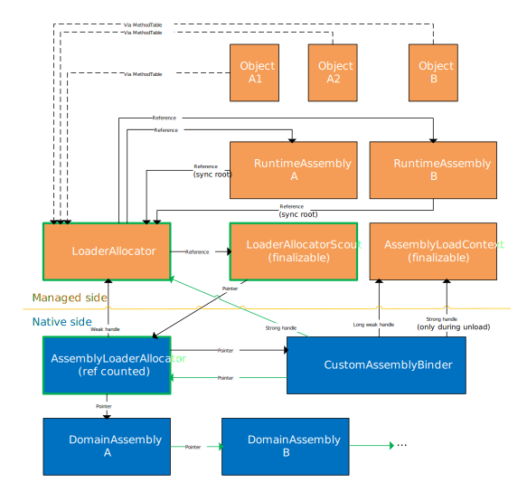

# `AssemblyLoadContext` unloadability
## Goals
* Provide a building block for unloadable plug-ins
* Users can load an assembly and its dependencies into an unloadable `AssemblyLoadContext`.
* There can be multiple unloadable `AssemblyLoadContext` instances coexisting
* Users can unload the `AssemblyLoadContext` when there are no outside hard references to the types and instance of types from the assemblies loaded into the context and the assemblies themselves.
* The unload can be initiated eagerly using explicit `Unload` method or it can happen after all references to the `AssemblyLoadContext` and all the assemblies in it are gone.
## Non-goals
* Forceful unload using thread abort or similar measures to cause threads to stop running with frames of code from the context to be unloaded on the call stack.
## Unsupported scenarios
After investigating all the details, it was decided that we won't support the following scenarios in unloadable `AssemblyLoadContext` unless we get strong feedback on a need to support those.
* Loading IJW assemblies
* Using R2R generated code from assemblies. R2R assemblies will be loaded as plain IL ones.
* Implementation of the FixedAddressValueTypeAttribute
## General scenarios
Based on various discussions and feedback on github, the following general scenarios were often mentioned as use cases for unloadability.
* Plugin scenarios when dynamic plugin loading and unloading is required.
* Dynamically compiling, running and then flushing code. Useful for web sites, scripting engines, etc.
* Loading assemblies for one-off introspection.
## Real-world scenarios
A couple of real-world scenarios were analyzed to assess feasibility of the `AssemblyLoadContext` unloading as a replacement of `AppDomain` unloading and also for possible new usages of the `AssemblyLoadContext` unloading.
### Roslyn
Roslyn has historically used AppDomains for executing different tests that can have assemblies with the same names but different identity or even the same identity, but different contents. `AppDomain` per test was very slow. So, to speed it up, they made them reusable based on the assemblies loaded into them.
* In .NET Core, they use `AssemblyLoadContext` without unloading, one context per test works fine.

In future, the ability to use unloadable plugins in the compiler server would be great. Analyzers execute user code in the server, which is not good without the isolation. Ideally, whenever the compilation is executed with analyzers, it would run inside `AssemblyLoadContext`. The context would get unloaded after the build.
### ASP.NET Core
ASP.NET (not Core) originally used AppDomains to support dynamic compiling and running code behind pages. AppDomains were originally meant as performance and security mean. It turned out that they didn't help with performance much and they provided a false sense of security.
ASP.NET Core moved to a more static model because of the lack of ability to unload stuff. Many of their customers did the same thing too. So, there is no pressing need for unloadability there at the moment.

However, they use two tool that could potentially benefit from the unloadability
* Dotnet watch tool that watches a directory with sources and when a source file changes, it triggers recompilation and re-deployment. So, people can edit a source code used for their web page and the web server gets automatically recompiled and restarted. A need to restart the process negatively affects its performance. So, the ability to unload and reload just the modified assemblies without process restart would be very helpful here. See https://docs.microsoft.com/en-us/aspnet/core/tutorials/dotnet-watch?view=aspnetcore-2.1 for more details on the watch tool usage in ASP.NET Core.
* Compilation server for Razor pages (on demand .cshtml files compilation to .dll). (https://github.com/aspnet/Razor/blob/master/src/Microsoft.AspNetCore.Razor.Tools/CompilerHost.cs)
### LINQPad
LINQPad (https://www.linqpad.net) is a very popular third-party tool for designing LINQ queries against various data sources. It uses AppDomains and their unloading mechanism heavily for the following purposes:
* Isolating drivers (components to access data sources). Drivers can be loaded and unloaded dynamically. There is no graceful shutdown before unloading, but the LINQPad author said it would not be a problem to add a shutdown method to enable it.
* Optional lightweight isolation of query server (executes a query in isolation). The default query servers are isolated using separate processes, but it can be optionally switched to use AppDomains. The LINQPad author believes that only a few users would use that, likely on resource constrained VMs.
* Isolated loading of assemblies and their dependencies for introspection.
* Isolation of building a data context schema (one `AppDomain` per-driver-per-schema).
### Prism
Prism (https://prismlibrary.github.io/) is a framework for building loosely coupled, maintainable, and testable XAML applications in WPF, Windows 10 UWP, and Xamarin Forms. The current version 6 is a fully open source version of the Prism guidance originally produced by Microsoft patterns & practices.

It uses AppDomains for directory catalog implementation. The directory catalog scans the contents of a directory, locating classes that implement `IModule` and add them to the catalog based on contents in their associated `ModuleAttribute`. Assemblies are loaded into a new application domain with `ReflectionOnlyLoad`. The application domain is destroyed once the assemblies have been discovered.

So from the unloadability point of view, the `AssemblyLoadContext` can be used for this purpose here.
## Design
From the API surface perspective, there are only couple of new functions added:
* New constructor for `AssemblyLoadContext` to enable creation of unloadable kind of `AssemblyLoadContext`
* `AssemblyLoadContext.Unload` method to explicitly initiate unloading
* `AssemblyLoadContext.IsCollectible` property to query whether the `AssemblyLoadContext` is unloadable or not.
* `MemberInfo.IsCollectible` and `Assembly.IsCollectible` properties to enable developers to do the right thing for collectible assemblies (e.g. avoid caching them for a long time, etc.)

The design of the feature builds on top of the existing collectible types. The isolation container for this feature is provided by `AssemblyLoadContext`.  All assemblies loaded into an unloadable `AssemblyLoadContext` are marked as collectible.

For each unloadable `AssemblyLoadContext`, an `AssemblyLoaderAllocator` is created. It is used to allocate all context specific memory related to the assemblies loaded into the context. The existing collectible types support ensures this behavior.

The `AssemblyLoaderAllocator` also keeps a list of `DomainAssembly` instances for assemblies loaded into the related `AssemblyLoadContext` so that they can be found and destroyed during the unload.

In addition to that, entries in the `AssemblySpecBindingCache` for assemblies loaded into unloadable `AssemblyLoadContext` are allocated by this `AssemblyLoaderAllocator`.

There are also machine code thunks (tail call arg copy thunk, shuffle thunk cache, JIT helper logging thunk) and unwind info for the thunks that have lifetime bound to the lifetime of the `AssemblyLoadContext`. These were not allocated from a proper `AssemblyLoaderAllocator` in the existing implementation of collectible types. So the thunk related code is updated to fix that.

At unload time, the `AssemblyLoaderAllocator`, its associated managed side helpers `LoaderAllocator` and `LoaderAllocatorScout`, the `CustomAssemblyBinder`, all the related `DomainAssembly` instances and the `AssemblyLoadContext` are destroyed in a coordinated manner. Details of this process are described in a paragraph below.
### Enable unloadability for all the features not supported by the existing collectible types
These are features that were explicitly disabled when collectible assemblies were added to CLR in the past. They were not supported because they were not needed for the use cases of the collectible assemblies and they seemed to have potential non-trivial complexity.
#### Support for interop
Enabling support for assemblies with classes containing interop functions is as easy as removing the check that prevented these assemblies from being loaded.
#### Support for types with thread static members
The thread statics that are of reference types or contain references are stored in managed `object[]` arrays. These arrays are being held alive by strong handles stored in the respective non-managed thread objects. That makes them alive for the whole lifetime of the thread. This is not suitable for thread statics on collectible classes since the thread static instances would be held alive for the whole life of the thread and the `AssemblyLoadContext` would not be able to unload.

To support thread statics on collectible types, their lifetimes need to be bound to both the thread and the `LoaderAllocator` lifetimes. The solution is to use a similar way to what regular statics do. The managed `object[]` arrays that store the references to thread locals of collectible classes are held alive by handles allocated from the respective `LoaderAllocator` instead of global strong handles. That enables them to be collected during the unload.

When a thread terminates, all these handles are freed. This requires a modification of handle allocator in the `LoaderAllocator`, since the existing implementation cannot free individual handles. We need to be able to do that, otherwise the handle table would explode e.g. in case when threads are created and destroyed continuously.

When a `LoaderAllocator` is destroyed, all `ThreadLocalModule` instances for Modules that were loaded into the `AssemblyLoadContext` related to this `LoaderAllocator` are destroyed. The `ThreadLocalModule` instances are stored in `ThreadLocalBlock` of each existing thread.

Also, all checks in the runtime that were disabling usage of thread statics on collectible types need to be removed.
#### Delegate marshaling for types within collectible assemblies
Fortunately, we just need to disable the checks in runtime that prevent delegate marshaling for types within collectible assemblies. The unmanaged to managed thunks are allocated from a global `LoaderAllocator` and they are released when the corresponding managed delegates are collected. So for unloadability, this behavior doesn't need to change in any way.
#### COM Interop for collectible types
The existing COM interop implementation has support for `AppDomain` unloading. For each domain that uses COM interop, an instance of `ComCallableWrapperCache` class is created to manage the interop. It has support for the case when an `AppDomain` is unloaded and managed objects implementing a COM server go away, but a COM client still holds references to the related interfaces. In such case, the COM callable wrapper that forward calls from the COM world to the managed world starts returning failure return codes for all calls, but it is kept alive until all references to the related interfaces are released.

We can reuse the `ComCallableWrapperCache` with only a very minor modifications for `AssemblyLoadContext` unloading. We can move the instance of this cache from `AppDomain` to `LoaderAllocator`. And we can get rid of the functionality that handled the case when COM interfaces outlived the managed objects, as it is not possible with the `AssemblyLoadContext` unloading. The reason is that the managed instances of the COM objects keep the `AssemblyLoadContext` alive and so the unloading can move to the phase when the `LoaderAllocator` is destroyed only after there are no COM references to the interfaces exposed by the managed COM objects.

The After the `AssemblyLoadContext` unload is initiated and the managed `LoaderAllocator` is collected, the `ComCallableWrapperCache` is destroyed in the `LoaderAllocator::Destroy` method.
#### FixedAddressValueTypeAttribute for fields in collectible types
After investigating all the details, it was decided that we won't add support for the FixedAddressValueTypeAttribute unless we get strong feedback on a need to support it.

If we decided to add support for it, we could do it as follows. The fields with `FixedAddressValueTypeAttribute` are always pinned, so their address in memory never changes. For non-collectible types, these fields are held pinned by a pinned `GCHandle`. But we cannot use that for collectible types, since the `MethodTable` whose pointer is stored in the respective boxed instance of the value type would prevent the managed `LoaderAllocator` from being collected.

For collectible types, a new handle table can be added to `LoaderAllocator`. This handle table would be scanned during GC in a special way and all the objects the handles point to will be reported as pinned. The special scanning would be done in `Module::EnumRegularStaticGCRefs`. To pin the objects, the `promote_func` needs to be passed `GC_CALL_PINNED` in the third argument.
## AssemblyLoadContext unloading process
For better understanding of the unloading process, it is important to understand relations between several components that play role in the lifetime management. The picture below shows these components and the ways they reference each other.
The green marked relations and blocks are the new ones that were added to enable unloadable `AssemblyLoadContext`. The black ones were already present before.
The dashed lines represent indirect links from MethodTables of the objects to the `LoaderAllocator`.

### First phase of unloading
Unloading is initialized by the user code calling `AssemblyLoadContext.Unload` method or by execution of the `AssemblyLoadContext` finalizer. The following steps are performed to start the unloading process.
* The `AssemblyLoadContext` fires the `Unloading` event to allow the user code to perform cleanup if required (e.g. stop threads running inside of the context, remove references and destroy handles, etc.)
* The `AssemblyLoadContext.InitiateUnload` method is called. It creates a strong GC handle referring to the `AssemblyLoadContext` to keep it around until the unload is complete. For example, finalizers of types that are loaded into the `AssemblyLoadContext` may need access to the `AssemblyLoadContext`.
* Then it calls `AssemblyNative::PrepareForAssemblyLoadContextRelease` method with that strong handle as an argument, which in turn calls `CustomAssemblyBinder::PrepareForLoadContextRelease`
* That method stores the passed in strong GC handle in `CustomAssemblyBinder::m_ptrManagedStrongAssemblyLoadContext`.
* Then it decrements refcount of the `AssemblyLoaderAllocator` the `CustomAssemblyBinder` points to.
* Finally, it destroys the strong handle to the managed `LoaderAllocator`. That allows the `LoaderAllocator` to be collected.
### Second phase of unloading
This phase is initiated after all instances of types from assemblies loaded into the `AssemblyLoadContext` are gone.
* GC collects the managed `LoaderAllocator`, since there is no strong reference to it anymore.
* Now GC can collect the `LoaderAllocatorScout` too, as the `LoaderAllocator` was holding the only reference to it. The `LoaderAllocatorScout` has a finalizer and when it is executed, it calls the native `LoaderAllocator::Destroy` method.
* This method decrements reference count of all the `LoaderAllocators` that reference this `LoaderAllocator` and then the reference count of this `LoaderAllocator` itself.
* If it was not the last reference, the native `AssemblyLoaderAllocator` must stay alive until there are no references to it, so there is nothing else to be done now. It will be destroyed later in `LoaderAllocator::GCLoaderAllocators` after the last reference goes away.
* If we have released the last reference, the `LoaderAllocator::GCLoaderAllocators` is executed. This function finds all collectible LoaderAllocators that are not alive anymore and cleans up all domain assemblies in them. The cleanup removes each `DomainAssembly` from the `AppDomain` and also from the binding cache, it notifies debugger and finally destroys the `DomainAssembly`.
* The strong and long weak handles to the managed `AssemblyLoadContext` in each of these LoaderAllocators are now destroyed. That enables these related `AssemblyLoadContext`s to be collected by GC.
* Finally, these `LoaderAllocator`s are registered for cleanup in the `AppDomain`. Their actual destruction happens on the finalizer thread in `Thread::DoExtraWorkForFinalizer`. When a `LoaderAllocator` is destroyed, the related `CustomAssemblyBinder` is destroyed too.
