# Mono Thread State Machine

In the course of running managed code, the runtime at times needs to allow a *suspend initiator* to suspend all threads that may be able to manipulate the runtime state.  In order to do this, the runtime requires that threads are *attached* to the runtime.  When a thread is attached, a *thread state machine* is created to represent the thread's behavior.

The thread as well as the runtime may perform a number of *transitions* on the thread state machine in order to guide the thread to a desired *state*.

The mono runtime has several different thread suspend *policies* that can be used to manipulate the thread state.  Only one policy is active during the lifetime of a running runtime.

The policies are:
 Policy | Description
 ------ | -----------
 Preemptive | The runtime uses an asynchronous mechanism to interrupt running threads and suspend them.  This was the default policy in older versions of Mono before we switched to hybrid suspend.
 Cooperative | The runtime relies on threads to periodically poll to check if they have been asked to suspend.  This is the default on platforms without native support for interrupting threads (e.g. without POSIX signals).
 Hybrid | A combination of the above - when threads are running *GC Unsafe* code, they are responsible for polling to check if they need to suspend. When threads switch to running code that will not touch runtime resources (*GC Safe*), they will be preepmtively suspended.

##  State machine protocol

The state of each thread that is attached to the runtime is manipulated by one of several actors:

1. The _suspend initiator_ is some other thread that is trying to stop the world - it will carry out some sequence of actions to reach a state where all non-GC-worked, non-utility threads have been suspended.  There is at most one suspend initiator at a time.
2. The user thread's own code: in cooperative and hybrid suspend the thread is responsible for (a) periodically polling to check if it has been asked to suspend, and (b) informing the runtime when it is transitioning between "GC Safe" and "GC Unsafe states".  There are multiple user threads and they are assumed to be cooperating (ie, they responsibly carry out their part of the protocol).
3. The user threads' signal handler: in preemptive and hybrid suspend on POSIX systems, a signal handler is installed that carries out part of the suspend protocol on behalf of a user thread.

Each transition is implemented by a `mono_threads_transition_NAME` function.  The transition function atomically swaps a single thread's state from its current state to the new state, and returns a value (a boolean or a small enumeration value) that tells the caller what kind of action to take next based on what state the thread was previously in.  If there is contention, the transition functions will retry until the state is no longer changing.  If the current state does not allow a valid transition from the current state to the new state, the transition function will assert.

A combined diagram of all the possible states and transitions is shown below.  Note that not all these states and transitions are possible at the same time - for example the preemptive policy does not have "GC Safe" states.

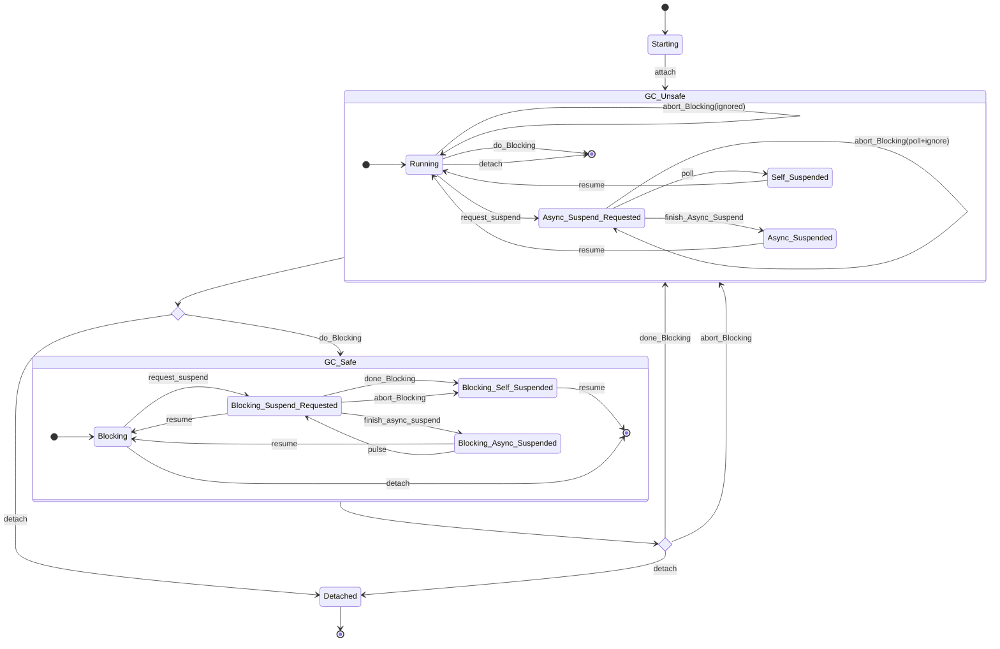

## Preemptive suspend

A diagram of just the preemptive suspend policy:

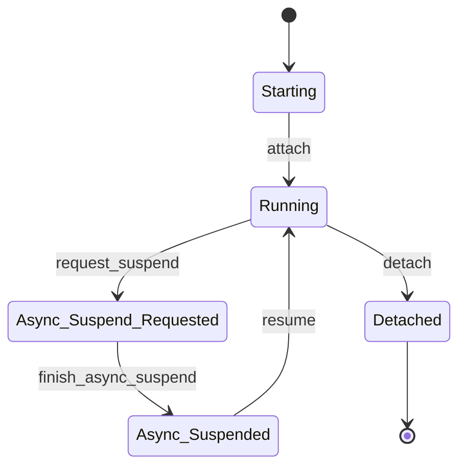

In preemptive suspend, there is no concept of GC Safe or GC Unsafe states, and no polling at all.  Instead, the suspend initiator performs a `request_suspend` transition (for example by calling `SuspendThread` on Windows, or by sending a signal on POSIX), and when the thread is no longer running user code, a `finish_Async_Suspend` transition is performed and the suspend initiator is notified.  (On systems with a syscall for thread suspension (Windows and Darwin) the suspend initiator performs the `finish_Async_Suspend` transition after the syscall returns.  On POSIX, the user thread's signal handler performs the transition before the thread blocks on the resume signal.)

When the suspend initiator is ready to resume the stopped threads it performs a `resume` transition and performs the resume operation (signal on POSIX, syscall on Windows and Darwin).

### Sequence diagrams

Initiating a suspend (POSIX)

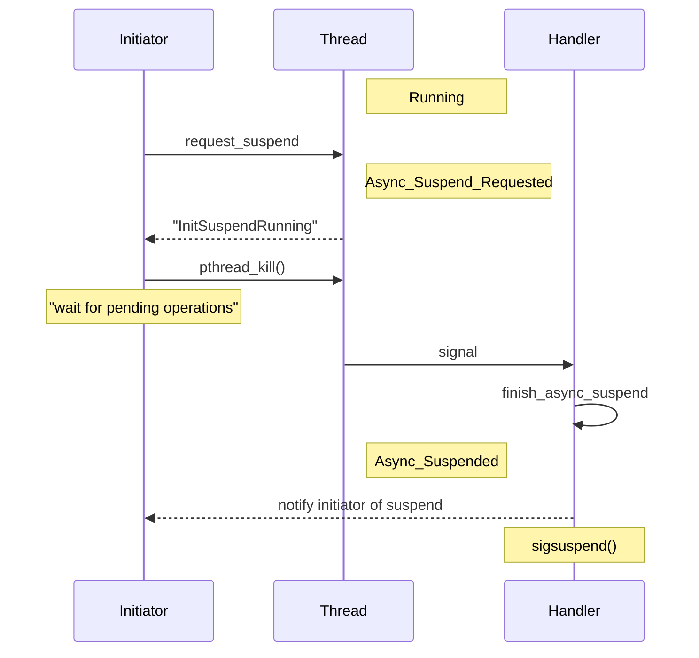

Initiating a suspend (Windows)

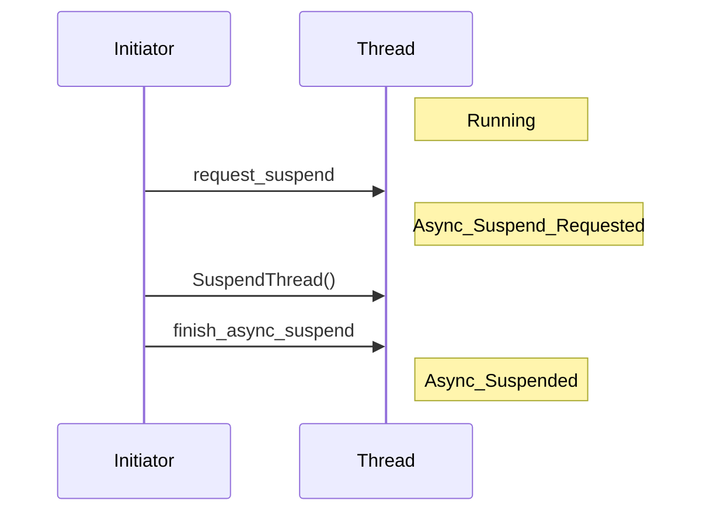

## Cooperative suspend

A diagram of the cooperative suspend policy:

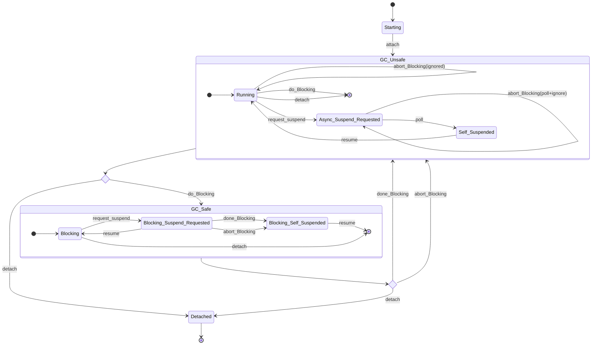

In cooperative suspend, the threads in `GC_Safe` states are always running - they are not blocked at all.  As a result, with this suspend policy, GC Safe code must not be able to manipulate runtime state at all: in embedding scenarios, all native runtime API calls have to be properly wrapped in thread state transitions.  Additionally, memory that may contain references into the managed heap must not be accessed by GC Safe code.  In other words, calls like `sleep()` or `read()` that may block are GC Safe, but calls like `mono_object_new()` are not - unless the thread performs a transition to GC Unsafe.

To suspend a thread, the GC initiator performs a `request_suspend` transition and acts on the result.  If the thread was in a `GC_Unsafe` state, the initiator must wait.  If the thread was in `GC_Safe`, the intiator has no more work to do: it assumes the thread is suspended.

If the thread is in `GC_Unsafe` it must periodically perform the `poll` transition.  If it was `Running`, there is nothing to do.  If it was `Async_Suspend_Requested` it moves to the `Self_Suspended` state and notifies the initiator.

Additionally threads must perform *blocking* transitions to notify the runtime of their intention to move between `GC_Safe` and `GC_Unsafe` states.

When a thread wants to move from the `GC_Unsafe` to the `GC_Safe` state, it performs a `do_Blocking` transition.  Entering `GC_Safe` cannot be nested: it is illegal to perform a `do_Blocking` transition from a `GC_Safe` state.  If the thread is `Running` it moves to the `Blocking` state (and keeps running - it is logically blocked from the point of view of the runtime).  If the thread was in the `Async_Suspend_Requested` state, it must perform a `poll` transition and self-suspend and then retry the `do_Blocking` transition after it is resumed.

To return from a `GC_Safe` state to `GC_Unsafe` the thread performs a `done_Blocking` transition.  It is illegal to perform a `done_Blocking` transition in a `GC_Unsafe` state.  If the thread was `Blocking`, it returns to `Running`.  If the thread was in a `Blocking_Suspend_Requested` state, it must self-suspend and the suspend initiator will put it in the `Running` state when the thread is resumed.

There is an additional transition `abort_Blocking` that a thread can perform if it wants to move to a `GC_Unsafe` state, but it is unsure whether it is in GC Safe or GC Unsafe state currently.  This is done, for example, as a wrapper around embedding API calls that may be called both from inside the runtime (assumed to be in `GC_Unsafe`) and from P/Invokes (assumed to be in `GC_Safe`).

If a thread performs an `abort_Blocking` and it was already in a `GC_Unsafe` state (`Running` or `Async_Suspend_Requested`), the state is unchanged and the thread is informed it was already in the desired state. Consequently when the thread is done with the embedding API call, it doesn't need to do anything.

If a thread performs an `abort_Blocking` and it was in `GC_Safe`, it behaves like a `done_Blocking` transition, and either the thread moves to `Running`, or it will move to `Running` after it is resumed.  Consequently, when the thread is done with the embedding API call, it is obligated to do a `do_Blocking` transition to go back to `GC_Safe`.

### Sequence diagrams

Initiating a suspend, thread is GC Unsafe:

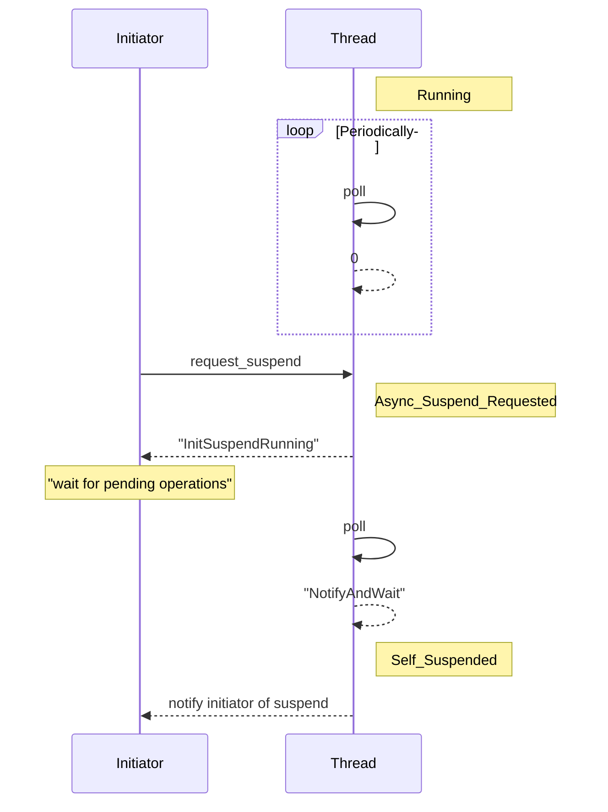

Initiating a suspend, thread is in GC Safe:

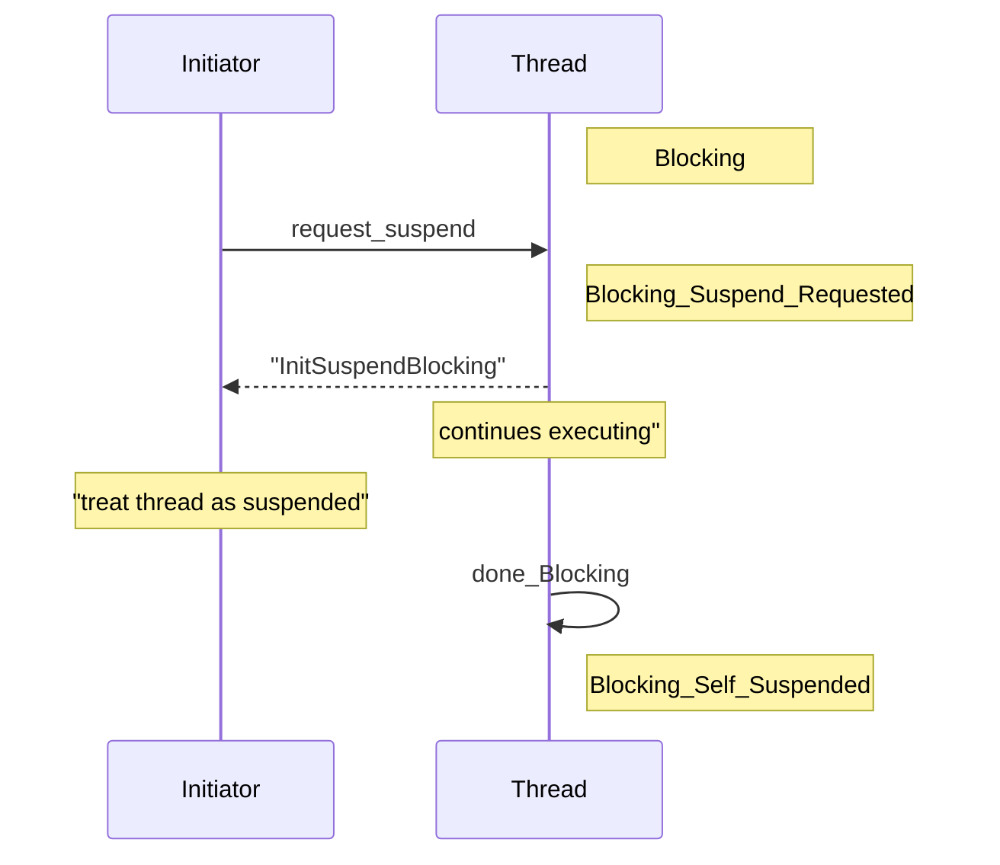

Resuming a GC Safe thread before it self-suspends:

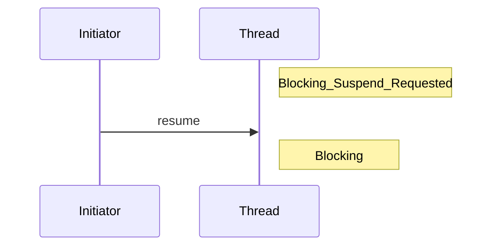

Resuming a GC Safe thread after it self-suspends:
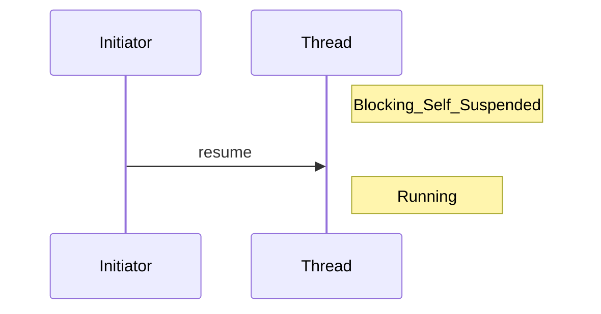

Transitioning from GC Unsafe to GC Safe, if no suspend has been requested:

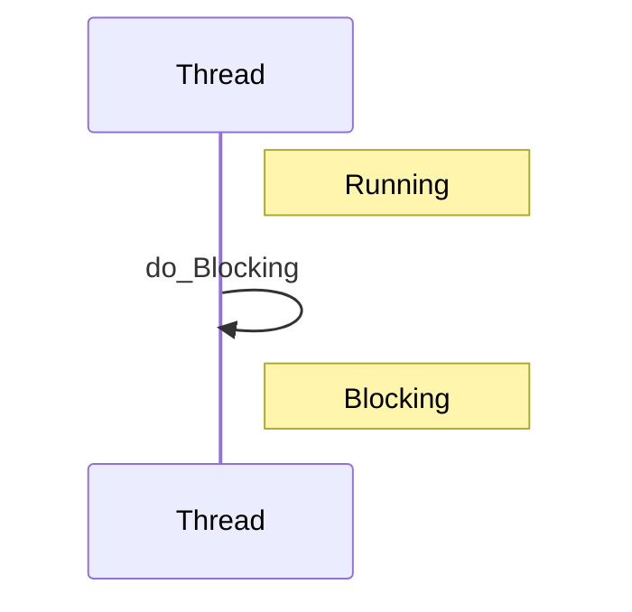

Transitioning from GC Unsafe to GC Safe, if a suspend was requested:
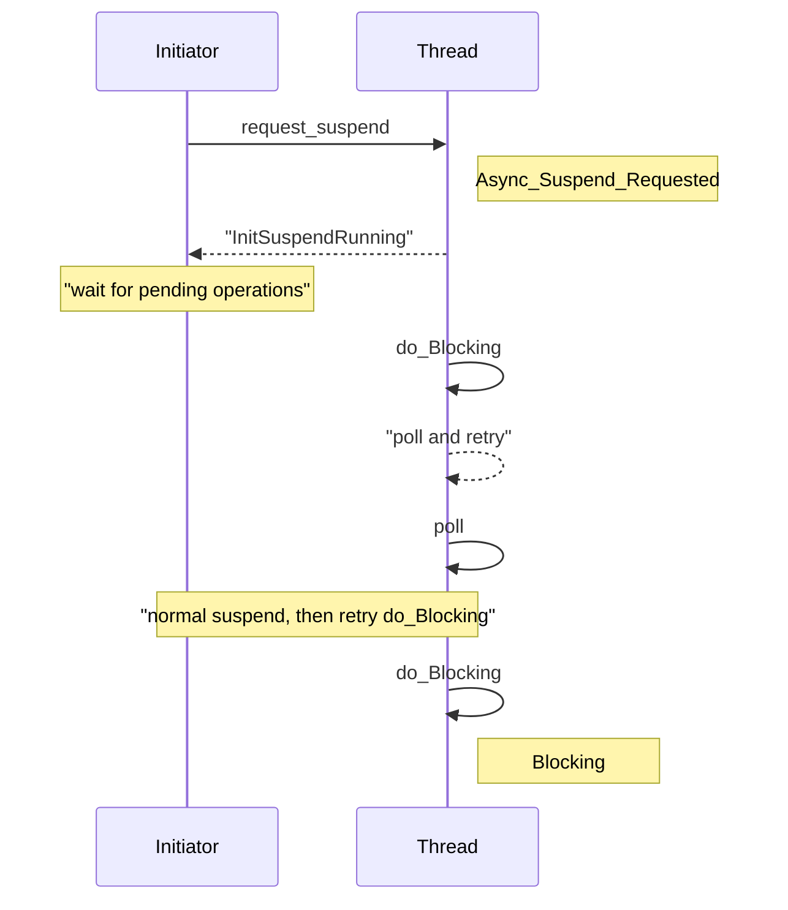

## Hybrid suspend

A diagram of the hybrid suspend policy:

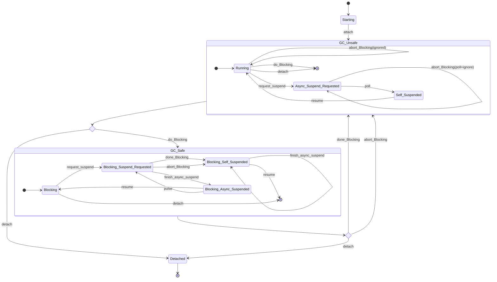

Hybrid suspend is a combination of cooperative and preemptive suspend.
Threads that are `GC_Unsafe` are suspended cooperatively, while `GC_Safe` threads are preemptively suspended.  This allows threads that are executing critical runtime code to delay suspension until the next polling opportunity.  As a result we can avoid suspending while holding critical runtime locks, allocating memory visible to the GC, or other global state changes.

In hybrid suspend there are several additional states, and an additional `pulse` transition to deal with native threadpool threads (below).

User threads in `GC_Unsafe` periodically perform the `poll` transition, as in cooperative suspend.

User threads in `GC_Safe` states can suspend either by reaching a transition out of `GC_Safe` (ie they attempt a `done_Blocking` or `abort_Blocking` transition), or by being preemptively suspended by the suspend initiator.  As a result there are two possible suspended states: `Blocking_Self_Suspended` (tried to do a `done_Blocking`  or `abort_Blocking` transition) or `Blocking_Async_Suspended` (suspend initiator performed an `finish_async_suspend` transition).

When resuming, if a thread was `Blocking_Self_Suspended` it finishes the `done_Blocking` or `abort_Blocking` transition and goes to a `GC_Unsafe` state.  If it was in `Blocking_Async_Suspended`, then it resumes still in `GC_Safe` and goes back to the `Blocking` state.

### State diagrams

Largely the same as preemptive or cooperative suspend.

One difference is suspending threads in GC Safe is more complicated.  The thread could reach a transitiout out of GC Safe before the initiator has a chance to asynchronously suspend the thread.

Suspending a GC Safe thread using `SuspendThread` on Windows is show below, the posix diagram is similar, except the signal handler performs the finish action and must decide whether the thread is already suspended or not:

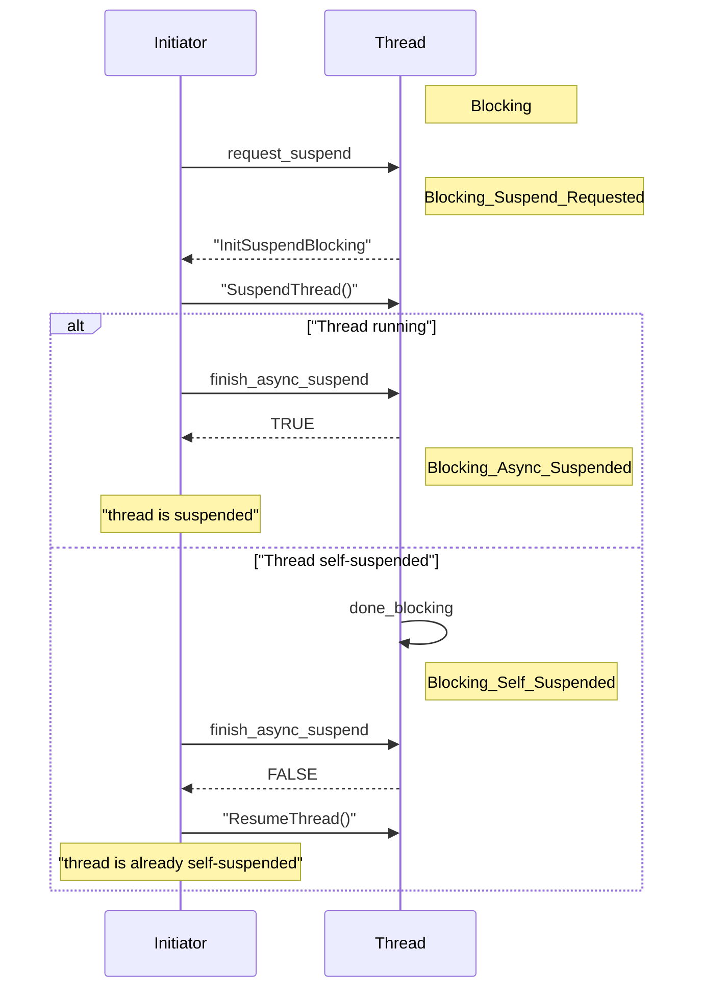

### Two phase suspension in hybrid suspend

There is a race condition that can happen with two user threads and a suspend initiator thread in hybrid suspend.

This happens when there is a system resource that is protected by a lock that is not exposed to the runtime.  (For example on linux, the dynamic linker uses a pthreads mutex in certain critical areas: as a result any function call (which triggers dynamic symbol resolution) can take a lock).

Consider a system lock that is not protected by runtime thread state transitions. (That is, a thread in `GC_Unsafe` state isn't able to attempt a transition to `GC_Safe` before trying to take the lock).

1. Thread A is in a `GC_Safe` state and it wants to take the lock.
2. Thread B is in a `GC_Unsafe` state and it holds the lock.
3. The suspend initiator initiates a suspend.
4. Thread A is preemptively suspended while holding the lock.
5. Thread B attempts to take the lock, because it hasn't reached its polling location yet.
6. There is now deadlock:
    * Thread A is waiting for the suspend initiator to resume it
    * Thread B is waiting for the lock held by Thread A
    * The suspend initiator is waiting for Thread B to self-suspend

The solution is a two phase hybrid suspend:

1. In the first phase, threads are asked to cooperatively suspend.  That is, threads in `GC_Unsafe` are asked to suspend in the usual manner, while threads in `GC_Safe` states get a `request_suspension` transition from the suspend initiator, but this is not followed by the suspend signal or syscall.  If the threads reach a `done_Blocking` or `abort_Blocking` transition, they will self-suspend, otherwise the will keep running in the `Blocking_Suspend_Requested` state.
2. In the second phase, any threads that haven't suspended are preemptively suspended by sending them a signal or syscall and performing the `finish_async_suspension` transition.

### Critical locations and native threadpool threads

As noted in the motivation for hybrid suspend, one of the problems with preemptive suspend is that it may interrupt threads at an inconvenient time.  With hybrid suspend we avoid suspending threads when they're using critical runtime resources, but they can still be in a critical location with respect to OS resources.

One such situation happens with native threadpools (for example GCD on Darwin).  We don't want to suspend threads that the operating system has parked.  (This can happen because the thread is still registered with the runtime because it previously ran managed code, but it is currently not running code on behalf of the runtime).

The suspend initiator can detect that some threads were preemptively suspended in a "critical location".  In this case we resume the threads and try to suspend them again, hoping that they will get to run for some time and reach a more suitable location.

The problem is that with two-phase suspend, once we resume a `GC_Safe` thread, we don't want it to transition to `GC_Unsafe` right away before we have a change to ask it to suspend again.  If that happens, we have to wake up the cooperatively suspended threads, too and repeat the entire two-phase suspend. (If we allow a thread to escape to `GC_Unsafe` while we're in the second phase, it could take a system lock and we get the deadlock described above).

As a result, the new `pulse` transition is used to wake up threads in critical locations.  The transition takes them back to `Blocking_Suspend_Requested`, which means they will get a chance to self-suspend, but if they don't we will preemptively-suspend them once again.
