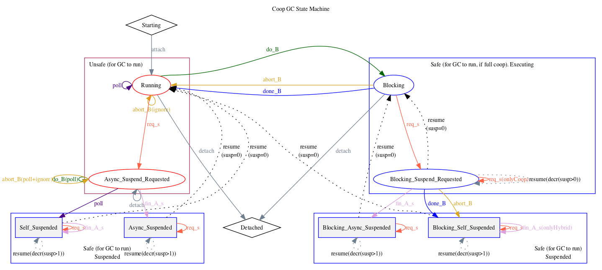

# Runtime Cooperative Suspend

## Intro: Preemptive, Cooperative and Hybrid Suspend

The runtime needs to be able to suspend threads to perform all sorts of tasks, the main one being garbage collection.
Those threads need to be suspended from another and historically Mono used signals (or similar APIs) to do it.

The basic problem is that when the runtime needs to stop threads (for example at some steps during GC) there are two general approaches:
* Preemptive - the runtime sends a signal to the thread and the signal handler for the thread puts it to sleep until it gets a resume signal. (or on Windows or Apple OSes, it uses a kernel calls to stop the thread).
   The problem of using signals is that threads are suspended at arbitrary points in time, which requires the suspender
thread to run in the equivalent of signal context - a very very restrictive setup. Not only that, but the fact that
threads could be suspended while holding runtime and libc locks meant that not even basic things like printf were available.
   Also on some platforms (watchOS, WebAssembly) we don't have enough OS facilities to examine the context when a thread is suspended - we can't see the contents of their registers, or their stack, and thus preemptive suspend on those systems wouldn't be useful for GC and other runtime operations that need to examine the state of suspended threads.
* Cooperative - The alternative is to use cooperative suspend, where threads suspend themselves when the runtime requests it. To make
this possible, frequent polling and checkpointing are required. This is a well understood model that goes along what
the industry does.
   With this, as long as the thread is running managed code, it will eventually reach a safepoint and suspend itself.  The advantage is that it will always be in a "nice" place.
   There is more to keep track of in cooperative mode when a thread calls native code - while it's in native it won't have safepoints and it might block for arbitrary amounts of time.  So the runtime marks all the places where a thread goes from managed code ("GC Unsafe" - because it can manipulate managed memory) to native code ("GC Safe" - because it's not supposed to access managed memory).  When the thread is in GC Safe mode instead of trying to suspend it, we just let it run until it tries to come back to GC Unsafe mode.
   The problem with cooperative suspend is that it relies on nice (cooperating) behavior from embedders and from native code - if the native code calls back into Mono suddenly it might be running managed code again when the GC thinks that it is not.  And that can cause problems.   So to use preemptive mode, the native code has to be explicitly annotated with GC transitions - telling the runtime when the thread is switching between GC Safe and GC Unsafe modes.
* Hybrid suspend - a combination of the previous two approaches.  While the thread is in managed code or in the Mono runtime itself, it is in GC Unsafe mode.  In GC Unsafe mode we will try to suspend it cooperatively by expecting the thread to reach a safepoint and suspend itself.   But when the thread calls out to native code we switch it to GC Safe mode and start preemptively suspending it.  That way no matter what kind of native code it is running, we will stop it and it won't be able to invalidate our assumptions by touching managed memory or calling runtime functions.
   Hybrid suspend requires even more bookkeeping (every embedding API function needs to switch from GC Safe mode to GC Unsafe on entry and back on exit), but all the bookkeeping is done by the runtime, not by the user code.
  So hybrid suspend is a good approach because the embedder code doesn't need to be aware of it - it behaves just like preemptive.  But at the same time it is less likely to suspend the thread in a state that is inconvenient for the runtime, unlike preemptive suspend.

## How cooperative and hybrid suspend works

Cooperative suspend limits what a suspender thread can do to simply request that the target thread suspends itself.
The target thread can serve a suspend in two manners, by frequently polling its state or checkpointing its state
at points the runtime loses control of the thread (pinvoke, blocking syscall).

We can split code in 3 categories: managed, runtime native code and foreign native code. This tells how coop suspend happens.

### Managed code

Managed code will check for suspend requests on function prologue, catch handlers and the back-edge of loops. This ensures that
a suspend will be served in a bounded amount of time. Those suspend checks are done at what's referred as safepoints.

This is implemented in mini.c:mono_insert_safepoints. It will add OP_GC_SAFE_POINT ops around the method.
Then each backend will emit machine code for those new ops. [1]

### Foreign native code

This includes pinvokes and arbitrary native code when the runtime is embedded. Foreig code doesn't touch managed objects
so it's safe for the GC to ignore both the stack and the code being executed by those.

Before executing a pinvoke, we save the current thread registers and transition it to the equivalent of the suspended state.
It means the GC can take the saved state as is and ignore that the thread keeps running.

### Runtime native code

This encompasses all runtime code, metatada, utils and mini. Special care must be taken to icalls.
Runtime code is different as it operates on raw object pointers, meaning that the GC must be aware of them.
To do so we handle runtime code just as managed code, except we don't get safepoints automatically inserted for us.

Manual insertion of polling code and checkpointing must be done in the runtime. In addition to that, we must be careful
of how we access managed memory once we save the thread state.

## Current Implementation

The current implementation is a state machine that tells what's the current status of a thread. These are the
states:

* Starting: Initial state of a thread, nothing interesting should happen while in this state.
* Detached: Thread is shuting down, it won't touch managed memory or do any runtime work.
* Running: The thread is running managed or runtime code.  There are no pending suspend requests.
* AsyncSuspendRequested: The thread is running managed or runtime code and another thread requested that the current thread be suspended.
* SelfSuspended: Thread suspended by itself.  This happens if a thread tried to switch to blocking, but there was a pending suspend requested and the thread suspended itself instead.  It will go back to running and the switch to blocking will be retried.
* AsyncSuspended: Thread was async suspended, so it's on a signal handler or thread_suspend was called on it. (This state never happens when running threads are cooperatively suspended)
* Blocking: The current thread is executing code that won't touch managed memory.  There are no pending suspend requests.
* BlockingSuspendRequested: The current thread is executing code that won't touch managed memory, and someone requested it to suspend.  In full cooperative mode, the thread is assumed to still be suspended.
* BlockingSelfSuspended: The current thread finished executing blocking code but there was a pending suspend against it, it's waiting to be resumed.
* BlockingAsyncSuspended: The current thread was executing in blocking code, but it was preemptively suspended.  This is done in "hybrid" suspend mode.  When the thread resumes, it will go back to executing blocking code.



In addition to those states, there are a number of transitions, that are used to move a thread from one state to another.

## mono-threads.c, mono-threads-coop.c, mono-threads-state-machine.c

Thread suspension is modeled with a state machine, which means there are a bunch of transitions. Those
are implemented in mono-threads-state-machine.c. One function per transition. All manipulation of the thread_state variable happens
here. New functions must follow the same template of the existing ones and must include every state either on the switch or on the comments.

mono-threads.c is the portable implementation of the threading infrastructure. Which there are multiple backends that implement target
specific functionality. The amount of ifdefs here should be kept at a minimum.

mono-threads-coop.c is the cooperative backend. It doesn't use any async APIs provided by the OS.

## Adding coop to the runtime

The runtime code must satisfy two properties to work with cooperative suspend, It must suspend in bounded time, by polling and
check pointing before blocking, and it must coordinate with the GC when accessing the managed heap.

We combine those two properties together are they are completementary. Every region of code in the runtime is then classified
in one of 3 kinds, which tells what can and can't be done.

### GC unsafe mode

Under this mode, the GC won't be able to proceed until explicit polling or a transition to GC Safe mode happens.

* Can touch managed memory (read/write).
* Can call GC Unsafe or GC Neutral functions.
* Can pass managed pointers to GC Safe regions/functions through pinning
* Can return managed pointers
* Cannot call foreign native code (embedder callbacks, pinvokes, etc)
* Cannot call into blocking functions/syscalls
* Cannot be detached

## GC safe mode

Under this mode, the GC will assume the thread is suspended and will scan the last saved state.

* Can call into foreign functions.
* Can call into blocking functions/syscalls
* Can call GC Safe or GC Neutral functions
* Can read from pinned managed memory
* Cannot touch managed memory (read/write)
* Cannot be detached

## GC Neutral mode

This mode only signals that the function works under Safe and Unsafe modes. The actual effect on the GC will depend
on the dynamic mode the thread is when the function is executed.

* Can call GC Neutral functions
* Cannot call into foreign functions.
* Cannot call into blocking functions/syscalls
* Cannot read from pinned managed memory
* Cannot touch managed memory (read/write)
* Cannot be detached

There's a special group of functions that are allowed to run detached. All they are allowed to do is
attach, pick a GC mode and call into regular GC functions.

All functions can transition from one mode to the other and then back. The runtime provides macros that
make a region of a function run in a different mode. Those macros are defined in mono-threads-coop.h.

Those macros define a possible transitions between GC safe/unsafe. They are:

### MONO_SUSPEND_CHECK

This polls the current GC state and possibly suspend the thread.
Ok only under GC unsafe mode.

Use it when a huge computation is happening with no explicit blocking happening.

### MONO_PREPARE_BLOCKING / MONO_FINISH_BLOCKING

Creates a C lexical scope. It causes a transition from Unsafe to Safe mode.
Ok only under Unsafe mode.

Great around a syscall that can block for a while (sockets, io).
Managed pointers *cannot* leak into the GC Safe region, as the GC might run while the thread is in this section, and move the referenced object around in the managed heap, leading to an invalid naked object pointer. For example, the following code is broken:

```c
MonoArray *x;
int res;
MONO_PREPARE_BLOCKING
res = read (1, mono_array_addr (x, char, 0), mono_array_length (x), 0); // if a GC run while read is blocked in the OS, the object x might be moved, and x would then point to garbage, or worst, in the middle of another object. And whenever the OS would write into the buffer passed to read, it would override managed memory.
MONO_FINISH_BLOCKING
```

To safely use an object reference in a GC safe section, the object needs to be pinned in the managed heap with a GC handle, and you cannot access any ref field on this object.

### MONO_PREPARE_RESET_BLOCKING / MONO_FINISH_RESET_BLOCKING

Creates a C lexical scope. It causes a transition to Unsafe mode. Resets to the previous mode on exit.
Ok under any mode.

This covers the case where code was expected to be in GC Safe mode but it now needs to be under GC Unsafe.

For example, the first call to a pinvoke will hit a trampoline that needs to move the runtime back into GC Unsafe
mode before going around resolving it. Once the pinvoke is resolved, the previous mode must be restored.

## Managed object handles

Mono coop handles (`MonoObjectHandle`) allow native code to hold a
handle to a managed object.  While currently raw pointers to managed
objects in native code work without problems, they do so only because
we use a conservative technique when the garbage collector is scanning
the native stack: every object that looks like it may be referenced
from the native stack is pinned.

In the future, we want to move away from conservative scanning, and
coop handles give native code a way to coordinate with the GC.

TODO: Document this more

### MONO_PREPARE_GC_CRITICAL_REGION / MONO_FINISH_GC_CRITICAL_REGION

When a thread is in Unsafe mode and uses the coop handles, it may need
to enter a *GC critical region* where it is manipulating the managed
objects in a non-atomic manner and must not be interrupted by the GC.

In a GC critical region:

* The thread *must not* transition from Unsafe to Safe mode.
* The thread *may* use `gc_handle_obj` to get a raw pointer to a managed object from a coop handle.

GC critical regions may be nested (for example, you may enter a GC
critical region and then call a function that again enters a GC
critical region).

#### MONO_REQ_GC_CRITICAL and MONO_REC_GC_NOT_CRITICAL

In checked Mono builds, this pair of macros can be used to assert that
the thread is (respectively, isn't) in a GC critical region.

## Debugging

There are two debug helpers in place. The first is the thread state dump when we fail to suspend in time.
It dumps the thread state of each thread plus a cue card on the beginning to help us parse it.

The second one are the toggles in mono-threads.h for specific logging of threading events. Those are VERY verbose
but do help figure out what's going on.

## Known issues

### Can't handle the embedding API

The current system doesn't take into account the runtime being used embedded. This boils down to a couple of issues.
First, if a native thread calls into managed then keep doing its thing. We might not be leaving the thread in the
appropriate state.

Second, the embedding API allows for raw object access, which is incompatible with coop. We need to figure out how to expose
coop to embedders.

### Thread start/finish still bad

There are a lot of hacks around how we handle threads starting and finishing. If a suspend hits a thread while it's
starting/finishing we fail every now and then.

### Non nested blocking state

An early decision that I made was to disallow nested blocking states. It was forbidden because it's more complicated and
could hide bugs in between the nesting. The downside is that it's hard to cover large blocks of code under a single blocking region.

### Thread attach/detach

This aspect of the runtime is due to some revision. I don't think it goes well with what we need now.

## References

[1] <https://github.com/mono/mono/commit/0e12ff3017d470676e94e561cd0de4ca22230532>
