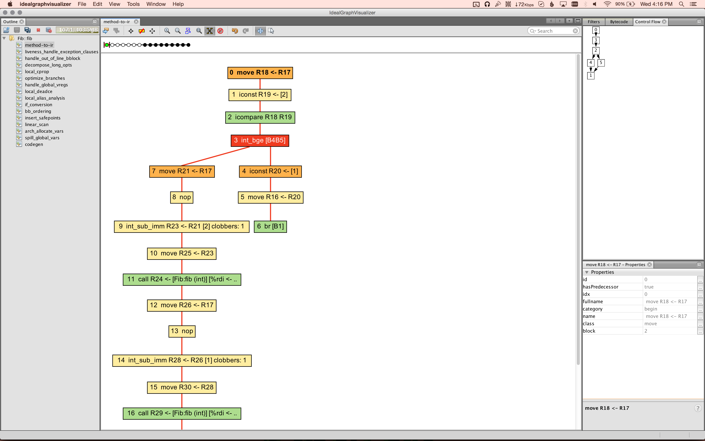

# Other notes

## Faster runtime builds

To speed up runtime builds, use one or more of the following:

-   Turn off optimization by passing CFLAGS=-O0 to configure.
-   Turn off generation of libmono by passing --disable-libraries to configure.
-   Turn off boeh support by passing --disable-boehm to configure.
-   Build in parallel, i.e. using make -j4.
-   Use ccache by passing CC="ccache gcc" CXX="ccache g++" to configure.

## Runtime debugging methods

### Debugging crashes which don't happen inside gdb, or only happen when a test program is ran in a loop

Set the MONO_DEBUG env variable to 'suspend-on-sigsegv'. This causes the runtime native SIGSEGV handler to spin in a loop, so gdb can be attached to the running process.

### Setting native breakpoints in managed methods

Use the --break \<METHOD> command line argument. The JIT will generate a native breakpoint (INT on x86) into the prolog of the given method. Use --break-at-bb \<METHOD> \<bb num> to set a breakpoint at the start of a given basic block.

### Displaying JIT debug output

Use the -v -v -v -v command line argument. Set the MONO_VERBOSE_METHOD env variable to display output for only one method.

### Dumping JIT IR to IGV

Set `MONO_JIT_DUMP_METHOD` to specify a method to dump over network to a running instance of the [IdealGraphVisualizer (IGV)](http://ssw.jku.at/General/Staff/TW/igv.html). An IGV build that is compatible with the implementation in Mono is available for [Mac/Linux/Windows](https://github.com/lewurm/GraalJVMCI8/releases/tag/v0.1) and requires at least JRE 1.7 to run.

On Mac:

``` bash
$ # unpack zip file
$ open idealgraphvisualizer
.
```

For Linux there's `bin/idealgraphvisualizer` and for Windows there's `bin/idealgraphvisualizer.exe`. After starting IGV, it will listen on port 4445 and is ready to receive graphs.

Here an example for dumping the IR of a method:

``` bash
$ cat fib.cs
using System;

public class Fib {

        public static int fib (int n) {
                if (n < 2)
                        return 1;
                return fib(n-2)+fib(n-1);
        }
        public static int Main (string[] args) {
                int repeat = 1;

                if (args.Length == 1)
                        repeat = Convert.ToInt32 (args [0]);

                // Console.WriteLine ("Repeat = " + repeat);

                if (repeat > 32) {
                        Console.WriteLine ("{0}", fib (repeat));
                        return 0;
                }

                for (int i = 0; i < repeat; i++)
                        if (fib (32) != 3524578)
                                return 1;

                return 0;
        }
}
$ csc fib.cs
$ MONO_JIT_DUMP_METHOD=Fib::fib mono fib.exe
cfg_dump: create context for "Fib::fib"
```

now switch to IGV, you should see something like that: [](images/igv-screenshot.png)

you can explore the different compiler passes in the navigation bar on the left side. IGV also has a graph diff feature:

[](/images/igv-diff.png)

### Displaying runtime debug output

Set the MONO_LOG_LEVEL env variable to 'debug'. The log output is useful for diagnosing assembly loading/AOT/pinvoke problems.

### mono_debug_count ()

This is useful for debugging problems where a piece of code is executed many times, and we need to find out which run causes the runtime to misbehave, i.e. which method is miscompiled by the JIT etc. It works by changing

``` bash
do_something ()
```

To:

``` bash
if (mono_debug_count ()) {
  <do something>
}
```

mono_debug_count () is controlled by the COUNT env variable, the first COUNT times it is called, it will return TRUE, after that, it will return FALSE. This allows us to find out exactly which execution of \<do something> causes the problem by running the application while varying the value of COUNT using a binary search.
