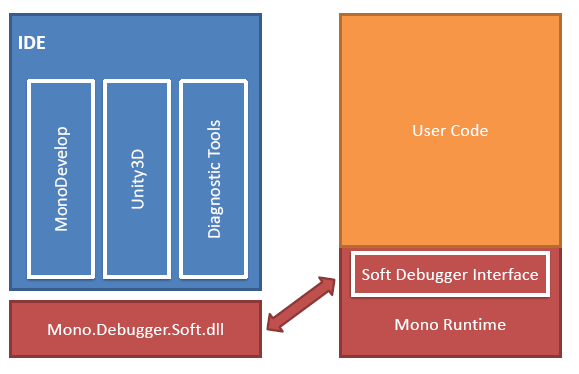

# Soft-Mode Debugger

The Mono Soft Debugger is a new debugging framework for Mono. Unlike regular debuggers which act as all-knowing and controlling programs that control a separate process, the Mono Soft Debugger is actually a cooperative debugger that is built into the Mono runtime.

Applications communicate with the Mono runtime and request debugging operations to be performed on the target process.

 The Mono Soft Debugger first became available with Mono 2.6 and is primarily used today with [Mono on the iPhone](http://monotouch.net) and is used from the [MonoDevelop IDE](http://monodevelop.com).

Architecture
------------

The following diagram is useful in the discussion of the soft debugger:

The soft debugger lives inside the Mono runtime. Debuggers communicate with this component with a compact protocol over a socket connection. For ease of use the protocol has been encapsulated in the Mono.Debugger.Soft.dll API which different IDEs can use to communicate with the target.

The soft debugger work both with Just-in-Time compiled code, and with [batch compiled code](/docs/advanced/aot/) allowing it to debug both regular Mono applications on a desktop, or applications on devices like the iPhone or the [PlayStation 3](/docs/about-mono/supported-platforms/playstation3/).

### Debugger Agent

The debugger agent is a module inside the mono runtime which offers debugging services to client programs.

### Wire Protocol

Clients communicate with the agent using a wire protocol over a socket transport. Read our [Soft Debugger Wire Protocol](/docs/advanced/runtime/docs/soft-debugger-wire-format/) document for details about the protocol.

The wire protocol is inspired by the [Java Debug Wire Protocol](http://java.sun.com/j2se/1.5.0/docs/guide/jpda/jdwp-spec.html).

### Client library

The client library is a C# assembly which uses the wire protocol to communicate with the debugger agent running inside the mono runtime. It is based on the [Java Debug Interface](http://java.sun.com/j2se/1.5.0/docs/guide/jpda/jdi/). The assembly is named Mono.Debugger.Soft.dll, and its source is in mcs/class/Mono.Debugger.Soft.

Implementation
--------------

### Agent

The source code is in mini/debugger-agent.{h,c}. Unlike the JDWP agent in Java, the debugger agent is tightly integrated with the mono runtime because mono doesn't have a tool interface with similar capabilities as JVMTI in Java.

#### Design

The design for the agent was to choose solutions which were easy to implement, they can be improved later. This means that some things like step out/over can be very slow, the code generated by the JIT when debugging is enabled is larger/slower etc.

#### The debugger thread

The agent starts its own thread which it uses to communicate with clients using the wire protocol.

#### Event handling

On startup, the agent registers callbacks for events using the mono profiler interface. When a callback is called, it searches the list of event requests for a request matching the event type. If one is found, the event is sent to the client using the wire protocol.

#### Suspend/Resume

Suspending/Resuming the runtime is the most complex part of the debugger agent. There are many complications: - threads running managed code/native code/transitioning between the two. - threads starting up/terminating. - multiple suspend/resume operations happening in parallel.

Threads running native code can't be suspended, because they can hold locks which are needed by the debugger and the rest of the runtime to function. So they are left running, and are only suspended when they enter managed code. We save enough state at managed-\>native transitions to be able to produce stack traces and examine the state of stack frames. However, debugger invocations are not supported on threads which are running managed code, so property evaluation is not possible on these threads.

A suspend can be started by a normal runtime thread when it receives an event which asks for the runtime to suspend, or it can be started by the debugger thread in response to a VM.Suspend command. In contrast, a resume can only be started by the debugger thread in response to a VM.Resume command.

Threads running managed code are suspended by turning on single stepping, and suspending the thread when it reaches the single step event handler. Threads running native code are treated as suspended.

A suspend can be started by calling suspend_vm (), which is an async operation. This means that when the client receives an event, the runtime might not be entirely suspended yet, so code which needs the runtime to be suspended like the stack frame processing code needs to call wait_for_suspend (). After starting a suspend, the thread needs to suspend itself by calling suspend_current ().

#### Sequence points

A sequence point is an IL offset where the program can be stopped and its state can be examined. Currently the debugger determines sequence points automatically. A sequence point is placed at the places:

-   IL offsets where the IL stack is empty. This generally corresponds to the end of C# statements.
-   IL offsets which contain the NOP IL instructions. This can be used by a compiler to insert extra sequence points, like between nested calls.
-   IL offsets which have a corresponding line number entry in the .mdb file.

The mdbdump tool in mcs/tools/mdbdump can be used to examine the line number tables inside an .mdb file.

A sequence point is represented by the JIT opcode OP_SEQ_POINT. The JIT backends generate code from this opcode which implements single stepping/breakpoints.

#### Single Stepping

The implementation of single stepping is target specific. On most platforms, it is implemented by allocating a memory page and having the implementation of OP_SEQ_POINT read from that page. Single stepping is then turned on by read-protecting that page, causing the memory read to turn into a SIGSEGV or similar signal. The signal handler needs to determine whenever the signal was caused by access to this page, and if it is, transfer control to the single step handler code in the debugger agent.

Step over/out is implemented by single stepping repeatedly until the condition becomes true (i.e. we reach a different line/parent frame).

#### Breakpoints

Breakpoints are usually implemented similarly to single stepping, by reading from a memory page. OP_SEQ_POINT generates a few nops to act as a placeholder, then the code to read from the trigger page is written to the JITted code when the breakpoint is enabled, and changed back to nops when the breakpoint is disabled.

#### AOT support

AOTed code can be debugged by compiling it with the 'soft-debug' aot option, i.e: mono --debug --aot=soft-debug foo.dll

In the AOT case, the code can'be be patched at runtime, so breakpoints are implemented by reading from per-method table with one entry per sequence point, which is either NULL or points to the breakpoint trigger page.
