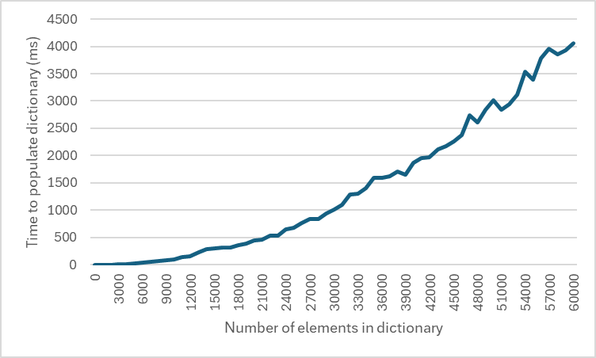

# Security design doc for `Dictionary<TKey, TValue>` and `HashSet<T>`

## Summary

To avoid algorithmic complexity attacks, instantiate these types using only the type arguments `Dictionary<string, ...>` and `HashSet<string>`, and only when constructed from inbox `StringComparer` instances (preferably _Ordinal_ and _OrdinalIgnoreCase_) or _null_ as the comparer (see _Appendix B_).

Other generic instantiations - `Dictionary<int, ...>`, `Dictionary<long, ...>`, `Dictionary<Guid, ...>`, `Dictionary<Tuple<...>, ...>` - and their `HashSet<T>` counterparts are not by default guaranteed secure against untrusted input. Callers must construct their own secure comparers (see _Appendix A_).

See the section _Serialization-specific security concerns_ for analysis on using a serializer to rehydrate dictionary instances from an untrusted payload, including a list of requirements placed on the consumer.

## Outline

This document discusses:

- The design philosophy of `Dictionary<...>` and `HashSet<...>`
- Security promises and non-promises made by the types
- Expected usage patterns and data flow through the types
- Considerations when deserializing instances of these types
- Discussion of potential future improvements

## Introduction and scope

The `System.Collections.Generic.Dictionary<TKey, TValue>` and `System.Collections.Generic.HashSet<T>` types are foundational collection types in the .NET ecosystem. The types' widespread use means that there's an implicit assumption on their security guarantees as part of a consumer's own security analysis.

A dictionary fundamentally consumes two types of data:
- An optional comparer, provided at construction; and
- Zero or more key-value pairs, whose keys are used to look up the corresponding value.

A hash set can logically be thought of as a dictionary whose values are always the unity object. Everything mentioned in this document regarding `Dictionary<TKey, TValue>` should be assumed also applicable to `HashSet<T>` unless otherwise stated.

This document _does not_ generally cover other keyed collection types like `SortedDictionary<TKey, TValue>`, `SortedList<TKey, TValue>`, `ConcurrentDictionary<TKey, TValue>`, `HashTable`, `NameValueCollection`, etc. (Though see _Appendix B_.) This document _does not_ cover abstractions like the `IDictionary<TKey, TValue>` interface.

This document covers only .NET Framework 4.x and .NET 6+. Where relevant, differences between runtime behaviors are highlighted.

### Audience

This document is intended for:

- **Maintainers of `Dictionary<TKey, TValue>`**, who need to understand and preserve the dictionary type's security guarantees.
- **Consumers of `Dictionary<TKey, TValue>`**, who depend on these guarantees.
- **Implementers of `IEqualityComparer<T>`**, who need to fulfill the guarantees that the inbox dictionary type expects.

## General security posture

`Dictionary<...>` instances may safely be populated from hostile key inputs only when using one of the safe constructions called out in this document. If the instance is created using any other construction, hostile inputs may trigger security vulnerabilities within the consuming application, most likely resulting in Denial of Service through hash flooding attack.

If the dictionary is misused by application code - though improper multithreaded access, through improperly implemented comparer logic, etc. - its internal state could be corrupted. This will most likely result in Denial of Service, but in extreme circumstances it could subvert an application's normal business logic, potentially resulting in Elevation of Privilege.

Given that dictionaries are often special-cased by serializers, this document contains a section titled _Serialization-specific security concerns_ which lists potential attack vectors of interest both to serialization library authors and consumers of serializers. Certain attacks mentioned there, such as desynced serialization attacks, have been utilized by adversaries to achieve Elevation of Privilege in real-world production services.

### String-keyed dictionaries

If the instance is explicitly typed as `Dictionary<string, ...>` or `HashSet<string>`; and

- no comparer is provided to the ctor; _or_
- an inbox `StringComparer` is provided to the ctor;

then the instance is guaranteed safe against hash flooding attacks. The collection type has logic to detect hash flooding attacks and dynamically switch to a different internal algorithm if necessary. See _Appendix B_ for further discussion.

This logic exists only for dictionaries instantiated with `TKey = string`. Other instantiations, such as `Dictionary<object, ...>` (even if populated with only string keys), are not afforded this protection automatically.

> **Reminder**
>
> This document discusses security considerations beyond simply hash flooding attacks. Those considerations apply to all dictionary instances, including `Dictionary<string, ...>`.

### Non-string-keyed dictionaries

If the instance is a different generic instantiation, such as `Dictionary<object, ...>` or `Dictionary<int, ...>` or `Dictionary<Guid, ...>` or `Dictionary<Tuple<...>, ...>`, no automatic hash flooding protection should be assumed. It may in fact be trivial for an adversary to trigger hash flooding. See _Appendix C_ for an example of hash flooding a `HashSet<int>`.

If these dictionary instances might be exposed to adversarial keys, the code which instantiates the dictionary is responsible for selecting an `IEqualityComparer<T>` which provides appropriate hash flood resistance.

> **Caution**
>
> Implementations of `IEqualityComparer<T>` or `IEquatable<T>` should consult [the `System.HashCode` security design doc](System.HashCode.md) before using that type to implement a hash code routine. That document lists important guarantees and non-guarantees made by the `HashCode` type and has more discussion on what constitutes a good hash code routine.

## Trustworthiness of inputs

The _comparer_ and _capacity_ ctor args are assumed to be trustworthy. See the section _Choice of comparer_ later in this document.

If the keys are adversarial, the dictionary data type is only guaranteed to be well-behaved if the output of `IEqualityComparer<T>.GetHashCode` is resistant to hash flooding. See the earlier section _General security posture_ for more information. Otherwise, the keys are assumed to be non-adversarial.

The values are opaque and _may_ contain adversarial data. The dictionary data type itself will not exhibit undesirable behavior when given adversarial values, but application code should be resilient against receiving such values. See the discussion on `ContainsValue` later in this document.

## Assumptions

### Choice of comparer

The `IEqualityComparer<T>` passed to the ctor is assumed to be trusted. Here, "trusted" means that the selected comparer is fully under caller control and that the caller has chosen a comparer appropriate for the context in which the dictionary will be used. For example, for string-based dictionaries, the instantiating code should know ahead of time what case sensitivity behavior consumers will expect of this dictionary instance, and the creator should pass the appropriate comparer (most likely a `StringComparer`) to the ctor.

If no comparer is provided to the ctor, `EqualityComparer<T>.Default` is assumed.

### Comparer behaviors and algorithmic complexity

Comparers are assumed to follow the general hash code and equality calculation guidance listed in the API docs (see [\[1\]](https://learn.microsoft.com/dotnet/api/system.object.gethashcode), [\[2\]](https://learn.microsoft.com/dotnet/fundamentals/runtime-libraries/system-object-gethashcode)). These calculations must remain stable for any given comparer instance, but they are not required to remain stable across processes (or even across different instances of the same comparer type).

The algorithmic complexity of the comparer's `GetHashCode` method is assumed to be $O(l)$, where $l$ is the logical size of the object passed to the comparer. Similarly, the algortihmic complexity of the `Equals` method is assumed to be $O(l_L + l_R)$, where $l_L$ and $l_R$ are the logical sizes of the left and right objects passed to the comparer. The exact meaning of "logical size" is dependent on the type of the object passed in, but a useful working definition might be the number of bytes required to represent the target object on the wire. For variable-length input strings, this would typically be the length (in bytes) of the string. For POD structures, this would typically be the sum of each field's logical size.

### Uniformity of the comparer's `GetHashCode` distribution

The comparer's `GetHashCode` routine is assumed to provide approximately uniform distribution across the domain of all input keys which will occur in the consuming dictionary instance.

If the keys are adversary-provided, the comparer must defend against hash flooding attacks. .NET dictionaries are bucket-based, which implies the dictionary instance is free to further reduce the computed hash code value. That is, while `GetHashCode` has a 32-bit output and thus a range of 4 billion possible hash code values, the dictionary instance may deterministically map this to a much smaller number, like an integer in the range $[0, 16]$. Practically speaking, this means that with the current dictionary implementation, randomizing comparers are the best defense against hostile input. See _Appendix A_ for further discussion.

### Key immutability

Once inserted into the dictionary, keys must remain immutable. Modifications to the key object which could affect the comparer's hash code or equality computation are illegal. The behavior of the dictionary instance is no longer well-defined should such modifications occur. The dictionary might incorrectly report the existence / non-existence of a key, or it might return the wrong value for a given key, or lookups could enter an infinite loop. This is not intended to be an exhaustive list of all negative behaviors which might be observed.

### Thread safety of dictionaries and comparers

`Dictionary<TKey, TValue>` is not thread safe for mutation (insertion and update) operations. However, it is intended to be thread safe for read (`ContainsKey`, `TryGetValue`, enumeration, etc.) operations. Improper multithreaded modification of a dictionary might result in misbehavior similar to that called out in the _Key immutability_ section above.

This requires that comparer operations also be thread safe. Comparers must expect parallel calls to `GetHashCode` or `Equals` from multiple threads. In practice, it would be odd for a comparer instance to _not_ be thread safe, but patterns like hash code memoization can inadvertently introduce race conditions if not done correctly.

## Usage and complexity guarantees

### Definitions

Let $l$ be the logical size of a key (essentially, the number of bytes required to represent this key's data). When no subscript is provided, as here, the key should be apparent from context.

Let $n$ be the number of entries in the dictionary and $l_i$ be the logical size of key $i$ (where $0 \le i < n$).

Let $l_\mathit{avg}$ be the average length of each key in the dictionary. The product $n \cdot l_\mathit{avg}$ can effectively be thought of as the number of bytes necessary to represent this dictionary (sans values) on the wire. It is also useful to think of this as the "total" size (sans values) of the dictionary.

### Construction

When a _capacity_ argument is provided, the collection type will proactively allocate backing arrays large enough to fit the specified capacity. This is an $O(\text{capacity})$ operation.

The ctor can optionally take an existing collection to clone into the newly created dictionary instance. If such a collection is provided, its elements are inserted one-by-one into the dictionary. See the _Insertion and modification_ section below for further discussion.

### Lookup

> Lookup operations include `ContainsKey`, `TryGetValue`, the indexer getter, and corresponding APIs on `AlternateLookup<TAlternateKey>`. The `HashSet<T>.Contains(T)` method is also a lookup operation.

Looking up a key consists of:

1. Determining the index of the bucket where the item should exist (through `GetHashCode`); _then_
2. For each item in the bucket which has a matching hash code, calling `Equals` on each until one returns _true_.

For the key of interest, the `GetHashCode` call is $O(l)$ complexity. Assuming a well distributed hash code computation, there should be on average one entry per bucket, and the entry's hash code will only match if there's a high likelihood of the key itself matching. If the hash code does not match, the lookup terminates, and only $O(l)$ work was performed. If the dictionary must validate equality, there will be an additional call to `Equals` with identical keys (of logical length $l$), which is complexity $O(l + l)$. This is still $O(l)$ overall complexity, just with a slightly higher constant factor.

If the hash code computation is _not_ well distributed, the dictionary could enter a degenerate case where all entries end up in the same bucket, and every entry is queried before ultimately returning _false_. This results in $n$ calls to `Equals`, totaling $O(n \cdot (l_\mathit{avg} + l))$ complexity. This means every lookup could take an amount of time proportional to the "total" (= $n \cdot l_\mathit{avg}$) size of the dictionary.

Even if the hash codes are unique, it is possible for multiple different hash code values to be tracked by the same bucket. When walking a bucket's entries, the dictionary will avoid calling `Equals` on keys where the hash code values do not match, but it still a linear $O(n)$ operation to walk the entire bucket.  If $n \gg l_\mathit{avg}$, this means that each lookup could take time proportional to the total size of the dictionary.

The dictionary type also has a `ContainsValue` method to determine if any given value exists in the collection. This operation does not use the dictionary's captured comparer at all, nor does it use bucket-based optimization. Rather, it's a linear search through potentially all elements of the dictionary instance, utilizing `EqualityComparer<TValue>.Default` as the comparer.

### Insertion and modification

> Insertion and modification operations include `Add`, `Remove`, the indexer setter, and corresponding APIs on `AlternateLookup<TAlternateKey>`.

Inserting into or modifying the dictionary necessarily involves a lookup operation. If a match exists, it is replaced, or an exception occurs, depending on the caller's desired behavior. Insertion and modification are amortized $O(1)$ operations after the initial lookup, so the lookup operation is the only cost worth considering here.

Insertion and modification are typically performed in batches, so it's worthwhile to consider how these methods behave when called in a loop. Assuming a well distributed hash code computation where lookup is $O(l)$, the total cost to fully populate the dictionary is $O(n \cdot l_\mathit{avg})$, which allows dictionaries to be efficiently rehydrated from wire data. (There is some bookkeeping overhead should the backing arrays need resizing, but adding to these arrays is still amortized $O(1)$, so it can be excluded from analysis.)

If instead the hash code computation is _not_ well distributed, then each lookup could take an amount of time proportional to the total amount of data already in the dictionary. Since each insertion involves $O(n \cdot l_\mathit{avg})$ complexity, and since there are $n$ such insertions, the total worst-case complexity is $O(n^2 \cdot l_\mathit{avg})$. The time necessary to populate the dictionary increases _quadratically_ as the length of the incoming payload increases.

> **Note**
>
> This worst-case analysis demonstrates why it is critical for an application to use only known-safe comparers if the keys could contain adversary-provided data. An $O(n^2)$ complexity algorithm would qualify as a denial of service for most applications.
>
> If it is not practical to use a known-safe comparer, applications can still defend themselves by limiting the maximum size of $n$ or $l_\mathit{avg}$ or both. For example, an application might limit the dictionary to only 100 entries, where each key is no greater than ~1 KB. Some collections - e.g., `Dictionary<byte, ...>` - naturally limit $n$ by virtue of having only a very small domain of possible inputs.

### Enumeration

Enumerating the collection is an $O(n)$ operation. The keys and values are treated as opaque for the purposes of enumeration; no call is made into the comparer. Any operation the app performs over the enumerated data is out of scope of this document.

## Serialization-specific security concerns

### Legacy serialization pattern

Though `Dictionary<TKey, TValue>` is annotated `[Serializable]` for use with the legacy .NET serialization pattern, deserialization of instances using this pattern _is not_ safe when given an adversary-provided serialized payload. Deserialization of malicious instances could cause a DoS attack through crashing the process or triggering an infinite loop, even when using a "safe" serializer.

When deserializing a dictionary instance, always use a deserializer which has first-class support for dictionaries rather than one which utilizes the legacy serialization pattern.

> **Reminder**
>
> The legacy serialization annotations (`[Serializable]` and `ISerializable`) only specify that it is _possible_ to serialize and deserialize a type, not that it is _safe_ to do so.

### Adversary-provided comparer ctor argument

As mentioned earlier, comparer argument to the ctor is assumed to be trusted. The choice of comparer should always be left up to the app code, never to the incoming payload. If the adversary can specify a comparer other than what the app's internal logic expects, they might subvert the app's business logic.

```cs
// The frontend takes a serialized dictionary payload and needs
// to convert that payload to a format that the backend understands,
// like JSON. The frontend also injects UNAUTHENTICATED = true into the
// dictionary so that the backend knows this came from an
// unauthenticated user.
void ForwardRequestToBackend(byte[] serializedPayload)
{
    Dictionary<string, string> dict = Deserialize(serializedPayload);
    dict["UNAUTHENTICATED"] = "true"; // add or replace entry

    string reserialized = System.Text.Json.JsonSerializer.Serialize(dict);
    SendToBackend(reserialized);
}
```

In the above example, the frontend might receive a request containing _"Name" := "Lisa Doe"_, _"Age" := "45"_; and it will send the payload `{ "Name": "Lisa Doe", "Age": "45", "UNAUTHENTICATED": "true" }` to the backend.

Now, assume the adversary instead sends _(comparer) := InvariantCulture_, _"Name" := "Lisa Doe"_, _"Age" := "45"_, _"UNAUTHENTICATED\u200D" := ""_ as the original payload. Since `"UNAUTHENTICATED"` and `"UNAUTHENTICATED\u200D"` are equivalent under an invariant comparer, the "add or replace" line in the sample above will end up reusing the original `"UNAUTHENTICATED\u200D"` slot in the dictionary's data rather than introducing a new `"UNAUTHENTICATED"` slot. What this means is that the payload `{ "Name": "Lisa Doe", "Age": "45", "UNAUTHENTICATED\u200D": "true" }` will get sent to the backend. By subverting the app logic in this manner, the adversary has tricked the frontend into omitting the required `"UNAUTHENTICATED": "true"` marker from the payload, and the backend - not seeing this expected marker - may go down an unexpected code path, potentially treating this payload as having already been authenticated.

> **Note**
>
> Most modern serializers which provide first-class support for dictionaries do not allow the payload to specify a comparer. These serializers fall back to creating dictionaries which wrap the `EqualityComparer<TKey>.Default` default comparer (equivalent to `StringComparer.Ordinal`).

### Adversary-provided capacity ctor argument

The _capacity_ ctor argument is used as an optimization to ask the dictionary instance to eagerly allocate underlying data structures when the caller knows ahead of time how many elements will be added to the collection. If this value is adversary-specified, excessive allocation could cause an OOM, leading to DoS.

Deserializers are advised not to pass a _capacity_ argument, instead allowing the dictionary instance to dynamically resize itself as elements are added. If a deserializer must specify a _capacity_ argument to meet its performance goals, consider one of the following mitigations to avoid DoS attacks.

- Clamp the capacity to a small safe value and allow the dictionary to dynamically grow as items are added. For example, use `Math.Clamp(untrustedValue, 0, 20)` to limit the initial creation to no more than 20 entries. The dictionary will naturally expand if more than 20 entries are added.
- Verify that the incoming payload really does contain as many elements as it says it does. Use caution not to introduce vulnerable backtracking logic into the reader.

### Adversary-provided `TKey` or `TValue`

Since the `Dictionary<TKey, TValue>` type is generic, the adversary may attempt to trick the serializer into creating a dictionary which contains a privileged (or hostile!) `TKey` or `TValue` argument. For example, they may try to trick the serializer into creating a `Dictionary<string, Process>` and use that as a springboard to gain process launch capabilities.

Attack vectors where the adversary can specify type information within the payload are well known throughout the .NET ecosystem (and other ecosystems like Java). The serializer is responsible for defending against these attacks; they are out of scope for this document.

### Desynced deserialization

In a desynced deserialization attack, an adversary crafts a payload which contains ambiguous data, then they send that payload to two different servers (e.g., a frontend and a backend; or a federated authentication server and a relying party). The adversary hopes that the two servers handle the ambiguities differently, and they try to exploit these differences to their advantage.

Consider an adversary who presents this JSON payload to a login handler:

```json
{
    "username": "admin",
    "username": "evil",
    "password": "evil-password"
}
```

The login handler might be backed by two different components - a membership database service and an auth token minting service - perhaps created by different teams. Both services see the exact same JSON payload, since only a single request has been sent to the server. The JSON payload is ambiguous in the sense that the _username_ field occurs multiple times.

If the membership database service disambiguates this via a "last field wins" rule, then the dictionary they deserialize will read: _"username" := "evil"_, _"password" := "evil-password"_. This lookup will succeed, and the service will return OK. Control now passes to the token minting service, which if it follows a "first field wins" policy, will deserialize the same payload and read: _"username" := "admin"_, _"password" := "evil-password"_. The token minting service discards the password (it doesn't care about it), happily mints an auth cookie for the "admin" user, and returns it to the client.

For serializers which special-case dictionaries, the most reliable way to prevent this attack is to avoid ambiguities in the first place. Instead of having a policy like "last field wins" or "first field wins" or "concatenate all occurrences of a given field", consider simply failing the deserialization operation by default. That would prevent the deserializer from being leveraged in a desynced deserialization attack.

> **Tip**
>
> Using the `Dictionary<TKey, TValue>.Add(TKey, TValue)` method instead of the indexer setter will force an exception to be thrown if the same key occurs multiple times in the collection. The `HashSet<T>.Add(T)` method will not throw an exception if the same item is seen multiple times; however, desynced deserialization attacks do not apply to hash sets.

### Null values and Nullable Reference Type (NRT) annotations

While `Dictionary<TKey, TValue>` cannot contain null keys, it _can_ contain null values, assuming _TValue_ is a reference type or a nullable value type. Many serializers do not honor NRT annotations on the target type, and an adversary may hope to trigger a `NullReferenceException` in the app by sending a specially crafted payload containing nulls.

`HashSet<T>` _does_ allow null entries, assuming _T_ is a reference type or a nullable value type. As above, serializers might not honor NRT annotations on the target type.

Consumers should consult the serializer documentation to determine whether the serializer enforces NRT annotations. If not, consumers should author code resilient to null values where they might appear in dictionaries and hash sets.

## Defenses for known-good comparers

Appendix B of this document details that certain instantiations of `Dictionary<string, ...>` and `HashSet<string>` are safe against adversarial keys. These protections were initially offered as part of [CVE-2011-3414](https://learn.microsoft.com/security-updates/SecurityBulletins/2011/ms11-100), and they remain in effect regardless of whether global string hash code randomization is enabled (as in .NET Core 1.0+) or disabled (the default for .NET Framework).

To improve performance, `Dictionary<string, ...>` and `HashSet<string>` instances in .NET Framework and .NET will optimize for non-malicious input and will utilize a non-randomizing hash code calculation routine where possible. To avoid an unbounded $O(n^2)$ work factor, the dictionary internally keeps track of the number of collisions it has observed for any given hash bucket. Once that count reaches a critical threshold (currently 100), the dictionary instance will rehash _all_ existing keys with a collision-resistant hash code routine using a randomly generated seed unique to the dictionary instance.

The per-instance seed is a defense-in-depth mitigation against any side channel which may inadvertently disclose a global / shared seed. There remains a possibility that the dictionary instance itself might have a side channel which discloses the per-instance seed; however, this is unlikely to be a problem in practice since most dictionary instances have an anticipated lifetime of no more than a single web request.

> **Note**
>
> This per-instance seed randomization only applies when the dictionary is constructed with a null _comparer_, `EqualityComparer<string>.Default`, `StringComparer.Ordinal`, or `StringComparer.OrdinalIgnoreCase`. Other inbox `StringComparer` instances (see Appendix B) will still enjoy hash code randomization when used within a dictionary instance, but the implementation may resort to a global seed instead of a per-instance seed. This may be a future opportunity for improvement, but it should not present a significant risk to real-world applications since such comparers are used relatively infrequently.

It might be beneficial for other inbox types like `long` and `Guid` - or even for user-defined types - to participate in this hash code randomization once the necessary collision threshold has been reached. Exposing such functionality may have simplified the response to [CVE-2024-43483](https://github.com/dotnet/announcements/issues/327), [CVE-2014-4072](https://learn.microsoft.com/security-updates/securitybulletins/2014/ms14-053), and [GHSA-7q36-4xx7-xcxf](https://github.com/advisories/GHSA-7q36-4xx7-xcxf), among others. See the "Future improvements and considerations" section of [the `System.HashCode` security design doc](System.HashCode.md) for more information.

## Appendices

### Appendix A - Notes on `GetHashCode` hash flooding

> **Note**
>
> The scope of this document does not encompass the philosophy around writing `GetHashCode` implementations. Nevertheless, because `Dictionary<TKey, TValue>`'s own security does rely on characteristics of the underlying comparer's hash code routine, some discussion is merited here. See also further discussion in [the `System.HashCode` security design document](System.HashCode.md).

The traditional rule for `GetHashCode` is that it should provide a uniform output distribution over the entire domain of possible inputs. This is a very naive rule and might end up doing unintentional harm. Consider the following implementation.

```cs
int GetHashCodeForString(string value)
{
    // Return up to the first 32 bits of the input string as the hash code.
    if (string.IsNullOrEmpty(value)) { return 0; }
    else if (value.Length == 1) { return value[0]; }
    else { return value[1] || (((int)value[0]) << 16); }
}
```

This works great if every possible input string is equally likely; that is, if the domain of inputs is itself uniformly distributed. But this is not reflective of the real world. Strings have technical structure: illegal UTF-16 sequences are not present unless the application has a bug. Strings have linguistic structure: English sentences often begin with articles like "the" or possessives like "my", and [individual letters aren't uniformly distributed across words](https://en.wikipedia.org/wiki/Letter_frequency). Other written languages exhibit similar characteristics. Strings representing HTTP headers often use the `"X-"` prefix. And so on.

Here is another example, computing a 32-bit hash code for a fixed-length 64-bit input:

```cs
int GetHashCodeForUInt64(ulong value)
{
    return (int)value; // just use the lower 32 bits

    // - ALTERNATIVELY -
    // return (int)value ^ (int)(value >> 32); // mix both the upper 32 bits and the lower 32 bits
}
```

Again, this works fine if all input integers are equally likely. Whether this is a valid assumption is scenario-dependent.

What's truly desirable isn't uniform hash code distribution over the domain of all possible inputs. Rather, the desired outcome is uniform hash code distribution over the domain _of realistically likely inputs_. It's possible to find [internal implementations of comparers](https://github.com/dotnet/aspnetcore/blob/206b0aeca39d5eb12e55ce4e35ef4c8b9bc63c86/src/Components/Components/src/Rendering/SimplifiedStringHashComparer.cs#L30-L36) which follow this philosophy, especially since implementers can sometimes get performance gains if they optimize their code for expected inputs.

> **Important**
>
> If the input is provided by an adversary, optimizing hash code calculation only for "realistically likely inputs" might be impractical. Adversaries can generate any set of legal inputs - even inputs which are unrealistic in an app's normal course of operation - in an attempt to take advantage of hash code pigeonholing and trigger a [hash flooding attack](https://en.wikipedia.org/wiki/Collision_attack#Hash_flooding). This is a type of [Denial of Service](https://owasp.org/www-community/attacks/Denial_of_Service) attack and can result in the app becoming unresponsive to legitimate requests.

Merely obscuring the result of `GetHashCode` is not sufficient to prevent hash flooding attacks. Keyed collection data structured like dictionaries often perform arithmetic on the returned hash code value, which presents a new avenue of attack. For example, it's common for a dictionary to reduce the hash code by calculating `<hashCode> MOD <numBuckets>` and using _that_ as the index of the bucket to insert the entry into. If the adversary knows that there are 13 buckets in use, they can try to submit values which have hash codes of $0, 13, 26, 39, \ldots$, since the dictionary will internally treat these all as having the same reduced hash code value. If the comparer instead manipulates the returned hash code value such that the adversary only knows that some input has a hash value of $n$, then they can try to submit inputs which produce the hash values $n, n + 13, n + 26, n + 39, \ldots$, even if they do not know the actual value $n$. This is a higher bar for the adversary to overcome, but it is not impossible.

For a given type $T$, an idealized equality comparer mimics a random oracle $\mathcal{O}(t \in T) \mapsto \mathtt{int32}$. This is obviously not practical, so what most equality comparers do in practice is use a bit of entropy as the secret seed in a reasonably [collision resistant](https://en.wikipedia.org/wiki/Collision_resistance) and [first preimage resistant](https://en.wikipedia.org/wiki/Preimage_attack) keyed hash function. This seed is ideally randomized per collection instance to limit the exposure of the seed through side channels. See the HashCode security design doc for more details.

If the seed is static - even if randomized per app execution - these side channels could theoretically allow the adversary to build a bespoke database of hash outputs and discover information about the seed. How practical this is likely depends both on the data being hashed and on the amount of entropy in the seed. Still, a safer design would be to make the collection instance itself (not the equality comparer) in charge of generating entropy and of rolling that entropy in-place if there's indication of attack.

### Appendix B - Instantiations known safe against hash flooding attacks

> **Important**
>
> By default, consumers must not assume that any generic instantiation other than `Dictionary<string, ...>` provides defenses against hash flood attacks.
>
> For example, `Dictionary<int, ...>` and `Dictionary<long, ...>` and `Dictionary<ValueTuple<...>, ...>` and `Dictionary<Guid, ...>` should not be assumed to be resilient against hash flooding attacks by default.

`Dictionary<string, ...>` instances are secure against hash flooding attacks only when instantiated using one of the following mechanisms:

- Calling a ctor which does not accept a comparer argument
- Passing _null_ for the ctor's comparer argument
- Passing `EqualityComparer<string>.Default` for the ctor's comparer argument
- Passing any inbox `StringComparer` for the ctor's comparer argument

"Inbox" above means one of the static singleton properties hanging off the `StringComparer` type (like _Ordinal_ or _OrdinalIgnoreCase_) or an instance created by the `Create` or `FromComparison` static factory methods. Custom `StringComparer`-derived subclasses are not assumed to provide hash flooding protection.

> **Note**
>
> If accepting adversary-provided strings as keys into a dictionary, developers are advised to pass an ordinal comparer: either no comparer at all (which defaults to `EqualityComparer<string>.Default`); or `EqualityComparer<string>.Default` explicitly; or `StringComparer.Ordinal`; or `StringComparer.OrdinalIgnoreCase`. Use of any other comparer in dictionaries accepting adversary-provided string keys typically indicates a usage error.
>
> Hash flooding protection is a characteristic _of the collection type itself_, not of the `StringComparer` instance being used. For more information, see [the StringComparer security design document](System.StringComparer.md).

The list below is the full list of collection types which have built-in protection from hash flooding attacks as long as they're constructed following the earlier rules (no comparer, or `EqualityComparer<string>.Default`, or an inbox `StringComparer`).

- `System.Collections.Generic.Dictionary<string, ...>`
- `System.Collections.Generic.HashSet<string>`
- `System.Collections.Concurrent.ConcurrentDictionary<string, ...>`
- `System.Collections.Hashtable`
- `System.Collections.Specialized.NameObjectCollectionBase`
  - and inbox subclassed types like `System.Collections.Specialized.NameValueCollection`

> **Reminder**
>
> Only `Dictionary<...>` and `HashSet<...>` are in scope for this security design document. Even though the list above shows that other keyed collection types have built-in protections against hash flooding attacks, no other part of this document should be assumed to apply to types other than `Dictionary<...>` or `HashSet<...>`.

### Appendix C - Demonstration of a hash flood attack

Hash flooding is often thought of in terms of pigeonholing. For example, there are an infinite number of strings but only $2^{32}$ 32-bit integers, so clearly some strings must produce the same hash value. This is trivially seen in a .NET Framework 4.8 application.

```cs
using System;

// all lines below will print '0' in a 32-bit application
Console.WriteLine("\uB5A7\uB5A7\uB5A7\uB5A7".GetHashCode());
Console.WriteLine("\uB1A2\u8BE2\u5678\u1234".GetHashCode());
Console.WriteLine("\u0578\u7134\uAAAA\uBBBB".GetHashCode());
```

However, _non-pigeonholing_ hash code generation can also allow hash flood attacks. Consider the implementation `int int.GetHashCode() => this;`, where an int32 just returns its own value as its hash code. It's obvious that under this implementation, every integer input will produce a unique hash code, so pigeonholing cannot occur. Yet, because of the modulus operation inherent in the dictionary's underlying data structure (see _Appendix A_), it's possible to choose adversarial inputs which will all go to the same bucket, even though the actual hash code values differ.

```cs
using System;
using System.Collections.Generic;
using System.Diagnostics;
using System.Linq;

Console.WriteLine("Count\tTime to add (ms)");
Stopwatch stopwatch = new Stopwatch();
for (int i = 0; i <= 60000; i += 1000)
{
    var set = new HashSet<int>(capacity: i);
    int prime = HashHelpers.GetPrime(i);

    stopwatch.Restart();
    for (int currentValue = 0; set.Count < i; currentValue += prime)
    {
        set.Add(currentValue);
        if (set.Count < i) { set.Add(currentValue | int.MinValue); }
    }

    Console.WriteLine($"{set.Count}\t{stopwatch.ElapsedMilliseconds}");
}

// ref: https://github.com/microsoft/referencesource/blob/4.6.2/mscorlib/system/collections/hashtable.cs#L1655
static class HashHelpers
{
    private static readonly int[] primes = new int[] {
        3, 7, 11, 17, 23, 29, 37, 47, 59, 71, 89, 107, 131, 163, 197, 239, 293, 353, 431, 521, 631, 761, 919,
        1103, 1327, 1597, 1931, 2333, 2801, 3371, 4049, 4861, 5839, 7013, 8419, 10103, 12143, 14591,
        17519, 21023, 25229, 30293, 36353, 43627, 52361, 62851, 75431, 90523, 108631, 130363, 156437,
        187751, 225307, 270371, 324449, 389357, 467237, 560689, 672827, 807403, 968897, 1162687, 1395263,
        1674319, 2009191, 2411033, 2893249, 3471899, 4166287, 4999559, 5999471, 7199369
    };

    public static int GetPrime(int min) => primes.First(prime => prime >= min);
}
```

Plotting the output as a line chart shows the familiar $O(n^2)$ growth typical of hash flood attacks, even for `Dictionary<int, ...>` and `HashSet<int>`.

