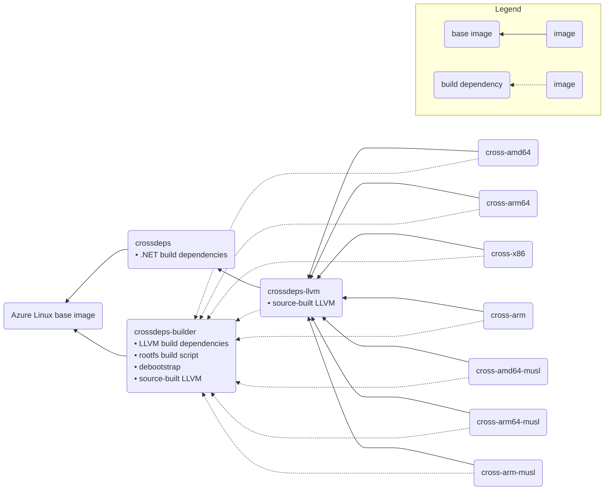

# .NET Linux build methodology

Starting with .NET 8, the builds of .NET for Linux have adopted an architecture designed to allow us to build the product following best practices related to security, while maintaining compatibility with a broad set of Linux distributions and versions.

## Goals

- Security: Build using recent tools in a secure, supported environment

  We would like to use recent versions of build tools such as LLVM and CMake, with the latest features, performance optimizations, bug fixes, and security patches. We also want to build in an environment where the provenance of our dependencies meets secure supply chain standards, and allows quick patching of our dependencies.

- Compatibility: Target reasonably old Linux distributions to maximize compatibility

  At the same time, we want the .NET product to be widely compatible with older Linux distributions. While each .NET release is typically only supported on a specific set of Linux distributions, we also want to enable customers to run .NET apps on older releases, releases in extended support, or on distributions other than those we support.

## Broad Linux targeting

The most important aspect of compatibility across Linux distributions is the version of the C library, which is shipped as part of each Linux distribution and dynamically linked. In general there are two technical solutions that allow targeting old versions:

1. Build on an old distribution

   The Python ecosystem's [manylinux](https://github.com/pypa/manylinux) project uses this approach. They provide docker images that use Linux distributions based on specific versions of glibc or musl libc, and come with a standardized set of build tools from that distribution preinstalled.

   The [Red Hat Developer Toolset](https://docs.redhat.com/en/documentation/red_hat_developer_toolset/12/html/user_guide/chap-Red_Hat_Developer_Toolset#sect-Red_Hat_Developer_Toolset-About) also takes this approach. It provides backports of more recent compiler toolchains to older Linux distributions, allowing these distributions to target the distribution-provided C library using newer compilers.

2. Build on a new distribution, targeting an old C library

   The tensorflow project uses this approach. The tensorflow [build](https://github.com/tensorflow/tensorflow/blame/7c58e6d06fd16415bef73ba90ef1b012ad419d3e/tensorflow/tools/ci_build/devtoolset/build_devtoolset.sh#L47-L70) sets up a build environment that points to an old glibc obtained from the target Linux distribution, rather than the glibc included in the distribution performing the build. They construct the build's target environment from a combination of downloaded binaries, patches to header files, and symlinks for header files that point back to header files from the host environment.

We needed an approach that let us target an older C library, while running our builds on a supported Linux distributions, so a structured variation of the second approach was a natural fit. We construct a target build environment by installing the target Linux packages using a package manager, rather than downloading/copying binaries and managing symlinks.

## History

Before .NET 8, we used CentOS 7 to build the Linux x64 product. CentOS 7 uses glibc 2.17, which was sufficiently low to allow us to meet our compatibility goals at the time. In the .NET 8 timeframe, CentOS 7 went out of support. Similarly, we used to build on Alpine 3.13 which was already out of support by the time .NET 8 was released, so we needed a new approach.

For x86, arm, and arm64 glibc builds, we have long used cross-compilation, letting us build the product on an x64 machine. However, we didn't take full advantage of the separation this can offer between the versions of the host and target. For example, in .NET 6, our arm and arm64 builds both ran on and targeted Ubuntu 16.04 with glibc 2.23.

## Sysroot setup

The key technical ingredient that enables building on a recent Linux, while targeting older libc, is cross-compilation. This works by laying out a set of directories with the targeted versions of libc and other libraries and header files, and passing these as search paths to the compiler. Both the GNU and LLVM toolchains have options to support this.

Our builds set up a sysroot, which is a directory containing the target header files and libraries, in a layout matching the root filesystem of an installation of the target Linux distribution. This simplifies the compiler options required for cross-compilation, allowing us to specify a single path to the sysroot instead of managing search paths for individual libraries.

We already had tooling in place to build a sysroot for cross-architecture compilation:

- Debootstrap is used to perform a minimal install of the target Linux distribution, for glibc-based distributions. It obtains target libraries from the Ubuntu package repositories for the targeted release.

- APK (Alpine Package Keeper), the Alpine Linux package manager, is used to install packages from the Alpine repositories into a target directory.

We continued using this tooling, and extended its use to x64 builds which were not previously using cross-compilation, unifying the way we build across all architectures. This lets us target versions of Ubuntu and Alpine with sufficiently old glibc and musl libc. We typically select the oldest libc versions that will remain in extended support throughout the life of a given .NET version.

## Host toolchain setup

Our build images are based on the latest release of [Azure Linux](https://github.com/microsoft/azurelinux) (CBL-Mariner 2.0 in [earlier](#evolution-of-libc-targeting) versions), where we have full control over the supply chain of our build tools, without sacrificing compatibility. We strive to use the latest versions of our toolchain components, installing them from the Azure Linux package sources where available, or building them from source where we need more control.

Tools that we install as Azure Linux packages include CMake, debootstrap, and header files needed to build the crosscomponents (tools designed to run on the build host but produce code for the target, like the crossgen compiler used to produce ready-to-run code for the framework libraries).

We build the LLVM toolchain from the upstream [source](https://github.com/llvm/llvm-project), giving us full control over the toolchain configuration. Currently we configure the toolchain to use statically linked low-level C library helpers (crtbegin and crtend) from the target Linux, and dynamically linked libstdc++ from the target Linux. Building from source gives us the option to statically link LLVM's C library helpers (compiler-rt builtins) or libc++ in the future.

Building .NET with PGO instrumentation or sanitizer support requires some LLVM components, matching the host LLVM, to be present in the sysroot. After we have built a working LLVM cross-compiler toolchain, we use it to build these components (compiler-rt.profile, and sanitizer runtimes) for the target, and lay these out in a location that will be discovered by the toolchain when building .NET for that target.

## Security-related servicing

The construction of the sysroot and the host toolchain makes it possible to service the dependencies that we ship as part of .NET, and leaves us with ways to further reduce servicing risk in the future. Most of the dependencies that contribute to the product come from recent upstream sources or Microsoft-owned package feeds:

- Azure Linux packages installed on the host are serviced by Microsoft, so we just need to update these to get the latest fixes.
- The LLVM components can be patched because they are built from source.

Our intent is to reduce and remove cases where code from the package sources used to construct the sysroot contributes to the final build. The following analysis describes how we could service the sysroot in the current setup, as well as opportunities to further reduce the surface area we rely on:

- C standard library

  We build against the C library from the sysroot's libc. The implementation is dynamically linked, so the impact of the shared object is limited to the library name and symbol versions, but it does not contribute code to the product. The header files can be patched in the sysroot if needed. The low-level C library helpers are statically linked into the product. The amount of code that these contribute is small. In the event we need to service these, we would need to start building them from source with our patches applied, and copy them into the sysroot.

  To reduce this servicing risk, we could explore using LLVM's low-level C library helpers (compiler-rt builtins) as an alternative.

- C++ standard library

  We build against the C++ standard library from the sysroot's installation of libstdc++. The implementation is dynamically linked so does not contribute code to the product. The C++ standard library headers are more likely to contribute code than the C headers because they include standard library templates. Our coding guidelines [recommend](https://github.com/dotnet/runtime/blob/main/docs/coding-guidelines/clr-code-guide.md#-2114-limit-usage-of-standard-template-types-in-shipping-executables) limiting usage of standard template types for this reason. The header files can be patched in the sysroot if necessary.

  To reduce this servicing risk, we could statically link in LLVM's libc++ as an alternative. Initial [exploration](https://github.com/dotnet/runtime/pull/102279) of this approach looks promising.

- Header files for runtime dependencies

  We build using header files for runtime dependencies, including openssl, icu, and the Linux kernel, that are taken from the target distribution. The actual implementation of the shared libraries will be dynamically loaded (not dynamically linked), and do not contribute to the shipping product. The header files could be patched after creating the sysroot if needed.

We've reduced the amount of code we statically link to minimize the risk of vulnerabilities in our shipped code. We believe this will result in most vulnerabilities being naturally patched by users in their environment, when they take updates to dynamically linked dependencies such as glibc.

## Docker image composition

All of our recent build images are based on Azure Linux, defined at https://github.com/dotnet/dotnet-buildtools-prereqs-docker/tree/main/src/azurelinux. We use an intermediate image (`crossdeps-builder`) to install dependencies only needed to build LLVM and set up the rootfs. This image also builds LLVM from source.

The `crossdeps-llvm` image contains the source-built LLVM taken from `crossdeps-builder`, and also includes the .NET runtime build dependencies from its base image, `crossdeps`.

The per-architecture/libc images are based on `crossdeps-llvm`. Each of these images is built by creating a target sysroot (using tools from `crossdeps-builder`, and copying the sysroot into the final image).

## Evolution of libc targeting

In .NET 7 when this project started, we learned that Amazon Linux 2 had an older glibc than we initially targed in our arm64 builds. We had been targeting glibc 2.27 from Ubuntu 18.04. We [enabled](https://github.com/dotnet/runtime/pull/80866) compatibility with Amazon Linux 2 by moving the arm64 builds to target Ubuntu 16.04 with glibc 2.23. At that time we still used an Ubuntu host image to build the arm64 product, but now we were targeting a different version than the host, which was an Ubuntu 18.04 image.

.NET 8 was the first release that [unified](https://github.com/dotnet/runtime/issues/83428) all of our Linux builds to use cross-compilation, and to build on a Microsoft-supported Linux distribution (CBL-Mariner 2.0 at the time of release). Before this our x64 glibc and musl builds were not using a sysroot. With this setup we unified all of the Linux builds to target a common version of glibc (2.23 from Ubuntu 16.04) or musl libc (1.2.2 from Alpine 3.13).

In .NET 9 we [moved](https://github.com/dotnet/dotnet-buildtools-prereqs-docker/pull/1015) our builds to Azure Linux 3.0, which was easy to do thanks to the separation between the host and target versions. We also discovered that our supported Linux distributions were moving to 64-bit `time_t` on arm32 to solve the [Y2038](https://github.com/dotnet/runtime/blob/main/docs/design/features/y2038.md) problem. The flexibility of the sysroot approach made it easy to update our arm32 builds to target a more recent distribution with support for 64-bit `time_t`, without requiring any other changes to the build images.
