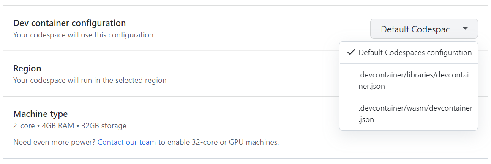

# Using Codespaces
Codespaces allows you to develop in a Docker container running in the cloud. You can use an in-browser version of VS Code or the full VS Code application with the [GitHub Codespaces VS Code Extension](https://marketplace.visualstudio.com/items?itemName=GitHub.codespaces). This means you don't need to install dotnet/runtime's prerequisites on your current machine in order to develop in dotnet/runtime.

## Create a Codespace

dotnet/runtime runs a nightly GitHub Action to build the latest code in the repo. This allows you to immediately start developing and testing after creating a codespace without having to build the whole repo. When the machine is created, it will have built the repo using the code as of 6 AM UTC that morning.

1. From https://github.com/dotnet/runtime, drop-down the `Code` button and select the `Codespaces` tab.

2. Click the drop-down at the side of the `Create codespace on main` button and select `Configure and create codespace`

3. Select which Dev container configuration you want to use.

    - For `libraries` work, pick `.devcontainer/libraries/devcontainer.json`.
    - For `WASM` work, pick `.devcontainer/wasm/devcontainer.json`.

4. Select the Machine type. For `dotnet/runtime`, it is recommended to select at least a `4-core` machine. You can also verify that a `Prebuild` is ready.

*If these instructions are out of date, see https://docs.github.com/codespaces/developing-in-codespaces/creating-a-codespace#creating-a-codespace for instructions on how to create a new codespace.*

## Updating dotnet/runtime's Codespaces Configuration

The Codespaces configuration is spread across the following places:

1. The [.devcontainer](../../.devcontainer) folder contains folders for each "development scenario":
    - `libraries` - Used by developers working in `src/libraries`
    - `wasm` - Used by developers working on the browser-wasm workload
    - The `scripts` folder contains any scripts that are executed during the creation of the codespace. This has the build command that builds the entire repo for prebuilds.
2. Each development scenario folder contains:
    - `devcontainer.json` file configures the codespace and has VS Code / Environment settings
    - The Dockerfile used to create the Docker image
3. The GitHub Action can be configured by following the instructions at https://docs.github.com/codespaces/prebuilding-your-codespaces/configuring-prebuilds.

To test out changes to the `.devcontainer` files, you can follow the process in [Applying changes to your configuration](https://docs.github.com/codespaces/customizing-your-codespace/configuring-codespaces-for-your-project#applying-changes-to-your-configuration) docs. This allows you to rebuild the Codespace privately before creating a PR.

To test out your changes you can run the [Codespaces Prebuilds Action](https://github.com/dotnet/runtime/actions/workflows/codespaces/create_codespaces_prebuilds) in your fork against a branch with your changes.