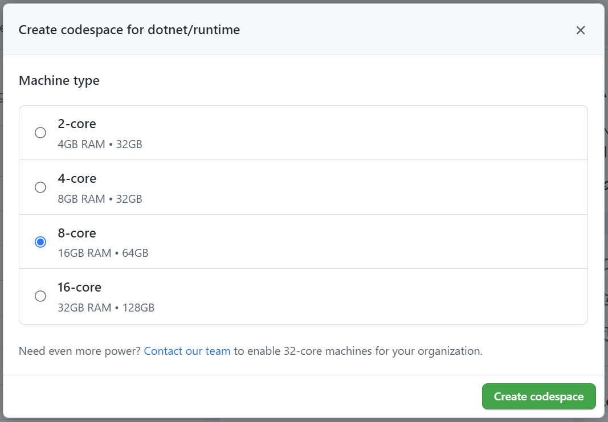

# Using Codespaces
Codespaces allows you to develop in a Docker container running in the cloud. You can use an in-browser version of VS Code or the full VS Code application with the [GitHub Codespaces VS Code Extension](https://marketplace.visualstudio.com/items?itemName=GitHub.codespaces). This means you don't need to install dotnet/runtime's prerequisites on your current machine in order to develop in dotnet/runtime.

## Create a Codespace

dotnet/runtime runs a nightly GitHub Action to build the latest code in the repo. This allows you to immediately start developing and testing after creating a codespace without having to build the whole repo. When the machine is created, it will have built the repo using the code as of 6 AM UTC that morning.

1. From https://github.com/dotnet/runtime, drop-down the `Code` button and select the `Codespaces` tab.

2. Select the Machine type. For dotnet/runtime, it is recommended to select at least a `4-core` machine. You can also verify that a "Prebuild" is ready.

*If these instructions are out of date, see https://docs.github.com/codespaces/developing-in-codespaces/creating-a-codespace#creating-a-codespace for instructions on how to create a new codespace.*

## Updating dotnet/runtime's Codespaces Configuration

The Codespaces configuration is spread across the following places:

1. The [.devcontainer](../../.devcontainer) folder contains:
    - `devcontainer.json` file configures the codespace and mostly has VS Code settings
    - The Dockerfile used to create the image
    - The `scripts` folder contains any scripts that are executed during the creation of the codespace. This has the build command that builds the entire repo for prebuilds.
2. The GitHub Action can be configured at [create-codespaces-prebuild](../../.github/workflows/create-codespaces-prebuild.yml)
    - This contains when the Action is run, what regions we build prebuilds for, and what size machines

To test out changes to the `.devcontainer` files, you can follow the process in [Applying changes to your configuration](https://docs.github.com/codespaces/customizing-your-codespace/configuring-codespaces-for-your-project#applying-changes-to-your-configuration) docs. This allows you to rebuild the Codespace privately before creating a PR.

To test out your `.yml` changes, here is the process:

**Note**: *Executing these steps will overwrite the current prebuilt container for the entire repo. Afterwards, anyone creating a new codespace will get a prebuilt machine with your test changes until the Action in `main` is executed again.*

1. Edit and commit the files to a branch.
2. Push that to a branch on dotnet/runtime. Be careful that you aren't pushing to `main` or some other important branch. Prefix your branch name with your GitHub account name, so others know it is a dev branch. ex. `username/FixCodespaces`.
3. In the "Actions" tab at the top of dotnet/runtime:
    - Select "Create Codespaces Prebuild" action on the left
    - On the right click "Run workflow" and pick your branch
    - After it runs, try to create a codespace
