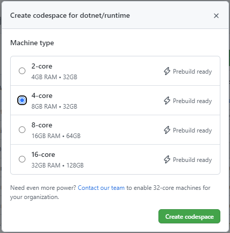

# Using Codespaces

* [Create a Codespace](#create-a-codespace)
* [Updating dotnet/runtime's Codespaces Configuration](#updating-dotnetruntimes-codespaces-configuration)
* [Testing out your Changes](#testing-out-your-changes)

Codespaces allows you to develop in a Docker container running in the cloud. You can use an in-browser version of VS Code or the full VS Code application with the [GitHub Codespaces VS Code Extension](https://marketplace.visualstudio.com/items?itemName=GitHub.codespaces). This means you don't need to install any prerequisites on your current machine in order to develop in _dotnet/runtime_.

## Create a Codespace

The _dotnet/runtime_ repo runs a nightly GitHub Action to build the latest code in it. This allows you to immediately start developing and testing after creating a Codespace without having to build the whole repo. When the machine is created, it will have built the repo using the code as of 6 AM UTC of that morning.

1. From this [repository's root](https://github.com/dotnet/runtime), Click the _<> Code_ button and then click _Codespaces_ tab.

2. At the top right of the _Codespaces_ tab, select ... and click _+ New with options_

3. Select which Dev container configuration you want to use.

* For `libraries` work, pick `.devcontainer/libraries/devcontainer.json`.
* For `WASM` work, pick `.devcontainer/wasm/devcontainer.json`.

4. Select the Machine type. For `dotnet/runtime`, it is recommended to select at least a `4-core` machine. You can also verify that a `Prebuild` is ready.

_If these instructions are out of date, see <https://docs.github.com/codespaces/developing-in-codespaces/creating-a-codespace#creating-a-codespace> for instructions on how to create a new Codespace._

## Updating dotnet/runtime's Codespaces Configuration

The Codespaces configuration is spread across the following places:

1. The [.devcontainer](/.devcontainer) folder contains subfolders for each development scenario:
    * _Libraries_: Used by developers working in `src/libraries`.
    * _Wasm_: Used by developers working on the _browser-wasm_ workload.
    * _Scripts_: Contains any scripts that are executed during the creation of the codespace. This has the build command that builds the entire repo for prebuilds.
2. Each development scenario folder contains the following files:
    * The `devcontainer.json` file that configures the codespace and has VS Code / Environment settings.
    * The _Dockerfile_ used to create the Docker image
3. The GitHub Action can be configured by following the instructions at <https://docs.github.com/codespaces/prebuilding-your-codespaces/configuring-prebuilds>.

To test out changes to the `.devcontainer` files, you can follow the process in the [Applying Changes to your Configuration](https://docs.github.com/codespaces/customizing-your-codespace/configuring-codespaces-for-your-project#applying-changes-to-your-configuration) docs. This allows you to rebuild the Codespace privately before creating a PR.

## Testing out your Changes

To test out your changes you can run the [Codespaces Prebuilds Action](https://github.com/dotnet/runtime/actions/workflows/codespaces/create_codespaces_prebuilds) in your fork against a branch with your changes.
