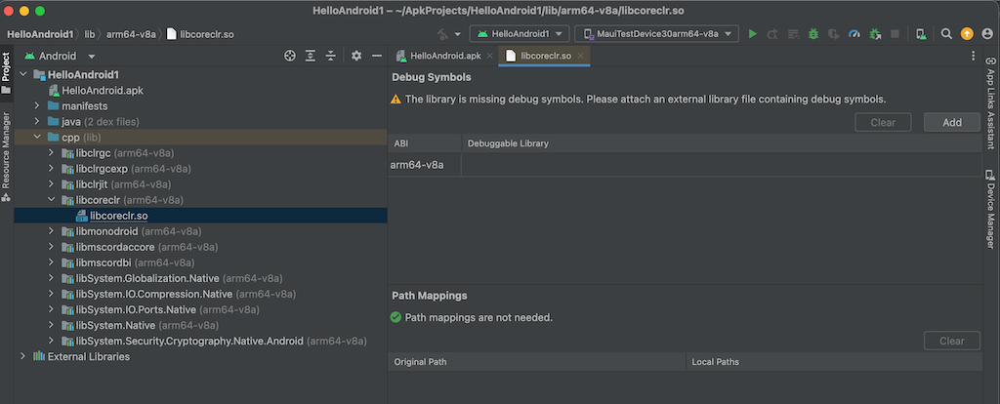
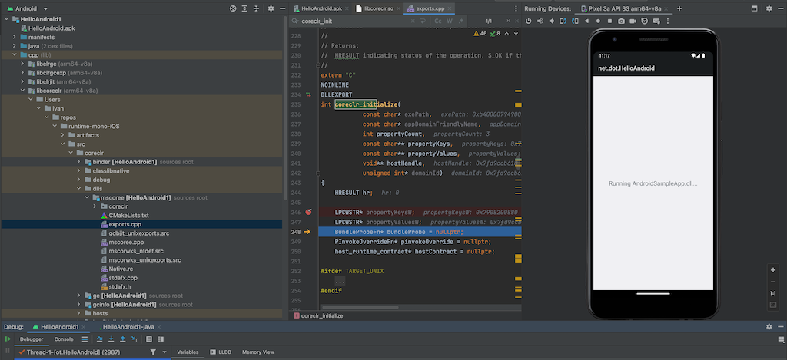

# Experimental support of CoreCLR on Android

This is the internal documentation which outlines experimental support of CoreCLR on Android and includes instructions on how to:
- [Build CoreCLR for Android](./android.md#building-coreclr-for-android)
- [Build and run a sample application with CoreCLR](./android.md#building-and-running-a-sample-app)
- [Debug the sample app and the runtime](./android.md#debugging-the-runtime-and-the-sample-app)

## Prerequisite

- Download and install [OpenJDK 23](https://openjdk.org/projects/jdk/23/)
- Download and install [Android Studio](https://developer.android.com/studio/install) and the following:
  - Android SDK (minimum supported API level is 21)
  - Android NDK r27

> [!NOTE]
> Prerequisites can also be downloaded and installed manually:
> - by running the automated script as described in [Testing Libraries on Android](../../testing/libraries/testing-android.md#using-a-terminal)
> - by downloading the archives:
>   - Android SDK - Download [command-line tools](https://developer.android.com/studio#command-line-tools-only) and use `sdkmanager` to download the SDK.
>   - Android NDK - Download [NDK](https://developer.android.com/ndk/downloads)

## Building CoreCLR for Android

Supported host systems for building CoreCLR for Android:
- [MacOS](./android.md#macos-and-linux) ✔
- [Linux](./android.md#macos-and-linux) ✔
- [Windows](./android.md#windows) ❌ (only through WSL)

Supported target architectures:
- x86 ❌
- x64 ✔
- arm ❌
- arm64 ✔

### MacOS and Linux

#### Requirements

Set the following environment variables:
  - ANDROID_SDK_ROOT=`<full-path-to-android-sdk>`
  - ANDROID_NDK_ROOT=`<full-path-to-android-ndk>`

#### Building the runtime, libraries and tools

To build CoreCLR runtime, libraries and tools for local development, run the following command from `<repo-root>`:

```
./build.sh clr.runtime+clr.alljits+clr.corelib+clr.nativecorelib+clr.tools+clr.packages+libs -os android -arch <x64|arm64> -c <Debug|Release>
```

To build CoreCLR runtime NuGet packages, run the following command from `<repo-root>`:

```
./build.sh clr.runtime+clr.alljits+clr.corelib+clr.nativecorelib+clr.tools+clr.packages+libs+host+packs -os android -arch <x64|arm64> -c <Debug|Release>
```

> [!NOTE]
> The runtime packages will be located at: `<repo-root>/artifacts/packages/<configuration>/Shipping/`

### Windows

Building on Windows is not directly supported yet. However it is possible to use WSL2 for this purpose.

#### WSL2

##### Requirements

1. Install the Android SDK and NDK in WSL per the [prerequisites](#prerequisite). This can be done by downloading the archives or using Android Studio.
- In case of Android Studio:
    - Make sure WSL is updated: from Windows host, `wsl --update`
    - [Enabled systemd](https://devblogs.microsoft.com/commandline/systemd-support-is-now-available-in-wsl/#set-the-systemd-flag-set-in-your-wsl-distro-settings)
    - `sudo snap install android-studio --classic`
2. Set the following environment variables:
    - ANDROID_SDK_ROOT=`<full-path-to-android-sdk>`
    - ANDROID_NDK_ROOT=`<full-path-to-android-ndk>`

#### Building the runtime, libraries and tools

To build CoreCLR runtime, libraries and tools, run the following command from `<repo-root>`:

```
./build.sh clr.runtime+clr.alljits+clr.corelib+clr.nativecorelib+clr.tools+clr.packages+libs -os android -arch <x64|arm64> -c <Debug|Release>
```

## Building and running a sample app

To demonstrate building and running an Android sample application with CoreCLR, we will use:
- the [HelloAndroid sample app](../../../../src/mono/sample/Android/AndroidSampleApp.csproj).
- a functional tests [Android.Device_Emulator.JIT.Test](../../../../src/tests/FunctionalTests/Android/Device_Emulator/JIT/Android.Device_Emulator.JIT.Test.csproj)

A prerequisite for building and running samples locally is to have CoreCLR successfully built for desired Android platform.

### Building HelloAndroid sample

To build `HelloAndroid`, run the following command from `<repo_root>`:

```
make BUILD_CONFIG=<Debug|Release> TARGET_ARCH=<x64|arm64> RUNTIME_FLAVOR=CoreCLR DEPLOY_AND_RUN=false run -C src/mono/sample/Android
```

On successful execution, the command will output the `HelloAndroid.apk` at:
```
<repo-root>artifacts/bin/AndroidSampleApp/<x64|arm64>/<Debug|Release>/android-<x64|arm64>/Bundle/bin/HelloAndroid.apk
```

### Running HelloAndroid sample on an emulator

To run the sample on an emulator, the emulator first needs to be up and running.

Creating an emulator (ADV - Android Virtual Device) can be achieved through [Android Studio - Device Manager](https://developer.android.com/studio/run/managing-avds).

After its creation, the emulator needs to be booted up and running, so that we can run the `HelloAndroid` sample on it via:
```
make BUILD_CONFIG=<Debug|Release> TARGET_ARCH=<x64|arm64> RUNTIME_FLAVOR=CoreCLR DEPLOY_AND_RUN=true run -C src/mono/sample/Android
```


> [!NOTE]
> Emulators can be also started from the terminal via:
> ```
> $ANDROID_SDK_ROOT/emulator/emulator -avd <emulator-name>
> ```

#### WSL2

The app can be run on an emulator running on the Windows host.
1. Install Android Studio on the Windows host (same versions as in [prerequisites](#prerequisite))
2. In Windows, create and start an emulator
3. In WSL, swap the `adb` from the Android SDK in WSL2 with that from Windows
    - `mv $ANDROID_SDK_ROOT/platform-tools/adb $ANDROID_SDK_ROOT/platform-tools/adb-orig`
    - `ln -s /mnt/<path-to-adb-on-host> $ANDROID_SDK_ROOT/platform-tools/adb`
4. In WSL, Make xharness use the `adb` corresponding to the Windows host:
    - `export ADB_EXE_PATH=$ANDROID_SDK_ROOT/platform-tools/adb`
5. In WSL, run the `make` command as [above](#running-helloandroid-sample-on-an-emulator)

### Building and running functional tests on an emulator

Similarly to the `HelloAndroid` sample, it is possible to build and run a functional test on Android with CoreCLR on an emulator.

To build and run a functional test on Android with CoreCLR, run the following command from `<repo_root>`:

```
./dotnet.sh build -c Release src/tests/FunctionalTests/Android/Device_Emulator/JIT/Android.Device_Emulator.JIT.Test.csproj /p:TargetOS=android /p:TargetArchitecture=arm64 /t:Test /p:RuntimeFlavor=coreclr
```

> [!NOTE]
> Similarly to the `HelloAndroid` sample the emulator needs to be up and running.

### Useful make commands

For convenience it is possible to run a single make command which builds all required dependencies, the app and runs it:
```
make BUILD_CONFIG=<Debug|Release> TARGET_ARCH=<x64|arm64> RUNTIME_FLAVOR=CoreCLR DEPLOY_AND_RUN=true all -C src/mono/sample/Android
```

## Debugging the runtime and the sample app

Managed debugging is currently not supported, but we can debug:
- Java portion of the sample app
- Native code for the CoreCLR host and the runtime it self

This can be achieved in `Android Studio` via `Profile or Debug APK`.

### Steps

1. Build the runtime and `HelloAndroid` sample app in `Debug` configuration targeting `arm64` target architecture.
2. Rename the debug symbols file of the runtime library from `libcoreclr.so.dbg` into `libcoreclr.so.so`, the file is located at: `<repo_root>/artifacts/bin/AndroidSampleApp/arm64/Debug/android-arm64/publish/libcoreclr.so.dbg`
3. Open Android Studio and select `Profile or Debug APK` project.
4. Find and select the desired `.apk` file (example: `<repo_root>/artifacts/bin/AndroidSampleApp/arm64/Debug/android-arm64/Bundle/bin/HelloAndroid.apk`)
5. In the project pane, expand `HelloAndroid->cpp->libcoreclr` and double-click `libcoreclr.so`

6. From the `Debug Symbols` pane on the right, select `Add`
7. Navigate to the renamed file from step 2. and select it `<repo_root>/artifacts/bin/AndroidSampleApp/arm64/Debug/android-arm64/publish/libcoreclr.so.so`
8. Once loaded it will show all the source files under `HelloAndroid->cpp->libcoreclr`

9. Find the `exports.cpp` and set a breakpoint in `coreclr_initialize` function and launch the debug session


> [!NOTE]
> Steps 5) through 8) can be omitted if the runtime is built without stripping debug symbols to a separate file (e.g., `libcoreclr.so.dbg`).
> This can be achieved by including `-keepnativesymbols true` option when building the runtime, e.g.,:
> ```
> ./build.sh clr.runtime+clr.alljits+clr.corelib+clr.nativecorelib+clr.tools+clr.packages+libs -os android -arch <x64|arm64> -c Debug -keepnativesymbols true
> ```

## See also

Similar instructions for debugging Android apps with Mono runtime can be found [here](../../debugging/mono/android-debugging.md).

## Troubleshooting

### Android samples or functional tests fail to build

If multiple JDKs are installed on your system, you may encounter the following error:

```
`src/mono/msbuild/android/build/AndroidBuild.targets(237,5): error MSB4018: java.lang.NullPointerException: Cannot invoke String.length() because <parameter1> is null
```

when building the Android samples or functional tests.

To resolve this:
1. Remove older JDK versions
2. Install [OpenJDK 23](https://openjdk.org/projects/jdk/23/)
3. Make sure OpenJDK 23 binaries are added to the path.
  - On Unix system this can be verifed via:
  ```
  $> java -version
  openjdk version "23.0.1" 2024-10-15
  OpenJDK Runtime Environment Homebrew (build 23.0.1)
  OpenJDK 64-Bit Server VM Homebrew (build 23.0.1, mixed mode, sharing)
  ```