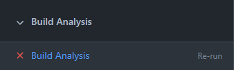
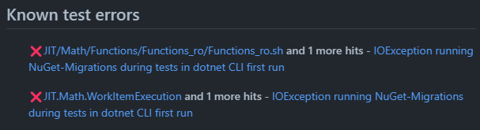
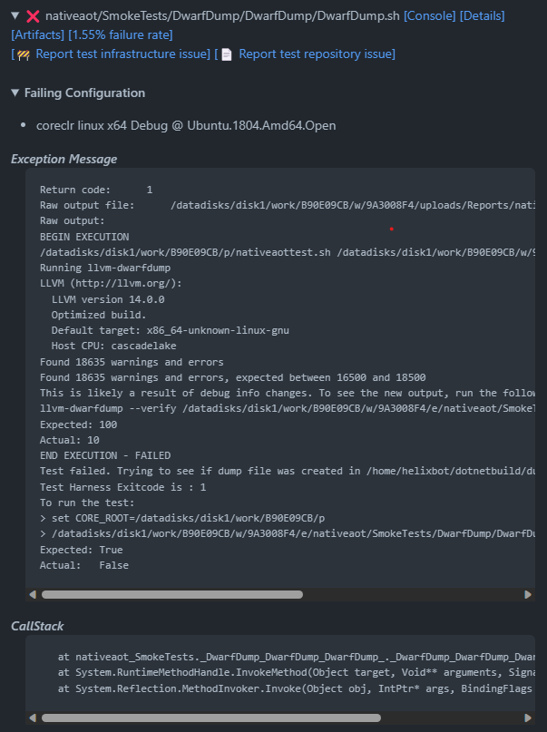
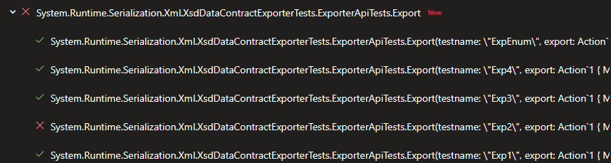
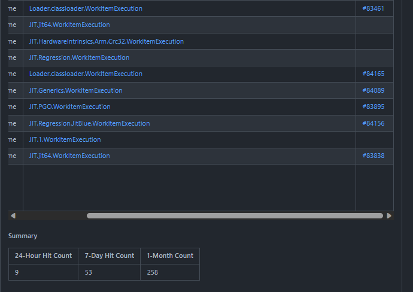

# Analyzing Failures with Build Analysis and Known Issues

* [Triaging errors seen in CI](#triaging-errors-seen-in-ci)
  * [Option 1: You have a defect in your PR](#option-1-you-have-a-defect-in-your-pr)
  * [Option 2: There is a flaky test that is not related to your PR](#option-2-there-is-a-flaky-test-that-is-not-related-to-your-pr)
  * [Option 3: The state of the main branch HEAD is bad.](#option-3-the-state-of-the-main-branch-head-is-bad)
  * [Additional information:](#additional-information)
* [What to do if you determine the failure is unrelated](#what-to-do-if-you-determine-the-failure-is-unrelated)
  * [Examples of Build Analysis](#examples-of-build-analysis)
    * [Good usage examples](#good-usage-examples)
    * [Bad usage examples](#bad-usage-examples)

## Triaging errors seen in CI

## Summary

**Passing Build Analysis is required to merge into the runtime repo**.

To resolve failures, do the following, in order:

1. Fix the problem if your PR is the cause.
2. For all failures not in the "Known test errors" section, [try to file a Known Build Error issue](#what-to-do-if-you-determine-the-failure-is-unrelated).
3. If all else fails, perform a [manual bypass](#bypassing-build-analysis).


## Details

In case of failure, any PR on the runtime will have a failed GitHub check - PR Build Analysis - which has a summary of all failures, including a list of matching  known issues as well as any regressions introduced to the build or the tests. This tab should be your first stop for analyzing the PR failures.



This check tries to bubble as much useful information about all failures for any given PR and the pipelines it runs. It tracks both build and test failures and provides quick links to the build/test legs, the logs, and other supplemental information that `Azure DevOps` may provide. The idea is to minimize the number of links to follow and tries to surface well known issues that have already been previously identified. It also adds a link to the `Helix Artifacts` tab of a failed test, as it often contains more detailed logs of the execution or a dump that's been collected at fault time.

Validation may fail for several reasons, and for each one we have a different recommended action:

### Option 1: You have a defect in your PR

* Simply push the fix to your PR branch, and validation will start over.

### Option 2: There is a flaky test that is not related to your PR

* Your assumption should be that a failed test indicates a problem in your PR. (If we don't operate this way, chaos ensues.) However, there are often subtle regressions and flaky bugs that might have slipped into the target branch.
  * Reruns might help, but we tend to be conservative with them as they tend to spike our resource usage. Opt to use them only if there are no known issue that can be correlated to the failures and it's not clear if the errors could be correlated. Try to rerun only the particular legs if possible, by navigating to the GitHub Checks tab and clicking on `Re-run failed checks`.
  * There's the possibility someone else has already investigated the issue. In such case, the build analysis tab should report the issue like so:
    
    There's no additional work required here - the bug is getting tracked and appropriate data is being collected.
  * If the error is not getting reported as a known issue and you believe it's unrelated, see the [unrelated failure](#what-to-do-if-you-determine-the-failure-is-unrelated) section for next steps.

### Option 3: The state of the main branch HEAD is bad.

* This is the very rare case where there was a build break in main, and you got unlucky. Hopefully the break has been fixed, and you want CI to rebase your change and rerun validation.
* To rebase and rerun all validation:
  * Add a comment `/azp run runtime`
  * Or, click on "re-run all checks" in the GitHub Checks tab
  * Or, simply close and reopen the PR.
  * Or, amend your commit with `--amend --no-edit` and force push to your branch.

### Additional information:
  * If the license/cla check fails to register a response, the check can be rerun by submitting a `@dotnet-policy-service rerun` comment to the PR.
  * Reach out to the infrastructure team for assistance on [Teams channel](https://teams.microsoft.com/l/channel/19%3ab27b36ecd10a46398da76b02f0411de7%40thread.skype/Infrastructure?groupId=014ca51d-be57-47fa-9628-a15efcc3c376&tenantId=72f988bf-86f1-41af-91ab-2d7cd011db47) (for corpnet users) or on [Gitter](https://gitter.im/dotnet/community) in other cases.

## What to do if you determine the failure is unrelated

An issue that has not been reported before will look like this in the `Build Analysis` check tab:



You can use the console log, any potential attached dumps in the artifacts section, or any other piece of information printed to help you decide if it's a regression caused by the change. Similarly, for runtime tests we will try to print the crashing stacks to aid in the investigation.

If you have considered all the diagnostic artifacts and determined the failure is definitely not caused by changes in your PR, please do this:

1. Identify a string from the logs that uniquely identifies the issue at hand. A good example of this the string `The system cannot open the device or file specified. : 'NuGet-Migrations'` for issue https://github.com/dotnet/runtime/issues/80619.
2. On the test failure in the tab you can select `Report repository issue`. This will prepopulate an issue with the appropriate tags and with a body similar to:
    ````
    Build Information
    Build: https://dev.azure.com/dnceng-public/cbb18261-c48f-4abb-8651-8cdcb5474649/_build/results?buildId=242380
    Build error leg or test failing: Build / linux-arm64 Release AllSubsets_Mono_Minijit_RuntimeTests minijit / Build Tests
    Pull request: https://github.com/dotnet/runtime/pull/84716
    <!-- Error message template  -->
    ## Error Message
    Fill the error message using [known issues guidance](https://github.com/dotnet/arcade/blob/main/Documentation/Projects/Build%20Analysis/KnownIssues.md#how-to-fill-out-a-known-issue-error-section).

    ```json
    {
        "ErrorMessage": "",
        "BuildRetry": false,
        "ErrorPattern": "",
        "ExcludeConsoleLog": false
    }
    ```
    ````
    It already contains most of the essential information, but *it is very important that you fill out the json blob*.

    - You can add into the `ErrorMessage` field the string that you found uniquely identifies the issue. In case you need to use a regex, use the `ErrorPattern` field instead. This is a limited to a single-line, non-backtracking regex as described [here](https://github.com/dotnet/arcade/blob/main/Documentation/Projects/Build%20Analysis/KnownIssues.md#regex-matching). This regex also needs to be appropriately escaped. Check the [arcade known issues](https://github.com/dotnet/arcade/blob/main/Documentation/Projects/Build%20Analysis/KnownIssues.md#filling-out-known-issues-json-blob) documentation for a good guide on proper regex and JSON escaping.
    - The field `ExcludeConsoleLog` describes if the execution logs should be considered on top of the individual test results. **For most cases, this should be set to `true` as the failure will happen within a single test**. Setting it to `false` will mean all failures within an xUnit set of tests will also get attributed to this particular error, since there's one log describing all the problems. Due to limitations in Known Issues around rate limiting and xUnit resiliency, setting `ExcludeConsoleLog=false` is necessary in two scenarios:
      + Nested tests as reported to Azure DevOps. Essentially this means theory failures, which look like this when reported in Azure DevOps: .
        Adding support for this requires too many API calls, so using the console log here is necessary.
      + Native crashes in libraries also require using the console log. This is needed as the crash corrupts the test results to be reported to Azure DevOps, so only the console logs are left.
    - Optionally you can add specifics as needed like leg, configuration parameters, available dump links.

Once the issue is open, feel free to rerun the `Build Analysis` check and the issue should be recognized as known if all was filed correctly and you are ready to merge once all unrelated issues are marked as known. However, there are some known limitations to the system as previously described. Additionally, the system only looks at the error message the stacktrace fields of an Azure DevOps test result, and the console log in the helix queue. If rerunning the check doesn't pick up the known issue and you feel it should, feel free to tag  @dotnet/runtime-infrastructure to request infrastructure team for help.

After you do this, if the failure is occurring frequently as per the data captured in the recently opened issue, please disable the failing test(s) with the corresponding tracking issue link in a follow-up Pull Request.

* Update the tracking issue with the `disabled-test` label and remove the blocking tags.
* For libraries tests add a [`[ActiveIssue(link)]`](https://github.com/dotnet/arcade/blob/master/src/Microsoft.DotNet.XUnitExtensions/src/Attributes/ActiveIssueAttribute.cs) attribute on the test method. You can narrow the disabling down to runtime variant, flavor, and platform. For an example see [File_AppendAllLinesAsync_Encoded](https://github.com/dotnet/runtime/blob/cf49643711ad8aa4685a8054286c1348cef6e1d8/src/libraries/System.IO.FileSystem/tests/File/AppendAsync.cs#L74)
* For runtime tests found under `src/tests`, please edit [`issues.targets`](https://github.com/dotnet/runtime/blob/main/src/tests/issues.targets). There are several groups for different types of disable (mono vs. coreclr, different platforms, different scenarios). Add the folder containing the test and issue mimicking any of the samples in the file.

There are plenty of intermittent failures that won't manifest again on a retry. Therefore these steps should be followed for every iteration of the PR build, e.g. before retrying/rebuilding.

### Bypassing build analysis

To unconditionally bypass the build analysis check (turn it green), you can add a comment to your PR with the following text:

```
/ba-g <reason>
```

For more information, see https://github.com/dotnet/arcade/blob/main/Documentation/Projects/Build%20Analysis/EscapeMechanismforBuildAnalysis.md

### Examples of Build Analysis

#### Good usage examples

- Sufficiently specific strings. Ex: issue https://github.com/dotnet/runtime/issues/80619

```json
{
  "ErrorPattern": "The system cannot open the device or file specified. : (&#39;|')NuGet-Migrations(&#39;|')",
  "BuildRetry": false,
  "ExcludeConsoleLog": false
}
```

This is a case where the issue is tied to the machine the workitem falls on. Everything would fail in that test group, so `ExcludeConsoleLog` isn't harmful and the string is specific to the issue. The proper usage of this provides useful insight such as an accurate count of the impact of the issue without blocking other devs:



#### Bad usage examples

- Overly generic short strings. For example "dlbigleakthd", just refering to the test name is likely to match the build log in case there's a build failure, since the log will list the file getting built. In that case a better thing is to use the name of the scripts (sh/cmd) or part of the dump that caused the crash.
