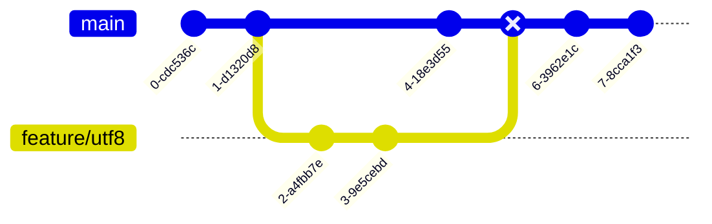

# Pipelines overview - Architecture and different available pipelines

* [Pipelines used in dotnet/runtime](#pipelines-used-in-dotnetruntime)
  * [Runtime pipeline](#runtime-pipeline)
  * [Runtime-dev-inner loop pipeline](#runtime-dev-inner-loop-pipeline)
  * [Dotnet-linker-tests](#dotnet-linker-tests)
  * [Runtime-staging](#runtime-staging)
  * [Runtime-extra-platforms](#runtime-extra-platforms)
  * [Outer loop pipelines](#outer-loop-pipelines)
* [Running of different runtime-level tests and their orchestration in Helix](#running-of-different-runtime-level-tests-and-their-orchestration-in-helix)
  * [Legacy tests](#legacy-tests)
  * [SourceGen Orchestrated tests](#sourcegen-orchestrated-tests)

The runtime repository counts with a large number of validation pipelines to help assess product quality across different scenarios. Some of them run automatically, and some run per request to accommodate hardware availability and other resource constraints. However, the overall orchestration remains largely the same.

Say there's a PR from `feature/utf8` to `main`. The `Azure DevOps Pipeline` plugin will take the merge commit to `main` and queue all default pipelines and any other requested pipelines to `Azure DevOps`.

Each pipeline will create its own build of the different runtimes, the tests, and will eventually run the tests. We usually run our tests in a separate environment called Helix. This system allows for distribution of the large number of tests across the wide array of platforms supported. Once each worker machine processes its own results, these get reported back to `Azure DevOps` and they become available in the tests tab of the build.

## Pipelines used in dotnet/runtime

This repository contains several runtimes and a wide range of supported libraries and platforms. This complexity makes it hard to balance resource usage, testing coverage, and developer productivity. In order to try to make build efforts more reliable and spend the least amount of time testing what the PR changes need, we have various pipelines - some required, some optional. You can list the available pipelines by adding a comment like `/azp list` on a PR or get the available commands by adding a comment like `/azp help`.

Most of the repository pipelines use a custom mechanism to evaluate paths based on the changes contained in the PR to try and build/test the least that we can without compromising quality. This is the initial step on every pipeline that depends on this infrastructure, called "Evaluate Paths". In this step you can see the result of the evaluation for each subset of the repository. For more details on which subsets we have based on paths, see [here](/eng/pipelines/common/evaluate-default-paths.yml). Also, to understand how this mechanism works, you can read this [comment](/eng/pipelines/evaluate-changed-paths.sh#L3-L12).

### Runtime pipeline

This is the "main" pipeline for the runtime product. In this pipeline we include the most critical tests and platforms where we have enough test resources in order to deliver results in a reasonable amount of time. The tests executed in this pipeline for runtime and libraries are considered inner loop. These are the same tests that are executed locally when one runs tests locally.

For mobile platforms and wasm we run some smoke tests that aim to protect the quality of these platforms. We had to move to a smoke test approach given the hardware and time limitations that we encountered, and contributors were affected by this with instability and long wait times for their PRs to finish validation.

### Runtime-dev-inner loop pipeline

This pipeline is also required, and its intent is to cover developer inner loop scenarios that could be affected by any change, like running a specific build command or running tests inside Visual Studio, etc.

### Dotnet-linker-tests

This is also a required pipeline. The purpose of this pipeline is to test that the libraries code is ILLink friendly. Meaning that when we trim our libraries using the ILLink, we don't have any trimming bugs, like a required method on a specific scenario is trimmed away by accident.

### Runtime-staging

This pipeline runs on every change; however it behaves a little different than the other pipelines. This pipeline will not fail if there are test failures, however it will fail if there is a timeout or a build failure. We fail on build failures is because we want to protect the developer inner loop (building the repository) for this platform.

The tests will not fail because this pipeline is for staging new platforms where the test infrastructure is new, and we need to test if we have enough capacity to include that new platform on the "main" runtime pipeline without causing flakiness. Once we analyze data and a platform is stable when running on PRs in this pipeline for at least a week, it can be promoted either to the `runtime-extra-platforms` pipeline or to the `runtime` pipeline.

### Runtime-extra-platforms

This pipeline does not run by default as it is not required for a PR, but it runs twice a day, and it can also be invoked in specific PRs by commenting `/azp run runtime-extra-platforms`. However, this pipeline is still an important part of our testing.

This pipeline runs inner loop tests on platforms where we don't have enough hardware capacity to run tests (mobile, browser) or on platforms where we believe tests should organically pass based on the coverage we have in the "main" runtime pipeline. For example, in the "main" pipeline we run tests on Ubuntu 21.10. Since we also support Ubuntu 18.04 which is an LTS release, we run tests on Ubuntu 18.04 of this pipeline to make sure we have healthy tests on platforms which we are releasing a product for.

This pipeline also runs tests for platforms that are generally stable but we don't have enough hardware to put into the regular runtime pipeline. For example, we run the libraries tests for windows arm64 in this pipeline. We don't have enough hardware to run the JIT tests and libraries tests for windows arm64 on every PR. The JIT is the most important piece to test here, as that is what generates the native code to run on that platform. So, we run JIT tests on arm64 in the "main" pipeline, while our libraries tests are only run on the `runtime-extra-platforms` pipeline.

### Outer loop pipelines

We have various pipelines that their names contain `Outerloop` in them. These pipelines will not run by default on every PR, they can also be invoked using the `/azp run` comment and will run on a daily basis to analyze test results.

These pipelines will run tests that are long-running, are not very stable (i.e. some networking tests), or that modify machine state.

## Running of different runtime-level tests and their orchestration in Helix

### Legacy tests

In older runtime tests, the classic xUnit console runner runs a generated set of xUnit facts. Each fact invokes a shell/batch script that sets up the environment, then starts the console apps that make up the runtime test bed. The wrapper is also responsible for harvesting all output from the processes that get started. The main advantage of this method is that each test runs in process isolation. This allows xUnit and its child process to have decoupled runtimes, hardening the test harness against native crashes. However, this is extremely expensive since startup costs and process start costs are paid per test. The usual flow for a Helix workitem of this type is as follows:

### SourceGen Orchestrated tests

Consolidated runtime tests generate an entry point assembly during build. The source generation globs the tests that will run and generates a `Main` method that runs each test in a `try`/`catch` block, while capturing all the necessary output. There are a few tests that require isolation, and instead of calling into them in-proc, the call starts another process as appropriate. The main advantage of this method is that it relies less heavily on process isolation, making testing more cost-efficient. However, this also means the first native or managed unhandled exception will pause all testing - much like what happens with library tests. The merged runner that invokes the tests sequentially is hosted under a watchdog to handle hangs, and there's a log fixer that runs afterwards to try to fixup the corrupted logs in case of a crash, so that Helix can report the workitem progress as much as possible. The usual flow for a Helix workitem of this type is as follows:

