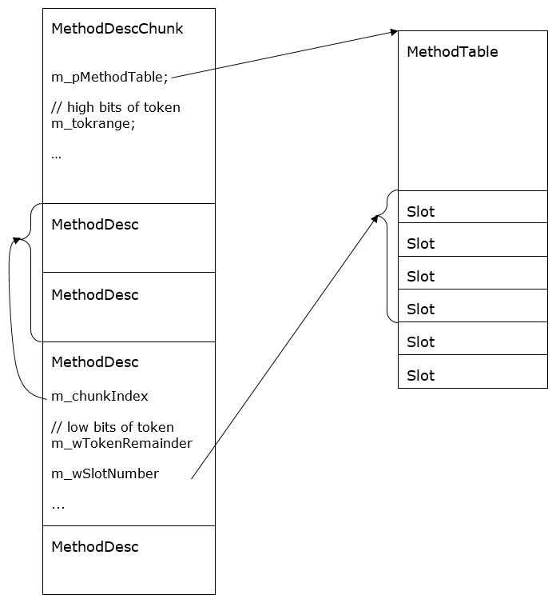
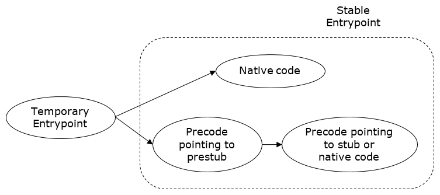
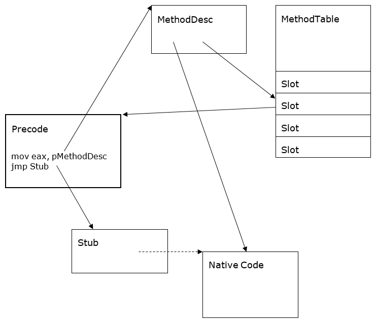

Method Descriptor
=================

Author: Jan Kotas ([@jkotas](https://github.com/jkotas)) - 2006

Introduction
============

MethodDesc (method descriptor) is the internal representation of a managed method. It serves several purposes:

- Provides a unique method handle, usable throughout the runtime. For normal methods, the MethodDesc is a unique handle for a <module, metadata token, instantiation> triplet.
- Caches frequently used information that is expensive to compute from metadata (e.g. whether the method is static).
- Captures the runtime state of the method (e.g. whether the code has been generated for the method already).
- Owns the entry point of the method.

Design Goals and Non-goals
--------------------------

### Goals

**Performance:** The design of MethodDesc is heavily optimized for size, since there is one of them for every method. For example, the MethodDesc for a normal non-generic method is 8 bytes in the current design.

### Non-goals

**Richness:** The MethodDesc does not cache all information about the method. It is expected that the underlying metadata has to be accessed for less frequently used information (e.g. method signature).

Design of MethodDesc
====================

Kinds of MethodDescs
--------------------

There are multiple kinds of MethodDescs:

**IL**

Used for regular IL methods.

**Instantiated**

Used for less common IL methods that have generic instantiation or that do not have preallocated slot in method table.

**FCall**

Internal methods implemented in unmanaged code. These are [methods marked with MethodImplAttribute(MethodImplOptions.InternalCall) attribute](mscorlib.md), delegate constructors and tlbimp constructors.

**NDirect**

P/Invoke methods. These are methods marked with DllImport attribute.

**EEImpl**

Delegate methods whose implementation is provided by the runtime (Invoke, BeginInvoke, EndInvoke). See [ECMA 335 Partition II - Delegates](dotnet-standards.md).

**Array**

Array methods whose implementation is provided by the runtime (Get, Set, Address). See [ECMA Partition II – Arrays](dotnet-standards.md).

**ComInterop**

COM interface methods. Since the non-generic interfaces can be used for COM interop by default, this kind is usually used for all interface methods.

**Dynamic**

Dynamically created methods without underlying metadata. Produced by Stub-as-IL and LKG (light-weight code generation).

Alternative Implementations
---------------------------

Virtual methods and inheritance would be the natural way to implement various kinds of MethodDesc in C++. The virtual methods would add vtable pointer to each MethodDesc, wasting a lot of precious space. The vtable pointer occupies 4 bytes on x86. Instead, the virtualization is implemented by switching based on the MethodDesc kind, which fits into 3 bits. For example:

	DWORD MethodDesc::GetAttrs()
	{
	    if (IsArray())
	        return ((ArrayMethodDesc\*)this)->GetAttrs();

	    if (IsDynamic())
	        return ((DynamicMethodDesc\*)this)->GetAttrs();

	    return GetMDImport()->GetMethodDefProps(GetMemberDef());
	}

Method Slots
------------

Each MethodDesc has a slot, which contains the entry point of the method. The slot and entry point must exist for all methods, even the ones that never run like abstract methods. There are multiple places in the runtime that depend on the 1:1 mapping between entry points and MethodDescs, making this relationship an invariant.

The slot is either in MethodTable or in MethodDesc itself. The location of the slot is determined by `mdcHasNonVtableSlot` bit on MethodDesc.

The slot is stored in MethodTable for methods that require efficient lookup via slot index, e.g. virtual methods or methods on generic types. The MethodDesc contains the slot index to allow fast lookup of the entry point in this case. 

Otherwise, the slot is part of the MethodDesc itself. This arrangement improves data locality and saves working set. Also, it is not even always possible to preallocate a slot in a MethodTable upfront for dynamically created MethodDescs, such as for methods added by Edit & Continue, instantiations of generic methods or [dynamic methods](https://github.com/dotnet/coreclr/blob/master/src/mscorlib/src/System/Reflection/Emit/DynamicMethod.cs).

MethodDesc Chunks
-----------------

The MethodDescs are allocated in chunks to save space. Multiple MethodDesc tend to have identical MethodTable and upper bits of metadata token. MethodDescChunk is formed by hoisting the common information in front of an array of multiple MethodDescs. The MethodDesc contains just the index of itself in the array.

Figure 1 MethodDescChunk and MethodTable

Debugging
---------

The following SOS commands are useful for debugging MethodDesc:

- **DumpMD** – dump the MethodDesc content:

		!DumpMD 00912fd8
		Method Name: My.Main()
		Class: 009111ec
		MethodTable: 00912fe8md
		Token: 06000001
		Module: 00912c14
		IsJitted: yes
		CodeAddr: 00ca0070

- **IP2MD** – find MethodDesc for given code address:

		!ip2md 00ca007c
		MethodDesc: 00912fd8
		Method Name: My.Main()
		Class: 009111ec
		MethodTable: 00912fe8md
		Token: 06000001
		Module: 00912c14
		IsJitted: yes
		CodeAddr: 00ca0070

- **Name2EE** – find MethodDesc for given method name:

		!name2ee hello.exe My.Main
		Module: 00912c14 (hello.exe)
		Token: 0x06000001
		MethodDesc: 00912fd8
		Name: My.Main()
		JITTED Code Address: 00ca0070

- **Token2EE** – find MethodDesc for given token (useful for finding MethodDesc for methods with weird names):

		!token2ee hello.exe 0x06000001
		Module: 00912c14 (hello.exe)
		Token: 0x06000001
		MethodDesc: 00912fd
		8Name: My.Main()
		JITTED Code Address: 00ca0070

- **DumpMT** – MD – dump all MethodDescs in the given MethodTable:

		!DumpMT -MD 0x00912fe8
		...
		MethodDesc Table
		   Entry MethodDesc      JIT Name
		79354bec   7913bd48   PreJIT System.Object.ToString()
		793539c0   7913bd50   PreJIT System.Object.Equals(System.Object)
		793539b0   7913bd68   PreJIT System.Object.GetHashCode()
		7934a4c0   7913bd70   PreJIT System.Object.Finalize()
		00ca0070   00912fd8      JIT My.Main()
		0091303c   00912fe0     NONE My..ctor()

A MethodDesc has fields with the name and signature of the method on debug builds. This is useful for debugging when the runtime state is severely corrupted and the SOS extension does not work.

Precode
=======

The precode is a small fragment of code used to implement temporary entry points and an efficient wrapper for stubs. Precode is a niche code-generator for these two cases, generating the most efficient code possible. In an ideal world, all native code dynamically generated by the runtime would be produced by the JIT. That's not feasible in this case, given the specific requirements of these two scenarios. The basic precode on x86 may look like this:

	mov eax,pMethodDesc // Load MethodDesc into scratch register
	jmp target          // Jump to a target

**Efficient Stub wrappers:** The implementation of certain methods (e.g. P/Invoke, delegate invocation, multi dimensional array setters and getters) is provided by the runtime, typically as hand-written assembly stubs. Precode provides a space-efficient wrapper over stubs, to multiplex them for multiple callers.

The worker code of the stub is wrapped by a precode fragment that can be mapped to the MethodDesc and that jumps to the worker code of the stub. The worker code of the stub can be shared between multiple methods this way. It is an important optimization used to implement P/Invoke marshalling stubs. It also creates a 1:1 mapping between MethodDescs and entry points, which establishes a simple and efficient low-level system.

**Temporary entry points:** Methods must provide entry points before they are jitted so that jitted code has an address to call them. These temporary entry points are provided by precode. They are a specific form of stub wrappers.

This technique is a lazy approach to jitting, which provides a performance optimization in both space and time. Otherwise, the transitive closure of a method would need to be jitted before it was executed. This would be a waste, since only the dependencies of taken code branches (e.g. if statement) require jitting. 

Each temporary entry point is much smaller than a typical method body. They need to be small since there are a lot of them, even at the cost of performance. The temporary entry points are executed just once before the actual code for the method is generated.

The target of the temporary entry point is a PreStub, which is a special kind of stub that triggers jitting of a method. It atomically replaces the temporary entry point with a stable entry point. The stable entry point has to remain constant for the method lifetime. This invariant is required to guarantee thread safety since the method slot is always accessed without any locks taken.

The **stable entry point** is either the native code or the precode. The **native code** is either jitted code or code saved in NGen image. It is common to talk about jitted code when we actually mean native code.

Temporary entry points are never saved into NGen images. All entry points in NGen images are stable entry points that are never changed. It is an important optimization that reduced private working set.

Figure 2 Entry Point State Diagram

A method can have both native code and precode if there is a need to do work before the actual method body is executed. This situation typically happens for NGen image fixups. Native code is an optional MethodDesc slot in this case. This is necessary to lookup the native code of the method in a cheap uniform way.

Figure 3 The most complex case of Precode, Stub and Native Code

Single Callable vs. Multi Callable entry points
-----------------------------------------------

Entry point is needed to call the method. The MethodDesc exposes methods that encapsulate logic to get the most efficient entry point for the given situation. The key difference is whether the entry point will be used to call the method just once or whether it will be used to call the method multiple times.

For example, it may be a bad idea to use the temporary entry point to call the method multiple times since it would go through the PreStub each time. On the other hand, using temporary entry point to call the method just once should be fine.

The methods to get callable entry points from MethodDesc are:

- MethodDesc::GetSingleCallableAddrOfCode
- MethodDesc::GetMultiCallableAddrOfCode
- MethodDesc::GetSingleCallableAddrOfVirtualizedCode
- MethodDesc::GetMultiCallableAddrOfVirtualizedCode

Types of precode
----------------

There are multiple specialized types of precodes.

The type of precode has to be cheaply computable from the instruction sequence. On x86 and x64, the type of precode is computed by fetching a byte at a constant offset. Of course, this imposes limits on the instruction sequences used to implement the various precode types.

**StubPrecode**

StubPrecode is the basic precode type. It loads MethodDesc into a scratch register and then jumps. It must be implemented for precodes to work. It is used as fallback when no other specialized precode type is available.

All other precodes types are optional optimizations that the platform specific files turn on via HAS\_XXX\_PRECODE defines.

StubPrecode looks like this on x86:

	mov eax,pMethodDesc
	mov ebp,ebp // dummy instruction that marks the type of the precode
	jmp target

"target" points to prestub initially. It is patched to point to the final target. The final target (stub or native code) may or may not use MethodDesc in eax. Stubs often use it, native code does not use it.

**FixupPrecode**

FixupPrecode is used when the final target does not require MethodDesc in scratch register2. The FixupPrecode saves a few cycles by avoiding loading MethodDesc into the scratch register.

The most common usage of FixupPrecode is for method fixups in NGen images.

The initial state of the FixupPrecode on x86:

	call PrecodeFixupThunk // This call never returns. It pops the return address
	                       // and uses it to fetch the pMethodDesc below to find
	                       // what the method that needs to be jitted
	pop esi // dummy instruction that marks the type of the precode
	dword pMethodDesc

Once it has been patched to point to final target:

	jmp target
	pop edi
	dword pMethodDesc

2 Passing MethodDesc in scratch register is sometimes referred to as **MethodDesc Calling Convention**.

**FixupPrecode chunks**

FixupPrecode chunk is a space efficient representation of multiple FixupPrecodes. It mirrors the idea of MethodDescChunk by hoisting the similar MethodDesc pointers from multiple FixupPrecodes to a shared area.

The FixupPrecode chunk saves space and improves code density of the precodes. The code density improvement from FixupPrecode chunks resulted in 1% - 2% gain in big server scenarios on x64.

The FixupPrecode chunks looks like this on x86:

	jmp Target2
	pop edi // dummy instruction that marks the type of the precode
	db MethodDescChunkIndex
	db 2 (PrecodeChunkIndex)

	jmp Target1
	pop edi
	db MethodDescChunkIndex
	db 1 (PrecodeChunkIndex)

	jmp Target0
	pop edi
	db MethodDescChunkIndex
	db 0 (PrecodeChunkIndex)

	dw pMethodDescBase

One FixupPrecode chunk corresponds to one MethodDescChunk. There is no 1:1 mapping between the FixupPrecodes in the chunk and MethodDescs in MethodDescChunk though. Each FixupPrecode has index of the method it belongs to. It allows allocating the FixupPrecode in the chunk only for methods that need it.

**Compact entry points**

Compact entry point is a space efficient implementation of temporary entry points.

Temporary entry points implemented using StubPrecode or FixupPrecode can be patched to point to the actual code. Jitted code can call temporary entry point directly. The temporary entry point can be multicallable entry points in this case.

Compact entry points cannot be patched to point to the actual code. Jitted code cannot call them directly. They are trading off speed for size. Calls to these entry points are indirected via slots in a table (FuncPtrStubs) that are patched to point to the actual entry point eventually. A request for a multicallable entry point allocates a StubPrecode or FixupPrecode on demand in this case. 

The raw speed difference is the cost of an indirect call for a compact entry point vs. the cost of one direct call and one direct jump on the given platform. The the later used to be faster  by a few percent in large server scenario since it can be predicted by the hardware better (2005). It is not always the case on current (2015) hardware.

The compact entry points have been historically implemented on x86 only. Their additional complexity, space vs. speed trade-off and hardware advancements made them unjustified on other platforms.

The compact entry point on x86 looks like this:

	entrypoint0:
	 mov al,0
	 jmp short Dispatch

	entrypoint1:
	 mov al,1
	 jmp short Dispatch

	entrypoint2:
	 mov al,2
	 jmp short Dispatch

	Dispatch:
	 movzx eax,al
	 shl eax, 3
	 add eax, pBaseMD
	 jmp PreStub

The allocation of temporary entry points always tries to pick the smallest temporary entry point from the available choices. For example, a single compact entry point is bigger than a single StubPrecode on x86. The StubPrecode will be preferred over the compact entry point in this case. The allocation of the precode for a stable entry point will try to reuse an allocated temporary entry point precode if one exists of the matching type.

**ThisPtrRetBufPrecode**

ThisPtrRetBufPrecode is used to switch a return buffer and the this pointer for open instance delegates returning valuetypes. It is used to convert the calling convention of MyValueType Bar(Foo x) to the calling convention of MyValueType Foo::Bar().

This precode is always allocated on demand as a wrapper of the actual method entry point and stored in a table (FuncPtrStubs).

ThisPtrRetBufPrecode looks like this:

	mov eax,ecx
	mov ecx,edx
	mov edx,eax
	nop
	jmp entrypoint
	dw pMethodDesc

**NDirectImportPrecode**

NDirectImportPrecode is used for lazy binding of unmanaged P/Invoke targets. This precode is for convenience and to reduce amount of platform specific plumbing.

Each NDirectMethodDesc has NDirectImportPrecode in addition to the regular precode.

NDirectImportPrecode looks like this on x86:

	mov eax,pMethodDesc
	mov eax,eax // dummy instruction that marks the type of the precode
	jmp NDirectImportThunk // loads P/Invoke target for pMethodDesc lazily

