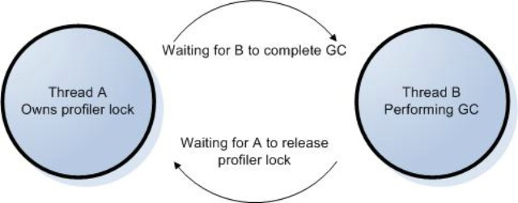
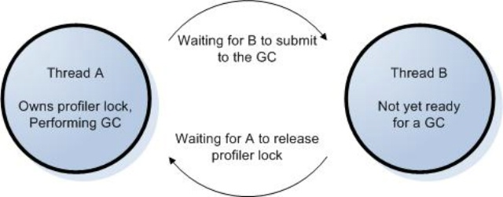

*This blog post originally appeared on David Broman's blog on 10/6/2005*


**Introduction**

This article is targeted toward profiler authors, and anyone interested in building a profiler to examine managed applications.   I will describe how you can program your profiler to walk managed stacks in version 2.0 of the Common Language Runtime.  I’ll try to keep the mood light and zany, as one might expect given the overtly wacky subject matter.

The profiling API in version 2.0 of the CLR has a new method that lets your profiler walk the call stack of the application you’re profiling: DoStackSnapshot.  Version 1.x of the CLR exposed similar functionality via the in-process debugging interface.  But it’s easier, more accurate, and more stable with DoStackSnapshot.  DoStackSnapshot uses the same stack walker used by the garbage collector, security system, exception system, etc.  So you _know_ it’s got to be right.

Access to a full stack trace gives customers of your profiler the ability to get the big picture of what’s going on in an application when something “interesting” happens.  Depending on the nature of the application and what a user wants to profile, you can imagine a user wanting a call stack when an object is allocated, a class is loaded, an exception is thrown, etc.  Even getting a call stack not in response to an application event, but say a timer event, would be interesting for a sampling profiler.  Looking at hot spots in code becomes more enlightening when you can see who called the function that called the function that called the function containing the hot spot.

I’m going to focus on getting stack traces via the DoStackSnapshot API. But it is worth noting that another way to get stack traces is by building shadow stacks: you can hook FunctionEnter/Leave to keep your own copy of the current thread’s managed call stack. Shadow stack building is useful if you need stack information at all times during the app’s execution, and don’t mind paying the performance cost of having your profiler’s code run on every managed call and return. DoStackSnapshot is best if you need slightly sparser reporting of stacks, such as in response to interesting events. Even a sampling profiler taking stack snapshots every few milliseconds is much sparser than building shadow stacks. So DoStackSnapshot is well-suited for sampling profilers.

**Stack walk on the wild side**

It’s nice to be able to get call stacks whenever you want them.  But with power comes responsibility.  A user of a profiler will not want stack walking to be used for evil purposes like causing an AV or deadlock in the runtime.  As a profiler writer, you will have to choose how to wield your power.  If you choose the side of good, that will be but your first step.  I will talk about how to use DoStackSnapshot, and how to do so carefully.  It turns out that the more you want to do with this method, the harder it is to get it right.  Unless you actually want to be evil.  In which case I’m not talking to you.

So let’s take a look at the beast.  Here’s what your profiler calls (you can find this in ICorProfilerInfo2, in corprof.idl):
```
HRESULT DoStackSnapshot(   
  [in] ThreadID thread,   
  [in] StackSnapshotCallback *callback,   
  [in] ULONG32 infoFlags,   
  [in] void *clientData,   
  [in, size_is(contextSize), length_is(contextSize)] BYTE context[],   
  [in] ULONG32 contextSize);
```
And here’s what the CLR calls on your profiler (you can also find this in corprof.idl).  You’ll pass a pointer to your implementation of this function in the callback parameter above.
```
typedef HRESULT \_\_stdcall StackSnapshotCallback(   
  FunctionID funcId,   
  UINT_PTR ip,   
  COR_PRF_FRAME_INFO frameInfo,   
  ULONG32 contextSize,   
  BYTE context[],   
  void *clientData);
```

It’s like a sandwich.  When your profiler wants to walk the stack, you call DoStackSnapshot.  Before the CLR returns from that call, it calls your StackSnapshotCallback several times, once for each managed frame (or run of unmanaged frames) on the stack:
```
Profiler calls DoStackSnapshot.                           Whole wheat bread  
            CLR calls StackSnapshotCallback.              Lettuce frame (“leaf”-most frame, ha)  
            CLR calls StackSnapshotCallback.              Tomato frame  
            CLR calls StackSnapshotCallback.              Bacon frame (root or “main” frame)  
CLR returns back to profiler from DoStackSnapshot         Whole wheat bread
```

As you can see from my hilarious notations, we notify you of the frames in the reverse order from how they were pushed onto the stack—leaf (last-pushed) frame first, main (first-pushed) frame last.  So what do all these parameters mean?  I'm not ready to discuss them all yet, but I guess I’m in the mood to talk about a few of them.  Let's start with DoStackSnapshot. infoFlags comes from the COR\_PRF\_SNAPSHOT\_INFO enum in corprof.idl, and it allows you to control whether we’ll give you register contexts for the frames we report.  You can specify any value you like for clientData and we’ll faithfully give it back to you in your StackSnapshotCallback.

In StackSnapshotCallback, we’ll give you the FunctionID of the currently “walked” frame in funcId.  This value will be 0 if the current frame is a run of unmanaged frames, but I’m not ready to talk about that just yet.  If it’s nonzero, feel free to pass funcId and / or frameInfo to other methods like GetFunctionInfo2 and GetCodeInfo2 to get more info about the function.  You can get this function info now during your stack walk, or save the funcIds and get the function info later on to reduce your impact on the running app. If you do the latter, remember that a frameInfo is only valid inside the callback that gives it to you. While it’s ok to save the funcIds for later use, you may not save the frameInfo for later use. Or, if you like, just report the raw numbers to your users; users love seeing meaningless numbers.

When you return from StackSnapshotCallback, you will typically return S\_OK and we will continue walking the stack. If you like, you can return S\_FALSE, and that will cause us to abort the stack walk. Your DoStackSnapshot call will then return with CORPROF\_E\_STACKSNAPSHOT\_ABORTED.

**Synchronous / Asynchronous**

There are two ways you can call DoStackSnapshot.  A **synchronous** call is the easiest to get right.  You make a synchronous call when, in response to the CLR calling one of your profiler’s ICorProfilerCallback(2) methods, you call DoStackSnapshot to walk the stack of the current thread.  This is useful when you want to see what the stack looks like at an interesting notification like ObjectAllocated.  So you just call DoStackSnapshot from within your ICorProfilerCallback(2) method, passing 0 / NULL for those parameters I haven’t told you about yet.

When you want to get jiggy with it, you’re kicking it **asynchronous** style.  An asynchronous stack walk occurs when you walk the stack of a different thread or, heaven forbid, forcefully interrupt a thread to perform a stack walk (on itself or another thread).  The latter involves hijacking the instruction pointer of a thread to force it execute your own code at arbitrary times.  This is insanely dangerous for too many reasons to list here.  Just, please, don’t do it.  I’ll restrict my description of asynchronous stack walks to non-hijacking uses of DoStackSnapshot to walk a separate target thread.  I call this “asynchronous” because the target thread was doing any old arbitrary thing at the time we chose to walk its stack.  This technique is commonly used by sampling profilers.

**_Walking all over someone else_**

So let’s break down the cross-thread stack walk a little.  You got two threads: the **current** thread and the **target** thread.  The current thread is the thread executing DoStackSnapshot.  The target thread is the thread whose stack is being walked by DoStackSnapshot.  You specify the target thread by passing its thread ID in the thread parameter to DoStackSnapshot.  What happens next is not for the faint of heart.  Remember, the target thread was executing any old arbitrary code when you came along and asked to walk its stack.  So what do we do?  We suspend the target thread, and it stays suspended the whole time we walk it.  Unbelievable!

Have we crossed over to evil?  Or can we do this safely?

I’m pleased you asked.  This is indeed dangerous, and I’ll talk some later about how to do this safely.  But first, I'm going to get into “mixed-mode stacks”.

**Multiple Personality Disorder**

A managed application is likely not going to spend all of its time in managed code.  PInvokes and COM interop allow managed code to call into unmanaged code, and sometimes back again via delegates.  Also, if you blink, you might miss managed code calling directly into the unmanaged runtime (CLR) to do JIT compilation, deal with exceptions, do a garbage collection, etc.  So when you do a stack walk you will probably encounter a mixed-mode stack: some frames are managed functions, and others are unmanaged functions.  What is one to do?

**_Grow up, already!_**

Before I continue from this exciting cliffhanger, a brief interlude.  Everyone knows that stacks on our faithful modern PCs grow (i.e., “push”) to smaller addresses.  But when we visualize these addresses in our minds or on whiteboards, we disagree with how to sort them vertically.  Some of us imagine the stack growing _up_ (little addresses on top); some see it growing _down_ (little addresses on the bottom).  We’re divided on this issue in our team as well.  I choose to side with any debugger I’ve ever used: call stack traces and memory dumps tell me the little addresses are “above” the big addresses.  So stacks grow up.  Main is at the bottom, the leaf callee is at the top.  If you disagree, you’ll have to do some mental rearranging to get through this article.

**_Waiter, there are holes in my stack_**

Now that we’re speaking the same language.  Let’s look at a mixed-mode stack:

| 

Unmanaged

 |
| 

D (Managed)

 |
| 

Unmanaged

 |
| 

C (Managed)

 |
| 

B (Managed)

 |
| 

Unmanaged

 |
| 

A (Managed)

 |
| 

Main (Managed)

 |

Stepping back a bit, it’s worthwhile to understand why DoStackSnapshot exists in the first place.  It’s there to help you walk _managed_ frames on the stack.  If you tried to walk managed frames yourself, you would get unreliable results, particularly on 32 bits, because of some wacky calling conventions used in managed code.  The CLR understands these calling conventions, and DoStackSnapshot is therefore in a uniquely suitable position to help you decode them.  However, DoStackSnapshot is not a complete solution if you want to be able to walk the entire stack, including unmanaged frames.  Here’s where you have a choice:

1. Do nothing and report stacks with “unmanaged holes” to your users, or 
2. Write your own unmanaged stack walker to fill in those holes.

When DoStackSnapshot comes across a block of unmanaged frames, it calls your StackSnapshotCallback with funcId=0.  (I think I mentioned this before, but I’m not sure you were listening.)  If you’re going with option #1 above, simply do nothing in your callback when funcId=0.  We’ll call you again for the next managed frame and you can wake up at that point.

Note that if this unmanaged block actually consists of more than one unmanaged frame we still only call StackSnapshotCallback once.  Remember, we’re making no effort to decode the unmanaged block—we have special cheat sheets that help us skip over the block to the next managed frame, and that’s how we progress.  We don’t necessarily know what’s inside the unmanaged block.  That’s for you to figure out.

**_That first step’s a doozy_**

Unfortunately, filling in the unmanaged holes isn’t the only hard part.  Just beginning the walk is a challenge.  Take a look at our stack above.  No, really, don’t be lazy; just scroll up and take a look.  There’s unmanaged gunk at the top.  Sometimes you’ll be lucky, and that unmanaged gunk will be COM or PInvoke code.  If so, the CLR is smart enough to know how to skip it and will happily begin your walk at the first managed frame (D).  However, you might still want to walk the top-most unmanaged block to report as complete a stack as possible.  And even if you don’t, you might be forced to anyway if you’re _not_ lucky, and that unmanaged gunk represents not COM or PInvoke code, but helper code in the CLR itself (e.g., to do jitting, a GC, etc.).  If that’s the case we won’t be able to find the D frame without your help.  So an unseeded call to DoStackSnapshot will result in an error (CORPROF\_E\_STACKSNAPSHOT\_UNMANAGED\_CTX or CORPROF\_E\_STACKSNAPSHOT\_UNSAFE).  By the way, if you haven’t visited corerror.h, you really should.  It’s beautiful this time of year.

If you’re still alert, you might have noticed I used the word “unseeded” without defining it.  Well, now’s the time.  DoStackSnapshot takes a “seed context” via the context and contextSize parameters.  Context is an overused term with many meanings.  In this case, I'm talking about a register context.  If you peruse the architecture-dependent windows headers (e.g., nti386.h) you’ll find a struct CONTEXT.  It contains values for the CPU registers, and represents the CPU’s state at a particular moment in time.  This is the type of context I'm talking about here.

If you pass NULL for the context parameter, the stack walk we perform is “unseeded”, and we just start at the top.  However, if you pass a non-NULL value for the context parameter, presumably representing the CPU-state at some spot lower down on the stack (preferably pointing to the D frame), then we perform a stack walk “seeded” with your context.  We ignore the real top of the stack and just start wherever you point us.

Ok, that was a lie.  The context you pass us is more of a “hint” than an outright directive.  If the CLR is certain it can find the first managed frame (because the top-most unmanaged block is PInvoke or COM code), it’ll just do that and ignore your seed.  Don’t take it personally, though.  The CLR is trying to help you by providing the most accurate stack walk it can.  Your seed is only useful if the top-most unmanaged block is helper code in the CLR itself, for which we have no cheat sheet to help us skip it.  Since that’s the only situation your seed is useful, that’s the only situation your seed is used.

Now if you’re not only still alert but also astute, you will wonder how on earth you can even provide us the seed in the first place.  If the target thread is still in motion, you can’t just go and walk this target thread’s stack to find the D frame (and thus calculate your seed context).  And yet I’m sitting here telling you to calculate your seed context by doing your unmanaged walk _before_ calling DoStackSnapshot (and thus before DoStackSnapshot takes care of suspending the target thread for you).  So what… does the target thread need to be suspended by you _and_ the CLR?!  Well, yeah.  I think it’s time to choreograph this ballet.

But before you get too deep, note that the issue of whether and how to seed a stack walk applies only to _asynchronous_ walks.  If you’re doing a synchronous walk, DoStackSnapshot will always be able to find its way to the top-most managed frame without your help.  No seed necessary.

**_All together now_**

For the truly adventurous profiler that is doing an asynchronous, cross-thread, seeded stack walk while filling in the unmanaged holes, here’s what it would look like.

| 

Block of  
Unmanaged  
Frames

 | 
1. You suspend the target thread (target thread’s suspend count is now 1) 
2. You get the target thread’s current register context 
3. You determine if the register context points to unmanaged code (e.g., call ICorProfilerInfo2::GetFunctionFromIP(), and see if you get back a 0 FunctionID) 
4. In this case the register context does point to unmanaged code, so you perform an unmanaged stack walk until you find the top-most managed frame (D)
 |
| 

Function D  
(Managed)

 | 
1. You call DoStackSnapshot with your seed context. CLR suspends target thread again: its suspend count is now 2.  Our sandwich begins.

1. CLR calls your StackSnapshotCallback with FunctionID for D.
 |
| 

Block of  
Unmanaged  
Frames

 | 
1. CLR calls your StackSnapshotCallback with FunctionID=0.  You’ll need to walk this block yourself.  You can stop when you hit the first managed frame, or you can cheat: delay your unmanaged walk until sometime after your next callback, as the next callback will tell you exactly where the next managed frame begins (and thus where your unmanaged walk should end).
 |
| 

Function C  
(Managed)

 | 
1. CLR calls your StackSnapshotCallback with FunctionID for C.
 |
| 

Function B  
(Managed)

 | 
1. CLR calls your StackSnapshotCallback with FunctionID for B.
 |
| 

Block of  
Unmanaged  
Frames

 | 
1. CLR calls your StackSnapshotCallback with FunctionID=0.  Again, you’ll need to walk this block yourself.
 |
| 

Function A  
(Managed)

 | 
1. CLR calls your StackSnapshotCallback with FunctionID for A.
 |
| 

Main  
(Managed)

 | 
1. CLR calls your StackSnapshotCallback with FunctionID for Main. 
2. DoStackSnapshot “resumes” target thread (its suspend count is now 1) and returns.  Our sandwich is complete.

1. You resume target thread (its suspend count is now 0, so it’s resumed for real).
 |

**Triumph over evil**

Ok, this is way too much power without some serious caution.  In the most advanced case, you’re responding to timer interrupts and suspending application threads arbitrarily to walk their stacks.  Yikes!

Being good is hard and involves rules that are not obvious at first.  So let's dive in.

**_The bad seed_**

Let’s start with an easy one.  If your profiler supplies a bogus (non-null) seed when you call DoStackSnapshot, we’ll give you bogus results.  We’ll look at the stack where you point us, and make assumptions about what the values on the stack are supposed to represent.  That will cause us to dereference what we expect are addresses on the stack.  So if you screw up, we’ll dereference values off into la la land.  We do everything we can to avoid an all-out 2nd-chance AV (which would tear down your customer’s process).  But you really should make an effort to get your seed right and not take any chances.

**_Woes of suspension_**

The second you decide to do cross-thread walking, you’ve decided, at a minimum, to ask the CLR to start suspending threads on your behalf.  And, even worse, if you want to walk the unmanaged block at the top of the stack, you’ve decided to start suspending threads all by yourself without invoking the CLR’s wisdom on whether this might be a good idea at the current time.

We all remember the dining philosophers from CS training, right?  Everyone picks up his right fork, and no one can grab his left fork because each dude is waiting on the dude to his left to put down the needed fork.  And if they’re all seated in a circle, you’ve got a cycle of waiting and a lot of empty stomachs.  The reason these idiots starve to death is, well, for one thing, they think they each need two forks to eat, which is pretty dumb.  But that’s not the point.  They break a simple rule of deadlock avoidance: if multiple locks are to be taken, always take them in the same order.  Following this rule would avoid the cycle where A waits on B, B waits on C, C waits on A.

So here’s where it gets interesting.  Suppose an app follows the rule and always takes locks in the same order.  But now imagine someone comes along and starts arbitrarily suspending threads (that would be your profiler doing the suspending, by the way).  The complexity has leaped substantially.  What if the suspender now needs to take a lock held by the suspendee?  Or more insidious, maybe the suspender needs a lock held by a dude who’s waiting for a lock held by another dude who’s waiting for a lock held by the suspendee?   Suspension adds a new edge to our thread-dependency graph, which can introduce cycles.  Let’s take a look at some specific problems:

Problem 1: _Suspendee owns locks needed by suspender, or needed by threads the suspender depends on._

Problem 1a: _Those locks are CLR locks._

As you might imagine, the CLR has a bit of thread synchronization to do here and there, and therefore has several locks that are used internally.  When you call DoStackSnapshot, the CLR detects the condition that the target thread owns a CLR lock that will be needed by the current thread (in order to perform the stack walk).  When the condition arises, the CLR refuses to do the suspension, and DoStackSnapshot immediately returns with an error (CORPROF\_E\_STACKSNAPSHOT\_UNSAFE).  At this point, if you’ve suspended the thread yourself before your call to DoStackSnapshot, then you will resume the thread yourself, and the pickle remains empty of you.

Problem 1b: _Those locks are your own profiler’s locks_

This is more common-sense than anything, really.  You may have your own thread synchronization to do here and there, so you can imagine an application thread (Thread A) hits a profiler callback, and runs some of your profiler code that involves taking one of your own locks.  Then poof, another thread (Thread B) decides to walk A.  This means B will suspend A.  So you just need to remember that, while A is suspended, you really shouldn’t have B try to take any of your own locks that A might possibly own.  For example, thread B will execute StackSnapshotCallback during the stack walk, so you shouldn’t be trying to take any locks during that callback that could be owned by the suspended target thread (A).

Problem 2: _While you suspend the target thread, the target thread tries to suspend you_

“Come on!  Like that could really happen.”  Believe it or not, if:

- Your app runs on a multiproc box, and 
- Thread A runs on one proc and thread B runs on another, and 
- A tries to suspend B while B tries to suspend A

then it’s possible that both suspensions win, and both threads end up suspended.  It’s like the line from that movie: “Multiproc means never having to say, ‘I lose.’”.  Since each thread is waiting for the other to wake it up, they stay suspended forever.  It is the most romantic of all deadlocks.

This really can happen, and it is more disconcerting than problem #1, because you can’t rely on the CLR to detect this for you when you do the suspension yourself before calling DoStackSnapshot.  Once you’ve done the suspension, it’s too late!

Ok, so, why is the target thread trying to suspend you anyway?  Well, in a hypothetical, poorly-written profiler, you could imagine that the stack walking code (along with the suspension code) might be executed by any number of threads at arbitrary times.  In other words, imagine A is trying to walk B at the same time B is trying to walk A.  They both try to suspend each other simultaneously (because they’re both executing the SuspendThread() portion of the profiler’s stack walking routine), both win, and we deadlock.  The rule here is obvious—don’t do that!

A less obvious reason that the target thread might try to suspend your walking thread is due to the inner workings of the CLR.  The CLR suspends application threads to help with things like garbage collection.  So if your walker tries to walk (and thus suspend) the thread doing the GC at the same time the thread doing the GC tries to suspend your walker, you are hosed.

The way out, fortunately, is quite simple.  The CLR is only going to suspend threads it needs to suspend in order to do its work.  Let’s label the two threads involved in your stack walk: Thread A = the current thread (the thread performing the walk), and Thread B = the target thread (the thread whose stack is walked).  As long as Thread A has _never executed managed code_ (and is therefore of no use to the CLR during a garbage collection), then the CLR will never try to suspend Thread A.  This means it’s safe for your profiler to have Thread A suspend Thread B, as the CLR will have no reason for B to suspend A. 

If you’re writing a sampling profiler, it’s quite natural to ensure all of this.  You will typically have a separate thread of your own creation that responds to timer interrupts and walks the stacks of other threads.  Call this your sampler thread.  Since you create this sampler thread yourself and have control over what it executes, the CLR will have no reason to suspend it.  And this also fixes the “poorly-written profiler” example above, since this sampler thread is the only thread of your profiler trying to walk or suspend other threads.  So your profiler will never try to directly suspend the sampler thread.

This is our first nontrivial rule so, for emphasis, let’s repeat with some neat formatting:

Rule 1: Only a thread that has never run managed code can suspend another thread

**_Nobody likes to walk a corpse_**

If you are doing a cross-thread stack walk, you need to ensure your target thread remains alive for the duration of your walk.  Just because you pass the target thread as a parameter to the DoStackSnapshot call doesn’t mean you’ve implicitly added some kind of lifetime reference to it.  If the app wants the thread to go away it will.  And if that happens while you’re trying to walk it, you could easily AV.

Lucky for you, the CLR notifies profilers when a thread is about to be destroyed via the aptly-named ThreadDestroyed callback (ICorProfilerCallback(2)).  So it’s your responsibility to implement ThreadDestroyed and have it wait until anyone walking that thread is finished.  This is interesting enough to qualify as our next rule:

Rule 2: Block in ThreadDestroyed callback until that thread’s stack walk is complete

 

**_GC helps you make a cycle_**

Ok, at this point you might want to take a bathroom break or get some caffeine or something.  Things get a little hairy here.  Let’s start with the text of the next rule, and decipher it from there:

Rule 3: Do not hold a lock during a profiler call that can trigger a GC

A while back I mentioned that it is clearly a bad idea for your profiler to hold one if its own locks if the owning thread might get suspended and then walked by another thread that will need the same lock.  Rule 3 warns us against something more subtle.  Here, I'm saying you shouldn’t hold _any_ of your own locks if the owning thread is about to call an ICorProfilerInfo(2) method that might trigger a garbage collection.  A couple examples should help.

Example #1:

- Thread A successfully grabs and now owns one of your profiler locks 
- Thread B = thread doing the GC 
- Thread B calls profiler’s GarbageCollectionStarted callback 
- Thread B blocks on the same profiler lock 
- Thread A executes GetClassFromTokenAndTypeArgs() 
- GetClassFromTokenAndTypeArgs tries to trigger a GC, but notices a GC is already in progress. 
- Thread A blocks, waiting for GC currently in progress (Thread B) to complete 
- But B is waiting for A, because of your profiler lock.



Example #2:

- Thread A successfully grabs and now owns one of your profiler locks 
- Thread B calls profiler’s ModuleLoadStarted callback 
- Thread B blocks on the same profiler lock 
- Thread A executes GetClassFromTokenAndTypeArgs() 
- GetClassFromTokenAndTypeArgs triggers a GC 
- Thread A (now doing the GC) waits for B to be ready to be collected 
- But B is waiting for A, because of your profiler lock.



Have you digested the madness?  The crux of the problem is that garbage collection has its own synchronization mechanisms.  Example 1 involved the fact that only one GC can occur at a time. This is admittedly a fringe case, as GCs don’t spontaneously occur quite so often that one has to wait for another, unless you’re operating under stressful conditions.  Even so, if you profile long enough, this will happen, and you need to be prepared.  Example 2 involved the fact that the thread doing the GC must wait for the other application threads to be ready to be collected.  The problem arises when you introduce one of your own locks into the mix, thus forming a cycle.  In both cases we broke the rule by allowing A to own one of your locks and then call GetClassFromTokenAndTypeArgs (though calling any method that might trigger a GC is sufficient to doom us).

How’s that caffeine holding out?  If it’s working, you probably have a couple questions.

“How do I know which ICorProfilerInfo(2) methods might trigger a garbage collection?”

We plan to document this on MSDN, or at the least, in my or [Jonathan Keljo’s blog](http://blogs.msdn.com/jkeljo/default.aspx).

“What does this have to do with stack walking?”

Yeah, if you read carefully, you’ll see that this rule never even mentions DoStackSnapshot.  And no, DoStackSnapshot is not even one of those mysterious ICorProfilerInfo(2) methods that trigger a GC.  The reason I'm discussing this rule here is that it’s precisely you daring cowboys—who asynchronously walk stacks at arbitrary samples—who will be most likely to implement your own profiler locks, and thus be prone to falling into this trap.  Indeed, rule 2 above downright tells you to add some synchronization into your profiler.  It is quite likely a sampling profiler will have other synchronization mechanisms as well, perhaps to coordinate reading / writing shared data structures at arbitrary times.  Of course, it’s still quite possible for a profiler that never touches DoStackSnapshot to need to deal with this issue.  So tell your friends.

**Enough is enough**

I’m just about tuckered out, so I’m gonna close this out with a quick summary of the highlights.  Here's what's important to remember.

1. Synchronous stack walks involve walking the current thread in response to a profiler callback.  These don’t require seeding, suspending, or any special rules.  Enjoy! 
2. Asynchronous walks require a seed if the top of the stack is unmanaged code not part of a PInvoke or COM call.  You supply a seed by directly suspending the target thread and walking it yourself, until you find the top-most managed frame.  If you don’t supply a seed in this case, DoStackSnapshot will just return a failure code to you. 
3. If you directly suspend threads, remember that only a thread that has never run managed code can suspend another thread 
4. When doing asynchronous walks, always block in your ThreadDestroyed callback until that thread’s stack walk is complete 
5. Do not hold a lock while your profiler calls into a CLR function that can trigger a GC

Finally, a note of thanks to the rest of the CLR Profiling API team, as the writing of these rules is truly a team effort.  And special thanks to Sean Selitrennikoff who provided an earlier incarnation of much of this content.
