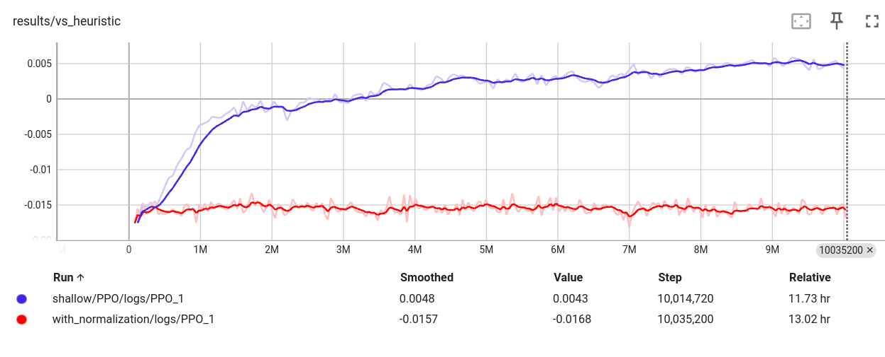

# Introduction

This project is a Reinforcement Learning gymnasium used to train a machine learning model to choose when to apply the Common Subexpression Elimination optimization in the JIT.

Currently, it *almost* matches the default, hand-written CSE heuristic in the JIT, and does so with a simple reward function and features which are not normalized or smartly chosen.  This is intended to be a playground to try to find optimal features, reward function, neural network, and architecture for a fine-tuned CSE model.

This project works best/easiest on Ubuntu 22 (WSL2 is fine), but it also works on Windows.

# Setup

Follow the standard [Workflow Guide](../../../../docs/workflow/README.md) to get a working environment to build .Net.

## Runtime setup

Build a checked version of the runtime and tests:

```bash
./build.sh -subset clr -c Checked
./build.sh -subset libs -c Release -rc Checked
./src/tests/build.sh x64 checked skipmanaged skipnative
```

Download superpmi data.  This will download a few gigs worth of data:

```bash
python src/coreclr/scripts/superpmi.py download
```

## Python Setup

This was developed and tested with Python 3.10 (3.11 on Windows).  Python 3.10 is the default Python version in Ubuntu 22.

First, install all dependencies from requirements.txt in this directory:

```bash
pip install -r requirements.txt
```

## Training a Model

This project uses SuperPMI to JIT methods without needing to load the runtime.  SuperPMI records data about methods in Method Contexts, stored in a .mch file under the `artifacts/spmi` folder.  To train a model, you need to specify the CORE_ROOT environment variable to point to the checked runtime we built above (or use the --core_root parameter) and specify a .mch file to use.  Here is an example:

```bash
python train.py ./model_output_path/ ~/git/dotnet/runtime/artifacts/[build]/[file].mch \
                --core_root ~/git/dotnet/runtime/artifacts/bin/coreclr/linux.x64.Checked/ \
                --iterations 5000000 --parallel 10
```

This will train a model and store it in `./model_output_path`.  Here are the command line options:

``` bash
usage: train.py [-h] [--core_root CORE_ROOT] [--parallel PARALLEL] [--iterations ITERATIONS] [--algorithm ALGORITHM]
                [--test-percent TEST_PERCENT] [--reward-optimal-cse] [--normalize-features] model_path mch
```

**algorithm** - PPO, A2C, or DQN.  PPO is the default and currently the only one that seems to converge to a solution.  Still working on getting A2C and DQN to work.

**iterations** - The number of iterations (individual CSE choices) to train on.  PPO builds a decent model at around 1 million iterations (the default).  It starts getting close to to the default CSE Heuristic at around 3-5 million iterations.

**parallel** - Use multiprocessing to train in parallel.  This specifies the number of processes (default is 1).

**test-percent** - What percentage of the .mch file to reserve for testing the model (default is .1, 10%).

**reward-optimal-cse** - Attempt to find the "optimal" choice at each iteration step and reward the model for picking the best option.  This does have a positive impact, but slows down training by 4x.

**normalize-features** - Performs normalization on features, currently causes the model to not train.  (So don't use it, still investigating why.)

## Evaluating a Model

Use `evaluate.py` to evaluate a model's performance.  Simply pass in the model path, `.mch` file, and CORE_ROOT used with train.py and it will list how many methods were improved or regressed by using the model versus the default heuristic.  Note that snapshots of the model are taken at regular intervals and this file will attempt to evaluate all of them.

# The Code

[jit_cse.py](jitml/jit_cse.py) - This contains the environment itself.  This is meant to produce the most basic observation space and rewards.  If you want to customize rewards, the features that the model uses, etc, you can create a gym wrapper that wraps the environment.

[wrappers.py](jitml/wrappers.py) - This is an example of modifying the gym environment.  `NormalizeFeaturesWrapper` is an example of a `gym.ObservationWrapper`.  It attempts to normalize all inputs to the model in the range of `[0, 1]`.  `OptimalCseWrapper` is a full `gym.Wrapper` that wraps the `step` function.  It enhances the default reward function to attempt to reward/punish the model for making the exact correct or incorrect decisions.

[machine_learning.py](jitml/machine_learning.py) - This file contains all of the machine learning implementation for this project.  We currently just use stable-baselines to implement PPO/A2C/DQN.  Additionally, we don't currently define our own neural network.  The neural network architecture is pre-defined by the `MlpPolicy` parameter when creating the reinforcement learning agent.  A custom neural network can be specified by building a [Custom Network Architecture](https://stable-baselines3.readthedocs.io/en/master/guide/custom_policy.html#custom-network-architecture).

[optcse.cpp](../../jit/optcse.cpp) - This contains the implementation of `CSE_HeuristicRLHook` used to give the agent the ability to control CSE optimization choices.  Specifically `CSE_HeuristicRLHook::GetFeatures` and `CSE_HeuristicRLHook::s_featureNameAndType` are the raw feature building blocks used by `JitCseEnv` to build the observation that the model is trained on.

[method_context.py](jitml/method_context.py) - This contains the Python classes that mirror the features produced by `CSE_HeuristicRLHook`.  This needs to be kept in sync with optcse.cpp.

## Making Changes

Typically, most changes should be implemented as gym wrappers.  The `JitCseEnv` should be as basic and straight forward as possible.  `JitCseModel.train` provides a `wrappers` parameter that you can use to pass in your custom wrappers to test your changes.

## Testing Changes

Use Tensorboard to see live updates on how training is going:

``` bash
tensorboard --host 0.0.0.0 --logdir=./model_output_path/
```

Both A2C and PPO provide extra metrics on the Tensorboard to see if the model is properly training (DQN does not yet have this).  Here is an example of successful training (blue) vs a model that did not train (red):



Typically, the `rollout/ep_rew_mean`, `results/vs_heuristic`, and `results/vs_no_cse` metrics should all trend upwards over time from a lower value if the model is learning.

Once you see that a model is training successfully, use `evaluate.py` to see how much better or worse it is over the baseline.

**NOTE:** The `results/` metrics are a rolling average of comparisons versus baseline since the last metric datapoint was emitted.  This metric crossing 0 into the positive does not necessarily mean that the model is performing better than the baseline heuristic in a general sense.  Only that it did better on the small subset of training functions it just recently attempted to optimize.  Whether or not the model actually performs better than baseline is left to `evaluate.py` after it is finished training.

## SuperPMI

SuperPMI is used to do the work of JIT'ing functions.  You do not need to use it directly.  However, if you need to test the JIT'ing of a method:

```bash
superpmi libclrjit.so -v q -streaming stdin {mch}
```

Then use the format `[method_id]!JitMetrics=1!Var1=Value1!Var2=Value2` to jit methods.  For example:

```
123!JitMetrics=1              <= JIT the method in the normal way
123!JitMetrics=1!JitRLHook=1  <= Use the reinforcement learning hook

123!JitMetrics=1!JitRLHook=1!JitRLHookCSEDecisions=2,3,1  <= Enable CSE 2, 3, then 1 when JIT'ing
```

## Pylint

Please run `pylint *py jitml/` before checkin and clean up any warnings (no need to run it on the tests).  It's ok to silence warnings with `#pylint disable` if it makes more sense to do that than clean up what it's complaining about.

