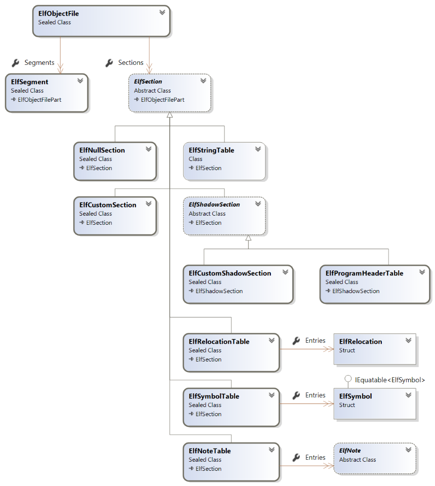
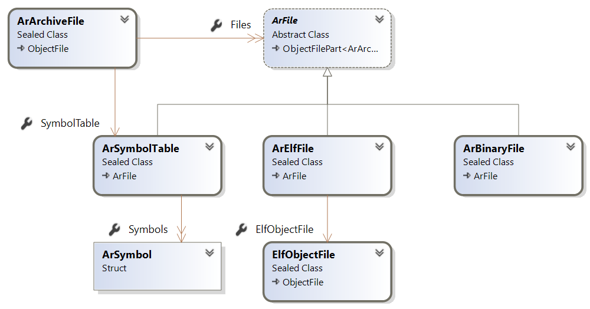

# LibObjectFile User Manual

This is the manual of LibObjectFile with the following API covered:

- [ELF Object File Format](#elf-object-file-format) via the `ElfObjectFile` API
- [Archive ar File Format](#archive-ar-file-format) via the `ArArchiveFile` API

## ELF Object File Format

### Overview

The main entry-point for reading/writing ELF Object file is the [`ElfObjectFile`](https://github.com/xoofx/LibObjectFile/blob/master/src/LibObjectFile/Elf/ElfObjectFile.cs) class.

This class is the equivalent of the ELF Header and contains also sections and segments (program headers)



### ELF Reading

The ELF API allows to read from a `System.IO.Stream` via the method `ElfObjectFile.Read`:

```C#
ElfObjectFile elf = ElfObjectFile.Read(inputStream);
``` 

### ELF Writing

You can create an ELF object in memory and save it to the disk:

```c#
var elf = new ElfObjectFile();

var codeStream = new MemoryStream();
codeStream.Write(Encoding.UTF8.GetBytes("This is a text"));
codeStream.Position = 0;

// Create a .text code section
var codeSection = new ElfCustomSection(codeStream).ConfigureAs(ElfSectionSpecialType.Text);
elf.AddSection(codeSection);

// Always required if sections are added
elf.AddSection(new ElfSectionHeaderStringTable());

using var outputStream = File.OpenWrite("test.out");
elf.Write(outputStream);
```

### Advanced

#### Print

You can print an object to a similar textual format than `readelf` by using the extension method `ElfObjectFile.Print(TextWriter)`:

```c#
// Using the previous code to create an ELF with a code section
elf.Print(Console.Out);
```

will print the following output:

``` 
ELF Header:
  Magic:   7f 45 4c 46 02 01 01 00 00 00 00 00 00 00 00 00 
  Class:                             ELF64
  Data:                              2's complement, little endian
  Version:                           1 (current)
  OS/ABI:                            UNIX - System V
  ABI Version:                       0
  Type:                              REL (Relocatable file)
  Machine:                           Advanced Micro Devices X86-64
  Version:                           0x1
  Entry point address:               0x0
  Start of program headers:          0 (bytes into file)
  Start of section headers:          0 (bytes into file)
  Flags:                             0x0
  Size of this header:               0 (bytes)
  Size of program headers:           0 (bytes)
  Number of program headers:         0
  Size of section headers:           0 (bytes)
  Number of section headers:         3
  Section header string table index: 2

Section Headers:
  [Nr] Name              Type            Address          Off    Size   ES Flg Lk Inf Al
  [ 0]                   NULL            0000000000000000 000000 000000 00      0   0  0
  [ 1] .text             PROGBITS        0000000000000000 000000 00000e 00  AX  0   0  0
  [ 2] .shstrtab         STRTAB          0000000000000000 000000 000001 00      0   0  0
Key to Flags:
  W (write), A (alloc), X (execute), M (merge), S (strings), I (info),
  L (link order), O (extra OS processing required), G (group), T (TLS),
  C (compressed), x (unknown), o (OS specific), E (exclude),
  l (large), p (processor specific)

There are no section groups in this file.

There are no program headers in this file.

There is no dynamic section in this file.

There are no relocations in this file.

The decoding of unwind sections for machine type Advanced Micro Devices X86-64 is not currently supported.

No version information found in this file.
```

The `Print` is trying to follow `readelf` from as compiled on `Ubuntu 18.04`. It is not intended to be 100% exact but is currently used in the unit tests to match the output of `readelf`.

#### Section Header String Table

When sections are added to an `ElfObjectFile.Sections`, it is required to store their names in a Section Header String Table (`.shstrtab`)

In that case, you need to add explicitly an `ElfSectionHeaderStringTable` to the sections:

```C#
// Always required if sections are added
elf.AddSection(new ElfSectionHeaderStringTable());
```

This section can be put at any places in the sections, but is usually put at the end.

#### Shadow sections

There is a type of section called `ElfShadowSection` which are only valid at runtime but are not saved in the Section Header Table, while their content might be saved as part of the layout of the file. They are also not part of ELF specifications but are an implementation details.

A shadow section is used by an `ElfSegment` for which a region of data might not be associated with an existing section. In that case, you still want to associate data with the segment.

This is specially required when working with executable that don't have any sections but have only segments/program headers. In that case, `ElfObjectFile.Read` will create `ElfCustomShadowSection` for each part of the file that are being referenced by an `ElfSegment`.

#### Null section and Program Header Table

The null section `ElfNullSection` must be put as the first section of an `ElfObjectFile`. It is the default when creating an `ElfObjectFile`.

The Program Header Table is implemented as the `ElfProgramHeaderTable` shadow section and is added right after the `NullSection`. This is required because a segment of type `PHDR` will reference it while it is not an actual section in the original ELF file.

#### ELF Layout

An `ElfObjectFile` represents an ELF Object File in memory that can be freely modified. Unlike its serialized version on the disk, the offsets and size of the sections and segments references can be changed dynamically.

You can force the computation of the layout of an ELF object file before saving it to the disk by using the method `ElfObjectFile.UpdateLayout`:

```C#
ElfObjectFile elf = ...;

// Update layout (ObjectFile.Layout, all offsets of Sections and Segments)
elf.UpdateLayout();

foreach(var section in elf.Sections)
{
    // Section.Offset is now calculated as it was on the disk
    Console.WriteLine($"Section {section} Offset: 0x{section.Offset:x16}");
}
```

#### Diagnostics and verification

An `ElfObjectFile` can be created in memory with an invalid configuration (e.g missing a link between a symbol table and a string table).

You can verify the validity of an `ElfObjectFile` by calling `ElfObjectFile.Verify`

```C#
ElfObjectFile elf = ...;

// Verify the validity of an ElfObjectFile instance
var diagnostics = elf.Verify();

// If we have any errors, we can iterate on diagnostic messages
if (diagnostics.HasErrors)
{
    foreach(var message in diagnostics.Messages)
    {
        Console.WriteLine(message);
    }
}
```

### Links

- [Executable and Linkable Format (ELF).pdf](http://www.skyfree.org/linux/references/ELF_Format.pdf)
- [ELF Linux man page](http://man7.org/linux/man-pages/man5/elf.5.html)

## Archive ar File Format

### Overview

LibObjectFile supports the [Unix `ar` archive file format](https://en.wikipedia.org/wiki/Ar_(Unix)) and the main entry point class is the [`ArArchiveFile`](https://github.com/xoofx/LibObjectFile/blob/master/src/LibObjectFile/Ar/ArArchiveFile.cs)  class.

This class has a similar API than ELF for reading/writing archive.



### Archive reading

The Ar API allows to read from a `System.IO.Stream` via the method `ArArchiveFile.Read` and by specifying the type of the archive to read (e.g GNU on Linux for regular `.a` files)

```C#
ArArchiveFile ar = ArArchiveFile.Read(inputStream, ArArchiveKind.GNU);
``` 

### Archive Writing

You can create an ArArchiveFile object in memory and save it to the disk:

```c#
var arFile = new ArArchiveFile();
arFile.AddFile(new ArBinaryFile()
    {
        Name = "file.txt",
        Stream = new MemoryStream(Encoding.UTF8.GetBytes("This is the content"))
    }
);
using var outputStream = File.OpenWrite("libtest.a");
arFile.Write(outputStream);
```

Although the example above is storing a text, one of the main usage of an `ar` archive is to store object-file format (e.g `ELF`)

If you want to store direct an `ElfObjectFile` you can use the `ArElfFile` to add an ELF object-file directly to an archive.

### Symbol Table

A symbol table allows an archive to quickly expose which symbols are stored in which file within the collection of files within the `ar` archive.

You have to use the `ArSymbolTable` and add it to an `ArArchiveFile`

> Note: The `ArSymbolTable` instance must be the first entry in the `ArArchiveFile.Files` before other file entries

```c#
var arFile = new ArArchiveFile();
// Create Symbol table, added 1st to ArArchiveFile
var symbolTable = new ArSymbolTable();
arFile.AddFile(symbolTable);
// Create an ELF
var elf = new ElfObjectFile();
// ... fill elf, add symbols
arFile.AddFile(elf);
// Add a symbol entry
symbolTable.Symbols.Add(new ArSymbol("my_symbol", elf));
``` 
### Links

- [Archive ar file format (Wikipedia)](https://en.wikipedia.org/wiki/Ar_(Unix))
