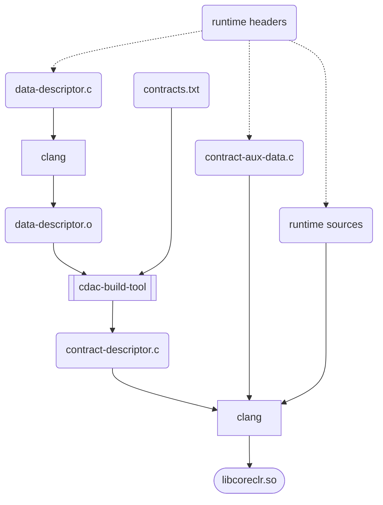

# cDAC Build Tool

## Summary

The purpose of `cdac-build-tool` is to generate a `.c` file that contains a JSON cDAC contract descriptor.

It works by processing one or more object files containing data descriptors and zero or more text
files that specify contracts.

## Running

```console
% cdac-build-tool compose [-v] -o contract-descriptor.c -c contracts.txt data-descriptor.o
```
## .NET runtime build integration

`cdac-build-tool` is meant to run as a CMake custom command.
It consumes a target platform object file and emits a C source
file that contains a JSON contract descriptor.  The C source
is the included in the normal build and link steps to create the runtime.

The contract descriptor source file depends on `contract-aux-data.c` which is a source file that contains
the definitions of the "indirect pointer data" that is referenced by the data descriptor.  This is typically the addresses of important global variables in the runtime.
Constants and build flags are embedded directly in the JSON payload.

Multiple data descriptor source files may be specified (for example if they are produced by different components of the runtime, or by different source languages).  The final JSON payload will be a composition of all the data descriptors.

Multiple contracts text files may be specified.  This may be useful if some contracts are conditionally included (for example if they are platform-specific).  The final JSON payload will be a composition of all the contracts files.




## Specifying data descriptors

The sample in the `sample` dir uses the following syntax (see [sample/sample.data.h](sample/sample.data.h)) to specify the data descriptor:

```c
CDAC_BASELINE("empty")
CDAC_TYPES_BEGIN()

CDAC_TYPE_BEGIN(ManagedThread)
CDAC_TYPE_INDETERMINATE(ManagedThread)
CDAC_TYPE_FIELD(ManagedThread, GCHandle, GCHandle, offsetof(ManagedThread,m_gcHandle))
CDAC_TYPE_FIELD(ManagedThread, pointer, Next, offsetof(ManagedThread,m_next))
CDAC_TYPE_END(ManagedThread)

CDAC_TYPE_BEGIN(GCHandle)
CDAC_TYPE_SIZE(sizeof(intptr_t))
CDAC_TYPE_END(GCHandle)

CDAC_TYPES_END()

CDAC_GLOBALS_BEGIN()
// FIXME: wasm32 doesn't like uint64_t cast from uintptr_t at compile-time
// The right thing to do is to not do pointers using this mechanism since they need to go into
// auxdata anyway.
CDAC_GLOBAL_POINTER(ManagedThreadStore, &g_managedThreadStore)
#if FEATURE_EH_FUNCLETS
CDAC_GLOBAL(FeatureEHFunclets, uint8, 1)
#else
CDAC_GLOBAL(FeatureEHFunclets, uint8, 0)
#endif
CDAC_GLOBAL(SomeMagicNumber, uint32, 42)
CDAC_GLOBALS_END()
```

**TODO**: finish documenting this

The file is included multiple times with the macros variously defined in order to generate the
data descriptor blob.

## Implementation Details

See [data-descriptor.md](./data-descriptor.md)
