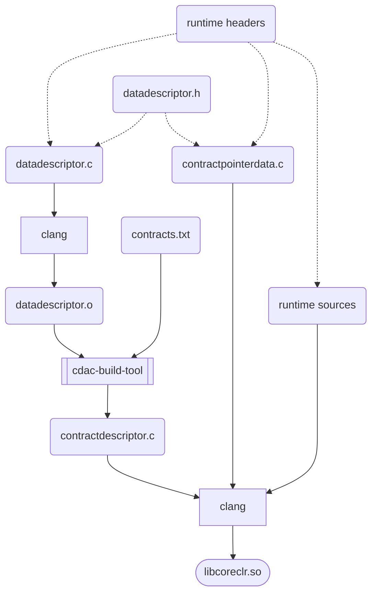

# cDAC Build Tool

## Summary

The purpose of `cdac-build-tool` is to generate a `.c` file that contains a JSON cDAC contract descriptor.

It works by processing one or more object files containing data descriptors and zero or more text
files that specify contracts.

## Running

```console
% cdac-build-tool compose [-v] -o contractdescriptor.c -c contracts.txt datadescriptor.o
```
## .NET runtime build integration

`cdac-build-tool` is meant to run as a CMake custom command.
It consumes a target platform object file and emits a C source
file that contains a JSON contract descriptor.  The C source
is then included in the normal build and link steps to create the runtime.

The contract descriptor source file depends on `contractpointerdata.c` which is a source file that contains
the definitions of the "indirect pointer data" that is referenced by the data descriptor.  This is typically the addresses of important global variables in the runtime.
Constants and build flags are embedded directly in the JSON payload.

Multiple data descriptor source files may be specified (for example if they are produced by different components of the runtime, or by different source languages).  The final JSON payload will be a composition of all the data descriptors.

Multiple contracts text files may be specified.  This may be useful if some contracts are conditionally included (for example if they are platform-specific).  The final JSON payload will be a composition of all the contracts files.

In the C/C++ data descriptor, we use a single header file `datadescriptor.h` together with the C preprocessor to produce `datadescriptor.c` and `contractpointerdata.c`.
This is an implementation detail. For data structures defined in other languages, other tools can be used to produce the object file and indirect pointer data.




## Specifying data descriptors

The sample in the `sample` dir uses the following syntax (see [sample/sample.data.h](sample/sample.data.h)) to specify the data descriptor:

```c
CDAC_BASELINE("empty")
CDAC_TYPES_BEGIN()

CDAC_TYPE_BEGIN(ManagedThread)
CDAC_TYPE_INDETERMINATE(ManagedThread)
CDAC_TYPE_FIELD(ManagedThread, GCHandle, GCHandle, offsetof(ManagedThread,m_gcHandle))
CDAC_TYPE_FIELD(ManagedThread, pointer, Next, offsetof(ManagedThread,m_next))
CDAC_TYPE_END(ManagedThread)

CDAC_TYPE_BEGIN(GCHandle)
CDAC_TYPE_SIZE(sizeof(intptr_t))
CDAC_TYPE_END(GCHandle)

CDAC_TYPES_END()

CDAC_GLOBALS_BEGIN()
CDAC_GLOBAL_POINTER(ManagedThreadStore, &g_managedThreadStore)
#if FEATURE_EH_FUNCLETS
CDAC_GLOBAL(FeatureEHFunclets, uint8, 1)
#else
CDAC_GLOBAL(FeatureEHFunclets, uint8, 0)
#endif
CDAC_GLOBAL(SomeMagicNumber, uint32, 42)
CDAC_GLOBALS_END()
```

The file is included multiple times with the macros variously defined in order to generate the
data descriptor blob.

## Implementation Details

See [data-descriptor-blob.md](./data-descriptor-blob.md)

## Workflow

### Porting and extending the data blob scraper

When porting to a new architecture, or extending the blob contents, it is recommended to
first work with the sample blob, rather than the full CoreCLR descriptor.

For example, if your target platform has a clang toolchain, something like this will provide a suitable
input for `cdac-build-tool`:

```console
$ clang -target wasm32-unknown-unknown -c -o /tmp/sample.o src/coreclr/tools/cdac-build-tool/sample/sample.blob.c
```

If you are modifying the preprocessor macros, using `-E` to emit the preprocessed output is helpful as well.

```console
$ clang -target x86_64-unknown-linux-gnu -E -o /tmp/sample.i .src/coreclr/tools/cdac-build-tool/sample/sample.blob.c
```

Running the `cdac-build-tool` with the `-v` verbose option will show progress

```console
$ ./dotnet.sh run --project src/coreclr/tools/cdac-build-tool/cdac-build-tool.csproj -- compose -v -o /tmp/contract.c /tmp/sample.o
```

It is also helpful to run the `cdac-build-tool` under a debugger with a breakpoint in `ObjectFileScraper.ScrapeInput`

**Release runtime builds** When building Release builds of the runtime, the build infrastructure
may turn on whole program optimizations.  On some toolchains this may produce object files that
are a serialization of the internal compiler state, rather than a native object format.  This may break
assumptions of the `cdac-build-tool` about global symbol initialization, for example constants and string literals might not be stored as binary integers or as byte sequences.  In such cases, it may be
necessary to turn off global optimizations when compiling `datadescriptor.cpp`.  This is okay to do because `datadescriptor.cpp` is not shipped as part of the runtime build - and in fact it has no executable functions at all.  It is just used to gather type layout and size information.

It is conceivable that some future C/C++ compiler with whole program optimizations turned on may remove unused struct fields.  (Such that separately compiling `datadescriptor.cpp` would produce incorrect offsets). In that case, `cdac-build-tool` will need to use another technique to collect offsets for a runtime built with such a compiler.  As of 2024, no compilers do this, however.
