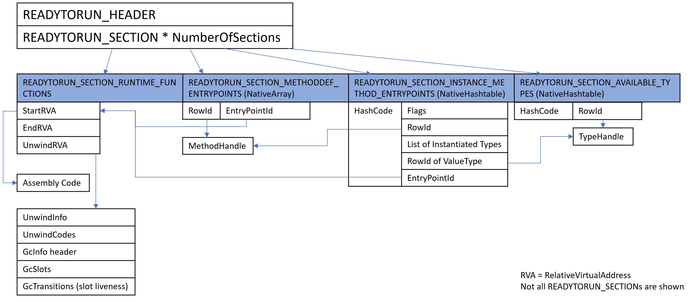

# R2RDump

Parses and outputs the contents of a ReadyToRun image

## Usage

dotnet R2RDump.dll --in &lt;path to ReadyToRun image&gt;

* -o, --out &lt;arg&gt;
	- Output file path. Dumps everything to the specified file except help message and error messages
* -x, --xml
	- Output in XML format
* --raw
	- Dump the raw bytes of each section or runtime function
* --header
	- Dump R2R header
* -d, --disasm
	- Show disassembly of methods or runtime functions
* -q, --query &lt;arg&gt;...
	- Query method by exact name, signature, row id or token
* -k, --keyword &lt;arg&gt;...
	- Search method by keyword
* -r, --runtimefunction &lt;arg&gt;...
	- Get one runtime function by id or relative virtual address
* -s, --section &lt;arg&gt;...
	- Get section by keyword
* --unwind
	- Dump unwindInfo
* --gc
	- Dump gcInfo and slot table
* --sc
	- Dump section contents
* -v, --verbose
	- Dump disassembly, unwindInfo, gcInfo and section contents

## Architectures Supported

### R2RDump Architectures

|             | x64 | x86       | ARM | ARM64 |
| ----------- | --- | --------- | --- | ----- |
| **Windows** | yes | no disasm |     |       |
| **Linux**   | yes |           |     |       |
| **OSX**     | yes | -         | -   | -     |

### Input Image Architectures

|             | x64 | x86 | ARM       | ARM64 |
| ----------- | --- | --- | --------- | ----- |
| **Windows** | yes | yes | yes       | yes   |
| **Linux**   | yes | yes | yes       | yes   |
| **OSX**     | yes | -   | -         | -     |

## ReadyToRun Format

### System.Reflection.Metadata

Used for getting method and type signatures from tokens (see: http://jilc.sourceforge.net/ecma_p2_cil.shtml)

### READYTORUN_SECTION_COMPILER_IDENTIFIER

A string describing the compiler.

Eg. "CoreCLR 4.5.30319.0 __BUILDMACHINE__"

### READYTORUN_SECTION_IMPORT_SECTIONS

A struct described in [READYTORUN_IMPORT_SECTION](../../inc/readytorun.h). Currently not parsed correctly

### READYTORUN_SECTION_RUNTIME_FUNCTIONS

A array of RVAs. For x64, each RuntimeFunction has RVAs to the start of the assembly, end of the assembly, and start of the UnwindInfo. For x86/Arm/Arm64, each RuntimeFunction has RVAs to the start of the assembly, and start of the UnwindInfo.

### READYTORUN_SECTION_METHODDEF_ENTRYPOINTS

A [NativeArray](../aot/ILCompiler.Reflection.ReadyToRun/NativeArray.cs) used for finding the index of the entrypoint RuntimeFunction for each method. The NativeArray is index by is the rowId-1 of a method. Each element in the NativeArray is an offset pointing to the RuntimeFunction index.

### READYTORUN_SECTION_AVAILABLE_TYPES

A [NativeHashtable](../aot/ILCompiler.Reflection.ReadyToRun/NativeHashtable.cs) mapping type hashcodes of types defined in the program to the rowIds. The hashcode is calculated with [ComputeNameHashCode](../../vm/typehashingalgorithms.h)(namespace) ^ [ComputeNameHashCode](../../vm/typehashingalgorithms.h)(name)

### READYTORUN_SECTION_ATTRIBUTEPRESENCE

A [NativeCuckooFilter](../aot/ILCompiler.Reflection.ReadyToRun/NativeHashtable.cs) to discover which tokens have which "System.Runtime." prefixed attributes. The System.Runtime.CompilerServices.NullableAttribute is not used in this calculation. The filter is composed of a name hash of the type name using [ComputeNameHashCode](../../vm/typehashingalgorithms.h)(namespace + name) hash combined with a hash of each token that produced it. In addition the upper 16 bits is used as the fingerprint in the filter.

### READYTORUN_SECTION_INSTANCE_METHOD_ENTRYPOINTS

A [NativeHashtable](../aot/ILCompiler.Reflection.ReadyToRun/NativeHashtable.cs) mapping type hashcodes of generic instances to the (methodFlags, methodRowId, list of types, runtimeFunctionId). Each type in the list of types corresponds to a generic type in the method.

Eg. GenericMethod&lt;S, T&gt;(T arg1, S arg2) instantiated for &lt;int, UserDefinedStruct&gt; is in the hashtable as:

(hashcode) -> (methodFlags) (methodRowId) (number of generic types) (Int32) (ValueType) (RowId of UserDefinedStruct) (offset to RuntimeFunctionId)

### UnwindInfo

A struct described in [_UNWIND_INFO](../../inc/win64unwind.h). Each RuntimeFunction has its own UnwindInfo.

For x86, it contains only an encoded function length

For x64, Arm and Arm64, it contains a bit field followed by an array of unwind codes ([_UNWIND_CODE](../../inc/win64unwind.h)) and finally padding to make it byte aligned

The unwind data info structure is used to record the effects a function has on the stack pointer and where the nonvolatile registers are saved on the stack (see https://msdn.microsoft.com/en-us/library/0kd71y96.aspx)

### GcInfo

Written into the ReadyToRun image right after UnwindInfo. Contains a header, GcSlots and GcTransitions (register liveness).

The x64/Arm/Arm64 GcInfo is written in crossgen by [GcInfoEncoder::Build](../../gcinfo/gcinfoencoder.cpp) and decoded similar to [GcInfoDecoder::EnumerateLiveSlots](../../vm/gcinfodecoder.cpp). The x86 gcInfo is written by [GCInfo::gcMakeRegPtrTable](../../jit/gcencode.cpp) and decoded similar to [GCDump::DumpGCTable](../../gcdump/i386/gcdumpx86.cpp)

Contains the code length followed by the header, GcSlots, and finally GcTransitions

The header contains flags indicating which properties are in the GcInfo. GcSlots gives details on the registers or stack pointer offsets that are used in the method. GcTransitions give the CodeOffsets (which line in the assembly code) where GcSlots (excluding untracked slots) become live or dead

In x64/Arm/Arm64, GcTransitions are grouped into chunks where each chunk covers NUM_NORM_CODE_OFFSETS_PER_CHUNK lines of assembly code. The following format is used:
> Array of offsets pointing to each chunk

> Padding to make it byte aligned

> For each chunk:
>> 1 bit indicating if it's RLE encoded

>> Array of bits indicating if each slot changed state in the chunk (ie. false if the slot is not used in the chunk). R2RDump uses this to calculate NumCouldBeLiveSlots and obtain slotIds

>> Array of bits indicating if each slot is live at the end of the chunk

>> For each slot that changed state in the chunk:
>>> Array of elements consisting of a bit set to 1 and the normCodeOffsetDelta indicating all the code offsets where the slot changed state in the chunk. CodeOffset = normCodeOffsetDelta + normChunkBaseCodeOffset + currentRangeStartOffset - cumInterruptibleLength, where normChunkBaseCodeOffset is the sum of the sizes of all preceeding chunks, currentRangeStartOffset is the start offset of the interruptible range that the transition falls under and cumInterruptibleLength is the sum of the lengths of interruptible ranges that came before it

## Todo

* Support R2RDump on ARM and ARM64 (https://github.com/dotnet/runtime/issues/10753)

* Parse R2RSections: READYTORUN_SECTION_EXCEPTION_INFO, READYTORUN_SECTION_DEBUG_INFO, READYTORUN_SECTION_DELAYLOAD_METHODCALL_THUNKS, READYTORUN_SECTION_INLINING_INFO, READYTORUN_SECTION_PROFILEDATA_INFO (https://github.com/dotnet/runtime/issues/10948)

* Reenable R2RDumpTests after making it less fragile

* Fix issues with disasm on Arm (https://github.com/dotnet/runtime/issues/10959) and disasm using x86 coredistools (https://github.com/dotnet/runtime/issues/10928)

* Test R2RDump on more test cases to make sure it runs reliably and verify that the output is accurate (list of failing inputs: https://github.com/dotnet/runtime/issues/10961)
