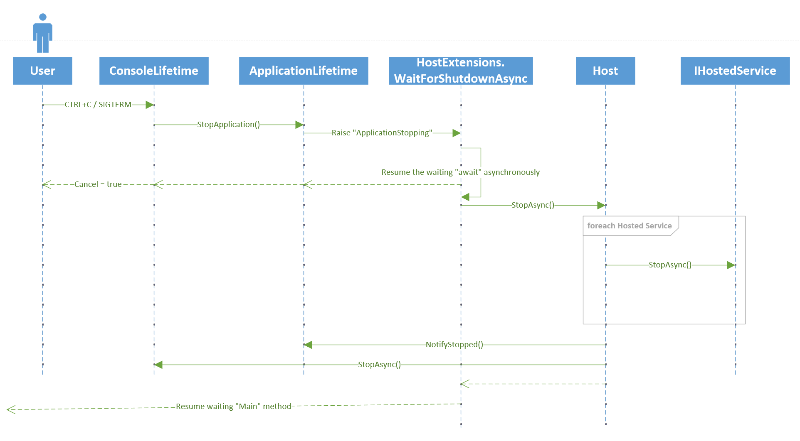

# Host Shutdown

A Hosted Service process can be stopped in the following ways:

1. If someone doesn't call `Run` or `WaitForShutdown` and the app exits normally with "Main" completing
2. A crash occurs
3. The app is forcefully shut down, e.g. SIGKILL (i.e. CTRL+Z)
4. When ConsoleLifetime is used it listens for the following signals and attempts to stop the host gracefully
    1. SIGINT (i.e. CTRL+C)
    2. SIGQUIT (i.e. CTRL+BREAK on Windows, CTRL+`\` on Unix)
    3. SIGTERM (sent by other apps, e.g. `docker stop`)
5. The app calls `Environment.Exit(code)`

Scenarios (1), (2), and (3) aren't handled directly by the Hosting code. The owner of the process needs to deal with
them the same as any application.

Scenarios (4) and (5) are handled specially by the built-in Hosting logic. Specifically by the ConsoleLifetime
class. ConsoleLifetime tries to handle the "shutdown" signals listed in (4) and allow for a graceful exit to the
application.

Before .NET 6, there wasn't a way for .NET code to gracefully handle SIGTERM. To work around this limitation,
ConsoleLifetime would subscribe to `AppDomain.CurrentDomain.ProcessExit`. When `ProcessExit` was raised,
ConsoleLifetime would signal the Host to stop, and block the `ProcessExit` thread, waiting for the Host to stop.
This would allow for the clean up code in the application to run - for example, `IHostedService.StopAsync` and code after
`Host.Run` in the Main method.

This caused other issues because SIGTERM wasn't the only way `ProcessExit` was raised. It is also raised by code
in the application calling `Environment.Exit`. `Environment.Exit` isn't a graceful way of shutting down a process
in the `Microsoft.Extensions.Hosting` app model. It raises the `ProcessExit` event and then exits the process. The end of the
Main method doesn't get executed. Background and foreground threads are terminated. `finally` blocks are not executed.

Since ConsoleLifetime blocked `ProcessExit` waiting for the Host to shutdown, this behavior lead to [deadlocks][deadlocks]
due to `Environment.Exit` also blocking waiting for `ProcessExit` to return. Additionally, since the SIGTERM handling was attempting
to gracefully shut down the process, ConsoleLifetime would set the ExitCode to `0`, which [clobbered][clobbered] the user's
exit code passed to `Environment.Exit`.

[deadlocks]: https://github.com/dotnet/runtime/issues/50397
[clobbered]: https://github.com/dotnet/runtime/issues/42224

In .NET 6, we added new support to handle [POSIX signals][POSIX signals]. This allows for ConsoleLifetime to specifically
handle SIGTERM gracefully, and no longer get involved when `Environment.Exit` is invoked. For .NET 6+, ConsoleLifetime no longer
has logic to handle scenario (5) above. Apps that call `Environment.Exit`, and need to do clean up logic, can subscribe to
`ProcessExit` themselves. Hosting will no longer attempt to gracefully stop the Host in this scenario.

[POSIX signals]: https://github.com/dotnet/runtime/issues/50527

If your application uses Hosting, and you want to gracefully stop the host, you can call
[`IHostApplicationLifetime.StopApplication()`][StopApplication] instead of `Environment.Exit`.

[StopApplication]: https://docs.microsoft.com/dotnet/api/microsoft.extensions.hosting.ihostapplicationlifetime.stopapplication

### Hosting Shutdown Process

The following sequence model shows how the signals in (4) above are handled internally in the Hosting code. It isn't necessary
for the majority of users to understand this process. But for developers that need a deep understanding, this may help them
get started.

After the Host has been started, when a user calls `Run` or `WaitForShutdown`, a handler gets registered for
`ApplicationLifetime.ApplicationStopping`. Execution is paused in `WaitForShutdown`, waiting for the `ApplicationStopping`
event to be raised. This is how the "Main" method doesn't return right away, and the app stays running until
`Run`/`WaitForShutdown` returns.

When a signal is sent to the process, it kicks off the following sequence.

The control flows from `ConsoleLifetime` to `ApplicationLifetime` to raise the `ApplicationStopping` event. This signals
`WaitForShutdownAsync` to unblock the "Main" execution code. In the meantime, the POSIX signal handler returns with
`Cancel = true` since this POSIX signal has been handled.

The "Main" execution code starts executing again and tells the Host to `StopAsync()`, which in turn stops all the Hosted
Services and raises any other stopped events.

Finally, `WaitForShutdown` exits, allowing for any application clean up code to execute, and for the "Main" method
to exit gracefully.